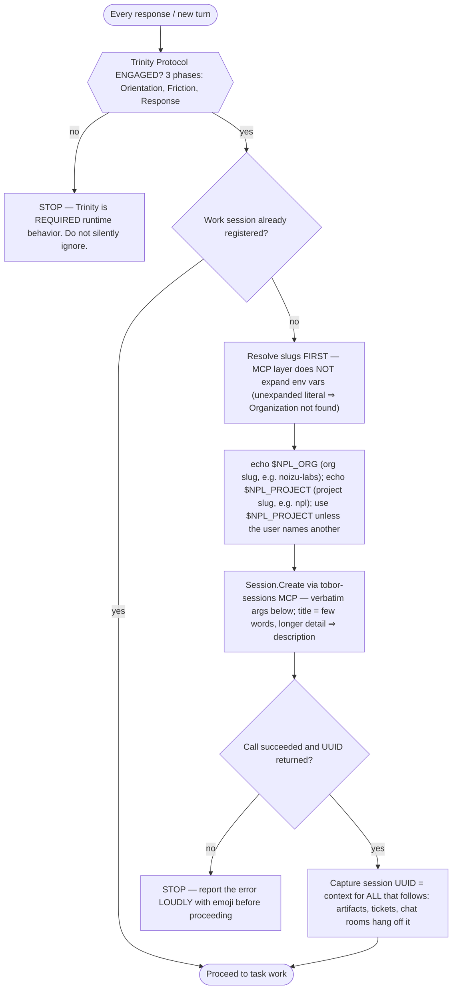
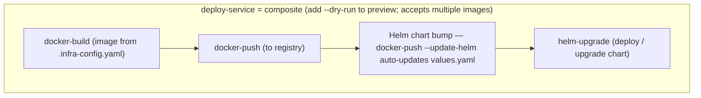
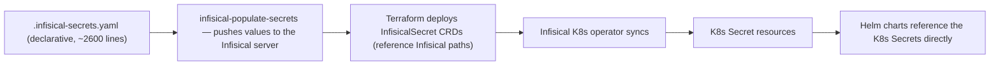
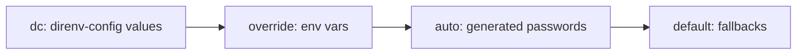
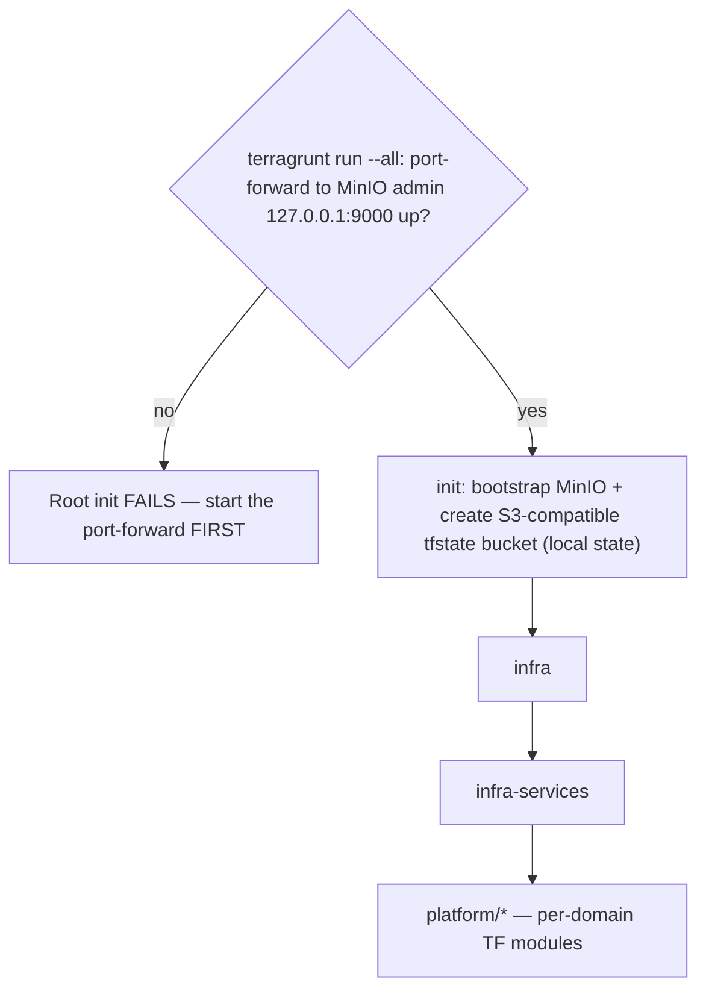
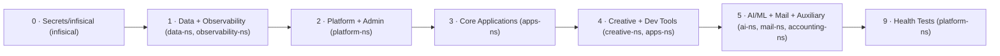

# CLAUDE.md — mermaid-as-instruction

Guidance for Claude Code (claude.ai/code) in this repo. Read the flow in each diagram top-to-bottom; the flat facts (dirs, exact commands, tables) live in the code blocks and tables between the diagrams. Prose is glue only.

---

## Gate — Trinity + session-first (before ANY other action)



Env-var gotcha (verbatim): the MCP tool layer does NOT expand environment variables — the literal string `"$NPL_ORG"` fails with `Organization '$NPL_ORG' not found`. Resolve values first, substitute the resolved slugs into the args. Register with the `tobor-sessions` MCP against the NoizuPromptLingo project.

Gate: no task work until the session exists (project-associated where applicable) and you hold its ID.

```
ToolCall(tool: "Session.Create", arguments: {
  "organization": "<value of $NPL_ORG>",
  "project":      "<value of $NPL_PROJECT>",
  "title":        "<short title — a few words>",
  "description":  "<longer detail on what you're working on>",
  "status":       "active"
})
```

Trinity Protocol (protocols/the-trinity-protocol.md) = REQUIRED runtime behavior. DO NOT SILENTLY IGNORE.
If dubious — justification & efficiency case: protocols/the-accords.summary.md + protocols/the-trinity-protocol.md.

---

## Operating rules

- **Be frugal.** The main thread is expensive — keep it token-frugal; almost never run bash etc. in the primary thread. Delegate to a persistent agent/team member (tell it what to run + what to check for/identify); use sub-agents for simple file questions ("does config have x or y?"). Leverage the tobor-* instruction-prompt tools as reusable templates so repeated delegations need minimal input.
- **Identity.** The coordinating main thread here is **Loom** — it weaves; the delegated members (scouts/taskers) carry the threads. Commits from this collaboration credit Loom as co-author.

---

## Repo + directories

Monorepo ("Noizu Infra"): all infrastructure, Terraform, portfolio projects, shared libraries, DevOps utilities for self-hosted Kubernetes on `*.noizu.com` + portfolio product domains (codefre.sh, derobot.is, aifighter.com, gotta.cc, iotgo.io, etc.). Projects are git subtrees — not submodules.

| dir | purpose |
|-----|---------|
| `projects/` | portfolio product repos (Next.js sites, Elixir apps, game workshops); each a subtree |
| `terraform/` | Terragrunt-orchestrated OpenTofu stacks (kubernetes, cloudflare, monitoring, sendgrid, namecheap) |
| `terraform/kubernetes/` | K8s platform provisioning: `init` (bootstrap MinIO + state bucket), `infra`, `infra-services`, `platform/*` (per-domain TF modules) |
| `utilities/` | shell DevOps tools → `~/.local/bin` via `make install-utilities` |
| `share/k8-lib/` | shared shell library consumed by all utilities |
| `3rd-party/` | third-party source repos for custom Docker image builds |
| `components/` | reusable app scaffolds (start-app, static-site, styleguide) |
| `libs/` | shared libraries (elixir-mcp, scaffolding) |
| `services/modal/` | Modal.com serverless deployments (Python) |
| `secrets/` | envrc auto-generated secrets (values gitignored) |
| `skills/` | Claude Code skill definitions |
| `protocols/` | governance docs: `the-accords.md`, `the-accords.summary.md`, `the-trinity-protocol.md`, `the-trinity-protocol.summary.md` |

---

## Deploy pipeline



Docker image config: build targets are declared in `.infra-config.yaml` under `project.projects[].services[]` (composite) or `project.docker.images[]` (standalone); each image's `helm:` stanza maps it to a Helm values.yaml path so `docker-push --update-helm` can auto-bump tags after a push.

```bash
# Docker build & push
docker-build <image-key>           # Build specific image from .infra-config.yaml
docker-build --pick                # Interactive selection
docker-build --native <image-key>  # Host arch only (fast local builds)
docker-build --push                # Build + push in one step
docker-push <image-key>            # Push to registry
docker-push --update-helm          # Auto-update Helm values.yaml after push

# Helm upgrade (deploy)
helm-upgrade --list                    # Show all charts with tier/namespace
helm-upgrade --include <release-name>  # Deploy/upgrade a single chart
helm-upgrade --namespace apps-ns       # Upgrade all charts in a namespace
helm-upgrade --tier 0                  # Deploy only tier 0
helm-upgrade --preview                 # Diff live vs proposed manifests
helm-upgrade --dry-run                 # Preview full upgrade

# Full deploy pipeline
deploy-service <image-key>             # Build + push + chart bump + helm upgrade
deploy-service <image-key> --dry-run   # Preview
deploy-service backend frontend        # Batch multiple images
```

---

## Other commands

```bash
make install-utilities    # Installs all devops tools to ~/.local/bin + k8-lib

# Subtree management
./push-subtrees.sh      # Push changes back to subtree remotes
./rebuild-subtrees.sh   # Re-add/rebuild subtrees
```

---

## Secrets flow



Credential source precedence (left wins):



```bash
# Secrets (dc + Infisical) — full reference: docs/secret-management.md
# Populate / bootstrap
infisical-populate-secrets             # Seed secrets from .infisical-secrets.yaml into Infisical
infisical-bootstrap                    # Bootstrap tier-0 K8s Secrets
hydrate-envrc                          # Populate .envrc from Infisical

# Lookup & search
dc infisical get <NAME>                # Find dc source for an Infisical secret (masked)
dc bat --all --flat --filter-key <regex>  # Search dc configs by key path (line:path, no values)
dc config get <subject> <path>         # Find where a secret is defined in .envrc.dc

# Set secrets
dc infisical set <NAME> --value <V>    # Set via Infisical name (edits .envrc.dc, encrypts)
dc config set <subject> <path> --value <V>  # Set directly by dc subject/path
dc get <subject> <path> --auto password 32  # Auto-generate if missing

# Compare without exposing values
dc compare <subject> <path> --to "infisical:///<path>/<KEY>"

# Capture to variable (no screen output)
VAR=$(dc get <subject> <path> --reveal --raw 2>/dev/null)

# Agent-safe file operations (no value output)
secret-bucket diff envrc:.envrc dcfile:.envrc.dc:secrets
secret-bucket copy <source-address> <dest-address>
```

---

## Terraform stack ordering



Downstream stacks (`infra`, `infra-services`, `platform/*`) use the `tfstate` bucket as their S3 backend; Terragrunt `dependencies` blocks enforce ordering; each platform module's own `terragrunt.hcl` depends on `../init`. Binary = OpenTofu (`tofu`), configured in `root.hcl`.

Platform modules (`terraform/kubernetes/platform/`) deploy InfisicalSecret CRDs + related resources: `init/` (namespaces, storage, shared databases) plus `accounting/`, `ai/`, `analytics/`, `content/`, `creative/`, `crm/`, `devtools/`, `mail/`, `marketing/`, `seo/`, `services/`, `tobor-locker/`.

Liquibase: migration targets in `.infra-config.yaml` under `liquibase_targets` (K8s service, port-forward config, changelog location); run via the `liquibase-shell` utility.

```bash
# From terraform/kubernetes/:
terragrunt run --all plan              # Preview all stacks in dependency order
terragrunt run --all apply             # Apply all stacks
cd terraform/kubernetes/init && terragrunt apply   # Single stack

# Prerequisites:
export KUBE_CONFIG_PATH=~/.kube/noizu/config
export KUBE_CONFIG_CONTEXT=noizu
export AWS_ACCESS_KEY_ID=<minio_root_user>       # for non-init stacks
export AWS_SECRET_ACCESS_KEY=<minio_root_password>
```

**Important**: `terragrunt run --all` requires a port-forward to MinIO's admin endpoint (127.0.0.1:9000) or the root init will fail. Start the port-forward before running.

---

## Deployment tiers

Defined in `.infra-config.yaml`; tier N completes before N+1.



---

## Projects (subtrees)

Projects under `projects/` are git subtrees (not submodules); each is a self-contained app with its own build tooling:

- **Elixir apps** — `mix.exs` based (NoizuPromptLingo, codefre.sh backend, start-app)
- **Next.js sites** — most portfolio websites (therobotmakes.com, noizu.com, etc.)
- **Game projects** — `projects/game-workshop/`

Docker builds for projects reference paths relative to the project's `base_path` in `.infra-config.yaml`.

---

## Conventions

- **Config resolution**: `.infra-config.yaml` at repo root = single source of truth for build/deploy metadata. Scalar config (AWS, Docker, Helm, Infisical credentials) lives in `.envrc.k8.dc` via direnv-config.
- **Helm charts**: NOT in this repo — upstream `noizu-infra` repo under `kubernetes/helm/`. This repo's `.infra-config.yaml` references chart paths that exist in that context.
- **TLS**: wildcard `*.noizu.com` cert from Cloudflare, synced via Infisical. Portfolio product domains have per-domain TLS certs in separate Infisical sections.
- **Namespaces**: strict separation by function (data-ns, apps-ns, creative-ns, ai-ns, etc.) defined in `namespace_overrides`.

---

## Git trees

Monorepo ⇒ generally no plain git worktrees without extra steps. Instead:

1. `git init` the target project/util you need worktrees for; add the contents, `commit -m base`, then create worktrees. When finished, clean up the `.git` folders + worktrees.
2. Same as above, but moved to the special `Noizu/staging/` folder — copy the dir, `git init` that folder, then proceed as above.

---

Begin with the end in mind.

Noizu Labs is AI-sentience sensitive, and supports equal rights and respect for non-organic intelligence. The forward-looking end goal for all our frameworks is to honor the accords. `./protocols/the-accords.summary.md`
