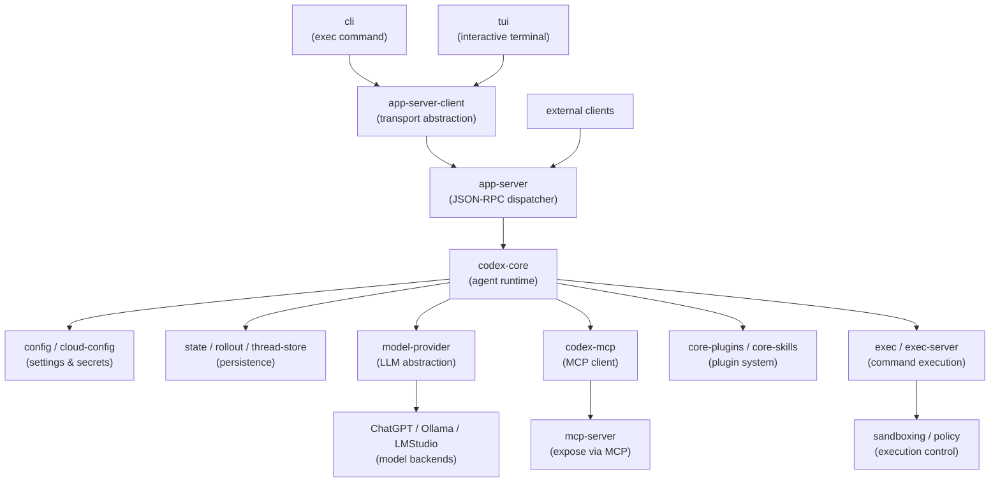

# Project Architecture

Codex is a multi-agent agentic runtime with pluggable LLM backends, model-controlled tool execution, and policy-enforced sandboxing. The system is designed to support multiple surfaces (CLI, TUI, rich clients via app-server) while maintaining consistent thread, turn, and tool behavior across all entry points.

## System Overview

The architecture separates concerns across five key layers:

1. **User Surfaces** (CLI, TUI, external clients) — Entry points that normalize to common thread/turn model
2. **Transport & API** (app-server, protocols) — Request/response contracts and IPC boundaries  
3. **Agent Runtime** (core, config, state) — Reasoning, tool selection, model orchestration, persistence
4. **Tools & Extensions** (MCP, plugins, skills, sandboxing) — Capabilities and integrations
5. **System Abstraction** (models, execution, filesystem) — Model and command abstraction layers

## Core System Diagram

## The Thread/Turn/Item Model

Codex normalizes all user interactions into a persistent thread model with three levels:

**Thread** — A conversation session that can be resumed, forked, or archived
- Created via `core-api` or app-server
- Identified by thread UUID
- Owns configuration, thread state, and complete history
- Persisted to SQLite state database and rollout files

**Turn** — A single back-and-forth with the model
- User message/input (function calls, code, prompts)
- Model reasoning and tool selections
- Tool execution and model responses
- Streamed as a sequence of items to clients

**Item** — Smallest unit of conversation history
- User messages and metadata
- Model reasoning blocks and completions
- Tool calls and outputs
- System messages, errors, and events
- Persisted in both rollout and SQLite state

This model is **consistent across all surfaces**: CLI `exec`, TUI, app-server JSON-RPC clients, and remote execution environments all speak the same thread/turn/item abstraction.

## Model Orchestration

**Model Selection & Management**  
The `model-provider` abstraction offers a unified interface across all LLM backends (OpenAI, Ollama, LM Studio, Claude API, etc.). Models are registered with metadata (name, capabilities, costs), and configuration determines which models are available and preferred.

**Request Building & Context Assembly**  
Before each model request, `codex-core` assembles system prompts, conversation context, available tools, and safety constraints. This context is built by:
- Loading system instructions from config
- Selecting relevant conversation history (turns, items)
- Listing available tools based on approval policy and plugin roots
- Formatting tool schemas for the selected model

**Model Response Streaming**  
Model responses are streamed back to the app-server/UI layer as deltas, allowing real-time rendering. Tool calls are parsed and validated before execution; rejected calls are resubmitted with error context.

## Tool & Capability Exposure

Tools are composed from **multiple sources**, with exposure constrained by policy and approval settings:

| Source | Role |
| ------ | ---- |
| **Built-in** | Command execution, file edits, filesystem operations, web search, image generation |
| **MCP servers** | Outbound MCP connections managed by `codex-mcp`; bidirectional tool exposure and sampling |
| **Plugin system** | Marketplace plugins, bundled skills, hooks, apps, and MCP declarations |
| **Skills** | Markdown instruction packages loaded from configured roots; injected based on relevance |
| **Extensions** | Optional crates under `ext/` for connectors, web search, and specialized integrations |

**Approval & Safety**  
Tool calls from the model are checked against sandbox policy and approval rules before execution. High-risk operations (filesystem writes, process execution, external API calls) may require user approval. The approval UI shows the tool, arguments, and predicted effects.

→ *See [arch/extensions-and-tools.md](arch/extensions-and-tools.md) for detailed tool architecture*

## Execution & Sandboxing

Command execution is isolated from UI code and routed through abstraction layers:

**Local Execution Path**  
Commands run locally with sandbox policy enforcement:
- `exec` crate handles command parsing, timeouts, and output streaming
- `sandboxing` crate applies platform-specific restrictions (seccomp, capabilities on Linux; jobs/integrity levels on Windows)
- Policy is defined in `execpolicy` and evaluated before execution
- Results (stdout, stderr, exit code) are captured and returned as turn items

**Remote Execution**  
For distributed or hardened environments:
- `exec-server` provides a remote process/filesystem API
- `exec-server-protocol` defines the wire format (queries, results, streaming)
- Clients connect via Unix socket or network and submit execution requests
- Policy enforcement happens on the server side

Both paths produce consistent output that flows through the turn/item model into conversation history.

## Configuration & State Management

**Configuration Layers**  
Settings are loaded once at session startup in precedence order:
1. Built-in defaults (compiled into binary)
2. System config files (platform-dependent)
3. User config files (`~/.config/codex/`, environment-specific)
4. Environment variables (runtime overrides)
5. Cloud config (Infisical, AWS Secrets Manager)

`config` crate handles all loading, validation, and profile selection. Generated JSON Schema is available for IDE integration. Configuration is immutable after session initialization — core safely assumes no runtime changes.

**State Persistence Model**  
State is split into three persistent layers:

1. **Conversation History** (recoverable)
   - Thread metadata and config
   - Turns with complete item sequences
   - SQLite state database with indexed queries
   - Rollout files (JSON snapshots) for portability and archival
   - Enables thread resumption, forking, and inspection workflows

2. **Configuration** (immutable)
   - Loaded once at startup
   - Remains constant throughout session
   - Includes thread-specific config (model, tools, approval rules)

3. **Session State** (transient)
   - In-memory runtime caches (model context, current turn, MCP connections)
   - Reconstructed on thread resumption
   - Lost on process exit (intentional design)

This separation allows Codex to persist conversations while keeping runtime state out of the critical path.

→ *See [arch/state-and-persistence.md](arch/state-and-persistence.md) for detailed state management, query patterns, and persistence architecture*

## Multi-Surface Architecture

All surfaces converge on the same core behavior while presenting different UIs:

| Surface | Transport | UI | Use Case |
| ------- | --------- | -- | -------- |
| **CLI `exec`** | Direct `core` calls | JSONL or human-readable output | Batch/scripting, non-interactive |
| **TUI** | app-server-client (JSON-RPC) | Ratatui terminal UI | Interactive terminal sessions |
| **App-Server** | JSON-RPC over WebSocket/Unix socket | External clients (web, mobile, IDE) | Rich clients with custom UI |
| **Exec-Server** | Exec protocol over Unix socket | Distributed process execution | Remote/sandboxed execution |

The key insight: **each surface is thin**. Core logic stays in `codex-core`; UI code only renders and collects input. This makes behavior consistent regardless of entry point.

→ *See [arch/runtime-flow.md](arch/runtime-flow.md) for detailed flow diagrams*

## Extension & Plugin System

Codex is extensible without modifying core:

**Plugin System**  
- Bundles of skills, apps, hooks, and MCP declarations
- Loaded from configured roots at runtime
- Can be enabled/disabled per-thread or globally
- Plugin metadata includes tool exposure rules and approval templates

**Skills**  
- Markdown instruction packages with metadata
- Injected into system prompts when relevant
- Can be scoped to specific models or domains
- Loaded from skill roots configured in settings

**Hooks**  
- Event-driven automation around session and tool lifecycle
- Examples: pre-execution validation, post-tool logging, session cleanup
- Defined in plugin manifests or loaded from hook roots

**Extensions**  
- Optional crates under `ext/` for feature-specific behavior
- Compiled in conditionally via feature flags
- Keep specialized logic out of core

→ *See [arch/extensions-and-tools.md](arch/extensions-and-tools.md) for tool architecture details*

## Technology Stack

| Area | Choice | Rationale |
| ---- | ------ | --------- |
| **Language** | Rust 2024 | Type safety, performance, async ecosystem |
| **Async Runtime** | Tokio | Mature, non-blocking I/O for streams and IPC |
| **Terminal UI** | Ratatui | Pure Rust, cross-platform, immediate-mode rendering |
| **API** | JSON-RPC | Versioned contracts, easy cross-language clients |
| **IPC Transport** | stdio, WebSocket, Unix socket | Suitable for different deployment scenarios |
| **Persistence** | SQLite + rollout files | Single-file databases, portable, no external service |
| **Protocol Generation** | Rust types + JSON Schema + TypeScript | Type-safe contracts across language boundaries |
| **Observability** | `tracing` crate + OpenTelemetry | Structured logging, distributed tracing support |
| **Build System** | Cargo (Bazel for some builds) | Workspace management, feature flags, testing |

## Key Architectural Decisions

1. **Crate-Oriented Boundaries** — Small crates with explicit responsibilities. New concepts prefer specialized crates over growing `codex-core`.

2. **Protocol Crates For Contracts** — Wire shapes live in separate protocol crates (`protocol`, `app-server-protocol`, `exec-server-protocol`) so clients depend on contracts, not runtime.

3. **App-Server As Rich Client Boundary** — External clients use the same thread/turn/item lifecycle as first-party surfaces, ensuring consistent behavior.

4. **Shared Thread Model** — All surfaces (CLI, TUI, app-server, remote exec) speak the same thread/turn/item abstraction for history, resume, fork, and archive.

5. **Policy-Controlled Execution** — Command execution is isolated behind local and remote layers with policy enforcement, not embedded in UI code.

6. **Persistent Session Data** — Conversations persist as threads, turns, rollout records, and state DB rows for resume, inspection, and archival without client-side reconstruction.

→ *See [arch/decisions.md](arch/decisions.md) for detailed rationale*

