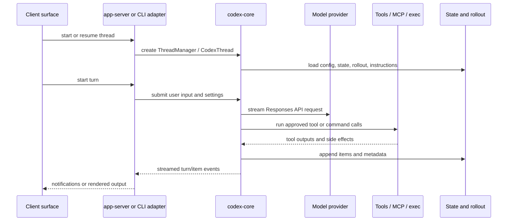

# Runtime Flow

Codex represents user work as threads containing turns, and turns containing streamed items such as user messages, reasoning, tool calls, command output, file changes, and agent messages. This model is shared across the TUI, `codex exec`, app-server clients, and persisted rollout data.

## Thread And Turn Flow

## Surface Responsibilities

| Surface | Responsibility |
| ------- | -------------- |
| `tui` | Render interactive terminal state, collect user input, and drive threads through app-server client abstractions. |
| `exec` | Run non-interactive prompts or reviews and emit human-readable or JSONL event streams. |
| `app-server` | Accept JSON-RPC requests, enforce connection lifecycle, dispatch thread/turn/tool/config methods, and stream notifications. |
| `core` | Build model context, select tools, enforce approvals and sandbox policy, persist rollouts, and map model/tool events into thread items. |
| `exec-server` | Provide remote process and filesystem operations through an exec-specific protocol. |

## Persistence

State is split by concern. Configuration comes from layered config loaders, long-lived local state uses SQLite-backed stores, and conversation history is persisted as rollout/session data. This split lets Codex resume or fork threads while keeping runtime caches and transport state separate from persisted conversation records.

