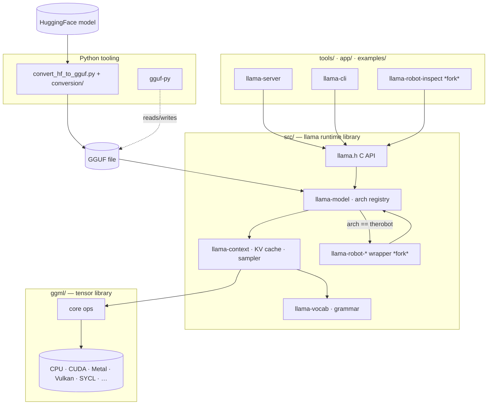

# Project Architecture

## Overview

llama.cpp is a C/C++ inference engine for LLMs in the GGUF format. Its design is
a layered stack: a portable tensor library (`ggml`) with per-hardware backends
at the bottom, a high-level model/runtime library (`src/`, the `llama` API) in
the middle, and runnable binaries plus Python conversion tooling at the top. The
public surface is a stable C API (`include/llama.h`) that every consumer — the
bundled tools, third-party apps, language bindings — builds against.

This checkout is the **therobot fork**: a *strict superset* of upstream that
adds one new architecture family, `therobot`. therobot models are ordinary GGUF
files that wrap a donor base architecture (llama, qwen2, mamba, …) and layer an
optional `therobot.*` feature contract on top. The fork is engineered so stock
architectures and stock files behave byte-identically to upstream — the only
observable change in a stock build is that the architecture string `"therobot"`
now loads instead of erroring.

→ *See [arch/therobot.md](arch/therobot.md) for the fork's design, feature
contract, and rebase strategy.*

## System Diagram

## Core Components

| Component | Purpose |
|-----------|---------|
| `include/llama.h` | Stable public C API — the single entry point for all consumers |
| `src/llama-model.cpp` | Model load, weight mapping, per-architecture graph build, arch registry |
| `src/llama-context.cpp` | Inference context, batch scheduling, runtime state |
| `src/llama-kv-cache.cpp` | KV cache variants (unified, recurrent, …) |
| `src/llama-sampler.cpp` | Sampling strategies (top-k/p, mirostat, grammar-constrained) |
| `src/llama-vocab.cpp` + `llama-grammar.cpp` | Tokenizer/vocab and GBNF grammar constraining |
| `src/models/` | Per-architecture graph builders (one class per arch) |
| `ggml/` | Portable tensor library + one backend per hardware target |
| `conversion/` + `convert_hf_to_gguf.py` | HuggingFace → GGUF adapters (per architecture) |
| `gguf-py/` | Python package for reading/writing GGUF metadata + tensors |
| `tools/` | Runnable binaries: `llama-server` (OpenAI-compatible HTTP), `llama-cli`, … |
| `src/llama-robot-*` *(fork)* | therobot GGUF spec parser + donor-wrapper model template |

## Runtime Data Flow

A consumer opens a GGUF file through the C API. `llama_model_load` reads
`general.architecture`, looks it up in the arch registry, and instantiates the
matching per-arch model class, which maps weights and builds the compute graph.
A `llama_context` then schedules batches through that graph onto the selected
ggml backend; `llama-vocab` tokenizes input and `llama-sampler` selects output
tokens, optionally constrained by a GBNF grammar. Models are produced offline by
the Python `conversion/` tooling, which reads HuggingFace weights and emits GGUF.

## The therobot Extension *(fork)*

When `general.architecture == "therobot"`, model creation dispatches to a fork
factory instead of the stock path. The factory parses the `therobot.*` GGUF
key-value contract, negotiates its declared features (refusing unknown-required
or not-yet-implemented ones), then instantiates a `llama_model_robot<TBase>`
template wrapping the *donor* base architecture's model class — with `model->arch`
set to the donor, so every base behavior (rope type, memory layout, chat
template) acts exactly as the donor. At the current stage the graph is a pure
L0 passthrough; extension tensors are claimed for loader bookkeeping but not yet
wired into compute. All upstream edits are fenced with `// ROBOT-EXT-BEGIN/END`
markers and catalogued for rebase safety.

→ *See [arch/therobot.md](arch/therobot.md) for the feature contract, wrapper
mechanics, staged roadmap (E1–E7), and [robot/patch-points.md](robot/patch-points.md)
for the fence inventory.*

## Technology Stack

- **Languages**: C++17 (core + tools), C (public API/ABI), Python 3 (conversion, tests, bench)
- **Build**: CMake + CMake presets; `Makefile` convenience wrapper; `flake.nix` Nix dev shell; `build-xcframework.sh` for Apple
- **Compute backends**: CPU (SIMD), CUDA, Metal, Vulkan, SYCL, HIP/ROCm, MUSA, CANN, OpenCL, RPC (via `ggml/src/`)
- **Model format**: GGUF (self-describing KV metadata + tensors)
- **Server**: vendored `cpp-httplib` + `nlohmann/json`; multimodal via `stb_image` / `miniaudio`
- **CI/packaging**: GitHub Actions (`.github/`), per-backend Dockerfiles (`.devops/`)

## Key Decisions

- **Layered ggml ↔ llama split** — the tensor library is hardware-facing and
  reusable; `src/` is model-facing. Backends can be added without touching model code.
- **Stable C ABI as the only public surface** — insulates the large, churning C++
  internals from consumers and language bindings.
- **Class-per-architecture dispatch** (`src/models/`) — each arch owns its graph
  builder; the therobot fork depends on this staying virtual.
- **GGUF self-description** — a model file carries its own hyperparameters and
  metadata, so the runtime configures itself from the file with no external config.
- **therobot as a fenced superset, not a patch fork** — new behavior lives in
  new files; the handful of upstream touches are marked and inventoried so
  upstream rebases stay mechanical and the stock test suite stays green.

→ *See [arch/therobot.md](arch/therobot.md) for the superset invariant and
rebase-sensitive contact surfaces.*
