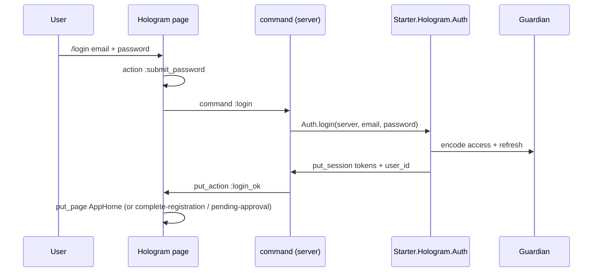

# Authentication — Hologram UI flow

Session-backed Hologram pages (not localStorage). Same domain model as the JSON API.

## Routes

| Route | Page | Auth |
|-------|------|------|
| `/` | Landing | public |
| `/login` | Multi-step email → SSO or password | public |
| `/signup` | Multi-step registration | public |
| `/forgot-password` | Password reset request | public |
| `/complete-registration` | Profile completion | required |
| `/pending-approval` | Waitlist / pending | required |
| `/app` | **App home** (post-login) | required |
| `/app/profile` | Profile | required |
| `/app/:org_id` | **Org dashboard** | required |
| `/app/:org_id/members` | Members | required |
| `/auth/verify` | Magic link | public |
| `/auth/verify-email` | Email verification | public |
| `/auth/sso-callback` | SSO code exchange | public |

## Sequence (password)

## Post-auth routing

`Starter.Hologram.Auth.post_auth_path/1`:

1. `requires_profile_completion` → `/complete-registration`
2. status `pending` / `waitlist` → `/pending-approval`
3. else → `/app`

### Post-login dashboard

| Route | Page |
|-------|------|
| `/app` | **Dashboard** — welcome, KPIs, workspaces, getting-started, create workspace |
| `/app/:org_id` | **Workspace dashboard** — KPIs, quick actions, members snapshot |
| `/app/:org_id/members` | Members table |
| `/app/profile` | Profile editor |

Navbar **Dashboard** and shell nav both point at `/app`. Creating a workspace opens `/app/:org_id`.

## Tokens

| Channel | Storage |
|---------|---------|
| Hologram UI | Session (`:access_token`, `:refresh_token`) via cookie-backed Hologram session |
| JSON API `/api/v1/*` | Bearer `Authorization` header (same Guardian JWTs) |

`RequireAuth` middleware redirects unauthenticated users to `LoginPage`.

## Dashboard shell

Authenticated pages use `AppShell` (sidebar + main): Home, Profile, org list, org Dashboard, Members.
