# Claude Assist — Site Map

> Local dev tool for searching, browsing, editing, and managing Claude Code conversations — then extracting reusable agents, skills, workflows, and fine-tuning datasets from them.

**Package:** `claude-assist` (npm)
**Status:** draft
**Last updated:** 2026-05-11

---

## Page Flow

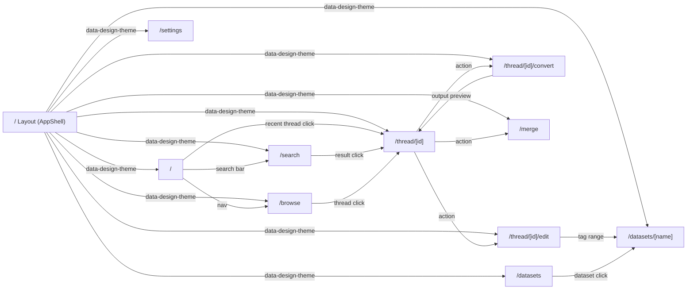

---

## / — Dashboard

Primary entry point after `claude-assist serve`. Provides quick access to search, recent conversations, and summary statistics. Designed for rapid orientation — "what was I working on?"

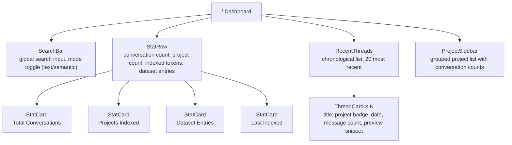

**Data:**
- Stats: `GET /api/stats`
- Recent threads: `GET /api/conversations?sort=updated_at&limit=20`
- Projects: `GET /api/projects`

---

## /search — Search

Full-featured search with dual modes (full-text and semantic), filters, and highlighted results. The primary discovery interface.

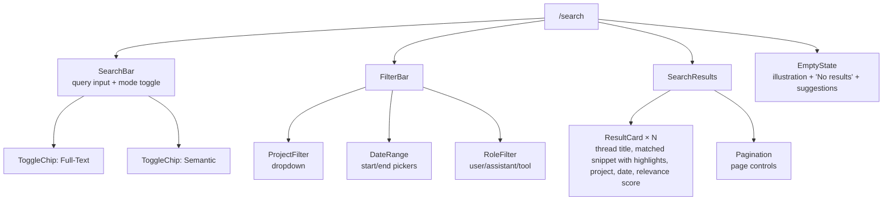

**Data:**
- Full-text: `GET /api/search?q={query}&mode=fts&project={}&from={}&to={}&role={}`
- Semantic: `GET /api/search?q={query}&mode=semantic&project={}&from={}&to={}`

---

## /browse — Browse

Project-grouped conversation list. The organizational view — "everything in this project" or "everything this week."

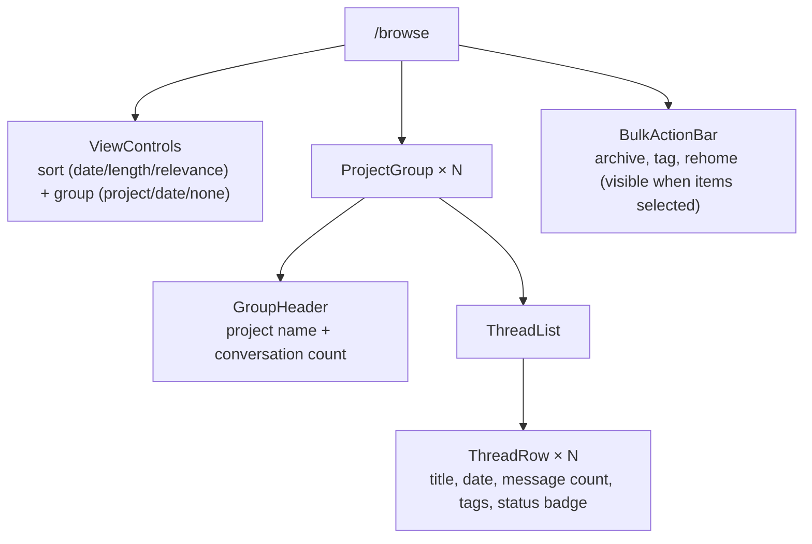

**Data:**
- Conversations: `GET /api/conversations?group_by={project|date}&sort={field}&order={asc|desc}`
- Bulk ops: `POST /api/conversations/bulk`

---

## /thread/[id] — Thread Viewer

Full conversation renderer. Shows the complete thread with collapsible tool calls, thinking blocks, and code blocks. Action hub for edit, convert, and dataset tagging.

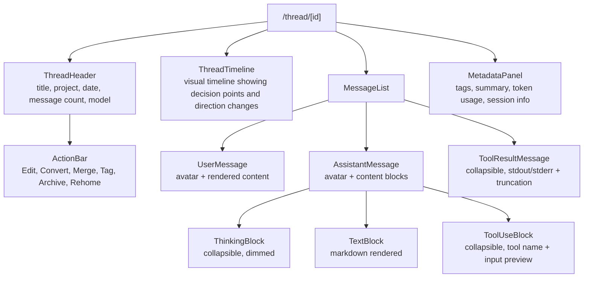

**Data:**
- Thread: `GET /api/conversations/{id}`
- Messages: `GET /api/conversations/{id}/messages`
- Metadata: `GET /api/conversations/{id}/metadata`

---

## /thread/[id]/edit — Thread Editor

Interactive editor for curating conversation threads. Non-destructive — all edits produce a new version, original JSONL is never modified.

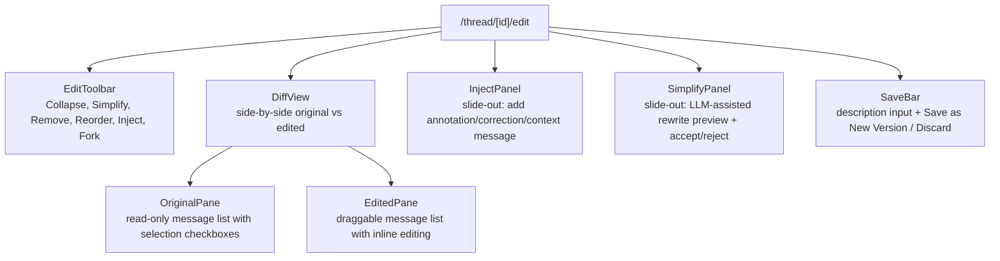

**Data:**
- Source thread: `GET /api/conversations/{id}/messages`
- Existing edits: `GET /api/conversations/{id}/edits`
- Save: `POST /api/conversations/{id}/edits`
- Simplify: `POST /api/llm/simplify` (body: message range)

---

## /thread/[id]/convert — Convert Wizard

Step-by-step wizard for extracting reusable artifacts (agents, skills, commands, snippets, runbooks) from a conversation.

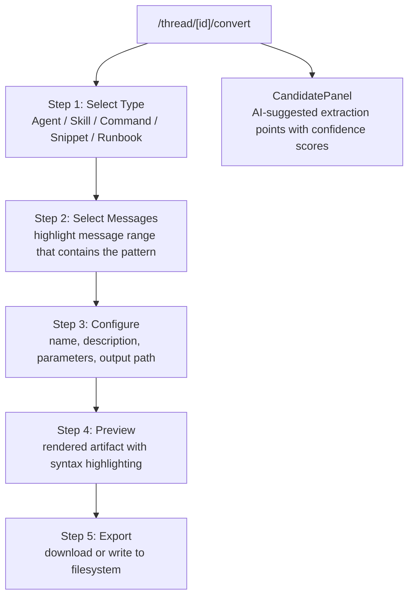

**Data:**
- Thread: `GET /api/conversations/{id}/messages`
- Candidates: `POST /api/convert/candidates` (body: conversation_id, type)
- Preview: `POST /api/convert/preview` (body: messages, type, config)
- Export: `POST /api/convert/export` (body: artifact definition)

---

## /merge — Merge View

Side-by-side thread comparison with drag-and-drop section assembly. For combining related conversations into a single reference document.

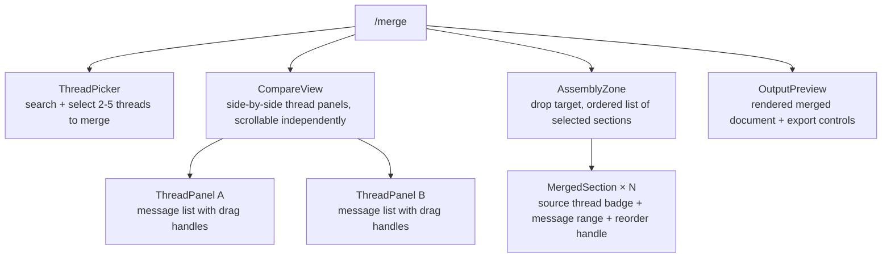

**Data:**
- Thread selection: `GET /api/conversations?ids={id1,id2,...}`
- Save merge: `POST /api/merges`

---

## /datasets — Dataset Manager

List and manage fine-tuning datasets. Overview of all datasets with entry counts, quality distribution, and export options.

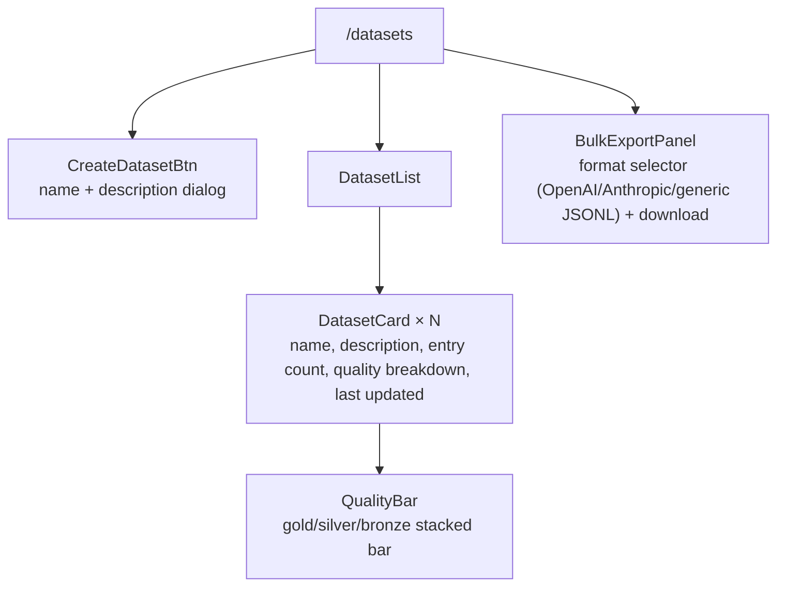

**Data:**
- Datasets: `GET /api/datasets`
- Create: `POST /api/datasets`
- Export: `GET /api/datasets/{name}/export?format={openai|anthropic|jsonl}`

---

## /datasets/[name] — Dataset Detail

Browse, review, and manage entries within a specific dataset. Preview training examples and manage quality labels.

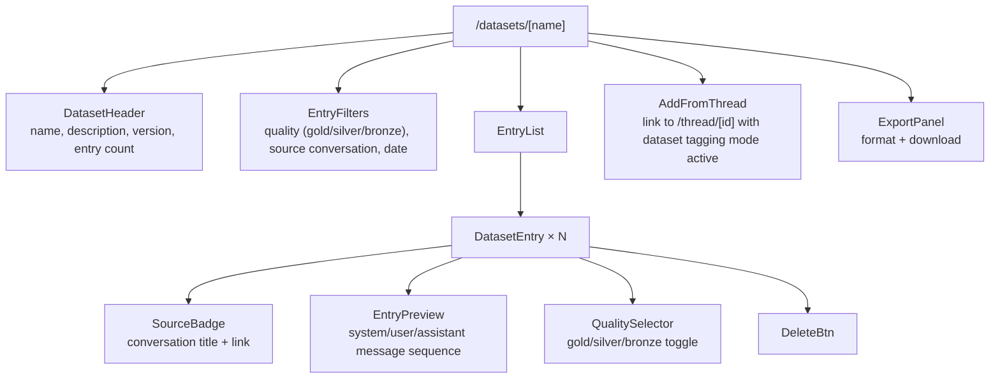

**Data:**
- Dataset: `GET /api/datasets/{name}`
- Entries: `GET /api/datasets/{name}/entries?quality={}&source={}`
- Update entry: `PATCH /api/datasets/{name}/entries/{id}`
- Delete entry: `DELETE /api/datasets/{name}/entries/{id}`

---

## /settings — Settings

Configuration for index paths, embedding provider, LLM provider, and display preferences.

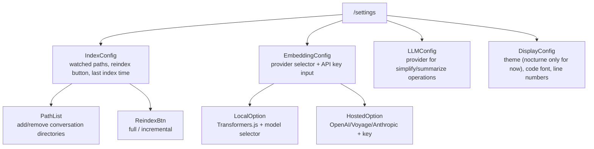

**Data:**
- Config: `GET /api/config`
- Update: `PATCH /api/config`
- Reindex: `POST /api/index/rebuild`

---

## Page Inventory

| Route | Purpose | Key Components | Data Sources |
|-------|---------|----------------|--------------|
| `/` | Dashboard — quick stats + recent threads | SearchBar, StatCard, ThreadCard | API: /stats, /conversations |
| `/search` | Full-text + semantic search | SearchBar, FilterBar, ResultCard | API: /search |
| `/browse` | Project-grouped thread list | ViewControls, ProjectGroup, ThreadRow | API: /conversations |
| `/thread/[id]` | Full conversation viewer | ThreadHeader, MessageList, ToolUseBlock | API: /conversations/{id} |
| `/thread/[id]/edit` | Non-destructive thread editor | DiffView, EditToolbar, InjectPanel | API: /conversations/{id}/edits |
| `/thread/[id]/convert` | Artifact extraction wizard | StepWizard, CandidatePanel, OutputPreview | API: /convert |
| `/merge` | Side-by-side thread merge | CompareView, AssemblyZone, OutputPreview | API: /conversations, /merges |
| `/datasets` | Dataset list + management | DatasetCard, QualityBar, ExportPanel | API: /datasets |
| `/datasets/[name]` | Dataset entry browser | EntryList, EntryPreview, QualitySelector | API: /datasets/{name} |
| `/settings` | App configuration | IndexConfig, EmbeddingConfig, LLMConfig | API: /config |

---

## Navigation

### Primary Nav (sidebar, persistent)
- Dashboard → `/`
- Search → `/search`
- Browse → `/browse`
- Datasets → `/datasets`
- Settings → `/settings`

### Contextual Nav (within thread views)
- Thread → `/thread/[id]`
- Edit → `/thread/[id]/edit`
- Convert → `/thread/[id]/convert`

### Global Elements
- **SearchBar** — appears on Dashboard hero and in navbar (compact mode)
- **CommandPalette** — `Cmd+K` overlay, routes to any page or action
- **IndexStatus** — indicator in navbar showing indexer state (idle/running/stale)

### No Auth Gates
All pages are local-only. No authentication required — the tool runs on localhost.
