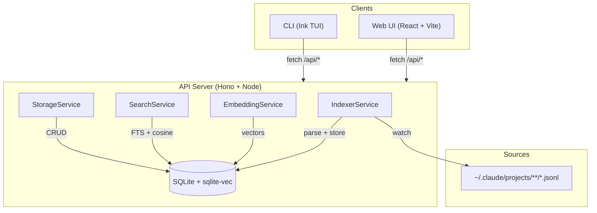

# Project Architecture

## Overview

Claude-assist is a local-first tool for searching, browsing, editing, and extracting reusable artifacts from Claude Code conversation logs. It reads JSONL conversation files from `~/.claude/projects/`, indexes them into a SQLite database with full-text and vector search, and exposes the data through three interfaces: a REST API, a browser UI, and a terminal TUI.

## System Diagram

## Core Components

| Component | Package | Purpose |
|-----------|---------|---------|
| StorageService | api | SQLite persistence — WAL mode, sqlite-vec for vectors |
| IndexerService | api | Scans JSONL files, parses conversations, watches for changes |
| EmbeddingService | api | Local embeddings via `all-MiniLM-L6-v2` (384-dim) |
| SearchService | api | Full-text search (FTS5) + semantic search (cosine similarity) |
| Hono routes | api | REST endpoints for conversations, search, datasets, prompts, projects |
| Web UI | web | React SPA with routing, markdown rendering, Tailwind styling |
| CLI | cli | Ink-based TUI — search, list, show, index commands |
| Shared types | shared | TypeScript types, JSONL parsers, API launcher utility |

## Data Flow

Conversation JSONL files are discovered by the IndexerService, parsed into structured records, and stored in SQLite. Messages are optionally embedded for semantic search. Clients query via REST.

-> *See [arch/data-flow.md](arch/data-flow.md) for details*

## Storage

Single SQLite database at `~/.claude-assist/claude-assist.db`. WAL journal mode for concurrent reads. sqlite-vec extension for vector similarity search.

-> *See [arch/storage.md](arch/storage.md) for details*

## Key Design Decisions

- **Local-first**: No external services required — SQLite + local embeddings run entirely on the user's machine
- **Hono over Express**: Lightweight, Web Standards-based HTTP framework
- **sqlite-vec over pgvector**: Keeps the single-binary philosophy; no database server needed
- **Monorepo with pnpm workspaces**: Shared types between api/cli/web without publishing
- **JSONL as source of truth**: Reads Claude Code's native format directly; database is a derived index

## Technology Stack

| Layer | Technology |
|-------|------------|
| Runtime | Node.js (tsx) |
| API framework | Hono |
| Database | better-sqlite3 + sqlite-vec |
| Embeddings | @huggingface/transformers (all-MiniLM-L6-v2) |
| Web framework | React 18 + React Router |
| Build tool | Vite |
| Styling | Tailwind CSS |
| CLI framework | Ink (React for terminals) |
| Package manager | pnpm workspaces |
| Language | TypeScript (strict) |
