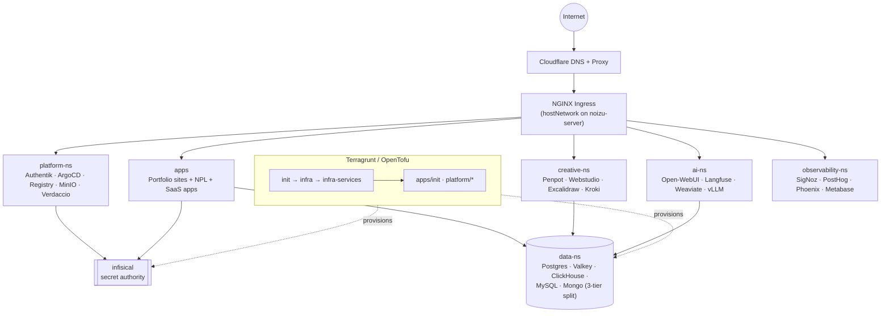

# Project Architecture — Noizu Infra

## Overview

Noizu Infra is a **monorepo that provisions and operates a self-hosted Kubernetes cluster**
serving internal platform services and a portfolio of product sites on `*.noizu.com` and
per-product domains. Infrastructure is declared as code: **Terragrunt/OpenTofu** provisions the
cluster and per-domain secret resources, **Helm** deploys workloads in dependency tiers, and
**Infisical** is the runtime secret authority.

Application code (portfolio products, shared libraries, vendored third-party services) lives
alongside the infrastructure as **git subtrees**, and is built into images pushed to an
in-cluster registry. A single source-of-truth config file, **`.infra-config.yaml`**, ties
build targets, Helm value paths, deployment tiers, and namespace mappings together for the
`docker-build` / `helm-upgrade` / `deploy-service` tooling.

The architectural style is **declarative, tiered, and self-hosting**: the cluster hosts its own
Terraform state backend, container registry, secret manager, and observability stack.

## System Diagram

```mermaid
flowchart TB
    Internet((Internet)) --> CF[Cloudflare DNS + Proxy]
    CF --> NGINX["NGINX Ingress<br/>(hostNetwork on noizu-server)"]

    NGINX --> Platform["platform-ns<br/>Authentik · ArgoCD · Registry · MinIO · Verdaccio"]
    NGINX --> Apps["apps<br/>Portfolio sites + NPL + SaaS apps"]
    NGINX --> Creative["creative-ns<br/>Penpot · Webstudio · Excalidraw · Kroki"]
    NGINX --> AI["ai-ns<br/>Open-WebUI · Langfuse · Weaviate · vLLM"]
    NGINX --> Obs["observability-ns<br/>SigNoz · PostHog · Phoenix · Metabase"]

    Apps --> Data[("data-ns<br/>Postgres · Valkey · ClickHouse ·<br/>MySQL · Mongo (3-tier split)")]
    Platform --> Infisical[["infisical<br/>secret authority"]]
    Apps --> Infisical
    Creative --> Data
    AI --> Data

    subgraph Provisioning["Terragrunt / OpenTofu"]
      T1[init → infra → infra-services] --> T2[apps/init · platform/*]
    end
    Provisioning -.provisions.-> Infisical
    Provisioning -.provisions.-> Data
```

## Core Components

| Component | Purpose |
|-----------|---------|
| **Terragrunt / OpenTofu** | Provisions cluster, storage, namespaces, secret CRDs (tiered stacks) |
| **Infisical** (+ operator) | Runtime secret authority; syncs to K8s Secrets consumed by Helm |
| **Helm** + `.infra-config.yaml` | Tiered workload deployment; single source of build/deploy metadata |
| **Docker Registry** (`ops.noizu.com`) | In-cluster image registry |
| **MinIO** | S3-compatible object store; hosts Terraform `tfstate` bucket |
| **NGINX Ingress** | hostNetwork ingress on `noizu-server`, fronted by Cloudflare |
| **Data layer** | Postgres, Valkey, ClickHouse, MySQL, MongoDB — 3-tier split |
| **Observability** | SigNoz (traces/metrics/logs), PostHog, Phoenix, Metabase |
| **Authentik** | SSO / auth provider for platform + apps |
| **Portfolio apps** | Elixir+Next.js products scaffolded from `components/start-app` |

## Technology Stack

- **IaC**: OpenTofu + Terragrunt · Helm · Cloudflare/Namecheap/SendGrid providers
- **Runtime**: Kubernetes · NGINX Ingress · Infisical · MinIO · Docker Registry
- **Apps**: Elixir/Phoenix + Next.js (React) · the Noizu Elixir framework ecosystem
- **Data**: PostgreSQL/TimescaleDB · Valkey/Redis · ClickHouse · MySQL · MongoDB · Weaviate/Qdrant
- **Schema**: Liquibase changelogs (not ORM migrations)
- **Observability**: SigNoz · OpenTelemetry · PostHog · Phoenix · Metabase

## Provisioning

Terragrunt orchestrates OpenTofu stacks in a fixed dependency order: `init` (bootstraps MinIO +
the `tfstate` bucket on local state) → `infra` (namespaces, storage, Infisical operator) →
`infra-services` → `apps/init` and `platform/*` (per-domain `InfisicalSecret` CRDs). Downstream
stacks use the MinIO bucket as their S3 backend, so `run --all` needs a MinIO port-forward.

→ *See [arch/provisioning.md](arch/provisioning.md) for stack ordering, backends, and commands*

## Deployment

Images build from `.infra-config.yaml` targets via `docker-build`, push to the in-cluster
registry, and auto-bump the mapped Helm `values.yaml` tag; `helm-upgrade` (default
`--reset-values`, values.yaml authoritative) rolls them out. `deploy-service` chains the whole
pipeline. Charts deploy in **tiers 0→9** (secrets → data/observability → platform → apps →
creative/AI), with namespaces mapped per chart. Apps run in the `apps` namespace (the former
`apps-ns` is retired).

→ *See [arch/deployment.md](arch/deployment.md) for the tier table, chart locations, and tooling*

## Secrets Flow

Secret definitions live in `.infisical-secrets.yaml`; `infisical-populate-secrets` pushes them
to Infisical; Terraform deploys `InfisicalSecret` CRDs; the operator syncs them into K8s
Secrets that Helm charts reference directly. Credential sources are layered
**`dc:` → `override:` → `auto:` → `default:`**, with the encrypted `direnv-config` layer
(`.envrc.dc`) mapping local values to Infisical names. Charts never embed secret values.

→ *See [secret-management.md](secret-management.md) (tools & recipes) and
[infrastructure-topology.md §10](infrastructure-topology.md) (flow diagram)*

## Data Layer

PostgreSQL and Valkey are each **split into 3 tier-scoped instances** (data / platform / app) to
isolate blast radius and allow independent scaling and credential rotation. ClickHouse backs
SigNoz/analytics, MinIO provides object storage, and Weaviate/Qdrant provide vector search for
AI workloads. Schema changes are applied as **Liquibase changelogs**, not ORM migrations.

→ *See [infrastructure-topology.md §3–7](infrastructure-topology.md) for per-store diagrams,
Infisical secret paths, and the full data-layer summary*

## Ingress & Traffic

Traffic enters via **Cloudflare** (DNS + proxy + wildcard `*.noizu.com` TLS), hits the **NGINX
ingress controller** (hostNetwork on `noizu-server`), and routes by hostname to services across
namespaces. Portfolio product domains carry per-domain TLS certs synced through Infisical.

→ *See [infrastructure-topology.md §1](infrastructure-topology.md) for the ingress flow diagram*

## Observability

Instrumentation flows through **OpenTelemetry collectors** into **SigNoz** (traces, metrics,
logs), with **PostHog** for product analytics, **Phoenix** for LLM tracing, and **Metabase** for
BI over the data stores. All run in `observability-ns` (OneUptime in `platform-observability`).

→ *See [infrastructure-topology.md §8](infrastructure-topology.md) for the pipeline diagram*

## Authentication

**Authentik** provides SSO for platform services and apps; several portfolio apps also use
Authentik PKCE flows, while others use the start-app scaffold's own auth. Secrets and OAuth
credentials are provisioned through Infisical.

→ *See [infrastructure-topology.md §9](infrastructure-topology.md) for the auth flow diagram*

## Applications

Portfolio products (49 subtrees) are mostly **Elixir/Phoenix + Next.js** apps scaffolded from
`components/start-app`, backed by the **Noizu Elixir framework ecosystem**. NoizuPromptLingo
(NPL) is the flagship — an Elixir app exposing multiple MCP servers, a prompt engine, and
tooling. Vendored upstream services under `3rd-party/` are built into custom images.

→ *See [layout/projects.md](layout/projects.md) and [layout/components-libs.md](layout/components-libs.md)*

## Key Decisions

- **OpenTofu + MinIO-hosted state** — open-source IaC with an in-cluster, self-bootstrapping backend
- **Git subtrees over submodules** — monorepo builds without recursive clones, still pushable upstream
- **Infisical + layered `dc` sources** — one declarative secret authority; no secrets in charts
- **`values.yaml` authoritative** — `--reset-values` default avoids stale-value drift
- **Tiered rollout + 3-tier data split** — dependencies-first ordering, isolated blast radius

→ *See [arch/decisions.md](arch/decisions.md) for rationale*
