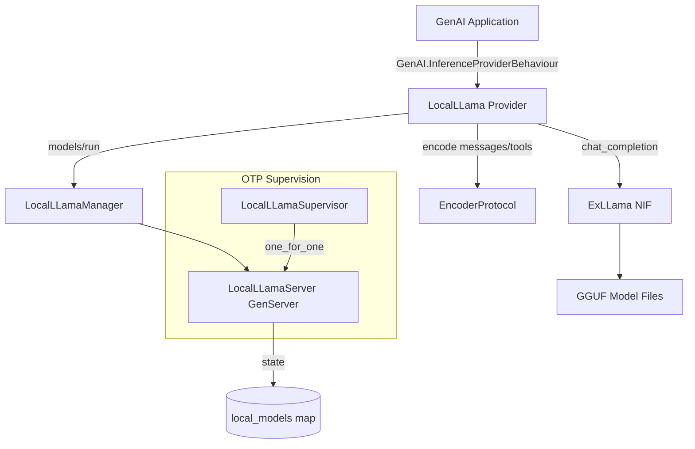

# Project Architecture

## Overview

GenAI Local is an Elixir extension library that provides a **local LLM inference provider** for the [GenAI](https://github.com/noizu-labs-ml/genai) framework. It wraps [ExLLama](https://hex.pm/packages/ex_llama) (a Rust NIF for llama.cpp) behind the standard `GenAI.InferenceProviderBehaviour`, allowing local GGUF models to be used interchangeably with cloud providers like OpenAI or Anthropic.

The library runs as an OTP application with a supervision tree that manages model lifecycle and state.

## System Diagram

```mermaid
graph TB
    App[GenAI Application] -->|"GenAI.InferenceProviderBehaviour"| Provider[LocalLLama Provider]
    Provider -->|models/run| Manager[LocalLLamaManager]
    Manager --> Server[LocalLLamaServer GenServer]
    Server -->|state| Models[(local_models map)]
    Provider -->|chat_completion| ExLLama[ExLLama NIF]
    ExLLama --> GGUF[GGUF Model Files]

    subgraph OTP Supervision
        Supervisor[LocalLLamaSupervisor] -->|one_for_one| Server
    end

    Provider -->|encode messages/tools| Encoder[EncoderProtocol]
```

## Core Components

| Component | Purpose |
|-----------|---------|
| `LocalLLama` | Provider entry point — implements `GenAI.InferenceProviderBehaviour` |
| `LocalLLamaManager` | Public API facade for model queries |
| `LocalLLamaServer` | GenServer holding loaded model state |
| `LocalLLamaSupervisor` | OTP supervisor for the server process |
| `EncoderProtocol` | Protocol for encoding messages/tools into model-compatible format |
| `Models` | Loads GGUF models from priv directory via ExLLama |

## Inference Flow

A `do_run` call resolves the effective model, encodes messages and tools via `EncoderProtocol`, builds a request body, and delegates to `ExLLama.chat_completion/3` for inference against the loaded NIF model reference.

→ *See [arch/inference-flow.md](arch/inference-flow.md) for details*

## OTP Supervision

The application starts a single supervision tree: `GenAILocal.Application` → `LocalLLamaSupervisor` (one_for_one) → `LocalLLamaServer`. The server maintains a `local_models` map keyed by model identifier.

## Encoding Layer

`EncoderProtocol` is an Elixir protocol with implementations for `GenAI.Message`, `GenAI.Tool`, `GenAI.Message.ToolResponse`, and `GenAI.Message.ToolUsage`. This makes the encoding extensible — third parties can add new message types by implementing the protocol.

→ *See [arch/encoding.md](arch/encoding.md) for details*

## Technology Stack

| Layer | Technology |
|-------|-----------|
| Language | Elixir 1.19 / OTP 28 |
| Inference | ExLLama (Rust NIF wrapping llama.cpp) |
| Model format | GGUF (quantized) |
| Framework | GenAI provider interface |
| Build | Mix, cmake (for NIF compilation) |

## Key Decisions

- **Why ExLLama NIF**: Direct in-process inference avoids HTTP overhead of local API servers (like llama.cpp server mode), enabling tighter OTP integration
- **Why Protocol for encoding**: Allows third-party message/tool types without modifying provider code
- **Why GenServer for model state**: Centralizes model lifecycle; commented-out code suggests planned runtime settings and PubSub-based model loading notifications
