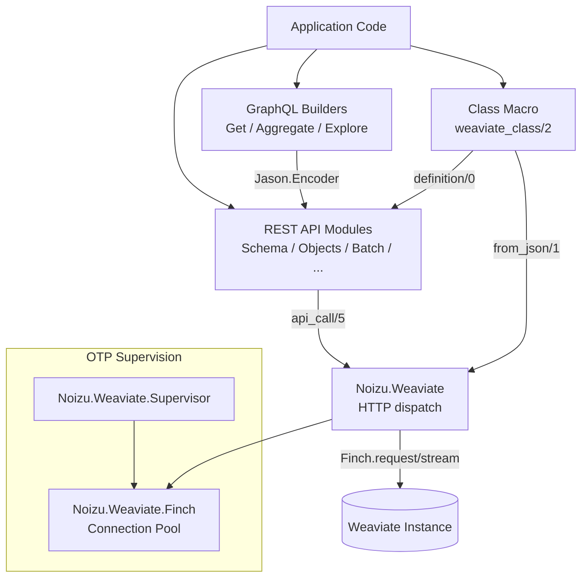

# Project Architecture

## Overview

`noizu_weaviate` is an Elixir client library for the [Weaviate](https://weaviate.io/) vector database. It provides typed REST and GraphQL interfaces with a macro-based class mapping system that lets Elixir modules mirror Weaviate collections. The library runs as an OTP application supervising a Finch HTTP connection pool.

## System Diagram

```mermaid
graph TB
    App[Application Code] --> Class[Class Macro<br/>weaviate_class/2]
    App --> GQL[GraphQL Builders<br/>Get / Aggregate / Explore]
    App --> API[REST API Modules<br/>Schema / Objects / Batch / ...]

    GQL -->|Jason.Encoder| API
    API -->|api_call/5| Core[Noizu.Weaviate<br/>HTTP dispatch]
    Core -->|Finch.request/stream| Weaviate[(Weaviate Instance)]

    Class -->|definition/0| API
    Class -->|from_json/1| Core

    subgraph OTP Supervision
        Sup[Noizu.Weaviate.Supervisor] --> Finch[Noizu.Weaviate.Finch<br/>Connection Pool]
    end

    Core --> Finch
```

## Core Components

| Component | Module Root | Purpose |
|-----------|-------------|---------|
| HTTP Core | `Noizu.Weaviate` | `api_call/5` — unified HTTP dispatch, JSON encode/decode, response routing |
| REST API | `Noizu.Weaviate.Api.*` | Thin wrappers mapping 1:1 to Weaviate REST endpoints |
| GraphQL | `Noizu.Weaviate.GraphQL` | Builder-pattern query structs (Get, Aggregate, Explore) |
| Search Operators | `Noizu.Weaviate.GraphQL.*` | NearText, BM25, Hybrid, NearVector, and 10 more |
| Class Macro | `Noizu.Weaviate.Class` | `weaviate_class/2` — generates struct, encoder, introspection |
| Data Structs | `Noizu.Weaviate.Struct.*` | Typed representations of Weaviate schema concepts |
| Application | `Noizu.Weaviate.Application` | OTP app — supervises Finch pool |

## Three-Layer Architecture

The library is organized into three distinct layers that separate concerns cleanly.

→ *See [arch/layers.md](arch/layers.md) for details*

## Data Flow

Requests flow from application code through GraphQL builders or REST wrappers, converge at `api_call/5`, and dispatch via Finch to the Weaviate instance. Responses decode through Jason and optionally through `Module.from_json/1` for typed deserialization.

→ *See [arch/data-flow.md](arch/data-flow.md) for details*

## Class Macro System

The `weaviate_class/2` macro generates Elixir modules that mirror Weaviate collections — struct definition, JSON encoding, schema introspection, and protocol derivation from a single DSL block.

→ *See [arch/class-macro.md](arch/class-macro.md) for details*

## Technology Stack

| Concern | Choice |
|---------|--------|
| Language | Elixir 1.20 / OTP 29 |
| HTTP | Finch (connection pooling, streaming) |
| JSON | Jason |
| Test Mocking | Mimic |
| Package Registry | Hex.pm (`:noizu_weaviate`) |

## Key Decisions

- **Finch over HTTPoison/Tesla**: Connection pooling built-in, lower overhead for repeated calls to a single Weaviate host
- **Compile-time endpoint**: `Application.compile_env` for the base URL avoids runtime config lookup on every request but requires recompilation on change
- **Jason.Encoder on GraphQL structs**: GraphQL queries serialize as JSON bodies (not raw query strings), matching Weaviate's `/v1/graphql` POST interface
- **Macro-based class mapping**: Eliminates boilerplate for struct/encoder/decoder when defining multiple Weaviate collections
