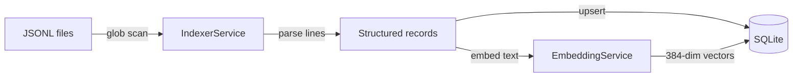
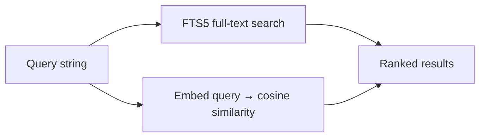

# Data Flow

## Indexing Pipeline

1. **Discovery** — IndexerService scans configured watch paths (default: `~/.claude/projects/`) for `*.jsonl` files
2. **Parsing** — Each JSONL line becomes a typed record: `user`, `assistant`, `system`, `attachment`, etc.
3. **Storage** — Conversations and messages are upserted into SQLite with content hashing to skip unchanged files
4. **Embedding** — Message text is embedded via `all-MiniLM-L6-v2` and stored as 384-dimensional float vectors in sqlite-vec virtual tables
5. **Watching** — File watcher detects new/changed JSONL files and re-indexes incrementally

## Search Pipeline

- **FTS mode** — SQLite FTS5 with BM25 ranking
- **Semantic mode** — Query embedded, cosine similarity against stored vectors via sqlite-vec

## Client Data Flow

All clients (web, CLI) communicate with the API via HTTP `fetch` to `localhost:3100/api/*`. The shared package provides an `ensureApi()` helper that auto-launches the API server if it isn't running.

## Record Types

Source JSONL records: `permission-mode`, `user`, `assistant`, `attachment`, `system`, `file-history-snapshot`, `last-prompt`, `queue-operation`.

Derived entities: `Conversation`, `SearchResult`, `ThreadEdit`, `Artifact`, `Dataset`, `DatasetEntry`, `SavedPrompt`.
