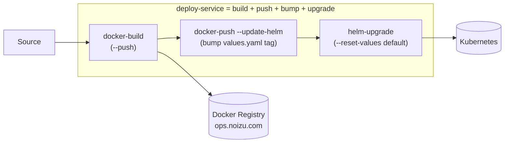

# Deployment — Images, Charts & Tiers

Workloads are containerized and deployed via **Helm**. Build/deploy metadata is centralized in
the repo-root **`.infra-config.yaml`** (consumed by the `docker-build` / `helm-upgrade` /
`deploy-service` CLI tools in `utilities/`).

## Pipeline



- **`docker-build <image-key>`** — build an image declared in `.infra-config.yaml`
  (`project.projects[].services[]` composite, or `project.docker.images[]` standalone).
- **`docker-push --update-helm`** — push and auto-bump the mapped Helm `values.yaml` tag via
  each image's `helm:` stanza.
- **`helm-upgrade`** — deploy/upgrade a chart. **Defaults to `--reset-values`** (values.yaml is
  authoritative); opt out per-release via `helm_preserve_values` in `.infra-config.yaml`.
- **`deploy-service <image-key>`** — full pipeline: build + push + chart bump + helm upgrade.

## Chart locations

- **Portfolio charts** live in-repo under `projects/*/helm` and `components/*/helm`.
- **Cross-project charts** live under `kubernetes/helm/apps/` (e.g. `remote-access`, `tobornalp`).
- **Shared platform charts** (codefresh, docmost, authentik, etc.) live in the **upstream
  `noizu-infra` repo** under `kubernetes/helm/` — not all present in this checkout.
  `.infra-config.yaml` `chart_path_overrides` / `helm_scan_dirs` resolve chart paths.

## Deployment tiers

Charts deploy in tier order; tier *N* completes before *N+1*. Tiers and namespace mappings are
defined in `.infra-config.yaml` (`tiers:` + `namespace_overrides:`).

| Tier | Name | Namespace(s) | Representative charts |
|------|------|--------------|-----------------------|
| 0 | Secrets Management | `infisical` | infisical |
| 1 | Data & Observability | `data-ns`, `observability-ns`, `platform-observability` | shared-{postgres,mysql,redis,valkey,mongodb,clickhouse,zookeeper}, signoz, otel-collector, phoenix, posthog, oneuptime, metabase |
| 2 | Platform & Admin | `platform-ns`, `apps` | argocd, authentik, minio, docker-registry, verdaccio, headlamp, cockpit, keygen, infra-portal |
| 3 | Core Applications | `apps` | codefresh, npl-mcp, docmost, plane, ghost, mautic, listmonk, n8n, + portfolio sites (aifighter, noizu, therobot*, ddi, …) |
| 4 | User-Facing & Creative | `creative-ns`, `apps`, `ai-ns` | penpot, webstudio, excalidraw, drawio, mermaid, kroki, plantuml, open-webui, langfuse, livebook, jupyterhub, code-server |
| 5 | Auxiliary & AI Infrastructure | `ai-ns`, `mail-ns`, `accounting-ns` | accounting-infra, mailu, vllm, weaviate, qdrant, chatterbox-tts, kitten-tts |
| 9 | Health Tests | `platform-ns` | health-tests |

> **Namespaces**: strict separation by function. Apps run in `apps` — the old `apps-ns` was
> retired (2026-07-08); use `apps` exclusively.

## Common commands

```bash
helm-upgrade --list                    # all charts with tier/namespace
helm-upgrade --include <release>       # one chart
helm-upgrade --tier 0                  # a whole tier
helm-upgrade --preview                 # diff live vs proposed
deploy-service backend frontend        # batch full pipeline
```

→ Tooling map: [../layout/utilities.md](../layout/utilities.md)
→ Database migrations: `.infra-config.yaml` `liquibase_targets` + `liquibase-shell`
