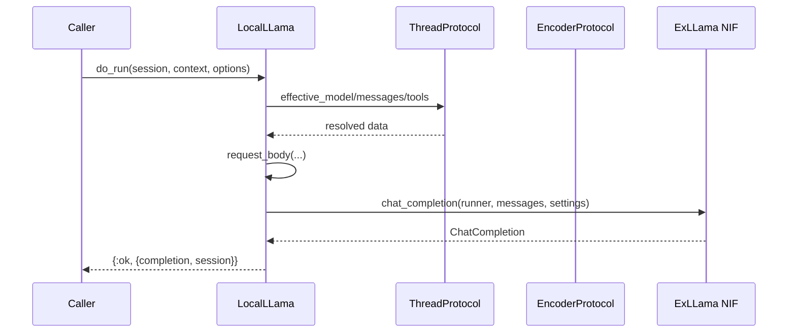

# Inference Flow

## Request Lifecycle

The inference pipeline in `GenAI.Provider.LocalLLama.do_run/3` follows these steps:

1. **Resolve model** — `GenAI.ThreadProtocol.effective_model/3` returns the model struct, which contains an `external` field holding the ExLLama model reference (NIF resource)

2. **Resolve encoder and provider** — Fetches the model's encoder module and provider identifier via `GenAI.ModelProtocol`

3. **Resolve settings** — `effective_settings/5` merges session, context, and option-level settings

4. **Resolve tools** — `GenAI.ThreadProtocol.effective_tools/4` collects tool definitions for the request

5. **Resolve messages** — `GenAI.ThreadProtocol.effective_messages/4` collects the conversation thread

6. **Build request body** — `request_body/7` assembles the final payload (inherited from `GenAI.InferenceProviderBehaviour`)

7. **Execute inference** — `ExLLama.chat_completion(runner, messages, settings)` performs inference via the Rust NIF, returning a `GenAI.ChatCompletion` struct

8. **Attach provider** — The completion is annotated with the provider identifier before returning

## Model Loading

Models are loaded via `GenAI.Provider.LocalLLama.Models.priv/2`:

- Resolves the priv directory from options or application config (`:genai_local, :local_llama, :otp_app`)
- Verifies the GGUF file exists on disk
- Calls `ExLLama.load_model/1` to load into memory (returns a NIF reference)
- Wraps in a `GenAI.ExternalModel` struct with the NIF reference in the `external` field

## Sequence

