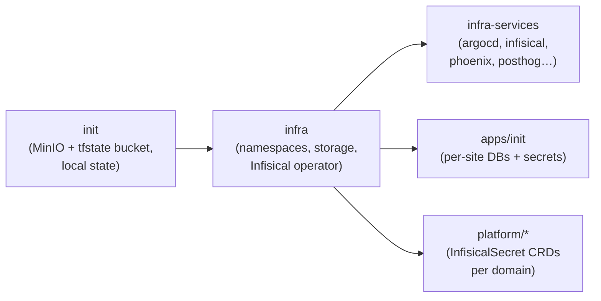

# Provisioning — Terraform / Terragrunt

All cluster infrastructure is provisioned declaratively with **Terragrunt** orchestrating
**OpenTofu** (`tofu`, configured as the binary in `root.hcl`). Stacks apply in a fixed
dependency order enforced by `terragrunt.hcl` `dependencies` blocks.

## Stack ordering



1. **`init`** bootstraps MinIO and creates the S3-compatible `tfstate` bucket using **local
   state**. Everything downstream uses that bucket as its S3 backend.
2. **`infra`** provisions core cluster resources: namespaces, storage classes, and the
   Infisical Kubernetes operator.
3. **`infra-services`** deploys cluster services (ArgoCD, Infisical server, Phoenix, PostHog,
   etc.).
4. **`apps/init`** provisions per-site resources — each `<site>-site.tf` plus
   `files/postgres/initdb.d/<site>/init-db.sh` DB seeders.
5. **`platform/*`** deploys `InfisicalSecret` CRDs and related platform resources, one module
   per domain (accounting, ai, analytics, content, creative, crm, devtools, mail, marketing,
   observability, seo), each depending on `platform/init`.

## Backends & state

- **State bucket**: MinIO (`tfstate` bucket), S3-compatible. All non-`init` stacks configure
  it as their S3 backend via `terraform/kubernetes/root.hcl`.
- **`init` uses local state** because it *creates* the bucket the others depend on.

## Prerequisites (from repo-root CLAUDE.md)

```bash
export KUBE_CONFIG_PATH=~/.kube/noizu/config
export KUBE_CONFIG_CONTEXT=noizu
export AWS_ACCESS_KEY_ID=<minio_root_user>       # non-init stacks
export AWS_SECRET_ACCESS_KEY=<minio_root_password>
```

> **`terragrunt run --all` requires a port-forward to MinIO's admin endpoint
> (`127.0.0.1:9000`)** or the root `init` fails at the backend. Start the port-forward first.

## Commands

```bash
# from terraform/kubernetes/
terragrunt run --all plan          # preview all stacks in dependency order
terragrunt run --all apply         # apply all stacks
cd terraform/kubernetes/init && terragrunt apply   # single stack
```

## Other Terraform stacks

`terraform/{cloudflare,monitoring,namecheap,sendgrid}` manage DNS/zones/TLS-origin, monitoring
providers (incl. the custom SigNoz provider from `3rd-party/`), domain registrations, and
SendGrid domain auth respectively. `terraform/modules/` holds shared modules.

→ Directory map: [../layout/terraform.md](../layout/terraform.md)
