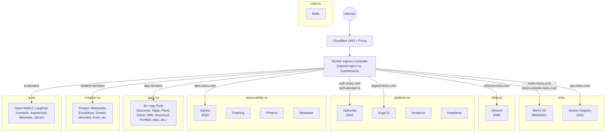
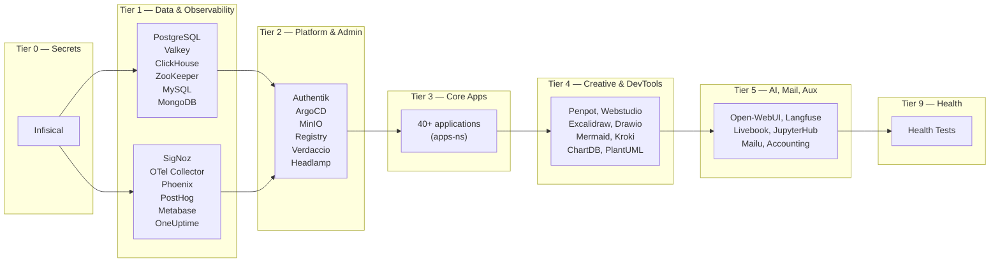
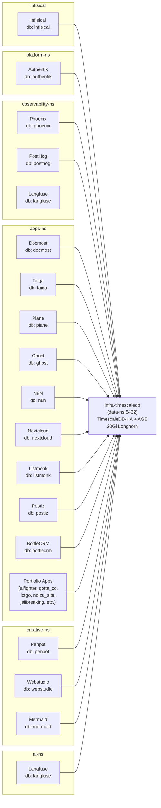
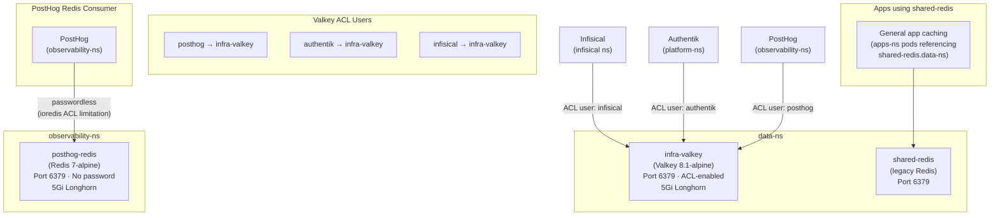
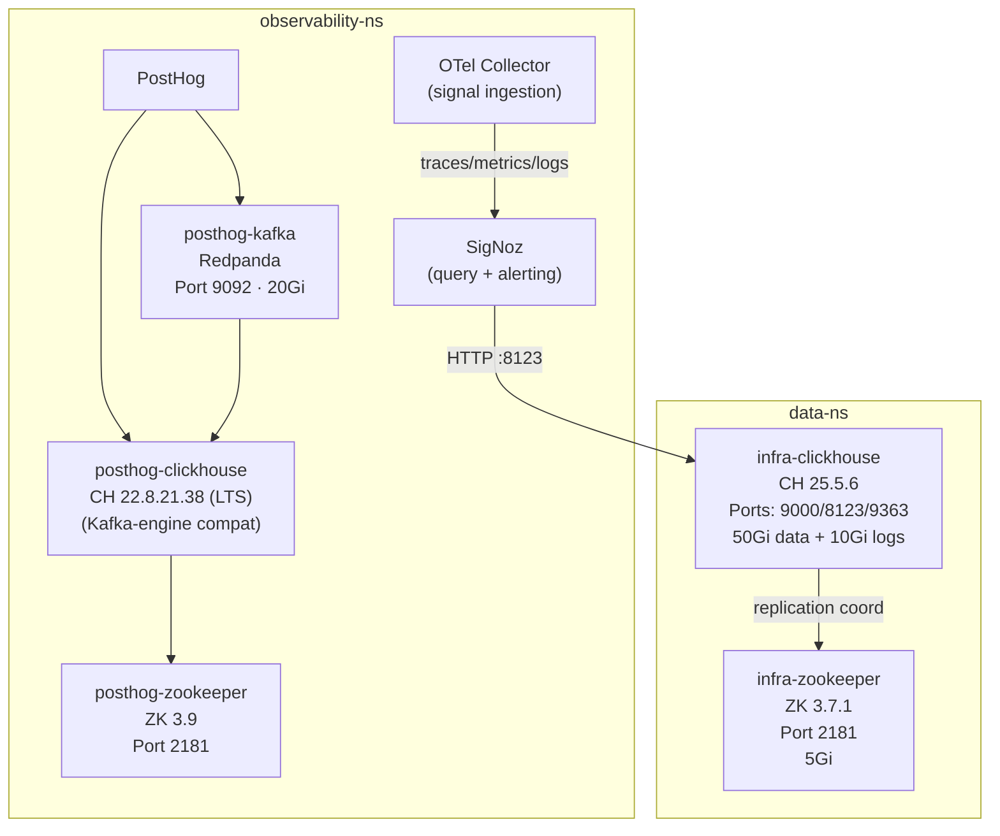
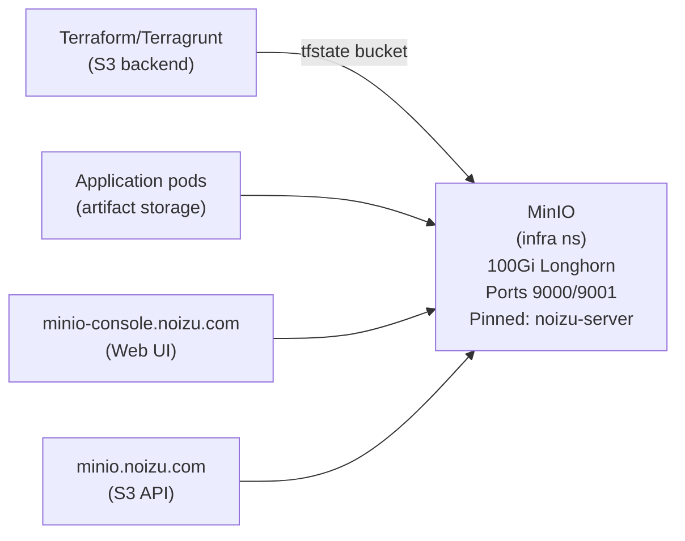
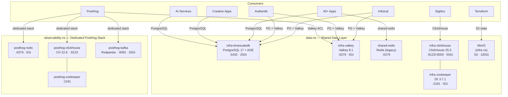
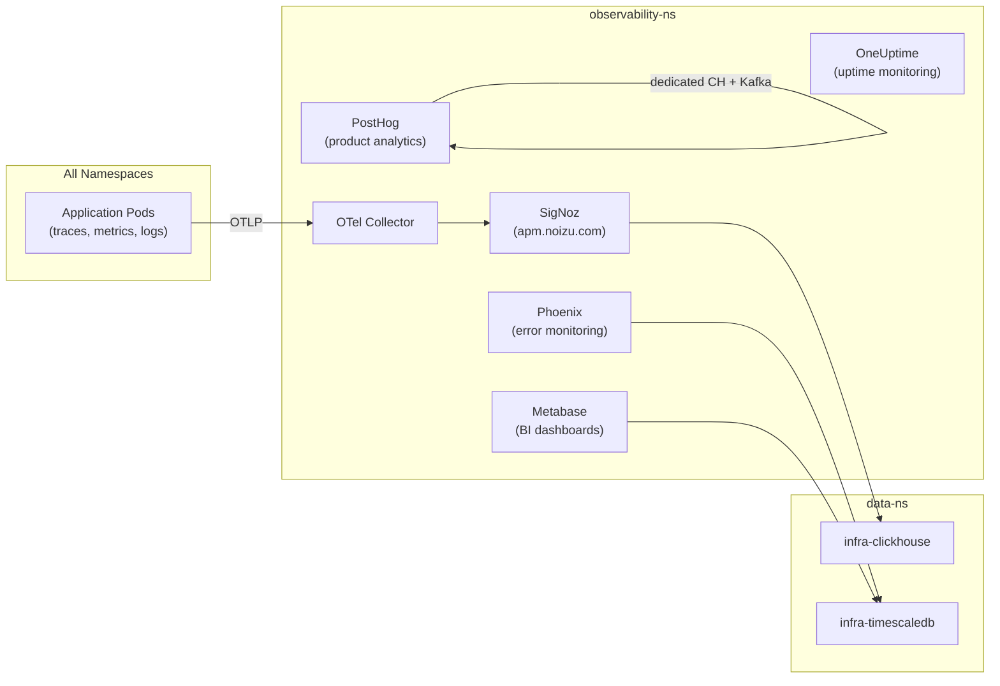
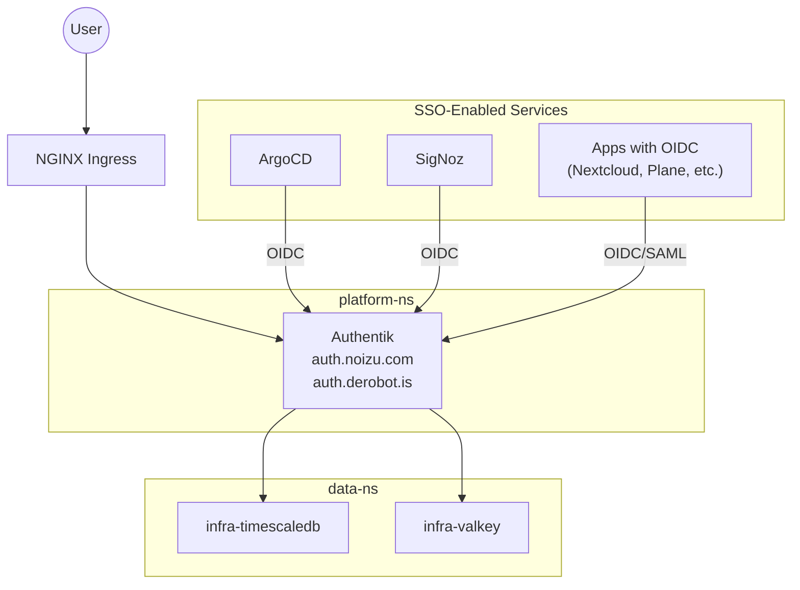
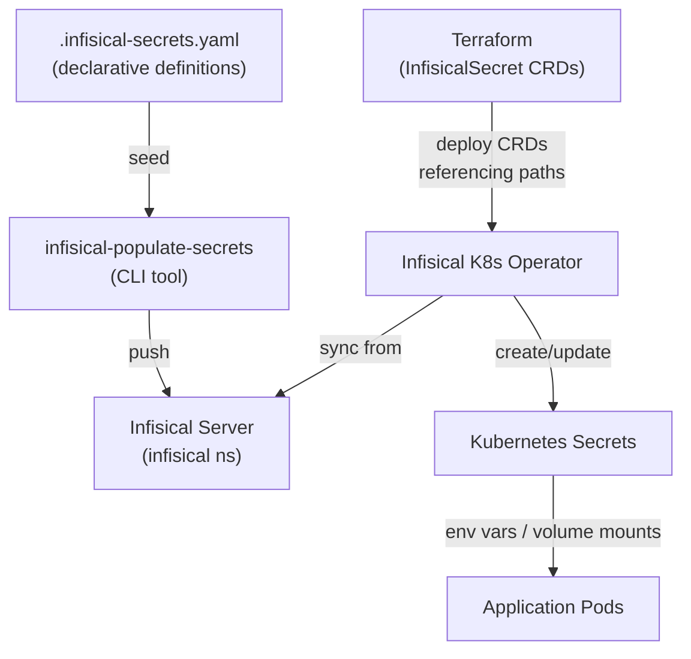

# Infrastructure Topology

Diagrams showing traffic flow, service dependencies, and data-layer connections across the Noizu Kubernetes cluster.

---

## 1. Traffic Ingress Flow

Traffic enters via Cloudflare, hits the NGINX ingress controller (hostNetwork on `noizu-server`), and routes to services across namespaces.

---

## 2. Namespace & Tier Overview

Deployment tiers control startup ordering. Tier N completes before N+1.

---

## 3. PostgreSQL Connections

All applications share a single `infra-timescaledb` instance (TimescaleDB-HA + Apache AGE) in `data-ns` on port 5432. Each app has its own database.

Mailu runs a **dedicated PostgreSQL** instance within `mail-ns` — it does not share the infra database.

---

## 4. Redis / Valkey Connections

Three distinct Redis-compatible instances serve different consumers.

### Summary Table

| Instance | Namespace | Image | Auth | Consumers |
|----------|-----------|-------|------|-----------|
| `infra-valkey` | data-ns | valkey/valkey:8.1-alpine | ACL per-user passwords | Infisical, Authentik, PostHog |
| `shared-redis` | data-ns | redis (legacy) | Password | General app caching (apps-ns) |
| `posthog-redis` | observability-ns | redis:7-alpine | None (passwordless) | PostHog only |
| ArgoCD embedded | platform-ns | Built into ArgoCD chart | Internal | ArgoCD state only |

---

## 5. ClickHouse & Analytics Pipeline

Two separate ClickHouse instances — shared infra and PostHog-dedicated — each with their own ZooKeeper.

---

## 6. Object Storage (MinIO)

MinIO provides S3-compatible storage in the `infra` namespace. It serves as the Terraform remote state backend and general object storage.

---

## 7. Full Data Layer Summary

End-to-end view of all data services and their consumers.

---

## 8. Observability Pipeline

How telemetry flows from application pods through collection to dashboards.

---

## 9. Authentication Flow

Authentik provides SSO (OIDC/SAML) for services that support it.

---

## 10. Secrets Flow

How secrets propagate from source of truth to running pods.

