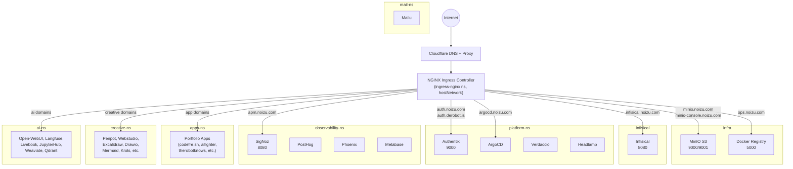
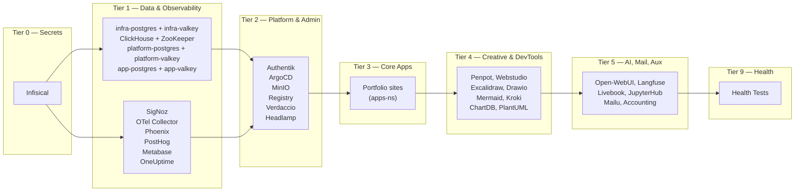
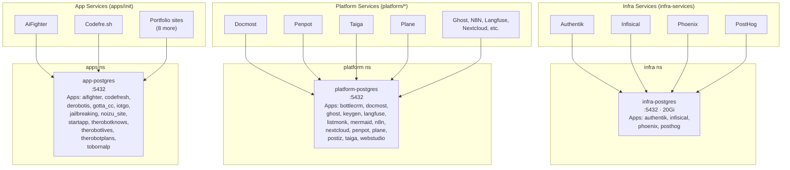
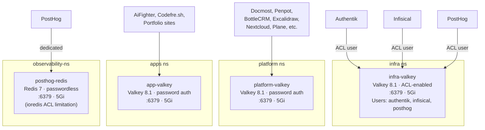
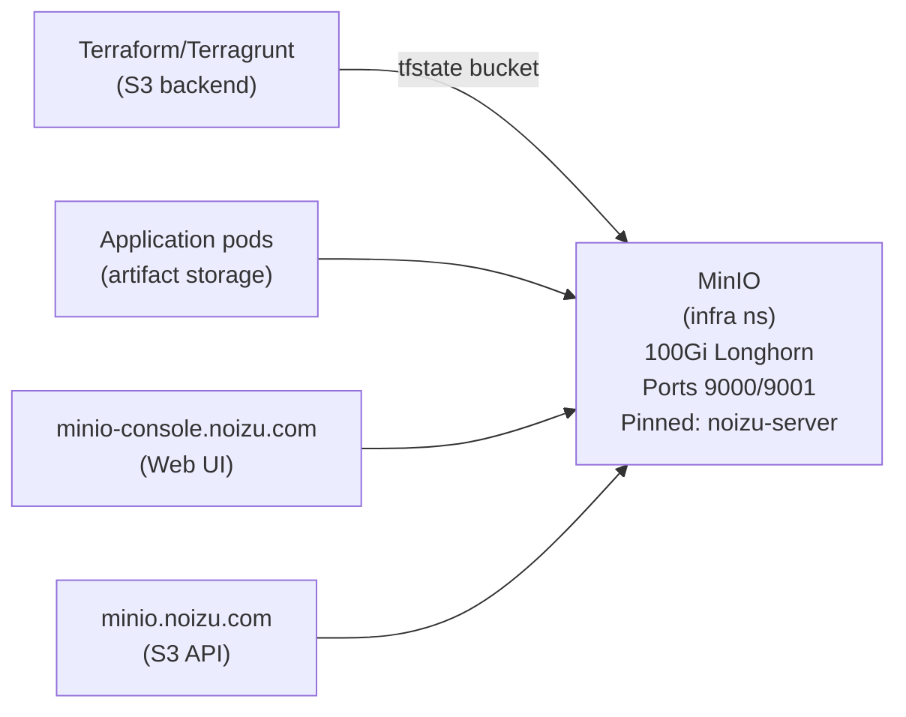
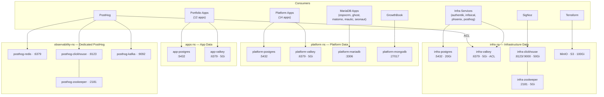
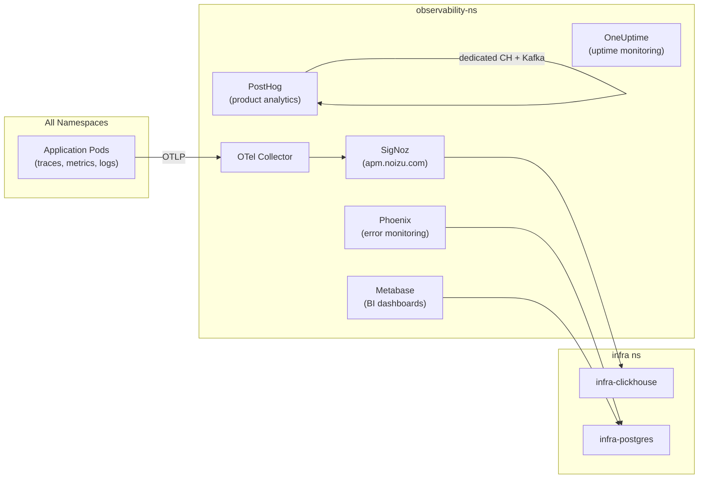
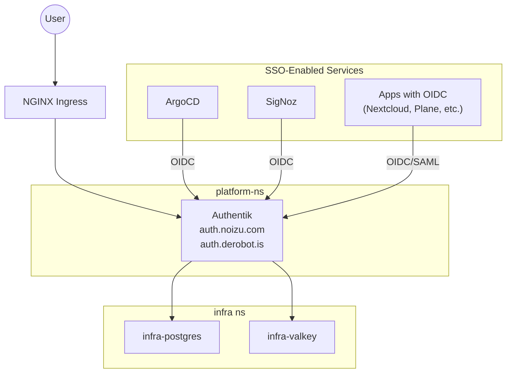
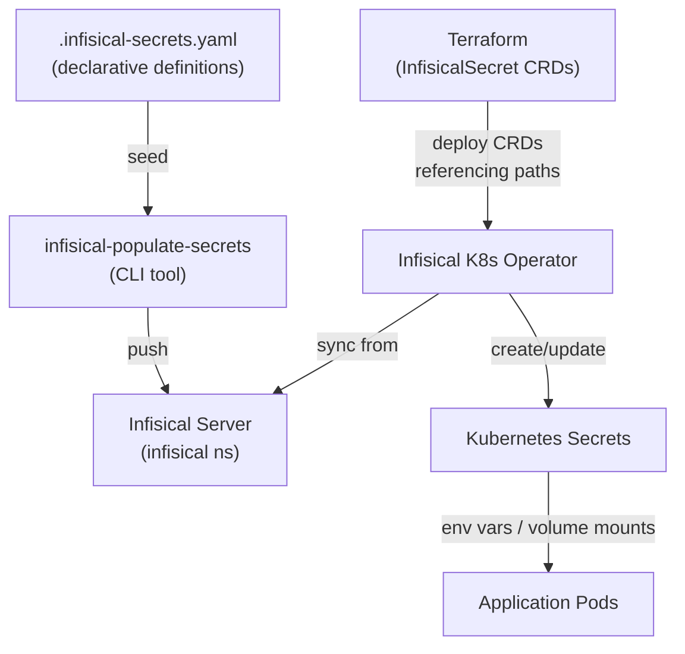

# Infrastructure Topology

Diagrams showing traffic flow, service dependencies, and data-layer connections across the Noizu Kubernetes cluster.

---

## 1. Traffic Ingress Flow

Traffic enters via Cloudflare, hits the NGINX ingress controller (hostNetwork on `noizu-server`), and routes to services across namespaces.

---

## 2. Namespace & Tier Overview

Deployment tiers control startup ordering. Tier N completes before N+1.

---

## 3. PostgreSQL — 3-Tier Split

Three independent PostgreSQL (TimescaleDB-HA + Apache AGE) instances, one per fixture group.

Mailu and accounting run **dedicated** databases within their own namespaces.

### Infisical Secret Paths

| Tier | PostgreSQL Path | Valkey Path | Managed Secret |
|------|----------------|-------------|----------------|
| Infra | `/data/postgres` | `/data/valkey` | `postgres-secrets` |
| Platform | `/platform/postgres` | `/platform/valkey` | `platform-postgres-secrets` |
| Apps | `/apps/postgres` | `/apps/valkey` | `app-postgres-secrets` |

---

## 4. Valkey — 3-Tier Split

Three Valkey instances provide per-tier caching. No legacy Redis.

### Summary Table

| Instance | Namespace | Auth | Consumers |
|----------|-----------|------|-----------|
| `infra-valkey` | infra | ACL per-user | Infisical, Authentik, PostHog |
| `platform-valkey` | platform | Password | Platform-tier apps (14 apps) |
| `app-valkey` | apps | Password | Portfolio sites (12 apps) |
| `posthog-redis` | observability-ns | None | PostHog only |
| ArgoCD embedded | platform-ns | Internal | ArgoCD state only |

---

## 5. ClickHouse & Analytics Pipeline

Two separate ClickHouse instances — shared infra and PostHog-dedicated — each with their own ZooKeeper.

---

## 6. Object Storage (MinIO)

MinIO provides S3-compatible storage in the `infra` namespace. It serves as the Terraform remote state backend and general object storage.

---

## 7. Full Data Layer Summary

End-to-end view of all data services across the 3-tier model.

---

## 8. Observability Pipeline

How telemetry flows from application pods through collection to dashboards.

---

## 9. Authentication Flow

Authentik provides SSO (OIDC/SAML) for services that support it.

---

## 10. Secrets Flow

How secrets propagate from source of truth to running pods.

