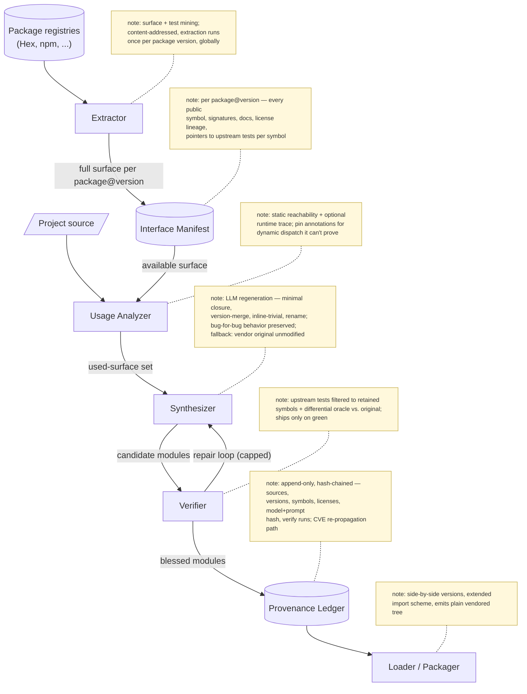
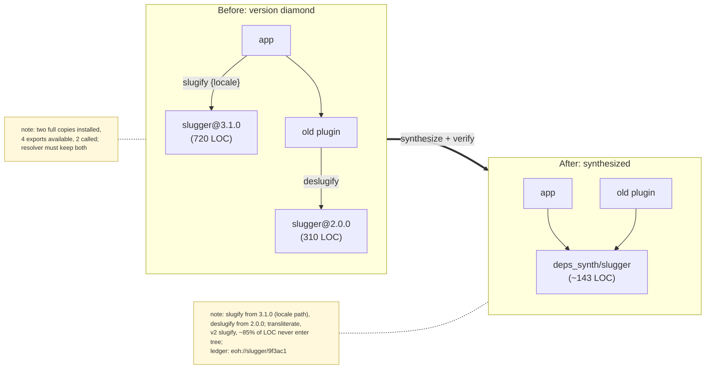

# End of Hell

**LLM-driven dependency collapse: ship only the code you actually call.**

> Status: concept / pre-alpha. This document is the design thesis; nothing is built yet.

---

## Thesis

Dependency management today distributes *packages* — opaque, versioned artifacts — when what a
project actually consumes is a small slice of each package's *interface surface*. A typical app
ships 100% of lodash and calls 2.3% of it, transitively drags in hundreds of packages it never
references, and inherits every diamond-version conflict and supply-chain risk along the way.

End of Hell inverts the model. Instead of resolving a dependency tree and bundling artifacts, it:

1. **Measures** the interface surface each dependency *offers* vs. what the project *actually uses*
   (static reachability + optional runtime tracing).
2. **Collapses** the tree: an LLM regenerates the dependency closure from scratch as a minimal,
   coherent synthesis containing only the referenced functionality — inlining trivial transitive
   deps, merging redundant utilities, and dissolving diamond-version conflicts by synthesizing one
   module that satisfies all callers.
3. **Preserves** the full interface manifest of everything that *was* available, per package and
   version, so the collapse is auditable and reversible — when a new call site appears, the
   manifest says exactly what can be re-expanded and from where.
4. **Verifies** every synthesized module against the upstream package's own test suite (filtered
   to the retained surface) plus differential testing with the original as oracle.
5. **Supports side-by-side versions** as a first-class citizen via extended package naming and
   import conventions (`lodash@4/get` and `lodash@3/get` coexisting without resolver gymnastics),
   because once dependencies are synthesized source rather than singleton artifacts, "one version
   per package" stops being a constraint.

The name is literal: this ends dependency hell — and, as a side effect, ends `left-pad`- and
`xz`-style supply-chain injection, because **nothing enters the build unread**. Code that is never
referenced never exists in the tree, and code that is referenced passes through analysis,
synthesis, and verification before it ships.

## Why now

- LLMs are the first tool that can restructure code *semantically* — classic tree-shaking and
  dead-code elimination remove unreachable code but cannot merge, inline, or simplify across
  package boundaries.
- Supply-chain attacks have made "trust the artifact" untenable; SBOMs document the problem
  without shrinking it.
- Context windows and code-gen reliability have crossed the threshold where regenerating a
  moderate dependency closure, with tests as the acceptance gate, is tractable.

## Prior art (and why it falls short)

| Approach | What it does | What it can't do |
| --- | --- | --- |
| Tree-shaking (Rollup, esbuild) | Drops unreachable exports at bundle time | Artifact-level only; can't restructure, merge versions, or cross package boundaries semantically |
| Dead-code elimination (LTO, `mix release` pruning) | Strips unused object code | Same — syntactic reachability, no synthesis |
| Nix / lockfiles / SBOMs | Reproducibility and provenance of *artifacts* | Ships everything; documents bloat rather than removing it |
| Vendoring / forking | Local control of dep source | Manual, unmaintained, no manifest of what was dropped |
| Vale/API-extractor-style surface reports | Interface inventories | Analysis only; no collapse step |

The gap: nothing operates on dependencies as *regenerable semantic content with a provable
interface contract*. That's the niche.

## Architecture

Five components around a central provenance ledger:



### 1. Extractor
Walks a package registry (Hex first — see *Why Elixir first* below) and produces, per
`package@version`, an **interface manifest**: every public module/function/type with signatures,
docs, license lineage, and a pointer to the upstream tests that exercise each symbol. Manifests
are content-addressed and cached — extraction happens once per package version, globally.

### 2. Usage Analyzer
Given a project, computes the *used* surface per dependency: static call-graph reachability as the
primary signal, optional runtime tracing (BEAM `:cover`/tracing, or instrumented test runs) as a
second signal for dynamic dispatch. Emits a **usage report** — the standalone-valuable artifact
("you ship 100%, you call 2.3%") — and a set of pins/escape hatches for code it can't prove about
(reflection, `apply/3`, string-keyed dispatch → `# eoh:pin-whole-package` annotations).

### 3. Synthesizer
The LLM stage. Takes (used surface, original sources, manifest) and regenerates a minimal closure:

- Inline transitive deps below a size threshold directly into their consumer.
- Merge multiple versions of the same package into one synthesized module satisfying all callers,
  or emit true side-by-side modules when semantics genuinely diverge.
- Preserve behavior **bug-for-bug** — error messages, edge-case semantics, ordering. Simplification
  of *structure* is allowed; change of *observable behavior* is not.
- Every emitted module carries a header linking back to its ledger entry.

Runs as an agentic loop: synthesize → verify → repair, with hard iteration caps and fallback to
"vendor the original source unmodified" when synthesis can't pass verification (graceful
degradation — worst case equals today's status quo).

### 4. Verifier
The trust story; make-or-break for the whole idea.

- **Upstream test carry-over:** run the original package's test suite filtered to retained
  symbols against the synthesized module.
- **Differential oracle:** property-based tests generating inputs over the retained surface,
  asserting synthesized output ≡ original output (original kept around solely as oracle, never
  shipped).
- **Contract checks:** dialyzer/type-level conformance of the synthesized surface to the manifest
  signatures.

A module ships only with a green verification record in the ledger.

### 5. Provenance Ledger
Append-only, hash-chained log (flat-file first, à la the Accord's Epoch 1→2 ledger machinery):
per synthesized module — source packages+versions+hashes, retained symbol set, license lineage,
synthesizer model+prompt hash, verification run results. Answers "where did this line come from
and what did we give up?" mechanically. This is also the **CVE re-propagation** path: an upstream
advisory maps to symbols → ledger maps symbols to synthesized modules → targeted re-synthesis.

### Loader / packaging conventions
Synthesized output is an ordinary vendored source tree (`deps_synth/` or similar) — no runtime
magic required. Extended naming (`PkgV4.Get` / `lodash__4`) makes side-by-side versions plain
modules. The manifest ships alongside so tooling (and future call sites) can re-expand.

## Infra

- **Runner:** the pipeline is itself an agentic harness — orchestrator + per-package synthesis
  workers + verify workers, embarrassingly parallel per package. Fits the existing Noizu K8s
  platform: a job queue in `apps-ns`, LLM calls via configured providers, artifacts to MinIO.
- **Manifest cache:** content-addressed store (MinIO/S3) keyed by `package@version` hash — global,
  shared across projects, append-only.
- **Ledger:** flat files in-repo per project (Epoch 1), SHA-256 chained (Epoch 2); no server
  dependency to start.
- **CI integration:** a `mix eoh.sync` / CLI entry point that diffs current usage vs. ledger and
  re-synthesizes only what changed.

## Why Elixir first

BEAM apps have clean module boundaries, small dependency trees (tens, not thousands), excellent
tracing/coverage hooks for the dynamic-reachability problem, and Hex packages ship tests and docs
uniformly. JS/npm is the flashier market and the deeper hell, but its dynamic-dispatch swamp and
tree scale make it a phase-2 target, not a proving ground.

## Second target: Node / npm

npm is where the payoff is largest and the problem is hardest — it is the ecosystem the project is
named after. What changes relative to the Elixir pipeline, component by component:

- **Extractor.** Surface extraction leans on TypeScript: `.d.ts` files (shipped or from
  DefinitelyTyped) give signatures for most of the registry; for untyped packages the extractor
  infers surface from `exports`/`module.exports` shape plus JSDoc, and marks the manifest
  *low-confidence* (which downstream stages treat as "retain conservatively"). Conditional
  `exports` maps (ESM/CJS/browser/node) mean one package version has *several* surfaces — the
  manifest records each condition branch.
- **Usage Analyzer.** Static reachability via the TS compiler API / oxc over ESM imports works
  well; CJS `require(dynamicExpr)`, `Proxy`-based APIs, prototype patching, and plugin-by-string
  registries (babel, eslint, webpack) do not. Runtime signal is mandatory here, not optional:
  instrumented test runs (V8 coverage via `NODE_V8_COVERAGE`) join the static set. Anything only
  provable at runtime gets pinned unless traced.
- **Synthesizer.** Two npm-specific wins unavailable to classic bundlers: dissolving the
  ESM/CJS dual-package hazard by emitting *one* format (the one the project actually uses), and
  flattening the `node_modules` duplication problem at the source level — five copies of four
  versions of `debug` become one synthesized module. Polyfill/engine-check code targeting Node
  versions the project doesn't support is dropped as unreachable-by-policy.
- **Verifier.** Upstream test carry-over is messier (jest/mocha/vitest/tap heterogeneity), so the
  differential oracle does more of the lifting: property tests over the retained surface with the
  original package installed in a sandbox as oracle. The npm sandbox runs with no network and no
  postinstall scripts — install-time scripts are precisely the attack channel this project exists
  to close, and synthesized output never has any.
- **Loader/packaging.** Output is a plain `deps_synth/` directory addressed via `package.json`
  `imports` (`#deps/lodash__4/get`) or workspace aliases — no bundler required, works under
  `node`, `tsx`, and every bundler unchanged. Side-by-side versions are just distinct specifiers.
- **Scale.** Thousand-package trees make per-package memoization and the global manifest cache
  load-bearing rather than nice-to-have; synthesis proceeds bottom-up from leaves, and the
  bloat-threshold policy (don't synthesize what's already small and clean) keeps LLM spend
  proportional to actual bloat.

## Example: interface drift across versions

A toy library, `slugger`, three published versions, interface drifting the way real libraries do:

```js
// slugger@1.2.0 — CJS, single function
module.exports = function slugify(str) { ... }        // "Hello World" -> "hello-world"

// slugger@2.0.0 — named exports, options bag, BREAKING: default separator changed '-' -> '_'
exports.slugify = function slugify(str, opts = {}) {  // opts: { separator = '_', lower = true }
  ...
}
exports.deslugify = function deslugify(slug, opts = {}) { ... }

// slugger@3.1.0 — ESM, deslugify REMOVED, unicode transliteration added
export function slugify(str, opts = {}) { ... }       // opts: { separator = '-', lower, locale }
export function transliterate(str, locale) { ... }
```

The **interface manifest** captures all three surfaces, so nothing about the drift is lost even
after collapse (excerpt):

```yaml
slugger:
  "1.2.0": { default: "slugify(str) -> string  # sep '-'" }
  "2.0.0":
    slugify:   "slugify(str, opts?) -> string   # sep DEFAULT '_' (breaking)"
    deslugify: "deslugify(slug, opts?) -> string"
  "3.1.0":
    slugify:       "slugify(str, opts?) -> string  # sep '-' again, adds locale"
    transliterate: "transliterate(str, locale) -> string"
    removed:       [deslugify]
```

Now a project that — through its transitive tree — depends on **both** `slugger@2` (some old
plugin calls `deslugify`) and `slugger@3` (the app itself calls `slugify` with `locale`):

**Usage report:**

```
slugger@2.0.0  used: deslugify/2            (1 of 2 exports,  ~48 LOC of 310)
slugger@3.1.0  used: slugify/2 {locale}     (1 of 2 exports,  ~95 LOC of 720)
```

**Synthesis outcome.** The two versions' *used* surfaces don't overlap, so no semantic merge
conflict exists — the diamond dissolves into one module:



```js
// deps_synth/slugger/index.mjs — synthesized; ledger: eoh://slugger/9f3ac1
export function slugify(str, opts = {}) { ... }    // from 3.1.0, locale path retained
export function deslugify(slug, opts = {}) { ... } // from 2.0.0, only surviving source of it
```

with call sites rewritten (or aliased via `imports`) to the single specifier. The unused
`transliterate`, the v2 `slugify`, and ~85% of both packages' LOC never enter the tree.

**The trap the manifest catches:** had the old plugin called v2 `slugify` (default separator
`'_'`) while the app called v3 `slugify` (default `'-'`), naive dedup to "latest wins" would
silently change the plugin's output. The manifest records the default-separator flip as a breaking
delta between versions, so the synthesizer must either emit two side-by-side functions
(`slugger__2.slugify`, `slugger__3.slugify`) or one implementation with the divergent default
bound per call site — and the differential oracle (v2-original vs. synthesized, v3-original vs.
synthesized, independently) fails the build if it gets this wrong. This is exactly the class of
bug that version-range resolution papers over today.

## Risks & mitigations

1. **Correctness / trust** — synthesized code silently diverges. → Verifier is a hard gate;
   fallback to unmodified vendoring; original-as-oracle differential testing.
2. **Dynamic reachability undercount** — reflection, runtime dispatch. → pin annotations, runtime
   trace signal, conservative default (whole-package retain) when unproven.
3. **Licensing** — regenerated GPL/LGPL code is a derived work. → license lineage in every ledger
   entry; policy gate that refuses to collapse incompatible licenses; copyleft packages default to
   pin-unmodified.
4. **Security patching** — CVE fixes must re-propagate through synthesis. → advisory→symbol→module
   mapping via the ledger; targeted re-synthesis. Net attack surface is still drastically smaller.
5. **Synthesis cost** — LLM spend per closure. → global manifest cache, per-package memoization of
   verified syntheses (same inputs → reuse), collapse only above a bloat threshold.
6. **Ecosystem friction** — "you forked all my deps." → manifest + ledger make every deviation
   auditable; upstream stays the source of truth and every sync starts from it.

## Milestones

**M0 — Usage Report (standalone value, zero trust required)**
`mix eoh.report`: walk `mix.lock`, extract manifests for all deps, compute used-vs-available
surface per package with percentages. No synthesis. Deliverable: the report + cached manifests.
*Exit: run against 3 real Noizu Elixir apps; numbers are believable and reproducible.*

**M1 — Manifest store + ledger**
Content-addressed manifest cache (MinIO) shared across projects; Epoch-1 flat-file ledger format;
license lineage captured. *Exit: two projects share cached manifests; ledger survives re-runs
idempotently.*

**M2 — Verifier harness (before any synthesis)**
Test carry-over runner: given (package, symbol subset), execute the upstream suite filtered to
those symbols against an *arbitrary* candidate module; differential property harness with the
original as oracle. Proven first against the trivial candidate — the original itself.
*Exit: harness green on originals for top-20 Hex deps in our tree.*

**M3 — Synthesis, easy mode**
Collapse leaf dependencies only (no transitive consumers, pure functions, permissive licenses).
Synthesize → verify → repair loop with vendoring fallback. *Exit: one real app builds and its full
test suite passes with ≥5 leaf deps replaced by verified syntheses.*

**M4 — Tree collapse + inlining**
Transitive inlining below size threshold, cross-package utility merging, diamond-version
dissolution. Side-by-side naming conventions land here. *Exit: a real app's dep closure shrinks
≥60% by LOC with green verification across the board.*

**M5 — Lifecycle: sync, CVE re-propagation, Epoch-2 ledger**
`mix eoh.sync` incremental re-synthesis on usage/upstream change; advisory→module mapping;
hash-chained ledger. *Exit: an upstream patch release propagates end-to-end without manual
intervention.*

**M6 — Second ecosystem (Node / npm)**
Port extractor/analyzer per the *Second target: Node / npm* section — TS-based surface extraction,
V8-coverage runtime signal, ESM/CJS dual-surface manifests, sandboxed no-postinstall verification.
Everything downstream of the manifest (synthesizer, verifier core, ledger) reuses.

---

## Relationship to the wider Noizu stack

- The **interface manifest** rhymes with NPL's thesis: a compressed, formal description of a
  capability space that an agent reasons over.
- The **provenance ledger** is the Copacetic Accord's Epoch 1/2 machinery (append-only logs,
  SHA-256 state hashes) applied to code instead of memory — same spine, shared tooling candidate.
- The synthesis pipeline is a natural workload for the existing K8s platform and agent harnesses.
