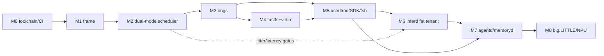

# fast-os Implementation Roadmap

Status: Draft — 2026-07-16
Companion to: [roadmap.md](roadmap.md) (phase gates), [architecture.md](architecture.md), [roadmap-distribution.md](roadmap-distribution.md), [ADR-0006](adr/0006-dual-process-model.md) (new)

This document turns the Phase 0–6 roadmap into an execution plan: milestones with
concrete checklists, measurable exit criteria, feature prioritization, and the
**dual process model** requirement extension (BEAM-style thin processes on a custom
scheduler **and** core-consuming fat processes, with runtime switching between the
two). Phase gates in `roadmap.md` remain authoritative; milestones here are the
finer-grained units of work that satisfy them.

---

## 1. Current state (verified 2026-07-16)

What exists and runs:

- Phase-0 proto-kernel, **aarch64 only** (~739 LOC): Linux-Image-protocol boot via
  hand-written header in `kernel/src/boot.s`, self-relocating PIE, DTB scan
  (`kernel/src/fdt.rs`), console autodetect (polled PL011 / virtio-console),
  boot banner with boot-ms, `fsh0` polling proto-shell. Boots on QEMU `virt` and
  UTM/Apple VZ. **No MMU, no interrupts, no allocator, no SMP (APs parked in
  `boot.s`), no processes, no scheduler, no syscalls.**
- `fastfs/` userspace reference FS (~2.5k LOC + integration tests): CoW,
  subvolumes, O(1) version-tag snapshots, mirror:N scrub/self-heal, tags, quotas,
  MCP tool surface. Known gaps: in-memory BTreeMap keyspace (no on-disk CoW
  B-tree), append-only allocator (no GC), no stripe parity.
- Tooling: `tools/elf2image.py` (working), `make image` / `make run`,
  `utilities/fastfs` host wrapper.

Everything else — `boot/`, `drivers/`, `kernel/frame/`, `kernel/services/`,
`userland/`, `services/{toolbusd,inferd,agentd,memoryd}`, `tests/` — is
planning-stage READMEs only. Notably, **x86_64 is not wired** despite being in the
Phase 0 exit criteria.

---

## 2. Requirement extension: dual process model

> Full rationale and decision record: [ADR-0006](adr/0006-dual-process-model.md).
> This section is the requirements contract the milestones below build against.

fast-os shall support two execution modes on one unified kernel task object, and
any running app can move between them at runtime:

- **Thin mode (BEAM-style)** — massive numbers of lightweight preemptible tasks
  multiplexed by the custom scheduler across the shared core pool. Actor
  semantics: private state, mailbox message passing, budget/reduction-based soft
  preemption with a hard timer backstop.
- **Fat mode (core lease)** — a task granted exclusive occupancy of one or more
  cores: tickless, run-to-completion, may spin/poll rings directly. For
  token-decode loops, DSP/codec workers, tight simulation loops — anything that
  earns a whole core.

Mode is a *scheduling attribute*, not an identity: capabilities, mailbox, budgets,
task ID, and flight-recorder lineage survive a switch in either direction.

### Formal requirements

| ID | Requirement | Verification |
|----|-------------|--------------|
| REQ-PM-001 | One kernel `Task` object; `mode ∈ {Thin, Fat}` is a mutable scheduling attribute. No separate process types. | Type-level: single struct; mode-switch tests |
| REQ-PM-002 | Thin task baseline footprint ≤ 2 KiB (TCB + initial stack segment); ≥ 100k concurrent thin tasks on the 512 MiB dev VM without OOM. | QEMU stress test in CI |
| REQ-PM-003 | Thin preemption: reduction/budget counting at safe points, hard timer backstop ≤ 2 ms; no thin task can monopolize a core. | Adversarial spin-loop test |
| REQ-PM-004 | Thin IPC: per-task mailbox, zero-copy send for ring-granted buffers; selective receive optional (post-MVP). | proptest on mailbox semantics |
| REQ-PM-005 | Fat mode: exclusive core lease — target core drained of thin tasks, tick disabled, IPIs masked except lease-revocation IPI. Scheduling jitter on a leased core ≤ 5 µs p99. | cyclictest-style probe in CI |
| REQ-PM-006 | Runtime switch, both directions, without restart. Thin→Fat promotion ≤ 10 ms p99 (includes core drain). Fat→Thin demotion (cooperative or revocation IPI) ≤ 1 ms p99 from signal to re-enqueue. | Mode-switch latency test |
| REQ-PM-007 | Core lease manager: capability-gated (`CoreLease` cap per ADR-0004), revocable, enforces a shared-pool floor (≥ 1 core, core 0, always shared — the OS never becomes unschedulable). | Lease exhaustion test |
| REQ-PM-008 | Scheduler policy classes (latency/EEVDF, throughput) govern the **thin pool only**; fat cores bypass policy entirely. Policy modules remain pluggable safe Rust. | Architecture review + policy swap test |
| REQ-PM-009 | Budget integration: fat lease consumes wall-clock/energy budget at core rate; exhausted budget forces demotion (agentd, Phase 5). | Budget exhaustion test |
| REQ-PM-010 | Observability: every mode transition (who, why, latency, drain cost) is a flight-recorder event. | Event assertion in switch tests |
| REQ-PM-011 | Rings are mode-agnostic: thin tasks submit batched + wait on CQ; fat tasks poll the same rings. No separate syscall surface per mode. | Same-binary-both-modes test |
| REQ-PM-012 | big.LITTLE awareness (Phase 6): fat leases prefer big cores; thin pool schedules across remaining cores with core-type hints. | Perf test on asymmetric topology |

Why this fits the existing design rather than fighting it: the planned scheduler is
already thread-per-core shared-nothing with pluggable policy classes and
inference-aware deadline hints; `inferd` already wants resident, latency-class
compute (ADR-0005); agent tasks are already kernel objects with budgets and
checkpointable context handles. The dual model names and unifies these: **thin =
the default agent/actor substrate, fat = the leased-core substrate inferd-class
work runs on.** (Sibling project `beam-os` explores full BEAM semantics; fast-os
thin mode borrows the scheduling ideas, not OTP.)

---

## 3. Milestones

Priorities: **P0** = critical path, **P1** = required for a usable system,
**P2** = differentiators that can trail. Each milestone lists the phase gate it
feeds (from `roadmap.md`).

### M0 — Toolchain, boot parity, CI floor  (Phase 0 → close it out) — P0

Goal: make Phase 0's own exit criteria true and stand up the CI gates every later
milestone relies on.

- [ ] `xtask` build orchestration (per tech-choices.md); keep `make` as thin wrapper
- [ ] x86_64 boot path: Limine + UEFI (`boot/`), or a recorded decision to defer x86_64 to post-P2 (update roadmap.md + ADR if deferred)
- [ ] CI: boot both targets (or aarch64 + deferral note) in QEMU headless, assert banner, record boot-ms as tracked perf metric
- [ ] CI: `cargo clippy`/`fmt` gates; `fastfs` test suite wired in
- [ ] Boot-time budget harness: fail CI if boot-ms regresses > 10%
- [ ] Repo hygiene: `tests/` skeleton runs one real QEMU smoke test

**Exit criteria:** one-command image build via xtask; CI green on boot smoke test
with boot-ms trend recorded; x86_64 either booting or formally deferred.

### M1 — Frame: the unsafe core  (Phase 1) — P0

Goal: the privileged substrate everything else stands on — all `unsafe` confined
to `kernel/frame/` (ADR-0002).

- [ ] Physical memory: DTB/UEFI memory map ingest, frame allocator (buddy or bitmap)
- [ ] MMU on: single-address-space kernel page tables, W^X, guard pages
- [ ] Kernel heap allocator (`GlobalAlloc`) + proptest coverage
- [ ] Exception vectors + fault handlers with readable register/backtrace dumps
- [ ] GICv2/v3 init; timer interrupts (CNTP) — first preemption tick
- [ ] Per-CPU data blocks; spinlocks + IRQ-safe lock types (replace `static mut` console)
- [ ] SMP bring-up: unpark APs from `boot.s` PSCI/spin-table, per-core init
- [ ] Context-switch primitive (callee-saved regs + per-task kernel stack)
- [ ] kani proofs on frame invariants; CI gate: `unsafe` LOC ratio < 15%

**Exit criteria:** all cores online in QEMU SMP (-smp 4); timer tick preempts a
busy loop; heap survives proptest fuzz; kani gate green in CI; fault handler
prints usable diagnostics for null deref/misaligned access.

### M2 — Tasks & the dual-mode scheduler  (Phase 2 core + ADR-0006) — P0

Goal: the heart of the extension — one task object, two modes, live switching.
This is deliberately scheduled *before* rings/FS: everything after it consumes
tasks.

- [ ] `Task` object: TCB, task IDs, states, mode field (REQ-PM-001)
- [ ] Thin stacks: segmented or growable-with-guard-page; ≤ 2 KiB baseline (REQ-PM-002)
- [ ] Per-core scheduler instances, shared-nothing run-queues, work stealing (thin pool)
- [ ] Policy-class trait (safe Rust, pluggable); ship `latency` (EEVDF-style) + `throughput` (REQ-PM-008)
- [ ] Reduction/budget preemption at safe points + 2 ms timer backstop (REQ-PM-003)
- [ ] Mailboxes + message send/receive; zero-copy grant handoff stub (REQ-PM-004)
- [ ] Core lease manager: lease request/grant/revoke, shared-pool floor, `CoreLease` capability check (REQ-PM-007)
- [ ] Core drain: migrate thin tasks off a core, disable tick, mask IPIs except revocation (REQ-PM-005)
- [ ] Mode switch both directions with state preservation (REQ-PM-006); revocation IPI path
- [ ] Flight-recorder events for every transition (REQ-PM-010; ring buffer now, agentd consumer later)
- [ ] Stress + latency tests in CI: 100k thin tasks; spin-loop preemption; promotion/demotion latency; leased-core jitter probe

**Exit criteria:** REQ-PM-001…008 and 010 demonstrably pass in CI on QEMU -smp 4:
100k thin tasks schedule fairly; an adversarial spin loop cannot starve peers; a
task promotes to a leased core in ≤ 10 ms p99, runs tickless at ≤ 5 µs p99 jitter,
demotes in ≤ 1 ms p99; core 0 is never leasable.

### M3 — Rings & syscall surface  (Phase 2) — P0

Goal: io_uring-style SQ/CQ rings as the primary interface (ADR-0003), working
identically for both modes.

- [ ] Per-core ring triple (main/latency/poll); SQ/CQ memory layout + rkyv-style encoding
- [ ] Trap path for setup/blocking-wait/fault only
- [ ] Capability table + handle checking on every submission (ADR-0004)
- [ ] Thin-mode integration: blocking CQ wait parks the task (scheduler-aware)
- [ ] Fat-mode integration: userspace CQ polling, no traps in steady state (REQ-PM-011)
- [ ] Ring fuzzing as untrusted input (CI job)
- [ ] First ring ops: console write, timer, task spawn/mode-switch, mailbox send/recv

**Exit criteria:** same test binary exercises identical ring ops in thin and fat
mode; fuzzer runs clean for a sustained CI window; no non-setup traps observed in
fat steady state.

### M4 — Storage: fastfs in kernel + virtio  (Phase 2/3) — P1

- [ ] virtio-blk driver (modern MMIO, then PCI for x86_64)
- [ ] fastfs `no_std` port of the userspace reference (CoW, snapshots, checksums first; mirror/scrub later)
- [ ] On-disk keyspace: replace in-memory BTreeMap with CoW B-tree (closes the documented gap — needed before kernel adoption, do it once here)
- [ ] Block cache with grant-friendly buffers (zero-copy into rings)
- [ ] fastfs ring ops: open/read/write/snapshot/tag
- [ ] Crash-consistency test: kill QEMU mid-write loop, remount, scrub clean

**Exit criteria:** kernel mounts a fastfs image, survives the kill/remount/scrub
loop 1000× in CI; userspace `fastfs-tool` can read images the kernel wrote.

### M5 — Userland: ELF, SDK, fsh  (Phase 3) — P1

- [ ] User mode + ELF64 loading (static PIE first)
- [ ] SDK (`userland/sdk`): Rust crate over rings — spawn, mailbox, **`set_mode(Thin | Fat { cores, deadline })`** and lease-request API surfaced to apps
- [ ] fsh command mode replaces fsh0 (as a real user task — the shell itself is a thin task)
- [ ] toolbusd MVP: typed tool schemas, MCP-compatible catalog (reuse `fastfs/src/mcp.rs` shape)
- [ ] Demo app for the dual model: same binary compresses a stream thin, promotes fat for a burst, demotes — shipped as an example + CI test
- [ ] POSIX personality shim: defer decision point (record scope for Phase 3b)

**Exit criteria:** fsh runs as a user thin task and can spawn/list/kill tasks and
flip a running demo app thin↔fat interactively; toolbusd serves ≥ 3 real tool
schemas (fastfs, task mgmt, sysinfo).

### M6 — inferd: first fat-mode tenant  (Phase 4) — P1

- [ ] inferd service skeleton, model residency (GGUF, CPU backend)
- [ ] Reflex-class always-resident small model (ADR-0005)
- [ ] Token-decode loop takes a fat lease during generation bursts; demotes between requests — the flagship validation of REQ-PM-006/009
- [ ] Inference-aware deadline hints in thin latency class (prefill/queue phases)
- [ ] Budget metering: tokens + core-seconds

**Exit criteria:** measured tokens/sec in fat mode ≥ 1.5× same workload pinned in
thin mode; lease churn (promote/demote per request) adds ≤ 5% overhead; reflex
model answers over rings while a fat decode runs on another core.

### M7 — Agent-native surface  (Phase 5) — P2

- [ ] agentd: task lifecycle, delegation with attenuated caps, cgroup-style budget trees
- [ ] Budget-driven demotion: exhausted budget revokes lease (REQ-PM-009)
- [ ] memoryd MVP; checkpointable context handles — note these double as suspended-task state for future mode-switch-across-checkpoint
- [ ] Flight recorder as queryable service (consumes M2's transition events)
- [ ] fsh intent mode with plan preview

**Exit criteria:** an agent tree runs under budgets; exhausting a child's budget
forcibly demotes and suspends it with a flight-recorder trail fsh can display.

### M8 — Asymmetric silicon  (Phase 6) — P2

- [ ] big.LITTLE topology ingest; core-type tags in lease manager (REQ-PM-012)
- [ ] Fat leases prefer big cores; thin pool spans remainder with type hints
- [ ] NPU enablement per Phase 6 scope; boot < 350 ms target work
- [ ] x86_64 parity sweep if deferred at M0

**Exit criteria:** on an asymmetric topology (QEMU or hardware), fat leases land
on big cores by default and the thin pool's latency class holds its SLOs on
LITTLE cores.

---

## 4. Feature prioritization (MoSCoW across the board)

**Must (P0):** xtask+CI, frame (MMU/IRQ/SMP/ctx-switch), dual-mode scheduler +
core leases + mode switching, rings + capabilities, flight-recorder events.

**Should (P1):** kernel fastfs + virtio-blk, on-disk CoW B-tree keyspace, ELF
userland + SDK with mode API, fsh command mode, toolbusd MVP, inferd CPU backend
with fat-lease decode.

**Could (P2):** agentd/memoryd, fsh intent mode, big.LITTLE/NPU, mirror/scrub in
kernel, selective receive, x86_64 (if deferred), networking (QUIC lanes),
distribution targets (D1 live disk after M5).

**Won't (this cycle):** POSIX personality beyond decision record, Wine/microVMs,
viewd/Scenes/graphics, fpkg, stripe parity, GC for fastfs allocator (unless M4
crash tests force it).

## 5. Dependencies

Sequencing judgment calls, made explicit:

1. **Scheduler before rings** (M2 < M3): rings need "park this task on CQ wait,"
   so tasks must exist first. The reverse ordering forces a throwaway
   busy-wait shim.
2. **On-disk B-tree lands in M4**, not later: porting fastfs to kernel while its
   keyspace is still an in-memory checkpoint would bake the prototype's biggest
   gap into the kernel.
3. **inferd is deliberately the first fat tenant** (M6): it's the workload the
   fat mode exists for, and it forces the promote/demote-per-request path to be
   cheap rather than a one-time configuration.

## 6. Standing workstreams (every milestone)

- **Perf CI:** boot-ms, mode-switch latency, leased-core jitter, tokens/sec —
  tracked trends, regression-gated.
- **Safety CI:** kani on frame, `unsafe` LOC ratio < 15%, ring fuzzing, proptest
  on allocator/mailboxes/fastfs.
- **Docs:** each milestone updates architecture.md + relevant ADR; mode-switch
  semantics get a dedicated doc at M2.

## 7. Risk register (additions to roadmap.md's table)

| Risk | Impact | Mitigation |
|------|--------|-----------|
| Core-drain latency blows the 10 ms promotion budget under load | Fat mode unusable for bursty inference | Drain = migrate-on-next-safe-point, not stop-the-world; reserve a pre-drained standby core when lease demand is predictable |
| Reduction counting needs compiler/runtime cooperation Rust doesn't give for free | Thin preemption leaks latency | Safe-point checks at await/alloc/send boundaries + hard 2 ms timer backstop makes soft preemption an optimization, not a correctness need |
| Dual-mode doubles the scheduler test matrix | Velocity loss | REQ-PM-011 (one ring surface) keeps the matrix at the scheduler layer only; same-binary-both-modes CI test enforces it |
| Fat tasks hog cores (lease squatting) | Thin pool starvation | Shared-pool floor (REQ-PM-007) + budget-driven revocation (REQ-PM-009) |
| x86_64 drift while aarch64-only | Phase 0 gate never truly closes | M0 forces boot-or-formal-deferral; M8 parity sweep backstop |

## 8. Immediate next actions (top of backlog)

1. M0: stand up xtask + CI boot smoke test with boot-ms tracking (unblocks every gate).
2. Decide x86_64 now-or-defer; record it (ADR or roadmap.md edit).
3. Review/accept ADR-0006 (dual process model) — M2's checklist assumes it.
4. M1 spike: GIC + timer tick on QEMU virt — the first preemption is the first real step toward the scheduler.
