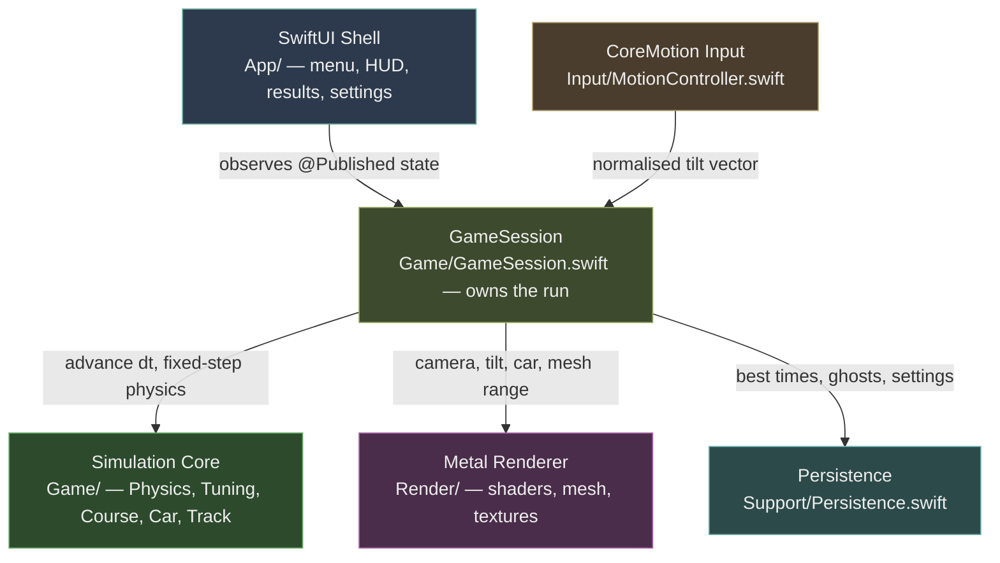

# Carpet Grand Prix — Platform Architecture

> The floor is the racetrack. The phone is the floor.

---

## 1. What this document is

This describes the actual technical architecture of the shipping app, not an
engine choice or a framework aspiration. Carpet Grand Prix is a **native iOS
app written in Swift, with a hand-written Metal renderer, no game engine, and
no third-party dependencies.** There is no Unity, no Unreal, no SpriteKit,
no SceneKit. Everything under `app/CarpetGrandPrix/` is first-party code
against Apple's own frameworks: Foundation, simd, CoreMotion, Metal, MetalKit,
Combine, and SwiftUI.

This is worth stating plainly because the originating design document
(`flesh/carpet-grand-prix/README.md`, §1) originally specified "Unity 6
(6000.x), URP 2D Renderer with custom parallax stack." That line was wrong and
has since been amended in place to point here. The custom parallax stack is
real and exactly as described there — it is simply implemented directly in
Metal, not as a URP extension. Every other section of that document (mechanics,
world, narrative, personas, monetization) is accurate and this document does
not revise it.

---

## 2. Layer diagram



`GameSession` is the hub. It is a `@MainActor` `ObservableObject` that owns
the loaded course, the car's live state, the camera, and the input source.
The `Renderer`'s `MTKViewDelegate.draw(in:)` calls `session.advance(dt:)`
once per displayed frame, and SwiftUI observes the session's `@Published`
properties for the HUD. Nothing else in the app has two owners of truth for
"where is the car right now."

---

## 3. Why `Game/` imports only Foundation and simd

`Game/Physics.swift`, `Game/Tuning.swift`, `Game/Course.swift`, and
`Game/Car.swift` do not import Metal, CoreMotion, SwiftUI, or Combine. The
entire simulation — gravity from tilt, track-relative lateral grip, rail
collision and restitution, ramps and airtime, checkpoints and respawns — is a
pure function of `(CarState, Track, CarSpec, tilt: SIMD2<Float>, dt: Float) ->
[RunEvent]` (`Physics.step`). It has no idea a screen, a GPU, or a
gyroscope exists.

This is a deliberate boundary, not an accident of file layout, and it is why
`Tests/` can unit-test the physics directly: a test can hand `Physics.step`
a synthetic tilt vector and assert on the resulting `CarState` without
standing up a Metal device, a `CMMotionManager`, or a view hierarchy. The
same boundary is what makes `GhostFrame` replay deterministic across app
versions — see §7.

---

## 4. The fixed 120 Hz physics accumulator

`GameSession.advance(dt:)` receives whatever the display's actual frame
delta was — 1/60s on a standard iPhone, 1/120s on ProMotion — and feeds it
into a fixed-step accumulator (`Tuning.physicsHz = 120`, `Tuning.physicsStep
= 1/120`). The `while accumulator >= step` loop in `GameSession.advance`
runs `Physics.step` zero, one, or two times per displayed frame depending on
how much real time elapsed, capped at 8 iterations as a runaway guard.

This decouples simulation rate from display rate for one specific reason: a
best time set on a 60 Hz iPhone 11 must be *exactly* comparable to one set on
a 120 Hz ProMotion iPhone. If physics ran at display rate, the same input
would integrate differently on the two devices and every leaderboard and
ghost comparison in the game would be lying by device. Running physics at a
fixed 120 Hz and rendering at whatever the display provides means the
simulation result is identical regardless of which iPhone it ran on.

---

## 5. The rendering model — static mesh, vertex-shader parallax

There is no 3D geometry, no perspective matrix, and no per-frame geometry
work anywhere in the renderer. The "3D" diorama look is entirely a height
field displaced in the vertex shader.

**Build once per course load.** `Render/DioramaBuilder.swift` walks the
track's samples once and emits eight separate static vertex buffers — shadow,
support posts, underside, deck, centre dashes, boost overlay, left rail,
right rail — each uploaded to the GPU a single time via
`device.makeBuffer(...)`. Nothing is rebuilt per frame.

**Uniform stride via degenerate quads.** Every layer emits exactly six
vertices per track segment, always, whether or not that segment actually has
the feature. A segment with no support post, or a rail that's absent because
the segment is an open edge, still emits six vertices — collapsed to a
zero-area quad (`appendDegenerate`). This is what makes the per-frame draw
range a single multiply (`segmentIndex * vertsPerSegment`) rather than a
scan for which segments have which features.

**Eight draws per frame, no culling pass.** `Renderer.drawTrack(_:)` computes
a contiguous vertex range around the car — `Tuning.visibleBehind` (16
samples) to `Tuning.visibleAhead` (46 samples) — and issues one
`drawPrimitives` call per layer against that range. There is no visibility
test per triangle; the "culling" is entirely an offset-and-length calculation
into a buffer that already exists.

**Deck height is relative to the camera's elevation, not absolute.** This is
the whole trick, and it lives in one line, present identically on the CPU
(`GameSession.followCamera`, camera elevation lerp) and the GPU
(`Shaders.metal`, `deckHeight`):

```
deck   = baseHeight + (elevation − cameraElevation) × gradeRead
height = floorPinned ? 0 : deck + heightOffset
screen = (position − camera) × scale + centre + height × scale × viewVector
```

Because `elevation` is measured relative to where the camera currently sits,
track ahead of the car on a descent visibly sinks toward the carpet, and
track on a climb visibly rises — a player reads gradient by looking at how
far off the floor the track is, the same way they'd read a real Hot Wheels
run. `viewVector` is derived directly from the handset's tilt (§6), so
tilting the phone slides every raised surface — deck, rails, posts — across
the carpet in proportion to how high off it they sit. Floor-pinned geometry
(the cast shadow, the feet of the support posts) ignores deck height
entirely and stays at height 0, which is what makes the posts visibly splay
as the deck slides over their fixed feet.

**One render pass, painter's algorithm, no depth buffer.**
`view.depthStencilPixelFormat = .invalid` — layers are drawn back-to-front in
a fixed order (carpet, then each diorama layer, then sprites) rather than
depth-tested, because the diorama is genuinely flat geometry with a height
field, not a 3D scene.

---

## 6. CoreMotion gravity vector, not Euler angles

`Input/MotionController.swift` reads `CMDeviceMotion.gravity` — the fused
gravity vector CoreMotion already computes from the accelerometer and
gyroscope — rather than `attitude.pitch` / `attitude.roll` Euler angles.

Gravity is exactly the quantity the fiction needs: "which way is down,
relative to the phone," expressed as a unit vector with no further
interpretation required. Euler angles would introduce three real problems
gravity doesn't have: gimbal-lock-adjacent degeneracy near vertical holds,
wraparound at ±180°, and an axis-remapping step every time the device
rotates between portrait and landscape. None of that is a hypothetical
concern for a game whose entire premise is "hold the phone however feels
comfortable" — players will hold it flat, tilted, rotated, lying down. Gravity
handles all of those poses uniformly; Euler angles do not.

The rest pose is captured once at `calibrate()` (called at the start of every
run and again on a mid-run re-centre tap) and every subsequent reading is
expressed as a delta from it, normalized by `fullLockGravity` (`sin(32°)` by
default, tunable down to `sin(6°)` for the accessibility tilt-sensitivity
slider) and low-pass filtered (`Tuning.tiltSmoothing`) to kill sensor jitter
without adding perceptible input lag. Vehicle Mode re-estimates the rest pose
continuously from a 4-second rolling average of gravity, so the slow
low-frequency drift of riding in a moving vehicle doesn't read as steering
input — a fast tilt still registers immediately against the moving baseline.

One signal, three consumers: the same tilt vector drives the physics'
gravity term, the renderer's `viewVector`, and (not yet built) an on-screen
bubble-level indicator.

---

## 7. Persistence — local-only, no server, no account

`Support/Persistence.swift` is the entire backend. Best times live in
`UserDefaults`. Ghost recordings are JSON files in the app's Application
Support directory, one per course. There is no network call anywhere in this
file, and no network call anywhere in the gameplay path at all — the GDD's
technical requirements (§12) state "No network required for any gameplay,"
and the code matches that exactly: no account system, no login, no server
round-trip, no sync conflict to resolve, and nothing that can go down. A run
completed on a train with no signal is stored identically to one completed
at home.

**Ghosts store sampled position, not input.** `GhostFrame` records `(x, y,
elevation, height, heading, tiltX, tiltY)` at a fixed 40 Hz
(`Tuning.ghostHz`), sampled from the already-simulated `CarState` — not the
raw tilt input that produced it. This is the deliberate choice described in
the file's own header comment: storing position means a later change to a
tuning constant (grip, drag, boost strength) never silently invalidates a
player's stored best time, because the ghost car simply replays the line
that was actually driven, regardless of what the physics constants are today.
Raw tilt is recorded alongside each frame purely for display — so a
committed player (the GDD's persona P-008, "the Achievement Hunter") can
watch not just where the ghost went but how the phone was held to get it
there — but it plays no role in reproducing the ghost's motion.

---

## Appendix A: key source files

| File | Owns |
|---|---|
| `App/ContentView.swift` | SwiftUI shell: course select, in-run HUD, results card, settings sheet. Everything reachable in the bottom third of the screen. |
| `Game/GameSession.swift` | The run: phase state machine (menu/countdown/racing/finished), fixed-step physics loop, camera follow, HUD state, ghost playback lookup. |
| `Game/Physics.swift` | The car simulation. Pure function of state + tilt + dt. No Metal, CoreMotion, or SwiftUI imports. |
| `Game/Tuning.swift` | Every gameplay constant in one place — the numbers that decide how the game feels. |
| `Game/Course.swift` | Course definitions and deterministic track sample generation; room theming (`RoomTheme`). |
| `Game/Car.swift` | Car specs — handling identity as multipliers on gravity authority, grip, drag, boost, rail penalty, hitbox width. |
| `Input/MotionController.swift` | CoreMotion gravity-vector reading, rest-pose calibration, Vehicle Mode, accessibility tilt-sensitivity slider. Also the keyboard/touch `FallbackController` used on the Simulator and on gyro-less devices. |
| `Render/DioramaBuilder.swift` | Builds the eight static per-course vertex buffers once, with degenerate-quad padding for absent features. |
| `Render/Renderer.swift` | The `MTKViewDelegate`: pipeline setup, per-frame uniform writes, the eight-draw track pass, sprite instancing for car/ghost/shadows. Triple-buffered uniforms behind a semaphore. |
| `Render/Shaders.metal` | `diorama_vertex`/`diorama_fragment` (the parallax height-field trick), `carpet_vertex`/`carpet_fragment` (full-screen triangle, no parallax), `sprite_vertex`/`sprite_fragment` (instanced car/ghost quads), `shadow_fragment`. |
| `Render/ShaderTypes.h` | Vertex, instance, and uniform struct layouts shared verbatim between Swift and MSL via the bridging header — the single source of truth for GPU buffer layout. |
| `Render/TextureFactory.swift` | All textures generated procedurally at load time with Core Graphics. No binary image assets ship with the app. |
| `Support/Persistence.swift` | Best times (`UserDefaults`), ghost recordings (JSON files, on-device), medals, accessibility settings. The entire backend. |
