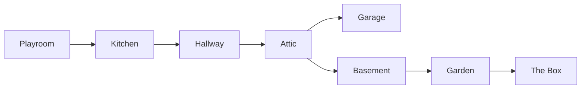

# Carpet Grand Prix — House Map

The world is a single suburban house, one floor plan, seen and raced entirely at
1:64 scale. This document lays out the actual physical geography implied by the
room-unlock graph in the flesh GDD and used consistently across narrative, level
design, and course naming.

## Floor plan

The house is a modest single-story-plus-basement-and-attic suburban build — the kind
with a living-room-adjacent kitchen, a central hallway, a pull-down or stair
attic access, an attached garage, a basement stair off the hallway, and a back door
opening onto a small yard. Nothing about the plan is exotic; the whole point of the
setting is that it is an ordinary house, ordinary enough that the scale of the
1:64 diorama does all the work of making it feel vast.

```
                                   ┌─────────────┐
                                   │   ATTIC      │
                                   │ (pull-down    │
                                   │  stair from    │
                                   │  hallway)      │
                                   └──────┬────────┘
                                          │
                    ┌─────────────┐      │      ┌─────────────┐
                    │  GARAGE      │◄─────┤      │             │
                    │ (side door    │      │      │             │
                    │  off hallway) │      │      │             │
                    └─────────────┘      │      │             │
                                          │
   ┌───────────┐    ┌───────────┐   ┌───┴───────┐
   │ PLAYROOM   │───►│  KITCHEN   │──►│  HALLWAY   │
   │ (couch,     │    │ (linoleum,  │   │ (runner rug │
   │  rug)       │    │  tile)      │   │  + hardwood)│
   └───────────┘    └─────┬─────┘   └───┬───────┘
                            │              │
                            │              ▼
                            │        ┌───────────┐
                            └───────►│ BASEMENT   │
                                     │ (stairs off │
                                     │  hallway)   │
                                     └─────┬─────┘
                                           │
                                           ▼
                                     ┌───────────┐
                                     │  GARDEN    │
                                     │ (back door, │
                                     │  patio,     │
                                     │  low wall)  │
                                     └─────┬─────┘
                                           │
                                     ┌─────┴─────┐
                                     │  THE BOX   │
                                     │ (patio,     │
                                     │  epilogue)  │
                                     └───────────┘
```

## Progression graph



**Playroom → Kitchen → Hallway → Attic → {Garage, Basement} → Garden → The Box.**
Garage and Basement both branch from the Attic, but only Basement continues onward
to the Garden — Garage is a genuine dead end, the game's one true side room, chosen
deliberately because a garage is exactly the kind of room a real house has that
doesn't lead anywhere else. Reaching the Garden always means passing back through
the Basement, which is also why the Crisis vignette's basement stairwell and the
Climax vignette's garden run are staged as a continuous physical journey rather
than two unrelated spaces — mechanically and narratively, they are adjacent.

The Box is not a physical room with its own courses (see `room-index.md`); it is the
patio just outside the Garden's back door, the same patio the donation box sits on
throughout the story, unlocked as a narrative epilogue rather than a racing
destination once the player has completed the Garden.

## Seeing the next room from the one you're in

Progression is spatial, and every room is built so its exit is visible — not just
implied by a menu — from within the current room, matching the flesh GDD's design
note that "you can see the doorway to the next room from the room you are in."

| From | You can see | Toward |
|---|---|---|
| Playroom | An open doorway past the couch's far arm, kitchen linoleum just visible past the threshold | Kitchen |
| Kitchen | A hallway opening past the fridge, runner rug visible on the floor beyond | Hallway |
| Hallway | A pull-down attic stair, folded up but rigged with a visible cord, at the hallway's far end | Attic |
| Attic | A side vent/duct gap on one wall (implying the garage below) and a floor hatch near the pull-stair (implying the basement) — the one point in the house where the player can see two destinations from a single vantage | Garage or Basement |
| Garage | A closed side door back into the hallway — visibly a dead end, no further doorway shown | *(none — Garage is terminal)* |
| Basement | A stairwell shaft of daylight at its far end, brighter than the room's own headlight-cone lighting, implying the back door beyond it | Garden |
| Garden | A low garden wall at the path's end — visibly the literal edge of the playable world, with the patio and donation box just inside frame to one side | The Box |

The Attic is the only room that visibly offers two destinations at once, which is
also the one point in the mermaid graph above where the progression branches — the
level geometry and the progression graph agree with each other by design, not by
coincidence.
