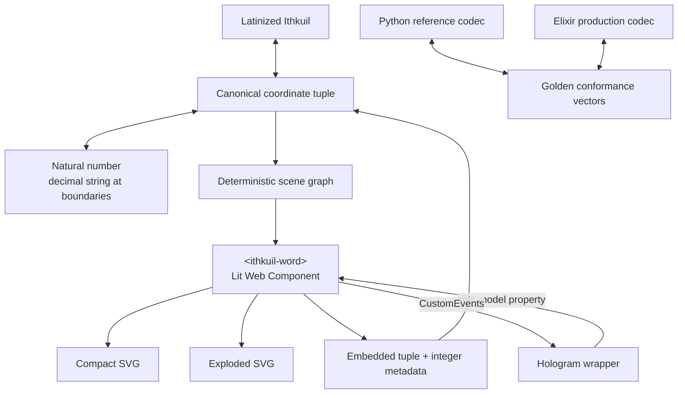
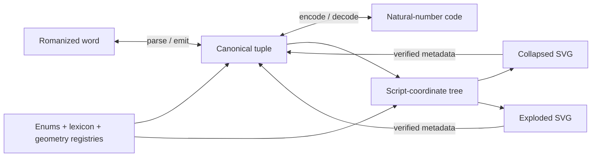

| Assumption                        | Engineering decision                                                                                                      |
| --------------------------------- | ------------------------------------------------------------------------------------------------------------------------- |
| Canonical authority               | The **versioned coordinate tuple** is the source of truth                                                                 |
| Browser responsibility            | Lit renders SVG and manages local interaction only                                                                        |
| Conversion responsibility         | Elixir is the production implementation; Python is the reference/conformance implementation                               |
| Integer transport                 | Decimal string at every language or JSON boundary                                                                         |
| “Glyph → tuple” for MVP           | Generated SVGs recover the tuple from embedded metadata                                                                   |
| Arbitrary drawn glyph recognition | Deferred; that is a different, substantially harder subsystem                                                             |
| Exploded sockets                  | Every possible socket has a fixed angular position; empty sockets are hidden rather than causing occupied sockets to move |



## Yes—this is the right architectural split

I would make one important correction to the motivation:

**JavaScript can perform arbitrary-precision integer arithmetic** using `BigInt`. The real problem is interoperability: native JSON serialization throws on `BigInt`, and the current Hologram boundary converts large Elixir integers to JavaScript `bigint` in one direction while a JavaScript `bigint` coming back is represented as an opaque native value. Therefore, your decision to expose the integer as a **decimal string** is exactly right—even though JavaScript is technically capable of the arithmetic. ([MDN Web Docs][1])

The clean division is:

[
\boxed{
\text{Elixir/Python understand Ithkuil;}
\qquad
\text{Lit understands how to draw a scene graph.}
}
]

No romanization parsing, enum ranking, tuple canonicalization, or integer arithmetic belongs inside the Lit component.

---

# 1. The canonical data object

Internally in Elixir, retain the tagged tuple form you proposed:

```elixir
{:ithkuil_word, 1,
 [
   {:glyph,
    character_class_id,
    base_id,
    orientation_id,
    [
      {socket_id, :empty},
      {socket_id,
       {:modifier,
        modifier_id,
        modifier_orientation_id,
        diacritics,
        child_sockets}}
    ]}
 ]}
```

A more formal type sketch:

```elixir
defmodule Ithkuil.Coord do
  @type enum_id :: non_neg_integer()
  @type schema_version :: pos_integer()

  @type t ::
          {:ithkuil_word, schema_version(), [glyph()]}

  @type glyph ::
          {:glyph,
           enum_id(),       # character class
           enum_id(),       # base
           enum_id(),       # orientation
           [socket()]}

  @type socket ::
          {enum_id(), :empty | modifier()}

  @type modifier ::
          {:modifier,
           enum_id(),       # modifier shape
           enum_id(),       # modifier orientation
           [enum_id()],     # diacritics / marks
           [socket()]}      # normally finite-depth, but recursively representable
end
```

The recursion is useful even when the official script only needs a fixed number of levels. It means the renderer does not require a new architecture if a modifier itself has marks, orientations, or subordinate sockets.

## Cross-language wire representation

JSON has no tuples, so the wire representation should use **tagged arrays**, preserving order:

```json
[
  "ithkuil-word",
  1,
  [
    [
      "glyph",
      0,
      17,
      1,
      [
        [0, null],
        [
          1,
          [
            "modifier",
            6,
            2,
            [3],
            []
          ]
        ]
      ]
    ]
  ]
]
```

The transformations are mechanical:

```text
Elixir tuple  ↔  JSON tagged arrays  ↔  Python tuple
```

Do not use arbitrary JSON objects as the canonical coordinate form. Objects are useful for view models, but ordered arrays make the integer mapping, equality, hashing, and golden test vectors much less ambiguous.

---

# 2. One schema, not two handwritten enum implementations

The enum inventory should live in one versioned declarative specification:

```text
spec/
├── schema.yaml
├── character_classes.yaml
├── bases.yaml
├── orientations.yaml
├── sockets.yaml
├── modifiers.yaml
├── diacritics.yaml
└── geometry/
    ├── bases.svg.json
    ├── modifiers.svg.json
    └── attachment_points.yaml
```

For example:

```yaml
schema_version: 1

orientations:
  - id: 0
    name: identity
    degrees: 0

  - id: 1
    name: rotate_90
    degrees: 90

  - id: 2
    name: rotate_180
    degrees: 180

  - id: 3
    name: rotate_270
    degrees: 270
```

And a socket definition:

```yaml
sockets:
  - id: 0
    name: upper
    angle_degrees: -90
    accepts:
      - diacritic
      - modifier

  - id: 1
    name: upper_right
    angle_degrees: -45
    accepts:
      - modifier
```

Then generate:

```text
lib/ithkuil/generated/enums.ex
python/ithkuil/generated/enums.py
web/generated/element-names.json
```

### Enum stability rule

Once published:

[
\boxed{\text{An integer ID is never reassigned to a different element.}}
]

Removed elements become reserved IDs. Otherwise an old integer could silently decode into a different word under a newer version.

The official New Ithkuil writing-system specification should be the authority from which the names, character classes, socket semantics, and shape inventories are extracted. ([Ithkuil][2])

---

# 3. Elixir is the production codec

I would expose this interface:

```elixir
defmodule Ithkuil do
  alias Ithkuil.Coord

  @spec from_latin(String.t()) ::
          {:ok, Coord.t()} | {:error, term()}
  def from_latin(text)

  @spec to_latin(Coord.t()) ::
          {:ok, String.t()} | {:error, term()}
  def to_latin(coord)

  @spec to_integer(Coord.t()) ::
          non_neg_integer()
  def to_integer(coord)

  @spec from_integer(non_neg_integer()) ::
          {:ok, Coord.t()} | {:error, term()}
  def from_integer(integer)

  @spec to_integer_string(Coord.t()) :: String.t()
  def to_integer_string(coord) do
    coord
    |> to_integer()
    |> Integer.to_string()
  end

  @spec from_integer_string(String.t()) ::
          {:ok, Coord.t()} | {:error, term()}
  def from_integer_string(value) do
    case Integer.parse(value) do
      {integer, ""} when integer >= 0 ->
        from_integer(integer)

      _ ->
        {:error, :invalid_natural_number}
    end
  end

  @spec to_scene(Coord.t()) ::
          {:ok, Ithkuil.Scene.t()} | {:error, term()}
  def to_scene(coord)
end
```

The required laws are:

[
\operatorname{to_latin}
\left(
\operatorname{from_latin}(w)
\right)
=======

\operatorname{canonicalize}(w)
]

[
\operatorname{from_integer}
\left(
\operatorname{to_integer}(c)
\right)
=======

c
]

and

[
\operatorname{parse_metadata}
\left(
\operatorname{render}(c)
\right)
=======

c.
]

Notice that Latinization round-trips to a **canonical Latinization**, not necessarily byte-for-byte to the original input, because alternate spellings or Unicode compositions may represent the same word.

---

# 4. Python is a reference implementation, not a second authority

The Python API should mirror Elixir:

```python
def from_latin(text: str) -> Coord: ...
def to_latin(coord: Coord) -> str: ...

def to_integer(coord: Coord) -> int: ...
def from_integer(value: int) -> Coord: ...

def to_scene(coord: Coord) -> Scene: ...
```

Python serves three purposes:

1. A small, easy-to-inspect mathematical reference implementation.
2. Offline corpus generation and experimentation.
3. An independent test oracle for the Elixir implementation.

I would **not** put Python in the live rendering path. The production path remains:

```text
Hologram/Elixir → scene model → Lit custom element
```

The two codec implementations are kept synchronized through generated enums and shared golden vectors, not through duplicated hand-maintained tables.

---

# 5. The browser receives a render model, not a semantic tuple alone

The Lit component can receive both the canonical coordinate and a deterministic scene graph:

```ts
export interface IthkuilWordModel {
  schema: "ithkuil-coordinate/1";

  latinized: string;
  integer: string;
  coordinate: unknown[];

  viewBox: [number, number, number, number];

  nodes: RenderNode[];
}

export interface RenderNode {
  id: string;
  parentId?: string;

  kind:
    | "base"
    | "modifier"
    | "diacritic"
    | "connector"
    | "socket-marker";

  path?: string;

  compact: Placement;
  exploded: Placement;

  socket?: {
    id: number;
    name: string;
    occupied: boolean;
    anchor: [number, number];
    orbitCenter: [number, number];
  };
}

export interface Placement {
  translate: [number, number];
  rotate: number;
  scale: number;
  visible: boolean;
}
```

The browser does only this:

```ts
const placement =
  this.exploded ? node.exploded : node.compact;
```

Then it emits SVG.

That is not “data conversion”; it is selecting one of two already-computed visual projections.

---

# 6. Plain SVG is better than D3 here

D3 would earn its keep if we needed:

* force-directed layout,
* dynamic scales,
* chart axes,
* data aggregation,
* arbitrary graph layout.

We need none of those.

The geometry is fixed, deterministic, and schema-driven. Therefore:

[
\boxed{\text{Lit + ordinary SVG is the smaller and more correct solution.}}
]

Lit components are standard custom elements, support reactive properties, and encapsulate their rendered subtree and styles with shadow DOM. That gives a particularly clean ownership boundary: Hologram owns the host element; Lit owns everything inside its shadow root. ([lit.dev][3])

---

# 7. Fixed exploded socket geometry

Let a particular base expose (N) possible sockets. Give every socket a permanent angle:

[
\theta_i
========

\theta_0
+
\frac{2\pi i}{N},
\qquad
i=0,\ldots,N-1.
]

If the base orientation is (\rho), use

[
\widehat{\theta}_i=\theta_i+\rho.
]

The socket indicator is placed at radius (r_s):

[
p_i
===

c+
r_s
\begin{bmatrix}
\cos\widehat{\theta}_i\
\sin\widehat{\theta}_i
\end{bmatrix}.
]

The orbit box is placed farther out at radius (r_o):

[
q_i
===

c+
r_o
\begin{bmatrix}
\cos\widehat{\theta}_i\
\sin\widehat{\theta}_i
\end{bmatrix}.
]

For an occupied socket:

1. Draw a small circle at (p_i).
2. Draw a ray from the exact center (c) to the orbit box (q_i).
3. Draw a square or circular box centered at (q_i).
4. Draw the modifier inside that box.
5. Recursively orbit its diacritics or subordinate elements around its own local center.

```text
                ┌──────────────┐
                │   modifier   │
                │      ◇       │
                └──────┬───────┘
                       │
                       ○  socket marker
                       │
                       │
                     [base]
```

### Crucial detail

Do **not** redistribute only the populated sockets evenly around the glyph.

Suppose socket 2 is at the upper-right. It must remain upper-right whether it is the only occupied socket or one of seven occupied sockets. Otherwise:

* expansion animations jump,
* socket identity becomes visually unstable,
* comparing two related glyphs becomes harder.

Instead, all possible sockets occupy fixed evenly spaced positions, and empty sockets simply draw nothing.

---

# 8. Compact and exploded views should use the same nodes

Each rendered element has two placements:

```json
{
  "id": "glyph-0.socket-3.modifier",
  "path": "M ... Z",

  "compact": {
    "translate": [12, -5],
    "rotate": 90,
    "scale": 1,
    "visible": true
  },

  "exploded": {
    "translate": [84, -84],
    "rotate": 90,
    "scale": 1.5,
    "visible": true
  }
}
```

The base, modifiers, marks, and accents retain stable IDs in both modes. That permits:

* clean toggling,
* later animation,
* per-node selection,
* highlighting the corresponding compact element when hovering its exploded box,
* deterministic testing.

The exploded connector is a simple radial line. The compact connector can be:

1. omitted when the official paths physically join;
2. a short line;
3. a cubic Bézier approximation during the prototype phase.

For a cubic connector:

[
B(t)
====

(1-t)^3P_0
+
3(1-t)^2tP_1
+
3(1-t)t^2P_2
+
t^3P_3.
]

But I would not use Béziers merely because they look clever. Exact attachment points plus SVG group transforms will usually produce a cleaner compact representation.

---

# 9. Lit component skeleton

```ts
import {LitElement, css, html, nothing, svg} from "lit";
import {customElement, property, state} from "lit/decorators.js";

@customElement("ithkuil-word")
export class IthkuilWordElement extends LitElement {
  @property({attribute: false})
  model?: IthkuilWordModel;

  @property({type: Boolean, reflect: true})
  exploded = false;

  @state()
  private contextMenu:
    | {x: number; y: number}
    | undefined;

  static styles = css`
    :host {
      display: inline-block;
      position: relative;
      contain: content;
    }

    svg {
      display: block;
      max-width: 100%;
      overflow: visible;
      cursor: pointer;
    }

    .connector {
      vector-effect: non-scaling-stroke;
      pointer-events: none;
    }

    .socket-marker {
      vector-effect: non-scaling-stroke;
    }

    .context-menu {
      position: fixed;
      z-index: 10000;
      min-width: 22rem;
      max-width: min(42rem, calc(100vw - 2rem));
      padding: 0.75rem;
      border: 1px solid;
      border-radius: 0.5rem;
      background: Canvas;
      color: CanvasText;
      box-shadow: 0 0.5rem 2rem rgb(0 0 0 / 0.25);
    }

    code {
      display: block;
      overflow-wrap: anywhere;
      white-space: pre-wrap;
    }
  `;

  render() {
    if (!this.model) {
      return html`<slot></slot>`;
    }

    const [x, y, width, height] = this.model.viewBox;

    return html`
      <svg
        viewBox="${x} ${y} ${width} ${height}"
        role="img"
        tabindex="0"
        aria-label=${`Ithkuil word: ${this.model.latinized}`}
        @click=${this.toggle}
        @keydown=${this.onKeyDown}
        @contextmenu=${this.openContextMenu}
      >
        ${this.renderNodes()}
      </svg>

      ${this.renderContextMenu()}
    `;
  }

  private renderNodes() {
    return this.model!.nodes.map((node) => {
      const placement =
        this.exploded ? node.exploded : node.compact;

      if (!placement.visible) {
        return nothing;
      }

      const [x, y] = placement.translate;
      const transform =
        `translate(${x} ${y}) ` +
        `rotate(${placement.rotate}) ` +
        `scale(${placement.scale})`;

      return svg`
        <g
          data-node-id=${node.id}
          data-kind=${node.kind}
          transform=${transform}
        >
          ${node.path
            ? svg`<path d=${node.path}></path>`
            : nothing}
        </g>
      `;
    });
  }

  private toggle = () => {
    this.exploded = !this.exploded;

    this.dispatchEvent(
      new CustomEvent("ithkuil-mode-change", {
        detail: {exploded: this.exploded},
        bubbles: true,
        composed: true
      })
    );
  };

  private onKeyDown = (event: KeyboardEvent) => {
    if (event.key === "Enter" || event.key === " ") {
      event.preventDefault();
      this.toggle();
    }

    if (event.key === "F10" && event.shiftKey) {
      event.preventDefault();

      const rect = this.getBoundingClientRect();

      this.contextMenu = {
        x: rect.left + rect.width / 2,
        y: rect.top + rect.height / 2
      };
    }
  };

  private openContextMenu = (event: MouseEvent) => {
    event.preventDefault();

    this.contextMenu = {
      x: event.clientX,
      y: event.clientY
    };
  };

  private renderContextMenu() {
    if (!this.contextMenu || !this.model) {
      return nothing;
    }

    const coordinate =
      JSON.stringify(this.model.coordinate);

    return html`
      <section
        class="context-menu"
        style="
          left: ${this.contextMenu.x}px;
          top: ${this.contextMenu.y}px;
        "
        @click=${(event: Event) => event.stopPropagation()}
      >
        <strong>${this.model.latinized}</strong>

        <p>
          <b>Integer</b>
          <code>${this.model.integer}</code>
        </p>

        <p>
          <b>Coordinate</b>
          <code>${coordinate}</code>
        </p>

        <button
          @click=${() =>
            navigator.clipboard.writeText(
              this.model!.integer
            )}
        >
          Copy integer
        </button>

        <button
          @click=${() =>
            navigator.clipboard.writeText(coordinate)}
        >
          Copy coordinate
        </button>

        <button
          @click=${() => {
            this.contextMenu = undefined;
          }}
        >
          Close
        </button>
      </section>
    `;
  }
}

declare global {
  interface HTMLElementTagNameMap {
    "ithkuil-word": IthkuilWordElement;
  }
}
```

Lit’s standard communication mechanism is DOM events, including composed custom events that can cross the shadow boundary. That makes the component independent of Hologram rather than secretly coupled to it. ([lit.dev][4])

---

# 10. Hologram should set a property, not micromanage the SVG

The wrapper can locate the custom element and set its `model` property:

```elixir
target =
  JS.call(
    :document,
    :getElementById,
    [element_id]
  )

JS.set(target, :model, view_model)
```

It can subscribe to events without a bespoke JavaScript hook:

```elixir
JS.call(target, :addEventListener, [
  "ithkuil-mode-change",
  fn event ->
    detail = JS.get(event, :detail)
    exploded = JS.get(detail, :exploded)

    # Update Hologram state if the surrounding
    # application cares about the view mode.
    handle_mode_change(exploded)
  end
])
```

Current Hologram JavaScript interop supports importing modules, reading and setting JavaScript properties, registering DOM listeners, and dispatching events directly from client-side Elixir. ([Hologram][5])

This ownership boundary matters:

```text
Hologram owns:
    <ithkuil-word id="word-17">

Lit owns:
    #shadow-root
        <svg>...</svg>
        <section class="context-menu">...</section>
```

Neither runtime patches the other runtime’s internal subtree. That avoids the usual two-framework knife fight in a telephone booth.

---

# 11. Free “glyph → tuple” for all glyphs we generate

The hard problem is:

```text
arbitrary unknown drawing or image → tuple
```

That can remain deferred.

But for every SVG **we** generate, tuple recovery can work immediately by embedding metadata:

```xml
<svg
  xmlns="http://www.w3.org/2000/svg"
  data-ithkuil-schema="1"
  data-ithkuil-integer="938475983475983475983475"
>
  <metadata id="ithkuil-coordinate">
    {
      "schema": "ithkuil-coordinate/1",
      "latinized": "...",
      "integer": "938475983475983475983475",
      "coordinate": ["ithkuil-word", 1, []]
    }
  </metadata>

  <!-- rendered paths -->
</svg>
```

Then:

[
\text{generated SVG}
\longrightarrow
\texttt{metadata}
\longrightarrow
\text{tuple}
]

requires no vision, OCR, path analysis, or geometric inference.

We should distinguish the two operations explicitly:

```elixir
Ithkuil.SVG.extract_coordinate(svg)
# Easy and available in MVP.

Ithkuil.Recognition.recognize(svg_or_bitmap)
# Deferred research/recognition subsystem.
```

Metadata extraction will fail only when an external tool strips the metadata. At that point the file becomes an ordinary unannotated drawing and falls into the later recognition problem.

---

# 12. Suggested repository structure

```text
ithkuil_codec/
├── spec/
│   ├── schema.yaml
│   ├── character_classes.yaml
│   ├── bases.yaml
│   ├── orientations.yaml
│   ├── sockets.yaml
│   ├── modifiers.yaml
│   ├── diacritics.yaml
│   └── geometry/
│
├── elixir/
│   ├── lib/ithkuil/coord.ex
│   ├── lib/ithkuil/romanization.ex
│   ├── lib/ithkuil/rank.ex
│   ├── lib/ithkuil/scene.ex
│   ├── lib/ithkuil/svg.ex
│   └── test/
│
├── python/
│   ├── ithkuil/coord.py
│   ├── ithkuil/romanization.py
│   ├── ithkuil/rank.py
│   ├── ithkuil/scene.py
│   └── tests/
│
├── web/
│   ├── src/ithkuil-word.ts
│   ├── src/types.ts
│   └── test/
│
├── hologram_app/
│   └── lib/components/ithkuil_word.ex
│
└── conformance/
    ├── latin_to_coordinate.jsonl
    ├── coordinate_to_integer.jsonl
    ├── scene_graph.jsonl
    └── invalid_inputs.jsonl
```

---

# 13. Implementation order

## Milestone 1 — Canonical identity

Implement:

```text
Latinized word → tuple
tuple → canonical Latinized word
tuple → integer
integer → tuple
```

Acceptance laws:

```elixir
coord
|> Ithkuil.to_integer()
|> Ithkuil.from_integer()
==
{:ok, coord}
```

and:

```elixir
word
|> Ithkuil.from_latin()
|> then(fn {:ok, coord} ->
  Ithkuil.to_latin(coord)
end)
==
{:ok, canonical_word}
```

## Milestone 2 — Geometry

Implement:

```text
tuple → scene graph
scene graph → compact SVG
scene graph → exploded SVG
```

At this stage the compact shapes may be approximate, provided:

* different coordinate values remain visually distinguishable;
* attachment points are deterministic;
* node IDs remain stable;
* rendering does not collide exactly between distinct tuples.

## Milestone 3 — Interactive component

Implement:

* click to expand/collapse;
* keyboard Enter/Space equivalent;
* context menu;
* copy integer;
* copy coordinate;
* hover socket highlighting;
* embedded SVG metadata.

## Milestone 4 — Hologram integration

Implement:

* model property injection;
* event bridge;
* surrounding editor state;
* Latinized input box;
* integer input box;
* tuple inspector.

## Milestone 5 — Recognition later

Separate:

```text
SVG with metadata → tuple
```

from:

```text
unannotated vector/raster glyph → tuple
```

Only the second one is postponed.

---

## The resulting invariant

The whole system should revolve around this commutative diagram:

[
\require{AMScd}
\begin{CD}
\text{Latinized word}
@>{\mathrm{parse}}>>
\text{Coordinate tuple}
@>{\mathrm{rank}}>>
\mathbb N_0
\
@A{\mathrm{print}}AA
@VV{\mathrm{scene}}V
@AA{\mathrm{unrank}}A
\
\text{Canonical Latinization}
@<<{\mathrm{metadata}}<
\text{SVG scene}
@.
\end{CD}
]

Or in Elixir-flavored form:

```elixir
latin
|> Ithkuil.from_latin!()
|> tap(fn coord ->
  assert coord ==
    coord
    |> Ithkuil.to_integer()
    |> Ithkuil.from_integer!()
end)
|> Ithkuil.to_scene()
|> Ithkuil.SVG.render()
```

That gives you the right foundation: **the component is clever about presentation but deliberately stupid about Ithkuil**. The tuple is the theorem; the SVG is merely one of its proofs.

[1]: https://developer.mozilla.org/en-US/docs/Web/JavaScript/Reference/Global_Objects/BigInt "BigInt - JavaScript | MDN"
[2]: https://ithkuil.net/Script_for_New_Ithkuil.pdf?utm_source=chatgpt.com "WRITING SYSTEM FOR NEW ITHKUIL"
[3]: https://lit.dev/docs/ "What is Lit? – Lit"
[4]: https://lit.dev/docs/components/events/ "Events – Lit"
[5]: https://hologram.page/docs/javascript-interop "JavaScript Interop - Hologram"


| Assumption              | Resolution in the specification                                                       |
| ----------------------- | ------------------------------------------------------------------------------------- |
| Language version        | **New Ithkuil / Ithkuil IV**, not a legacy Ithkuil grammar                            |
| Canonical authority     | The versioned semantic tuple—not the SVG, romanization, or integer                    |
| Integer transport       | Unsigned decimal string; arbitrary-precision integers may be used internally          |
| Reverse glyph operation | Exact for SDK-generated SVG through embedded metadata; visual recognition is deferred |
| Renderer                | Lit custom element with native SVG; D3 is not a core dependency                       |
| Deliverable             | Architecture and requirements only—no implementation code                             |



## Delivered

[Download the New Ithkuil Coordinate Codec and SDK PRD](sandbox:/mnt/data/new_ithkuil_coordinate_sdk_prd.md)

This is a **2,510-line engineering handoff document** containing:

* The three required reversible interfaces:
  [
  \text{romanization}\leftrightarrow\text{tuple},
  \qquad
  \text{tuple}\leftrightarrow\mathbb N_0,
  \qquad
  \text{tuple}\leftrightarrow\text{SDK-generated SVG}.
  ]
* A canonical Elixir-compatible nested term algebra using `Nat`, `Pair`, `List`, `Bytes`, and reserved control values.
* A compact tuple-to-integer codec.
* Separate semantic, script-plan, and geometry layers.
* Complete seed enum tables for the major closed domains, including:

  * formative and Primary categories,
  * CA categories,
  * Valence, Phase, Effect, Level, and all 36 Aspects,
  * Mood and Case-Scope,
  * all 68 Cases,
  * Illocution and Validation,
  * the 28 standard Secondary cores,
  * affix type, degree, orientation, and scope,
  * all 61 Biases,
  * Register values,
  * socket and renderer enums.
* The exploded-view geometry, including:
  [
  c_0\longrightarrow p_s\longrightarrow u_s,
  ]
  meaning exact center (\to) transformed socket marker (\to) orbital component box.
* Circular and square deterministic orbital layouts.
* Recursive explosion of modifiers and their own diacritics/components.
* Collapsed placement, Bézier leaders, reviewed near-connections, and collapse/explode interpolation.
* The complete `<ithkuil-word>` Lit component contract: properties, events, keyboard behavior, context menu, security, and SVG metadata.
* Hologram integration boundaries.
* Matching Elixir, Python, Rust, Node/TypeScript, and Go SDK APIs.
* Registry layouts, conformance vectors, property tests, roadmap, risks, licensing questions, and acceptance criteria.
* Locations for the official grammar, writing-system materials, root lexicon, affix source, community spreadsheet, and machine-readable toolkit.

## Integer-codec decision

I replaced recursive Cantor pairing with a substantially more practical construction.

First, the nested tuple is serialized into a canonical, prefix-decodable byte string:

[
\mathcal T
\xrightarrow{\operatorname{ser}}
\mathcal B^\ast.
]

That byte string is then ranked among all finite byte strings:

[
E(t)
====

S_m+
V_{256}!\left(\operatorname{ser}(t)\right),
]

where

[
S_m
===

# \sum_{j=0}^{m-1}256^j

\frac{256^m-1}{255}.
]

The length intervals are disjoint:

[
S_m\le E(t)<S_{m+1},
]

so decoding recovers the byte length, including any leading zero bytes, and then parses the nested tuple exactly. This retains the lovely mathematical reversibility you were after without making the decimal integer explode quadratically at every nested pair.

The PRD uses a permanent codec-v1 tag grammar:

|    Tag | Value                           |
| -----: | ------------------------------- |
| `0x00` | Natural number                  |
| `0x01` | Pair, corresponding to `{x, y}` |
| `0x02` | Finite list                     |
| `0x03` | Binary/UTF-8 bytes              |
| `0x04` | Reserved control value          |

## Source grounding

The specification treats the official current grammar as primary, reconciles the December 2022 writing-system specification with the February 15, 2023 Grammar Design amendments, and points to the official 570-page lexicon. ([Ithkuil][1])

It uses the MIT-licensed `@zsnout/ithkuil` project as a **pinned reference**, not a floating authority. That toolkit already demonstrates romanization generation, parsing, structured data, and SVG-path script rendering, but explicitly describes itself as actively developing. ([GitHub][2])

And yes: JavaScript supports arbitrary-precision `BigInt`; your decimal-string boundary remains the correct architecture because ordinary JSON serialization does not natively support `BigInt`. ([developer.mozilla.org][3])

[1]: https://www.ithkuil.net/ "https://www.ithkuil.net/"
[2]: https://github.com/zsakowitz/ithkuil "https://github.com/zsakowitz/ithkuil"
[3]: https://developer.mozilla.org/en-US/docs/Glossary/BigInt?utm_source=chatgpt.com "BigInt - Glossary - MDN Web Docs"

