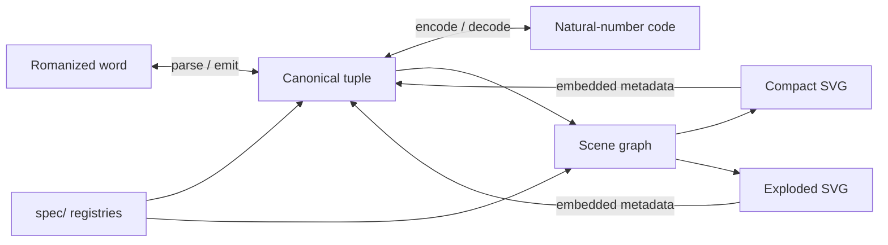

# iffywow — New Ithkuil Coordinate Codec & SDK

Every New Ithkuil (Ithkuil IV) word gets one canonical, versioned coordinate tuple. Everything else — romanization, a natural-number code, compact SVG, exploded SVG — is a reversible projection of that tuple.

> **The tuple is the theorem; the SVG is merely one of its proofs.**



---

## Decisions (locked)

| Question | Decision |
|---|---|
| Language version | **New Ithkuil / Ithkuil IV** — full morphology is the target (68 cases, 61 biases, 36 aspects, full CA, etc.) |
| Canonical authority | The **versioned coordinate tuple** — not the romanization, integer, or SVG |
| Production codec | **Elixir** (`elixir/`) |
| Reference codec / test oracle | **Python** (`python/`) — mirrors the Elixir API; never in the live render path |
| Integer transport | **Unsigned decimal string** at every language/JSON boundary (JSON can't serialize `BigInt`; the arithmetic itself is fine everywhere) |
| Wire format | **JSON tagged arrays**, order-preserving — never free-form objects as the canonical form |
| Renderer | **Lit custom element `<ithkuil-word>` + plain SVG** — no D3 |
| Glyph → tuple (MVP) | Exact recovery via **embedded SVG metadata** in everything we generate |
| Arbitrary glyph recognition | **Deferred** — separate research subsystem, not this SDK |
| Exploded sockets | Every possible socket has a **fixed angular position**; empty sockets are hidden — occupied ones never move |
| Enum registry | One versioned declarative spec (`spec/*.yaml`) → generated Elixir / Python / web enums |
| Enum stability | **An integer ID is never reassigned.** Removed elements become reserved IDs |
| Hologram boundary | Hologram sets the element's `model` property and listens to composed CustomEvents. Neither runtime touches the other's subtree |

---

## What each layer knows

**Elixir/Python understand Ithkuil; Lit understands how to draw a scene graph.** No romanization parsing, enum ranking, canonicalization, or integer arithmetic lives in the browser component.

| Layer | Owns |
|---|---|
| `spec/` | The single source of truth: schema version, enum inventories, socket geometry, glyph path registries. Codegen emits enums for all three runtimes |
| `elixir/` | `from_latin/1`, `to_latin/1`, `to_integer/1`, `from_integer/1`, `to_integer_string/1`, `from_integer_string/1`, `to_scene/1`, `Ithkuil.SVG.render/1`, `Ithkuil.SVG.extract_coordinate/1` |
| `python/` | Same API surface, minimal and inspectable; drives conformance vectors |
| `web/` | `<ithkuil-word>`: renders a precomputed scene model, toggles compact/exploded, context menu, copy integer/coordinate, emits `ithkuil-mode-change` |
| `hologram_app/` | Wrapper component: injects the view model, bridges events into Hologram state |
| `conformance/` | Golden JSONL vectors both codecs must pass — this, not shared code, keeps Elixir and Python in sync |

---

## The canonical tuple

Elixir-internal form:

```elixir
{:ithkuil_word, 1,
 [
   {:glyph, character_class_id, base_id, orientation_id,
    [
      {socket_id, :empty},
      {socket_id, {:modifier, modifier_id, modifier_orientation_id, diacritics, child_sockets}}
    ]}
 ]}
```

Sockets recurse: a modifier can carry its own sockets. The official script needs finite depth; the representation doesn't care.

Wire form — tagged arrays, mechanical in both directions (`Elixir tuple ↔ JSON tagged arrays ↔ Python tuple`):

```json
["ithkuil-word", 1, [["glyph", 0, 17, 1, [[0, null], [1, ["modifier", 6, 2, [3], []]]]]]]
```

---

## Integer codec (codec-v1)

Not recursive Cantor pairing — it explodes quadratically under nesting. Instead:

1. Serialize the tuple to a canonical, prefix-decodable byte string using a permanent tag grammar:

   | Tag | Value |
   |---|---|
   | `0x00` | Natural number |
   | `0x01` | Pair `{x, y}` |
   | `0x02` | Finite list |
   | `0x03` | Binary/UTF-8 bytes |
   | `0x04` | Reserved control value |

2. Rank that byte string among all finite byte strings: `E(t) = S_m + V₂₅₆(ser(t))` where `S_m = (256^m − 1)/255`. Length intervals are disjoint, so decode recovers the exact byte length (leading zeros included), then parses the tuple exactly.

---

## Rendering model

The browser receives a **render model**, not just semantics: `{schema, latinized, integer, coordinate, viewBox, nodes[]}`. Every node carries a stable ID and **two precomputed placements** (`compact`, `exploded`); the component's only "logic" is `exploded ? node.exploded : node.compact`. Stable IDs across modes buy clean toggling, animation, per-node selection, and hover-linking compact↔exploded.

Exploded geometry: socket *i* of an N-socket base sits at fixed angle `θᵢ = θ₀ + 2πi/N` (plus base orientation). Marker at radius `r_s`, orbit box at `r_o`, radial connector between, modifier drawn in the box, recursively for its own children. **Never redistribute only occupied sockets** — socket 2 stays upper-right whether it's alone or one of seven.

Every generated SVG embeds `data-ithkuil-schema`, `data-ithkuil-integer`, and a `<metadata>` JSON block, so `Ithkuil.SVG.extract_coordinate/1` is exact and free. Recognition of *unannotated* glyphs is explicitly out of scope (`Ithkuil.Recognition` is a future subsystem).

---

## Acceptance laws

Property tests + conformance vectors enforce, for all valid inputs:

```text
from_integer(to_integer(c))        == {:ok, c}                    # exact
to_latin(from_latin(w))            == canonicalize(w)             # canonical, not byte-for-byte
extract_coordinate(render(scene(c))) == c                         # metadata round-trip
```

Elixir and Python must agree on every vector in `conformance/*.jsonl` (latin↔coordinate, coordinate↔integer, scene graphs, invalid inputs).

---

## Repository layout

```text
projects/iffywow/
├── SDK-INTERFACE.md          # normative language-agnostic core API (v1)
├── CODEC.md                  # normative codec-v1 byte/integer contract
├── ROMANIZATION.md           # normative romanization profile core-v1
├── spec/                     # versioned YAML registries + geometry (source of truth)
├── elixir/                   # production codec + scene/SVG extensions (mix project)
├── python/                   # reference codec + oracle (pytest)
├── rust/                     # core SDK (cargo, num-bigint)
├── node/                     # core SDK (@noizu/ithkuil, zero deps, BigInt)
├── go/                       # core SDK (stdlib, math/big)
├── web/                      # <ithkuil-word> Lit component (plain ES modules, no build)
├── hologram_app/             # Hologram wrapper component
└── conformance/              # golden JSONL vectors — the arbiter for every SDK
```

---

## Roadmap

**M1 — Canonical identity.** Tuple type, spec registries + codegen, latin↔tuple, tuple↔integer (codec-v1). *Done when the round-trip laws pass as property tests in both languages.*

**M2 — Geometry.** tuple → scene graph → compact + exploded SVG. Approximate shapes are fine if distinct tuples stay visually distinct, attachment points are deterministic, and node IDs are stable.

**M3 — Interactive component.** Click/keyboard expand-collapse, context menu, copy integer/coordinate, hover socket highlighting, embedded metadata.

**M4 — Hologram integration.** Model injection, event bridge, editor state, latin/integer input boxes, tuple inspector.

**M5 — Recognition (deferred).** `SVG with metadata → tuple` ships in M1–M3. `Unannotated glyph → tuple` is a separate future project.

Full Ithkuil IV morphology is the target; enum inventories land registry-first (spec YAML before code), so partial coverage is always shippable and version-stamped.

---

## Sources

- Official grammar & writing system: <https://www.ithkuil.net/> — writing-system spec (Dec 2022) reconciled with the 2023-02-15 Grammar Design amendments; the ~570-page lexicon for roots/affixes
- Pinned reference implementation (MIT, not a floating authority): <https://github.com/zsakowitz/ithkuil>
- Lit: <https://lit.dev/docs/> · Hologram JS interop: <https://hologram.page/docs/javascript-interop>
