# ARCHITECTURE.md — The Robot Dissassembles

> The big picture: a six-stage pipeline that turns an arm64 Mach-O into readable source via an LLM-enhanced semantic-lift stage. Each stage is a pure function over immutable records, so the whole thing is testable, cacheable, and inspectable.

---

## 1. The pipeline

```mermaid
flowchart LR
    A["Mach-O<br/>(arm64 / fat slice)"] --> B["Binary Loader<br/>Parsing/"]
    B --> C["BinaryImage"]
    C --> D["Disassembler<br/>(Capstone)"]
    D --> E["Instruction[]"]
    E --> F["CFG Builder<br/>ControlFlow/"]
    F --> G["ControlFlowGraph"]
    G --> H["IR Lowerer + SSA<br/>PseudoCode/"]
    H --> I["SsaModule"]
    I --> J["Idiom matcher<br/>(cheap, no LLM)"]
    I --> K["LLM Semantic Lift<br/>LLM/"]
    J -. hints .-> K
    K --> L["AnnotatedModule<br/>(IR + SemanticHints)"]
    L --> M["Codegen<br/>Python/Rust/Go"]
    M --> N["Target-language source"]
```



The headline difference vs Ghidra/IDA is the **LLM Semantic Lift** stage (`K`): instead of stopping at "what does this code do", we add a stage that recovers *why* — variable names, types, idioms, and comments. Critically, that output is **advisory**, layered *on top of* a verified IR, never replacing verified facts ([ADR-004](adrs/ADR-004-llm-output-is-advisory.md)).

## 2. Stage contracts

Every stage takes an immutable record in and produces an immutable record out. This is the spine — see [pipeline-and-data-flow.md](arch/pipeline-and-data-flow.md) for the full type definitions.

| Stage | Project | Input | Output | Pure? | Deterministic? | Cached? |
|-------|---------|-------|--------|-------|----------------|---------|
| Binary Loader | `Core/Parsing` | `IBinarySource` (file/fat slice/raw) | [`BinaryImage`](arch/binary-loading.md) | yes | yes | n/a |
| Disassembler | `Core/Disassembly` | `BinaryImage` | [`Instruction[]`](arch/disassembly.md) | yes | yes | n/a |
| CFG Builder | `Core/ControlFlow` | `Instruction[]` + symbols | [`ControlFlowGraph`](arch/control-flow.md) | yes | yes | n/a |
| IR Lowerer + SSA | `Core/PseudoCode` | `ControlFlowGraph` | [`SsaModule`](arch/ir-and-ssa.md) | yes | yes | n/a |
| Idiom matcher | `Core/PseudoCode` | `SsaModule` | `SemanticHints` (heuristic provenance) | yes | yes | n/a |
| LLM Semantic Lift | `Core/LLM` | `SsaModule` + hints | [`AnnotatedModule`](arch/llm-semantic-lift.md) | **no** (network) | **reproducible** (content-addressed) | **yes** |
| Codegen | `Core/Codegen` | `AnnotatedModule` | target source string | yes | yes | snapshot |

**Design rule:** impurity (file I/O, LLM network calls) lives only at the edges — the Loader (file read) and the LLM stage (network, but content-addressed so its output is cacheable and reproducible). Everything in between is pure and unit-testable without mocks.

## 3. Cross-cutting concerns

- **Address-space model** — One `Address` abstraction (virtual address) used everywhere downstream; the Loader owns the file-offset ↔ VM-address mapping. See [binary-loading.md §Address model](arch/binary-loading.md).
- **Symbol resolver** — Resolves addresses ↔ names, demangling Swift/C++ symbols (P/Invoke to `libswift-demangle`/libc++ demangle). Backs function-boundary detection and codegen naming.
- **Diagnostic sink** — A structured logger every stage writes to (warnings for "decoded data as code", "stripped binary, falling back to heuristics", "LLM hint rejected — conflicts with verified type", …). Drives both the CLI output and test assertions.
- **Binary-loader abstraction** — `IBinarySource` hides whether the input is a fat slice, a raw arm64 Mach-O, a `.dylib`, or a raw hex dump; every downstream stage sees a `BinaryImage`. See [binary-formats.md](specs/binary-formats.md) for coverage scope.

## 4. Solution shape

A single .NET solution with five C# projects; the boundary between them *is* the boundary between stages. See [layout/solution-layout.md](layout/solution-layout.md) and [ADR-001](adrs/ADR-001-dotnet-solution-layout.md):

```
therobotdisassembles.sln
├── src/TherobotDissassembles.Core/      # all six stages + shared types
├── src/TherobotDissassembles.CLI/       # Spectre.Console command-line driver
├── src/TherobotDissassembles.TUI/       # interactive Terminal.Gui explorer
└── tests/TherobotDissassembles.Tests/   # golden / differential / property tests
```

> The README listed the TUI as "Textual" — that is a **Python** library. The .NET TUI stack is **Spectre.Console** (rich CLI output / status) plus **Terminal.Gui** (interactive explorer). This correction is recorded in [ADR-001](adrs/ADR-001-dotnet-solution-layout.md).

A `Makefile` (added in Phase 0, see [IMPLEMENTATION-PHASES.md](IMPLEMENTATION-PHASES.md)) wraps the `dotnet` CLI with targets `build`, `run`, `test`, `clean`, `doctor`, mirroring the sibling `therobotdrafts` project's conventions.

## 5. Where to go next

- **One-page overview:** [PROJ-ARCH.summary.md](PROJ-ARCH.summary.md)
- **Full architecture summary:** [PROJ-ARCH.md](PROJ-ARCH.md)
- **Stage contracts in depth:** [pipeline-and-data-flow.md](arch/pipeline-and-data-flow.md)
- **What to build and when:** [IMPLEMENTATION-PHASES.md](IMPLEMENTATION-PHASES.md)
- **What can go wrong:** [TECHNICAL-RISKS.md](TECHNICAL-RISKS.md)
- **Vocabulary:** [CONCEPTS.md](CONCEPTS.md)
