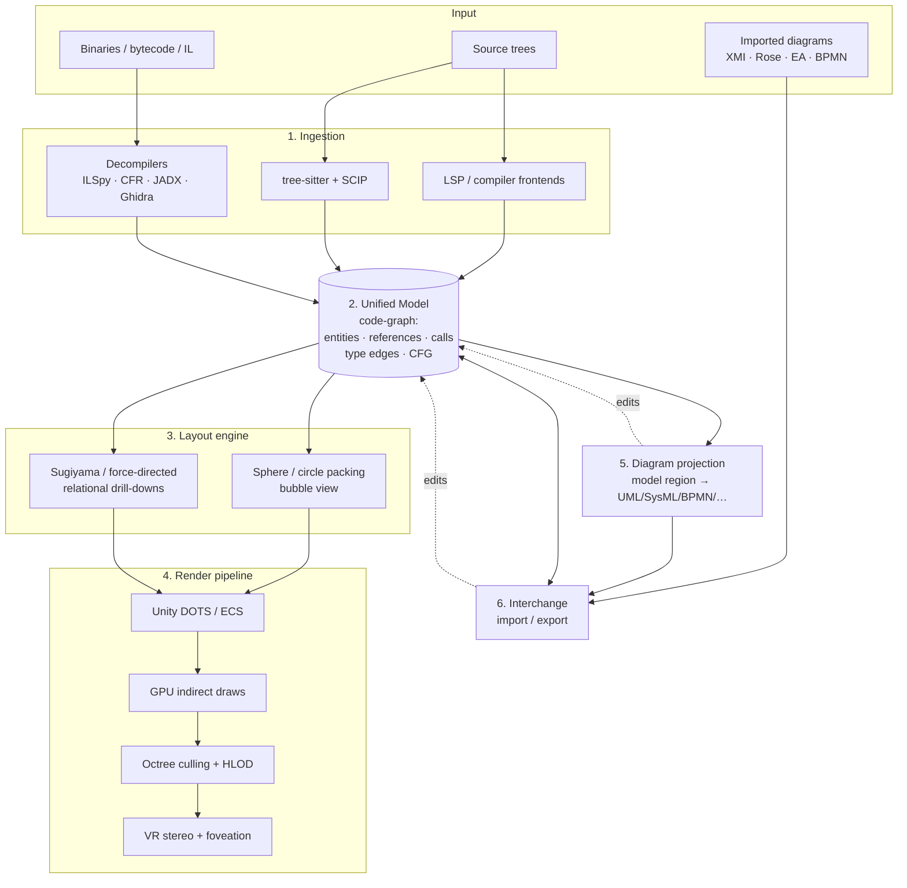

# Architecture

> The Robot Draft is a VR-capable UML/IDE that treats a software system as a navigable 3D
> space. This document describes the end-to-end pipeline — how a repository or compiled
> artifact becomes a unified model, a packed-sphere "bubble" world you fly through, and a set
> of standard diagrams you can project, edit, and export. It is written for engineers building
> the system.

For the conceptual vocabulary (what a *bubble* is, *model* vs. *projection*, HLOD proxies),
read [`CONCEPTS.md`](CONCEPTS.md) alongside this document. For the product framing, see the
[README](../README.md).

---

## System overview

The Robot Draft is a pipeline, not a monolith. Six subsystems hand work to each other in one
direction, with a single shared data structure — the **Unified Model** — at the center. Input
(source trees, binaries, or imported diagrams) enters through **Ingestion**, is normalized into
the **Unified Model**, gets positioned by the **Layout engine**, and is drawn by the **Render
pipeline**. On demand, any region of the model is sent through **Diagram projection** to produce
standard notation, and through **Interchange** to import or export industry formats.

Two design rules govern the whole system:

1. **The model is the single source of truth.** Bubbles, diagrams, and exports are all *views*
   of the same graph. Nothing carries authoritative state outside the model.
2. **Heavy work is decoupled from the frame loop.** Ingestion, layout, and projection run off
   the render thread and stream results in. The render pipeline never blocks on analysis.

These rules are what let the tool hold a VR frame budget while a million-element graph is being
analyzed in the background.

### Pipeline diagram

---

## 1. Ingestion

Ingestion turns raw inputs into facts. It does **not** decide layout or notation — its only job
is to extract accurate, language-aware structure and hand it to the Unified Model. There are
three ingestion paths, chosen by input type.

**Source path (compiler-grade).** For languages with mature frontends, the tool drives the real
compiler's semantic model rather than re-implementing parsing. This gives resolved symbols,
overload resolution, and full type information — not guesses. Adapters target:

- Roslyn (C#/.NET), Clang (C/C++/Objective-C), Eclipse JDT (Java)
- the TypeScript checker (TS/JS), `go/types` (Go)
- LSP servers generally, where a frontend adapter does not yet exist

**Source path (fast/broad).** For breadth across many languages and for files that do not
compile cleanly, the tool uses **tree-sitter** for syntax and **SCIP** (SCIP/LSIF-style indexes)
for cross-file references. This path is lower-fidelity than a compiler frontend but resolves
quickly and degrades gracefully on partial or broken code.

**Binary path (decompilers).** For artifacts with no source — a third-party DLL, a JAR, a
stripped native binary — the tool lifts bytecode, IL, and machine code back toward readable
structure using ILSpy (IL), CFR and JADX (JVM/Android), and Ghidra (native). This is the
*reverse-compile* capability: you explore a dependency you were never given source for. See
[`specs/reverse-engineering.md`](specs/reverse-engineering.md) for fidelity tiers and per-tool
detail.

Each path emits the same fact shape, so downstream subsystems never branch on input type.

---

## 2. Unified Model

The Unified Model is a single in-memory **code-graph** that every other subsystem reads from. It
is shaped conceptually like the OMG **KDM** (Knowledge Discovery Metamodel) layers — Code,
Structure, and Data — but it is populated by the mature tooling above rather than by a
KDM-conformant extractor. Think of KDM as the *organizing schema*, not the import format.

The graph carries:

| Element | Examples |
|---------|----------|
| **Entities** | packages, namespaces, modules, types, methods, fields, variables |
| **References** | symbol uses, imports, inheritance/implementation links |
| **Call edges** | caller → callee, including virtual/dynamic dispatch candidates |
| **Type edges** | declared type, generic instantiation, parameter and return types |
| **CFG** | per-method control-flow graphs (for sequence/activity projection) |

Crucially, this same model is also the **home for imported diagrams**. When you import an XMI
file, a Rose petal model, or a BPMN exchange document, its elements land in the model as
first-class entities and edges — not in a separate sidecar. A UML class imported from XMI and a
class extracted from Roslyn occupy the same graph and can be related, laid out, and re-exported
identically. This is what makes round-trip and cross-source comparison possible.

The model is stable under re-ingestion: re-analyzing a changed file produces a diff against the
existing graph rather than a wholesale rebuild, so views and camera position survive edits.

---

## 3. Layout engine

The Layout engine assigns geometry. It reads the model and produces positions — and it is where
the tool offers two fundamentally different spatial idioms, chosen by what the user is doing.

**Bubble layout (sphere / circle packing).** The default spatial view nests packed spheres:
package bubbles contain class bubbles contain method bubbles. The engine uses hierarchical
circle/sphere packing so that containment is *physical* — a child is inside its parent's volume.
Packing is computed bottom-up (members sized, then packed into their type, then types into their
package), which keeps each level locally stable when a sibling changes. This is the everyday
"fly through the system" experience.

**Relational layout (Sugiyama / force-directed).** When you drill into relationships — a call
graph, a class diagram, a sequence — bubble packing is the wrong tool, because those views are
about edges, not containment. Here the engine switches to **Sugiyama** layered layout (for
directed, hierarchy-like graphs: inheritance, layered call flow) and **force-directed** layout
(for dense, non-hierarchical relationship webs).

The engine emits layout as data, not as scene-graph mutations, so the render pipeline can consume
it in bulk. Layout for off-screen and collapsed regions is computed lazily. See
[`specs/rendering-and-vr.md`](specs/rendering-and-vr.md) for the layout↔render contract and
[`specs/design-conventions.md`](specs/design-conventions.md) for sizing, spacing, and color rules.

---

## 4. Render pipeline

The render pipeline draws the laid-out model fast enough for VR — the target is **90 fps on
million-element graphs**. It is built on Unity **DOTS/ECS** so that bubbles are data in tightly
packed arrays, not GameObjects, which is the only way element counts at this scale stay tractable.

The pipeline stages:

- **GPU-driven indirect draws.** Bubble geometry is submitted in large batches via indirect draw
  arguments computed on the GPU. The CPU never iterates a million elements per frame.
- **Octree culling.** A spatial octree over bubble positions answers "what is visible from here?"
  per frame, so only on-screen, in-budget elements reach the rasterizer.
- **HLOD (hierarchical level of detail).** A collapsed package renders as **one** proxy — a
  single impostor bubble — instead of its thousands of descendants. HLOD is what makes the
  whole-system overview cheap; it is a first-class concept, defined in [`CONCEPTS.md`](CONCEPTS.md).
- **VR stereo + foveated rendering.** Stereo rendering for head-mounted display, with foveation
  to spend GPU budget where the eye is looking. Desktop renders the same scene mono and remains
  fully equal in capability.

Because layout arrives as data and the model never mutates inside the frame loop, the render
pipeline can run flat-out while ingestion and projection proceed in the background.

---

## 5. Diagram projection

Projection turns a **region of the model** into **standard diagram notation**. This is the bridge
between the 3D world and the conventional UML/SysML/BPMN deliverables engineers still need to
read, review, and ship.

A projection takes a selected sub-graph (e.g., "this package and its callers") plus a target
notation, and produces a 2D diagram laid out by the relational layout engine. Supported families:

- **UML 2.5.1** — all 14 diagram types (class, sequence, component, deployment, activity, …)
- **SysML, BPMN 2.0, DMN, ArchiMate** — systems, process, decision, and enterprise-architecture
- **ERD / DDL** — data models
- **Rational Rose** legacy models

The same model region can be projected into *different* notations — a method's CFG becomes a UML
sequence diagram or a BPMN process, depending on the lens. Projection is non-destructive: it reads
the model and produces a view. The full mapping from model elements to each notation lives in
[`specs/diagram-catalog.md`](specs/diagram-catalog.md). The model-vs-projection distinction is
covered conceptually in [`CONCEPTS.md`](CONCEPTS.md).

---

## 6. Interchange

Interchange moves models across the tool boundary. **Import** parses an external format into the
Unified Model (see §2 — imported elements are first-class). **Export** serializes a model region
into an external format, usually after projection.

| Direction | Formats |
|-----------|---------|
| **Import** | XMI, Rose petal files, EA native repositories, BPMN/DMN/ArchiMate exchange XML |
| **Export** | XMI, BPMN/DMN/ArchiMate exchange XML, PlantUML, Mermaid, DOT, SVG, PNG |
| **Round-trip** | XMI and the exchange XML families preserve identity for re-import |

Text formats (PlantUML, Mermaid, DOT) and raster/vector renders (SVG, PNG) are export-oriented —
good for documentation and review, lossy on re-import. Identity-preserving formats (XMI, the
exchange XMLs) are what the round-trip path relies on. Fidelity per format is documented in
[`specs/file-formats.md`](specs/file-formats.md).

---

## The round-trip / edit path

The pipeline reads left-to-right, but editing flows back. Because every view points at the one
model, an edit made anywhere updates the model and re-derives every other view.

A typical loop:

1. **Edit in a view** — rename a method in the bubble world, redraw an association in a projected
   class diagram, or import a revised XMI.
2. **Apply to the model** — the edit becomes a model mutation (the dashed `edits` arrows in the
   pipeline diagram). The model is authoritative; the view was only a lens.
3. **Re-derive dependents** — affected layout, HLOD proxies, open projections, and (for source
   loaded from a repo) generated code are recomputed incrementally from the diff.
4. **Export** — when you want a deliverable, project the region and serialize via Interchange.

Source-backed and diagram-backed elements share this loop, which is why a class extracted from
Roslyn and a class imported from XMI behave identically under edit.

---

## Key architectural decisions

The reasoning behind the choices above — KDM-as-schema vs. KDM-as-importer, DOTS/ECS over
GameObjects, sphere-packing vs. the "code city" metaphor, the model-as-source-of-truth rule, and
the decompiler stack — is recorded as Architecture Decision Records in
[`adrs/`](adrs/). Read the ADRs before changing a subsystem's contract; they capture the
trade-offs that aren't obvious from the code.

---

## Related documents

- [`CONCEPTS.md`](CONCEPTS.md) — bubble metaphor, model vs. projection, HLOD, glossary
- [`specs/diagram-catalog.md`](specs/diagram-catalog.md) — every supported diagram type and its mapping
- [`specs/file-formats.md`](specs/file-formats.md) — import/export formats and round-trip fidelity
- [`specs/reverse-engineering.md`](specs/reverse-engineering.md) — source/binary → model, fidelity tiers
- [`specs/rendering-and-vr.md`](specs/rendering-and-vr.md) — layout↔render contract and VR pipeline
- [`specs/design-conventions.md`](specs/design-conventions.md) — visual, layout, and interaction conventions
- [`adrs/`](adrs/) — architecture decision records
