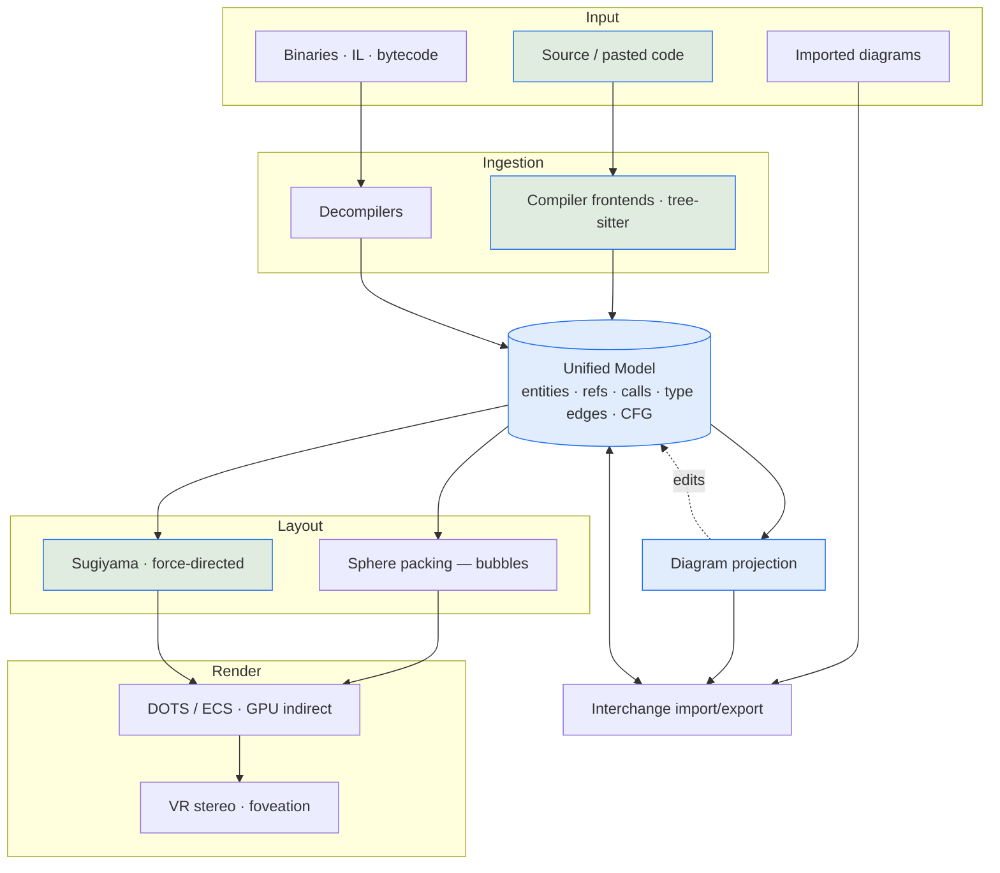

# Project Architecture — The Robot Draft

## Overview

The Robot Draft is a VR-capable **UML/IDE** that treats a software system as a navigable 3D space.
Its architecture is a **one-directional pipeline around a single shared data structure**: input
(source trees, binaries, imported diagrams) is normalized into a **Unified Model**, positioned by a
**Layout engine**, drawn by a **Render pipeline**, and on demand **projected** into standard diagrams
or **interchanged** to/from industry formats. Two invariants govern everything: *the model is the
single source of truth* (bubbles, diagrams, exports are all views) and *heavy work is decoupled from
the frame loop* (ingestion, layout, projection run off the render thread).

The repository is **pre-alpha**: the full pipeline is the *design target*, while the committed Unity
code implements a working **slice** — an interactive standard-UML editor (2D harness + 3D mesh scene)
over a UI-agnostic authoring core, with deterministic + LLM code↔model round-tripping.

→ *See [CONCEPTS.md](CONCEPTS.md) for vocabulary (bubble, model vs. projection, HLOD) and [ARCHITECTURE.md](ARCHITECTURE.md) for the original long-form design narrative.*

## System Diagram

*Highlighted nodes have a working (if partial) implementation in the current Unity stub; the rest are designed.*

## Core Components

| Component | Purpose | Status |
|-----------|---------|--------|
| Ingestion | Source/binary/diagram → facts (Roslyn, Clang, JDT, TS, tree-sitter, decompilers) | Partial — source parse built |
| Unified Model | One in-memory code-graph (KDM-shaped); single source of truth | Partial — authoring model |
| Layout engine | Bubble (sphere packing) + relational (Sugiyama / force-directed) geometry | Partial — 2D/3D harness |
| Render pipeline | DOTS/ECS, GPU indirect draws, octree culling, HLOD, VR stereo | Designed — uGUI/mesh stub |
| Diagram projection | Model region → UML/SysML/BPMN/ERD notation (+ UI wireframes) | Partial — UML class diagrams + wireframes |
| Interchange | Import/export XMI, Rose, EA, BPMN, PlantUML, Mermaid, DOT, SVG/PNG | Partial — PNG/clipboard, HTML + PlantUML salt |
| Authoring core | UI-agnostic model/rules/commands/controller shared by 2D + 3D | **Built** |
| CodeGen | Deterministic + LLM code ↔ model + wireframe bridge; shadow-file editor round-trip | **Built** |
| Styleguide | Noizu css-gen port: YAML seeds → resolved design tokens; themes HTML wireframe export | **Built** |

## Unified Model

A single in-memory KDM-shaped code-graph (entities, references, call/type edges, CFG) that every
subsystem reads from. Imported diagrams land in it as first-class elements, and re-ingestion produces
a diff rather than a rebuild — the basis of round-trip and stable views.

→ *See [arch/unified-model.md](arch/unified-model.md) for details.*

## Ingestion & Reverse Engineering

Source uses compiler-grade frontends (resolved symbols, full types) with a fast tree-sitter/SCIP
fallback; binaries are lifted by decompilers (ILSpy, CFR, JADX, Ghidra) so source-less dependencies
become navigable. Every path emits the same fact shape. *Built today: deterministic + LLM source parse.*

→ *See [arch/ingestion.md](arch/ingestion.md) for details.*

## Layout Engine

Two spatial idioms chosen by task: bottom-up sphere/circle **packing** for the containment-nesting
bubble view, and **Sugiyama / force-directed** layout for edge-centric relational drill-downs. Layout
is emitted as data so the renderer consumes it in bulk; off-screen regions compute lazily.

→ *See [arch/layout.md](arch/layout.md) for details.*

## Render Pipeline & VR

The target renderer is Unity **DOTS/ECS** with GPU indirect draws, octree culling, and HLOD proxies
(a collapsed package = one impostor bubble), plus VR stereo and foveation — aimed at 90 fps on
million-element graphs. The current code is a non-DOTS uGUI/mesh stand-in with a 6-DOF camera rig.

→ *See [arch/rendering-and-vr.md](arch/rendering-and-vr.md) for details.*

## Diagram Projection & Interchange

Any model region projects non-destructively into standard notation (UML 2.5.1, SysML, BPMN, DMN,
ArchiMate, ERD, Rose) — plus a UI-wireframe family — and the same region can target different
notations. Interchange imports/exports identity-preserving formats (XMI, exchange XML) for round-trip
plus export-oriented text/raster forms. *Built today: UML class diagrams, and Screen/Panel regions
to HTML mockups + PlantUML `salt`, themed by the styleguide engine.*

→ *See [arch/projection-and-interchange.md](arch/projection-and-interchange.md) for details.*

## Data Flow & Round-Trip

The pipeline reads left-to-right but editing flows back: every view points at the one model, so an
edit becomes a model mutation and re-derives every other view (layout, HLOD, projections, generated
code) incrementally from the diff. Source-backed and diagram-backed elements behave identically. The
working instance of this loop is the **shadow-file round-trip**: a node's source opens in VS Code,
and a save there re-parses the edits back onto the model.

→ *See [arch/data-flow.md](arch/data-flow.md) for details.*

## Technology Stack

Unity 6 (6000.3.18f1), C# (no `System.Text.Json` → `JsonUtility` DTOs), Unity XR/OpenXR; uGUI today
with DOTS/ECS + GPU-driven rendering targeted; an OpenAI-compatible LLM endpoint; an in-engine port
of the Noizu styleguide css-gen pipeline (theme tokens for HTML wireframe export); targeted ingestion
via Roslyn/Clang/JDT/TS/go + tree-sitter/SCIP and ILSpy/CFR/JADX/Ghidra; `make` + `build-mac.sh` +
NUnit EditMode.

→ *See [PROJ-LAYOUT.md](PROJ-LAYOUT.md) for the repository/file map.*

## Key Decisions

Model-as-single-source-of-truth and heavy-work-off-the-frame-loop are the two core invariants;
DOTS/ECS over GameObjects (ADR-001), unified KDM-as-schema model (ADR-002), and sphere-packing
bubbles over "code city" (ADR-003) are the load-bearing structural choices.

→ *See [arch/decisions.md](arch/decisions.md) and the [adrs/](adrs/).*

## Implementation Status

Built end-to-end today: code→model→diagram, interactive UML editing, model→code, a notation-aware 3D
slab view (per-kind silhouettes, regions, resize, images), shadow-file VS Code round-trip + LLM
refactor, UI-wireframe projection (HTML + PlantUML salt) with styleguide theming, and PNG/clipboard
export. Not yet started: DOTS/HLOD/VR rendering, compiler-grade + decompiler ingestion,
identity-preserving interchange, and notations beyond UML class diagrams.

→ *See [arch/implementation-status.md](arch/implementation-status.md) for the designed-vs-built map.*

## Related Documents

- [arch/](arch/) — detailed per-section architecture documents
- [ARCHITECTURE.md](ARCHITECTURE.md) — original long-form design narrative
- [CONCEPTS.md](CONCEPTS.md) — bubble metaphor, model vs. projection, HLOD, glossary
- [specs/](specs/) — authoring UX, rendering/VR, diagram catalog, file formats, reverse engineering
- [adrs/](adrs/) — architecture decision records
- [PROJ-LAYOUT.md](PROJ-LAYOUT.md) — repository structure and file-level map
