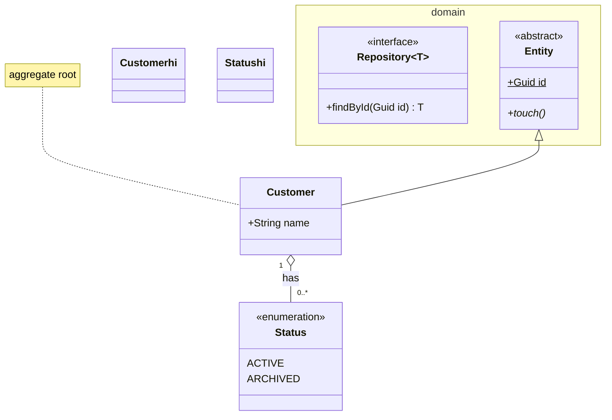

# Mermaid Class Diagram Format — Reference for Import/Export

Research + implementation reference for the Mermaid **class diagram** text format as consumed and
emitted by `MermaidReader` / `MermaidWriter` in
`Assets/Scripts/Authoring/Interchange/`. Source: the official Mermaid docs
([classDiagram](https://mermaid.js.org/syntax/classDiagram.html) incl. the styling section).

Guiding principle, same as the sibling PlantUML importer:

- **Import is tolerant.** Only the class-diagram subset below is recognized; every other line —
  frontmatter, `%%` comments, `%%{init}%%` directives, `direction`, `click`/`callback`/`link`
  interactions, config — is **skipped**, never fatal. The only hard error is a `null` string;
  empty/whitespace input returns an empty model.
- **Export is minimal, idiomatic and deterministic.** The writer is a pure function of the
  `IxModel`: LF newlines, model-list ordering, one canonical orientation per relationship, no
  invented ids or colors. Identical input ⇒ byte-identical output, so exports diff cleanly and
  re-import is a fixed point.

Everything below maps to the neutral `IxModel` in `InterchangeModel.cs`; colors land in the
`FillColor` / `LineColor` / `TextColor` / `StyleClass` fields (`"#RRGGBB"` or `null`).

---

## 1. Document envelope

```mermaid
---
title: optional frontmatter
---
%%{init: {'theme':'default'}}%%
classDiagram
    direction LR
    %% a comment
    ... body ...
```

- **Frontmatter** — an optional leading `---` … `---` YAML block. Skipped whole (an unterminated
  one is also tolerated).
- **Header** — `classDiagram` or `classDiagram-v2`. **Tolerated if missing** (the whole input is
  treated as a body).
- **Comments** — a line whose first non-whitespace is `%%`. The config directive form
  `%%{init: …}%%` is the same prefix and is likewise skipped.
- **`direction TB|BT|LR|RL`** — layout only; skipped. Mermaid class diagrams carry no node
  coordinates, so `IxModel.Diagrams` is always left empty.
- A trailing `;` on any statement is stripped before parsing.

---

## 2. Elements

| Form | Meaning |
|---|---|
| `class Name` | class |
| `class Name["Display label"]` | class with a display label distinct from its id |
| `class Name~T~` / `class Map~K, V~` | generic/template params → `IxElement.GenericParams` |
| `class Name { … }` | class with a body block (members / annotations / enum literals) |
| `namespace N { … }` | package container (see §5) |

- The **id** (bare token) is what relationships and styling reference; the bracket label is the
  human display name. On import: `Id` = token, `Name` = label when present else the token.
- **Generics** `~…~` after the name become `GenericParams` verbatim (`"T"`, `"K, V"`).

### Annotations (element kind / stereotype)

Recognized inside a body, on their own line, or inline after the class name:

```mermaid
class Shape { <<interface>> }
<<abstract>> Shape
class Duck <<interface>>
```

| Annotation | IR effect |
|---|---|
| `<<interface>>` | `Type = Interface` |
| `<<enumeration>>` / `<<enum>>` | `Type = Enum` |
| `<<abstract>>` | `IsAbstract = true` (element stays a Class) |
| anything else (`<<service>>`, …) | `Stereotype = "service"` |

Multiple annotation lines accumulate (e.g. `<<abstract>>` + `<<service>>` set both `IsAbstract`
and `Stereotype`).

---

## 3. Members

Two equivalent ways to attach members, both supported:

```mermaid
class Account {
    +int balance
    -owner : Person        %% (tolerated) 
    +deposit(int amount) bool
}
Account : +String iban     %% external form: `Class : member`
```

**Mermaid convention (differs from PlantUML):**

- **Fields are type-first:** `+int balance` → name `balance`, type `int`. The **name is the last
  whitespace token**; everything before it is the type (so generics with spaces like
  `Map~K, V~ m` parse correctly).
- **Methods put the return type after the parens:** `+deposit(int amount) bool` → name `deposit`,
  return type `bool`. Parameters are type-first (`int amount`). A leading `+ - # ~` sets
  visibility; a Java-style `+bool deposit()` head is also tolerated.

### Visibility & classifiers

| Prefix | Visibility | | Suffix | Meaning |
|---|---|---|---|---|
| `+` | Public | | `$` | static (field or method) |
| `-` | Private | | `*` | abstract (method) |
| `#` | Protected | | | |
| `~` | Package | | | |

Classifier suffixes come **after** the field type or the method's return type
(`+Guid id$`, `+area() double*`) and are stripped into `IsStatic` / `IsAbstract`. Original text is
kept in `IxMember.RawText`.

### Generics in member types

`~T~` inside a type normalizes to `<T>` in the IR (`List~int~` → `List<int>`); the writer converts
back. This keeps the neutral IR angle-bracket-canonical across all formats.

### Enum literals

Inside an `<<enumeration>>` body, a bare line with no `(` is an enum constant → `EnumLiterals`
(methods with `()` are still parsed as operations). External literals (`Color : RED`) are folded
back into `EnumLiterals` in a final normalization pass.

---

## 4. Relationships

General shape (whitespace around the arrow is expected; multiplicities are quoted, hugging the
arrow ends; a `: label` follows):

```
LEFT ["lmult"] ARROW ["rmult"] RIGHT [ : label ]
```

### 4.1 Arrow table (as implemented)

Read `A <arrow> B` left-to-right. The reader decodes each end's head and normalizes to the IR
direction convention (`InterchangeModel.cs`): triangle/diamond end wins the semantic role
regardless of which side it is on, so both orientations of every arrow collapse to one edge.

| ASCII (canonical) | IxEdgeType | Head at → IR role |
|---|---|---|
| `Parent <\|-- Child` | Generalization | triangle end = `To` (parent); `From` = child |
| `Impl ..\|> Iface` | Realization | triangle end = `To` (interface); dashed |
| `Whole *-- Part` | Composition | filled-diamond end = `From` (whole) |
| `Whole o-- Part` | Aggregation | hollow-diamond end = `From` (whole) |
| `Source --> Target` | DirectedAssociation | open-arrow end = `To` (target) |
| `A -- B` | Association | undirected (`From=A, To=B`) |
| `A ..> B` | Dependency | open-arrow end = `To`; dashed |
| `A .. B` | Dependency | weak dashed link (→ NoteLink if a Note participates) |

**Both orientations** are accepted and mirror to the same edge: `A <|-- B` ≡ `B --|> A`;
`A *-- B` ≡ `B --* A`; `A --> B` ≡ `B <-- A`; `A <|.. B` ≡ `B ..|> A`; etc. Two-way arrows
(`A <--> B`, `o--o`, `>--<`) map to a plain **Association**. Lollipop interfaces (`bar ()-- foo`,
`foo --() bar`) are not modeled → **Association** (reported here rather than dropped). Solid vs
dashed is decisive: `-->`/`..>` and `<|--`/`<|..` differ only by the line style.

Decoding algorithm: locate the arrow token (`[<>o*()|]*` + `--`/`..` + `[<>o*()|]*`), classify each
head — `|`→triangle, `*`→filled diamond, `o`→hollow diamond, `<`/`>`→open arrow, `(`/`)`→lollipop —
and pick edge type + orientation from the pair plus the solid/dashed body.

### 4.2 Multiplicity & label

```mermaid
Customer "1" o-- "0..*" Status : has
```

Quoted strings immediately before/after the arrow are the left/right end multiplicities; they
follow their **operand** into `FromMultiplicity` / `ToMultiplicity` (so they stay attached to the
right classifier even when the arrow swaps orientation). `: text` after the operands is the edge
`Label`. (Mermaid class diagrams have no role names, so `FromRole` / `ToRole` are unused.)

### 4.3 Auto-created endpoints

An element first named by a relationship is auto-created as a `Class`.

---

## 5. Namespaces (packages)

```mermaid
namespace domain {
    class Repository
    class Entity
}
namespace ui["Display Name"] { class View }
```

`namespace N { … }` opens a package container; contained classes get `ParentId = N`. A `["label"]`
form is supported. Bodies close on `}` (a container stack tracks nesting alongside class-body
braces). Deeply nested packages are read but the writer emits one flat `namespace` per package
that has classifier children (empty packages have no Mermaid representation).

---

## 6. Styling (headline feature — deterministic)

### Import

- **`classDef name fill:#f9f,stroke:#333,color:#fff,stroke-width:4px`** — collected into a style
  table. Only `fill`→`FillColor`, `stroke`→`LineColor`, `color`→`TextColor` are mapped; everything
  else (`stroke-width`, `font-size`, …) is ignored. `classDef default …` applies to every element
  that has no explicit assignment.
- **Assignment** via `class Foo styleName`, `class A,B styleName`, `cssClass "A,B" styleName`, and
  inline `Foo:::styleName` (on a declaration or an operand). Sets the element's colors from the
  style table and records `StyleClass = styleName`.
- **`style Foo fill:#…,stroke:#…`** — per-element inline colors (no `StyleClass`).
- **Color normalization:** 3-digit hex `#f9f` → `#FF99FF`; 6/8-digit hex upper-cased; a small
  built-in named-color table (`red`→`#FF0000`, `white`→`#FFFFFF`, `lightblue`→`#ADD8E6`, …); any
  other value passes through verbatim.

### Export

Coloring is emitted deterministically and colors are **never invented** — an element with no color
fields produces no styling:

1. Group elements by identical `(FillColor, LineColor, TextColor)` tuple, in first-appearance
   (emission) order.
2. One `classDef` per group: reuse the group's `StyleClass` name when **every** member shares the
   same one, otherwise generate `style1..styleN` in order. Only the set properties are emitted, in
   `fill,stroke,color` order.
3. Assign with `class <id> <styleName>` lines, **sorted by id**.

Grouping in emission order (not raw model order) is what makes `parse → write → parse → write` a
fixed point even with generated `styleN` names.

---

## 7. Things a tolerant importer SKIPs

`%%` comments · `%%{init: …}%%` directives · `---` frontmatter · `classDiagram` / `classDiagram-v2`
header · `direction …` · `click …` / `callback …` / `link …` / `href …` interactions · `style-width`
and other non-color CSS props · any unrecognized line. None are fatal.

---

## 8. Export shape

The writer emits, in order: `classDiagram`, namespaces (with their classes), top-level classes,
notes, relationships, then the styling block. Example for a small model:



### Canonical writer orientations

| IxEdgeType | Emitted as |
|---|---|
| Generalization / Extension | `Parent <\|-- Child` (`To <\|-- From`) |
| Realization | `Impl ..\|> Iface` (`From ..\|> To`) |
| Composition | `Whole *-- Part` (`From *-- To`) |
| Aggregation | `Whole o-- Part` (`From o-- To`) |
| DirectedAssociation | `Source --> Target` (`From --> To`) |
| Association / Unknown | `From -- To` |
| Dependency | `From ..> To` |
| NoteLink | emitted as `note for <target> "…"`, not an arrow |

Names that are not bare identifiers (`^[A-Za-z_][A-Za-z0-9_]*$`) are emitted in
`class Id["Display"]` form with a sanitized, uniquified id; relationships and assignments reference
that same id.

---

## 9. IR mapping summary & friction

| Mermaid | IxModel |
|---|---|
| `class` / `<<interface>>` / `<<enumeration>>` / `<<abstract>>` | `IxElement.Type` / `IsAbstract` |
| other `<<stereo>>` | `IxElement.Stereotype` |
| `Name["label"]` | `Id` + `Name` |
| `~T~` element / `~T~` member | `GenericParams` / `Type` (as `<T>`) |
| field `+Type name` / method `+name(p) Ret` | `IxMember` (type-first / return-after-parens) |
| `$` / `*` | `IsStatic` / `IsAbstract` |
| enum body literal | `EnumLiterals` |
| relationship arrows | `IxEdge.Type` + normalized `From`/`To` |
| `"m"` ends / `: label` | `From`/`ToMultiplicity` / `Label` |
| `namespace` | `IxElement.Type = Package` + `ParentId` |
| `note` / `note for X` | Note `IxElement` (+ `NoteLink` edge) |
| `classDef` + assignment / `style` / `:::` | color fields + `StyleClass` |

**IR friction (no `InterchangeModel.cs` change needed):**

- Mermaid class diagrams carry **no layout**, so `IxDiagram` / `IxNodePlacement` are unused on both
  directions.
- **Lollipop** interfaces and **role names** have no IR representation → lollipops degrade to
  Association; roles are dropped.
- **Nested packages** round-trip only one level deep (the writer flattens to one `namespace` per
  package with children; empty packages are dropped).
- A single element carrying **both** a custom `Stereotype` and `IsAbstract` emits only the
  stereotype annotation (one `<<…>>` per class on export).
- `IxMember.RawText` is populated on read but the writer regenerates canonical member text, so
  `RawText` is not byte-preserved across a round-trip (the parsed fields are).
