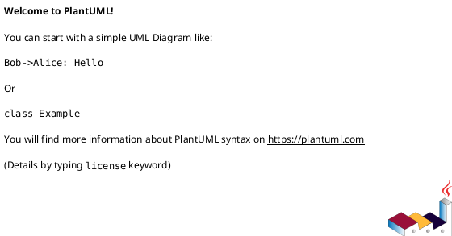

# PlantUML Class Diagram Format — Reference for Import/Export

Research reference for implementing a **parser (import)** and **generator (export)** of
the PlantUML *class diagram* text format in C#. Sources: the official PlantUML docs
([class-diagram](https://plantuml.com/class-diagram),
[object-diagram](https://plantuml.com/object-diagram), commons/preprocessing pages) and
the PlantUML Language Reference Guide PDF.

The guiding principle for both directions:

- **Import must be tolerant.** PlantUML is a huge language; a class-diagram importer only
  needs to recognize a subset and must *skip* everything it doesn't understand (styling,
  preprocessor, layout hints) without failing.
- **Export must be minimal and idiomatic.** Emit only the constructs below, in a stable
  order, so the output is diffable and re-importable.

PlantUML itself is **very permissive**: member text, types, and parameters are largely
treated as free-form display text, not parsed semantically. The parser we build will be
*stricter* than PlantUML (extracting types/params heuristically) but must never reject a
file PlantUML would accept.

---

## 1. Document envelope



- `@startuml` / `@enduml` delimit a diagram. Keywords are case-insensitive-ish but always
  written lowercase in practice. Everything before `@startuml` and after `@enduml` is
  ignored.
- **Optional diagram name** follows `@startuml`: `@startuml MyDiagramName`. When a single
  source file contains several `@startuml`/`@enduml` blocks, the name is used to name the
  generated image file. Importers should capture it as the diagram title and otherwise
  ignore it.
- A single file **can contain multiple** `@startuml`…`@enduml` blocks. A robust importer
  should either process the first block or iterate all blocks.
- Alternate delimiters exist for other renderers (`@startuml`/`@enduml` is the only one we
  need); some files omit the envelope entirely when embedded — tolerate a missing
  `@startuml` by treating the whole input as the body.

### Comments

```plantuml
' single-line comment — the apostrophe must be the first non-whitespace char on the line
/'
  block comment,
  may span multiple lines
'/
class Foo /' inline block comment '/ #red
```

- **Line comment**: a line whose first non-whitespace character is `'` is a comment.
- **Block comment**: `/'` … `'/`, may be multi-line, and may appear inline in the middle of
  a line (PlantUML strips it before parsing the line).
- ⚠️ **Trailing `'` inline comments are NOT supported.** `class Foo ' note` does *not* make
  `' note` a comment — it becomes part of the line and usually a syntax error in strict
  PlantUML. Only the two forms above are valid. (Any "` ' comment`" trailing text you see in
  informal examples is editorial annotation, not real syntax.) Our parser should:
  1. Strip all `/' … '/` spans (including multi-line) first.
  2. Then drop any line whose first non-whitespace char is `'`.

---

## 2. Element declarations

### Keywords

Every element keyword introduces a node. All of these are accepted:

| Keyword | Renders as / meaning |
|---|---|
| `class` | class |
| `abstract` / `abstract class` | abstract class (name italicized) |
| `interface` | interface |
| `enum` | enumeration |
| `annotation` | annotation / attribute type |
| `entity` | entity (ER-ish) |
| `struct` | struct |
| `exception` | exception |
| `protocol` | protocol |
| `metaclass` | metaclass |
| `stereotype` | stereotype |
| `dataclass` | data class |
| `record` | record |
| `circle` (`()`) | small circle node (lollipop target) |
| `diamond` (`<>`) | diamond node (n-ary association point) |
| `object` | object (object diagrams; same body rules) |
| `json` / `map` | structured-data nodes (object diagrams) |

For an **importer**, map each keyword to an element "kind" enum. Unknown keywords that fit
the `KEYWORD Name [body]` shape should be tolerated as a generic class-like node.

### Forms

```plantuml
class MyClass
class MyClass { }
abstract class AbstractList
abstract AbstractCollection
interface List
enum TimeUnit { DAYS HOURS MINUTES }
annotation SuppressWarnings
entity Customer
struct Point
```

### Generics / templates

```plantuml
class Foo<T>
class Foo<? extends Element> { int size() }
class HashMap<Long,Customer>
interface Map<K,V>
```

The `<...>` after the name is the generic/template parameter list, rendered in a corner box.
`skinparam genericDisplay old` switches to the older in-name rendering — tolerate & ignore.

### Display name vs code name (alias)

Two interchangeable orderings; the **quoted** part is the display label, the bare identifier
is the code name/alias used in relationships:

```plantuml
class "This is my class" as class1
class class2 as "It works this way too"
class "$C2" as dollarC2
```

- Use an alias whenever the display name contains spaces, punctuation, or would otherwise be
  an invalid identifier.
- All subsequent references (relationships, notes, members) use the **alias**, not the
  display string.
- **Exporter rule:** if a model element's name is not a bare identifier
  (`^[A-Za-z_][A-Za-z0-9_]*$`), emit `class "Display Name" as SafeAlias` and reference
  `SafeAlias` everywhere else.

### Stereotypes and custom spots

```plantuml
class Object << general >>
class System << (S,#FF7700) Singleton >>
class Date << (D,orchid) >>
class MyClass << stereotype1, stereotype2 >>
```

- `<< text >>` attaches a stereotype label.
- `<< (X,#color) text >>` sets the "spot" letter `X` and its circle color, optionally with
  trailing stereotype text.
- **Import:** capture stereotype text (strip the `(X,color)` spot), tolerate the rest.
- Well-known stereotypes double as element kinds (e.g. an element may be a `class`
  `<< interface >>`).

### Class-level visibility & colors/tags (tolerate on import)

```plantuml
-class "private Class" { }
#class "protected Class" { }
class Foo #red
class Bar #line:green;back:lightblue
class Baz #back:red;line:00FFFF
class FooDashed #line.dashed:blue
class C1 $tag13
```

- A leading `+ - # ~` on the *keyword* sets class visibility — rare; tolerate.
- `#color` / `#key:value;key:value` after the declaration is inline styling — **skip on
  import**, don't emit on export (unless you deliberately round-trip color).
- `$tagName` attaches a tag used later by `hide`/`remove` — skip.

---

## 3. Members: fields and methods

Two equivalent ways to attach members.

### A. Inline brace body

```plantuml
class Dummy {
  String data
  int id
  void methods()
  +getName() : String
}
```

### B. External "Class : member" form

```plantuml
Object <|-- ArrayList
Object : equals()
ArrayList : Object[] elementData
ArrayList : size()
```

Each `Name : text` line appends one member to `Name`. Same disambiguation rules as the brace
body apply to `text`.

### Field vs method disambiguation

> **"The system checks for parenthesis to choose between methods and fields."**

- Contains `()` → **method**. Otherwise → **field**.
- Explicit override: a leading `{field}` or `{method}` forces the kind (needed when a field
  name legitimately contains parentheses, or a parameterless method must be shown without
  `()`).

```plantuml
class Dummy {
  {field} A field (despite parentheses)
  {method} Some method
}
```

### Visibility prefixes

The first non-whitespace character of the member text, if one of these, sets visibility and
is stripped from the display name:

| Char | Visibility |
|---|---|
| `+` | public |
| `-` | private |
| `#` | protected |
| `~` | package private |

```plantuml
class Dummy {
  -field1
  #field2
  ~method1()
  +method2()
}
```

- Rendered as UML icons by default; `skinparam classAttributeIconSize 0` renders the raw
  `+ - # ~` characters instead. Either way the semantic mapping is identical.
- To show a literal leading `~` (e.g. a C++ destructor `~Dummy()`), escape it: `\~Dummy()`.

### `{static}` / `{abstract}` / `{classifier}` modifiers

```plantuml
class Dummy {
  {static} String id
  {abstract} void methods()
  +void {abstract} start(int timeout)
}
```

- `{static}` → underlined; `{classifier}` is a synonym for `{static}`.
- `{abstract}` → italic.
- **Placement is flexible:** the modifier may appear at the **start or the end** of the line,
  and may co-exist with a visibility prefix. A parser must scan the whole member line for
  `{static}`, `{classifier}`, `{abstract}`, `{field}`, `{method}` tokens and remove them
  before extracting the name.

### Return types and parameters (free-form)

PlantUML does **not** parse types — the member text after visibility/modifier stripping is
displayed verbatim. Both conventions appear in the wild and both are just text to PlantUML:

```plantuml
class C {
  +getName() : String     ' name(): Type  — UML/"Ada" style
  +String getName()       ' Type name()   — Java/C# style
  +setName(n: String) : void
  +void setName(String n)
}
```

**Heuristic our importer should use** (PlantUML won't do it for us):

1. Split the member on the first `(` and matching `)` to isolate `params` (methods only).
2. `head` = text before `(`; `tail` = text after `)`.
3. If `tail` starts with `:` → return type is `tail[1:]`, method name is the last token of
   `head` (Ada/UML style, `name(params): Ret`).
4. Else if `head` has ≥2 tokens → first token(s) are the return type, last token is the name
   (Java/C# style, `Ret name(params)`).
5. Fields: if `name : Type` present, split on `:`; else if two tokens `Type name`, first is
   type. A lone token is a bare name with unknown type.
6. Parameters: split `params` on top-level commas; each param parsed with the same
   `name: Type` / `Type name` heuristic.

Keep the **raw text** alongside the parsed fields so export can round-trip losslessly.

### Body separators / grouping (NOT members)

Lines made of separator runs create visual dividers or sub-titles inside a class body and
must **not** be parsed as members:

```plantuml
class User {
  .. Simple Getter ..
  +getName()
  +getAddress()
  __ private data __
  int age
  -- encrypted --
  String password
  == Section ==
}
```

Separator tokens: `..` (dotted), `--` (solid), `==` (double), `__` (bold), optionally
wrapping a title (`.. Getters ..`). Rule: if a line, after trimming, consists only of one of
those runs (optionally with a title between two equal runs), it's a separator.

---

## 4. Enum literals

Inside an `enum` body, each non-empty, non-separator line that is **not** a method (no `()`)
is an enum constant:

```plantuml
enum TimeUnit {
  DAYS
  HOURS
  MINUTES
}
```

Enums may also carry methods/fields (same rules as classes); lines with `()` are methods.

---

## 5. Relationships

General line shape (this is the single most important grammar to get right):

```
LEFT  [ "lmult" ]  ARROW  [ "rmult" ]  RIGHT  [ : label [dir-hint] ]
```

- `LEFT`, `RIGHT` — element aliases (optionally `Alias::member` to target a member; optionally
  a `[qualifier]` box — see below).
- `"lmult"`, `"rmult"` — optional quoted multiplicity/role strings adjacent to each end.
- `ARROW` — a head/line/head token, decoded below.
- `: label` — optional; may carry a `<`/`>` reading-direction hint.

### 5.1 Arrow anatomy

An arrow = **optional left head** + **line body** + **optional right head**.

- **Heads:** `<|` / `|>` (triangle, inheritance), `<` / `>` (open arrow), `*` (filled
  diamond), `o` (hollow diamond), plus tolerated variants `+`, `x`, `#`, `{` / `}`, `^`,
  and `()` (lollipop/circle).
- **Line body:** one or more `-` (solid) or `.` (dotted/dashed). Line style is determined by
  whether the run is dashes or dots.
- The head can be on either or both ends; `A <|-- B` and `B --|> A` are the same relation.

### 5.2 Canonical arrow table

Read `A <arrow> B` left-to-right. "Triangle/diamond/arrow at X" = the head symbol sits on
X's side.

| ASCII | Name / UML meaning | Head at | Directed reading |
|---|---|---|---|
| `A <\|-- B` | **Extension / generalization** (B *extends* A) | triangle at A | B → A (subclass to superclass) |
| `A --\|> B` | Extension, reversed (A extends B) | triangle at B | A → B |
| `A <\|.. B` | **Realization / implementation** (B *implements* interface A) | hollow triangle at A, dashed | B ..▷ A |
| `A ..\|> B` | Realization, reversed (A implements B) | triangle at B, dashed | A ..▷ B |
| `A *-- B` | **Composition** (A owns B; B dies with A) | filled diamond at A | whole A ◆— part B |
| `A o-- B` | **Aggregation** (A has B; B independent) | hollow diamond at A | whole A ◇— part B |
| `A --> B` | **Directed association** (A → B) | open arrow at B | A → B |
| `A <-- B` | Directed association, reversed | open arrow at A | B → A |
| `A -- B` | **Plain association** (no direction) | none, solid | undirected |
| `A ..> B` | **Dependency** (A depends on B) | open arrow at B, dashed | A ┄▷ B |
| `A ..  B` | **Dotted link** (weak/none) | none, dashed | undirected |
| `A ()-- B` / `A --() B` | **Lollipop** interface exposure | circle at the `()` end | interface provided/required |

Tolerated alternate heads seen in the wild (map to nearest standard meaning or keep raw):
`#--`, `x--`, `}--`, `+--`, `^--`, and their mirrors. An importer should decode the head
symbols it knows and preserve the raw arrow string for anything exotic.

**Decoding algorithm (line-based):**
1. Regex-locate the arrow token: the maximal run matching
   `[<>o*+x#{}^|()]*[-.]+(?:\w+[-.]+)?[<>o*+x#{}^|()]*` between the two operands (allowing an
   embedded direction/style token — see 5.3).
2. Left head = leading head chars; right head = trailing head chars; middle = line run.
3. Line style: dashes → solid, dots → dashed.
4. Classify by (leftHead, rightHead, style):
   - triangle (`<|`/`|>`) + solid → generalization; + dashed → realization.
   - filled diamond (`*`) → composition; hollow diamond (`o`) → aggregation.
   - open arrow (`<`/`>`) only → association (directed); dashed → dependency.
   - no heads, solid → association; dashed → dotted link.
   The **whole/owner/parent** is the end bearing the diamond or triangle.

### 5.3 Direction & length (layout hints — semantics-free)

Direction and length affect *layout only*; a semantic importer should record them as hints
(or ignore) but never change the relationship kind.

```plantuml
foo -left->  bar
foo -right-> bar
foo -up->    bar
foo -down->  bar
foo -l-> bar     ' abbreviations: l r u d
foo -r-> bar
foo -u-> bar
foo -d-> bar
foo -do-> bar    ' 'do' also = down
```

- Direction keyword sits **inside** the dashes: `-up-`, `-down-`, `-left-`, `-right-`
  (abbrev `-u-`, `-d-`, `-l-`, `-r-`, and `-do-`).
- **Line length = dash count.** `--` is the standard vertical rank link; `-` is horizontal;
  more dashes (`---`, `----`) request a longer edge / more rank separation. Single dash tends
  to place nodes side-by-side, double dash stacks them.
- Whole-diagram direction: `top to bottom direction` (default) or `left to right direction`.

Bracketed style also lives inside the dashes and is **skip-on-import**:

```plantuml
foo -[bold]-> bar
foo -[dashed]-> bar
foo -[dotted]-> bar
foo -[hidden]-> bar          ' invisible edge used only to nudge layout
foo -[#red,thickness=2]-> bar
```

Note `-[hidden]->` / `-[dotted]->` etc.: the bracket token can contain color
(`#red`), style (`dashed`,`dotted`,`bold`,`plain`,`hidden`), and `thickness=N`. Strip the
`[...]` before decoding heads. `[hidden]` edges carry no model meaning — drop them.

### 5.4 Multiplicity / cardinality & role labels

```plantuml
Class01 "1" *-- "many" Class02 : contains
Class05 --> "1" Class06
Aaa "1" *--> "1..100" Entry : -entries
User "owner which is very long"/1 -- "0..n"/items Item
```

- Quoted string immediately **before** the arrow = left-end multiplicity/role; quoted string
  immediately **after** the arrow = right-end multiplicity/role.
- Values are free text: `1`, `0..*`, `many`, `1..100`, `0..n`, etc.
- The `"label"/role` slash form splits an end into a multiplicity and a named role.

### 5.5 Association labels & reading-direction hints

```plantuml
Driver - Car : drives >
Car -- Person : < owns
Dummy --> Foo : A link
```

- `: text` after the operands labels the edge.
- A trailing `>` or leading `<` in the label is a **reading-direction arrow** (renders a small
  triangle showing which way to read the verb). Strip it into a `readingDirection` hint; the
  remaining text is the label.

### 5.6 Association classes

Connect an association (between two classes) to a third class describing it:

```plantuml
class Student
Student "0..*" -- "1..*" Course
(Student, Course) .. Enrollment
class Enrollment { drop() ; cancel() }
```

- `(A, B) .. C` (or `(A, B) . C`) links the A–B association to class `C`.
- Importer: recognize a line starting with `(ident, ident)` followed by a dotted link to a
  class; attach `C` as the association class of the most recent/ matching A–B edge.

### 5.7 n-ary association via diamond

```plantuml
<> dia            ' or:  diamond dia
StationCrossing . dia
dia - "from 0..*" Station
dia - "to 0..*"   Station
```

`diamond`/`<>` declares a shared association point; edges connect to it. Treat the diamond as
a synthetic node.

### 5.8 Qualified associations

```plantuml
class1 [Qualifier] - class2
Shop [customerId: long] ---> "customer\n1" Customer
HashMap [id: Long] -r-> "value" Customer
```

`[qualifier]` box sits between an operand and the arrow. Capture as a qualifier on that end;
tolerate if unmodeled.

### 5.9 Member-to-member links

```plantuml
Foo::field1 --> Bar::field3 : foo
User::id *-- Email::user_id
```

Operands can be `Alias::memberName` to draw the edge from/to a specific field or method.
Parser: split operand on `::` into (element, member). If the member side is unmodeled, fall
back to an element-level edge.

---

## 6. Packages & namespaces

```plantuml
package "Classic Collections" #DDDDDD {
  Object <|-- ArrayList
}

package com.plantuml {
  Object <|-- Demo1
  Demo1 *- Demo2
}

namespace net.dummy #DDDDDD {
  .BaseClass <|-- Person       ' leading dot = root namespace
  Meeting o-- Person
}

package foo1 <<Node>> {        ' package shape via stereotype
  class Class1
}
```

- `package Name [<<shape>>] [#color] { ... }` — a container; `<<Node>>`, `<<Rectangle>>`,
  `<<Folder>>`, `<<Frame>>`, `<<Cloud>>`, `<<Database>>` set the box shape (tolerate/skip
  shape on import).
- `namespace Name { ... }` — like a package but participates in name resolution. A **leading
  dot** (`.BaseClass`) references the root namespace.
- **Dotted names auto-create packages/namespaces:** `class A.B.C.D.Z` implicitly nests
  `Z` under `A.B.C.D`. Disable intermediate package creation with
  `!pragma useIntermediatePackages false`.
- **Namespace separator:**
  ```plantuml
  set separator ::        ' now A::B::C is the path
  set separator none      ' disable dotted-name nesting; dots are literal
  ```
  (Older syntax: `set namespaceSeparator ::`.) Import must honor the *current* separator when
  splitting qualified names; default is `.`.
- Packages nest arbitrarily and can have relationships drawn between them.

**Import model:** maintain a container stack. On `package`/`namespace ... {` push; on the
matching `}` pop. Elements declared inside are assigned the current container path. Also split
any dotted element name by the active separator to derive its package path.

---

## 7. Notes

```plantuml
note left of MyClass : short one-line note
note right of MyClass : right note
note top of Object : In java, every class\nextends this one.
note bottom of MyClass : bottom note

note top of Foo
  multi-line note body
  with <b>creole</b> markup
end note

' floating note + dotted links to elements
note "This note is connected\nto several objects." as N2
Object .. N2
N2 .. ArrayList

' note on a relationship
Dummy --> Foo : A link
note on link #red: note that is red
note right on link
  multi-line link note
end note

' note anchored to a specific member
class A { {static} int counter ; +start(int timeout) }
note right of A::counter : annotates the field
note right of A::"start(int timeout)" : annotates that overload
```

Forms to recognize:
- `note (left|right|top|bottom) of <Element>[::member] : text` (single line) or the
  `... \n <body> \n end note` block form.
- `note "text" as Alias` — floating note; then `Element .. Alias` links it (dotted).
- `note (left|right|...)? on link : text` / block — attaches to the most recently declared
  relationship.
- `#color` after the position is styling — skip.
- Member-anchored notes use `Element::member`; overloaded methods are disambiguated with a
  quoted signature `Element::"start(int timeout)"`.

Export: emit notes as `note <pos> of <Alias>` single-line when short, block form when the
text has newlines.

---

## 8. Things a tolerant importer must SKIP gracefully

None of these change the model; recognize and discard (never error):

- **Styling:** `skinparam ...` (single line *and* `skinparam name { ... }` blocks),
  `<style> ... </style>` blocks, inline `#color`/`#key:value` on elements & edges,
  bracketed edge styles `-[...]->`.
- **Visibility toggles:** `hide ...` / `show ...` (`hide empty members`, `hide methods`,
  `hide circle`, `hide <<stereo>> ...`, `hide $tag`, `hide @unlinked`, etc.).
- **Remove:** `remove <Element>`, `remove $tag`, `remove @unlinked`, `restore ...`.
- **Preprocessor:** `!define`, `!definelong`/`!enddefinelong`, `!include`, `!includesub`,
  `!includeurl`, `!import`, `!pragma ...`, `!function`/`!procedure`, `!$var = ...`,
  `!if`/`!else`/`!endif`, `!theme`, `!unquoted`. A class-diagram importer generally does not
  expand these — skip the directive lines. (If macro expansion matters, run input through the
  real PlantUML preprocessor first; otherwise treat `!`-prefixed lines as no-ops.)
- **Titles/captions/frames:** `title`, `header`, `footer`, `caption`, `legend ... end legend`.
- **Layout hints:** `together { ... }` (keep the inner declarations, drop the grouping),
  `page NxM`, `scale ...`, `left to right direction` / `top to bottom direction`,
  `!pragma layout smetana`, `-[hidden]-` edges.
- **Splitting/paging:** `page 2x2`, `skinparam pageMargin`, etc.

Rule of thumb: if a line starts with `skinparam`, `hide`, `show`, `remove`, `restore`,
`!`, `scale`, `title`, `header`, `footer`, `caption`, `legend`, `<style`, `page`,
`together`, `set ` (except `set separator`), or a `direction` phrase — consume and ignore it.

---

## 9. Export: minimal idiomatic output

Guidelines for the generator:

1. **Envelope:** `@startuml` [optional name] … `@enduml`. Optionally `hide empty members` to
   suppress empty compartments.
2. **Group by package/namespace** with `package X { ... }`; emit fully-qualified via nesting
   rather than dotted names (clearer, separator-independent).
3. **Declare every element once** with its members in a brace body. Order: fields then
   methods, each with a visibility prefix; use `{static}`/`{abstract}` as needed.
4. **Aliases:** if a name isn't a bare identifier, use `class "Display" as Alias`.
5. **Typed members:** pick one style and stick to it. UML-idiomatic is
   `+ name(param: Type): ReturnType` and `+ name: Type`. (Java/C# style
   `+ ReturnType name(...)` is equally valid — match the model's source language if known.)
6. **Relationships after declarations**, one per line, using the canonical arrows:
   `<|--` inheritance, `<|..` realization, `*--` composition, `o--` aggregation,
   `-->` directed association, `..>` dependency. Put multiplicities in quotes on each end and
   a `: label` when present.
7. **Keep it deterministic** (stable element + edge ordering) so exports diff cleanly.

### Full example

```plantuml
@startuml
hide empty members

package domain {
  interface Repository<T> {
    + findById(id: Guid): T
    + save(entity: T): void
  }

  abstract class Entity {
    + {abstract} id: Guid
    # createdAt: DateTime
  }

  enum Status {
    ACTIVE
    ARCHIVED
    DELETED
  }

  class Customer {
    + name: String
    + email: String
    - status: Status
    + activate(): void
  }

  class CustomerRepository {
    + findById(id: Guid): Customer
    + save(entity: Customer): void
  }
}

Entity <|-- Customer
Repository <|.. CustomerRepository
CustomerRepository ..> Customer : manages
Customer "1" o-- "0..*" Status : has
Customer --> "1" Status : current >
@enduml
```

This exercises packages, an interface with a generic parameter, an abstract class with an
abstract member, an enum, typed fields/methods, generalization, realization, dependency,
aggregation with multiplicities, and a directed association with a reading-direction label —
i.e. everything a round-trip test should cover.

---

## 10. Grammar sketch (line-oriented)

Pragmatic EBNF for the recognizable subset (not the full PlantUML grammar). The parser is
**line-based** with a brace/`end note`/`package` block stack.

```
diagram      = "@startuml" [ name ] NEWLINE { statement } "@enduml" ;
statement    = comment | element | member-ext | relationship | assoc-class
             | note | package-open | block-close | skip-line ;

comment      = "'" ... NEWLINE ;                         (* also strip /' ... '/ spans *)

element      = elem-kw [ visibility ] ( bare-name | quoted "as" alias | alias "as" quoted )
               [ generic ] [ stereotype ] [ color-tag ]
               [ "{" { member | separator } "}" ] ;
elem-kw      = "class" | "abstract" ["class"] | "interface" | "enum" | "annotation"
             | "entity" | "struct" | "exception" | "protocol" | "metaclass"
             | "stereotype" | "dataclass" | "record" | "object" | "diamond" | "circle"
             | "<>" | "()" ;
generic      = "<" ... ">" ;
stereotype   = "<<" [ "(" char "," color ")" ] text ">>" ;

member-ext   = ref ":" member-text ;                     (* Class : member *)
member       = [ "{field}" | "{method}" ] [ visibility ]
               { modifier } member-text { modifier } ;
modifier     = "{static}" | "{classifier}" | "{abstract}" ;
visibility   = "+" | "-" | "#" | "~" ;
member-text  = (* method if it contains "()", else field; type/params are free text *) ;
separator    = ( ".." | "--" | "==" | "__" ) [ title ( ".." | "--" | "==" | "__" ) ] ;

relationship = end [ mult ] arrow [ mult ] end [ ":" label ] ;
end          = ref | ref "::" member-name | ref "[" qualifier "]" ;
ref          = alias | quoted ;
mult         = '"' text '"' [ "/" role ] ;
arrow        = head? line head? ;
head         = "<|" | "|>" | "<" | ">" | "*" | "o" | "()" | "+" | "x" | "#" | "{" | "}" | "^" ;
line         = ( "-" | "." ){1,} with optional embedded direction (-up-,-down-,-left-,
               -right-,-u-,-d-,-l-,-r-,-do-) and/or "[" style "]" ;
label        = [ "<" ] text [ ">" ] ;                     (* < / > = reading direction *)

assoc-class  = "(" ref "," ref ")" ( ".." | "." ) ref ;

note         = "note" ( pos "of" ref [ "::" member ] | '"' text '"' "as" alias
                       | pos? "on link" ) ( ":" text | NEWLINE body "end note" ) ;
pos          = "left" | "right" | "top" | "bottom" ;

package-open = ( "package" | "namespace" ) name [ stereotype ] [ color ] "{" ;
block-close  = "}" ;
skip-line    = "skinparam" ... | "hide" ... | "show" ... | "remove" ... | "restore" ...
             | "!" ... | "title" ... | "header" ... | "footer" ... | "legend" ...
             | "scale" ... | "page" ... | "together" ... | direction-phrase
             | "set" ( "separator" sep | ... ) ;
```

---

## 11. Top pitfalls for a hand-rolled line-based parser

1. **Comments are only line-leading `'` and `/'…'/` blocks.** Strip `/'…'/` (multi-line!)
   *before* line-splitting logic. Do **not** treat a mid-line `'` as a comment — it isn't one
   in PlantUML.
2. **Arrow head can be on either end.** `A <|-- B` and `B --|> A` are identical. Decode both
   ends; the parent/whole is the end with the triangle/diamond, regardless of left/right.
3. **Solid vs dashed = dashes vs dots**, and that flips meaning: `-->` association vs `..>`
   dependency; `<|--` generalization vs `<|..` realization. Never ignore the dot/dash choice.
4. **Direction, length, and `[...]` style live *inside* the dashes** (`-up->`,
   `-[#red,dashed]->`, `---`). Strip the embedded direction/style token before decoding heads,
   and never let it change the relationship kind. `-[hidden]-` edges carry no model meaning.
5. **Multiplicity vs label vs role.** Quoted strings hug the arrow ends (multiplicity/role);
   `:` introduces the edge label; a `<`/`>` inside the label is a reading-direction arrow, not
   text. `"label"/role` splits an end.
6. **`Class : member` external members** are easy to miss — a colon at top level (not inside
   braces, not part of an arrow) attaches a member to an existing element. Distinguish from a
   relationship label colon by checking there is no arrow token on the line.
7. **Field vs method is the parenthesis test**, overridable by `{field}`/`{method}`. Don't
   assume a type-looking token means field; `void methods()` is a method because of `()`.
8. **Modifiers `{static}`/`{abstract}`/`{classifier}`/`{field}`/`{method}` may appear at
   either end** of a member line and must be removed before name extraction. Visibility prefix
   may co-exist with them (`+void {abstract} start(...)`).
9. **Aliases decouple display name from reference name.** Build an alias→element map on the
   first pass; resolve all relationships/notes against aliases, not display strings. Names with
   spaces *must* be quoted with `as`.
10. **`::` is overloaded**: member targeting (`Foo::field`) *and* the active namespace
    separator when `set separator ::` is used. Track the current separator; default `.`.
    Dotted/`::`-ed element names auto-create packages.
11. **Separator lines inside bodies** (`.. Getters ..`, `--`, `==`, `__`) are dividers, not
    members — filter them before the parenthesis test.
12. **Association classes and n-ary diamonds** are separate statement shapes (`(A,B) .. C`,
    `<> dia`); handle them before the generic two-operand relationship rule or you'll
    mis-parse the parentheses/`<>`.
13. **Be forgiving.** Any unrecognized line — preprocessor `!...`, `skinparam`, `hide/show`,
    `title`, `<style>` blocks, `together`, `page`, whole-diagram `direction` — must be skipped,
    not fatal. Two-pass parsing (declare elements first, then wire relationships/notes) makes
    forward references (relationships before declarations, which PlantUML allows) work.
```
