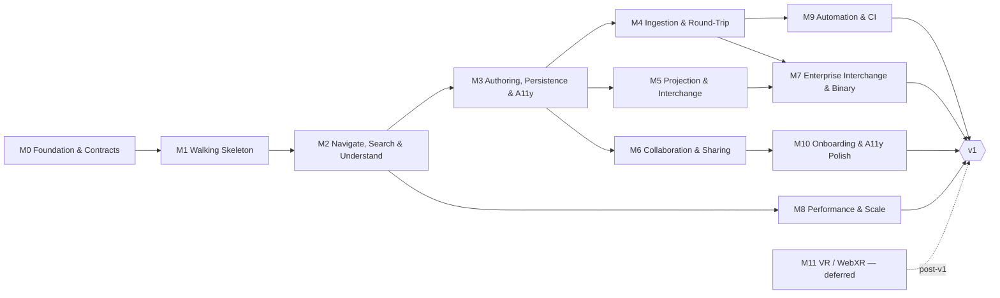

# TheRobotDrafts vnext — Implementation Roadmap

This roadmap sequences the ground-up rewrite of **The Robot Draft** as a web-native application:
**HoloGraph**, a Phoenix backend plus Next.js frontend with a 3D graph renderer, built around
patch-based collaborative graph documents. It replaces the Unity vertical slice (a desktop
standard-UML editor) with a browser product that keeps that slice's proven authoring semantics and
code round-trip while adding web delivery, real-time collaboration, million-element scale, and full
interchange breadth.

The plan is a **sequence of tasks with explicit dependencies and parallel lanes** — not a schedule.
There are no dates, weeks, or sprint numbers anywhere in this document set. Progress is tracked by
milestone entry/exit criteria and by which lanes have merged. Every unit of work carries an
appropriate t-shirt size (S/M/L) where estimation is useful.

## Purpose & scope

- **In scope (v1):** load and navigate large code-graph models in 3D; search, filter, trace, and
  metric-color; author on a patch protocol with full keyboard/accessibility support; ingest source
  and round-trip to code; project regions to 2D diagrams and interchange formats; collaborate on
  shared live views; scale to a million elements; headless automation and CI integration.
- **Out of scope (v1):** VR / WebXR (persona Aiko, US-071..080). These are captured as **M11**,
  explicitly deferred post-v1, with WebXR via Babylon as the eventual vehicle.
- **Donor, not dependency:** the Unity app is not migrated code-wise. It contributes concepts and
  specs — authoring-core semantics, sphere-packing layout, the `.trd-yaml` interchange format, and
  its diagram corpus as test fixtures. The `.NET` `tools/trd-converter` CLI (PlantUML ↔ trd-yaml)
  **is** reused, wrapped server-side.

### Target directory (one-time note)

The new app lives at `projects/therobotdrafts/vnext/app/{backend,frontend,nginx,helm}`, scaffolded
from `components/start-app` via `start-app-scaffold`. The `vnext.md` blueprint writes `vnexti/`;
treat that as a typo. The real target is the existing empty `vnext/` directory (`vnexti/` does not
exist on disk). This is the only place that discrepancy is called out — everything downstream uses
`vnext/app/`.

## Stack decisions (settled — stated, not re-litigated)

1. **New app, new directory.** `vnext/app/{backend,frontend,nginx,helm}`, scaffolded from
   `components/start-app` (Phoenix 1.8 API + Next.js 16 / React 19 / Tailwind v4 + nginx; Guardian
   JWT auth; Phoenix channels; Liquibase canonical schema; `@noizu/styleguide` YAML design system).
2. **No Hologram framework.** Plain Next.js frontend + Phoenix JSON API + Phoenix Channels. The
   product codename "HoloGraph" is unrelated to the Elixir Hologram framework. Working module name
   `HoloGraph` / slug `holograph`, confirmed at M0.
3. **WebGL-first renderer.** Babylon.js on its WebGL2 engine, behind the `IRenderer` TypeScript
   abstraction. The renderer is client-only (`next/dynamic`, `ssr: false`; repo precedent:
   robotwars `hero-diorama.tsx`). A Babylon WebGPU engine swap is a later optional enhancement (M8).
4. **Unity is the concept/spec donor**, not migrated code. `tools/trd-converter` is reused/wrapped
   server-side.
5. **Persistence:** Postgres via the shared `app-timescaledb`; Liquibase canonical schema under
   `backend/db/changelog/`. Seed data model: `projects`, `graph_documents`,
   `graph_document_versions`, `collab_events` (+ later `billing_events`).
6. **API:** REST `/api/v1/*` (Guardian JWT access + refresh per start-app) plus channels
   `graph:doc:*` for patches, presence, and cursors.
7. **Deployment:** one two-service `.infra-config.yaml` entry (backend + frontend, one Helm chart),
   tier 3 / `apps-ns`, one `liquibase_targets` entry, following the `start-app` block shape.
8. **No timelines.** Sequenced tasks, dependencies, and parallel lanes only.
9. **VR deferred** to M11, out of v1 scope.
10. **Accessibility P0s ship in M3** and are enforced as cross-cutting acceptance constraints from
    M1 onward (reduced-motion, non-color encoding, keyboard reachability).

## Lane model & ownership

Work is divided into **lanes**. A lane is one worker (or worker pair) with **exclusive ownership**
of its code areas for the duration of a milestone. Two lanes never edit the same directory in the
same milestone. Cross-lane needs are met either by contracts frozen at milestone entry (gate tasks)
or by explicitly-listed integration tasks at milestone end. This keeps merges trivial and lets each
lane's progress be tracked independently.

| Lane | Scope | Owned paths (under `projects/therobotdrafts/vnext/app/` unless noted) |
|------|-------|--------------------------------------------------------------------|
| INFRA | scaffold, CI, deploy, envs | repo-root `.infra-config.yaml`, `helm/`, `nginx/`, `docker-compose*`, `Makefile`, CI files |
| BE-CORE | domain model + persistence | `backend/lib/holograph/{docs,graph,draft}/`, `backend/db/changelog/` |
| BE-API | REST surface | `backend/lib/holograph_web/{controllers,plugs}/`, JSON views, OpenAPI doc |
| BE-RT | realtime | `backend/lib/holograph_web/channels/`, presence |
| BE-ING | ingestion + graph analysis | `backend/lib/holograph/ingest/`, `backend/lib/holograph/analysis/`, Oban workers |
| BE-INT | interchange + 2D projection | `backend/lib/holograph/interchange/`, `backend/lib/holograph/projection/`, wrapper around `projects/therobotdrafts/tools/trd-converter` |
| BE-AI | LLM / agents | `backend/lib/holograph/agents/` (genai lib) |
| FE-SHELL | app UX, non-3D UI, API client | `frontend/src/app/`, `frontend/src/components/` (non-3D), `frontend/src/lib/` (api, auth) |
| FE-GL | WebGL renderer | `frontend/src/renderer/` (Babylon behind IRenderer; camera, picking, labels, gizmos) |
| FE-GRAPH | graph / layout algorithms (pure TS, no DOM) | `frontend/src/graph/` (sphere packing, traversal, metrics, LOD tree, diff) |
| FE-COLLAB | realtime client + collab UI | `frontend/src/lib/realtime/`, `frontend/src/components/collab/` |
| QA | e2e + fixtures + perf harness | `frontend/cypress/`, `backend/test/integration/`, `vnext/fixtures/` |

## Milestones

| ID | Name | Enters after | Notes |
|----|------|--------------|-------|
| M0 | Foundation & Contracts | — | Narrow: INFRA + one architect. Freezes the contracts that unlock parallelism. |
| M1 | Walking Skeleton — Load & View | M0 | First end-to-end render of a fixture graph. |
| M2 | Navigate, Search & Understand | M1 | Comprehension power tools. |
| M3 | Authoring, Persistence & Core Accessibility | M2 | Patch protocol + the accessibility P0s. Fan-out point. |
| M4 | Source Ingestion & Code Round-Trip | M3 | Parallel track A. |
| M5 | Projection & Interchange v1 | M3 | Parallel track B. |
| M6 | Collaboration & Sharing | M3 | Parallel track C. |
| M7 | Enterprise Interchange & Binary Ingestion | M4 + M5 | Joins two tracks. |
| M8 | Performance & Scale | M2 | Independent track; joins before v1. |
| M9 | Automation & CI Integration | M4 | Light. |
| M10 | Onboarding, Education & A11y Polish | M6 | Final pre-v1. |
| M11 | VR / WebXR | (post-v1) | **Deferred.** Out of v1 scope. |

### Dependency DAG

**Headline parallelization property:** after **M3** the project supports **3–4 independent
milestone tracks running simultaneously** — track A (M4→M9, M4/M5→M7), track B (M5→M7), track C
(M6→M10), and the independent perf track (M8, which forks off M2). This is on top of the
per-milestone lane parallelism described below.

## Parallelization & merge rules

Every milestone document has a **Parallelization notes** section built on these rules:

- **Lanes run concurrently within a milestone; tasks within a lane are ordered.**
- **Gate tasks run first and block dependent lanes.** These are the contract/schema freezes
  (JSON schemas, TypeScript interfaces, channel protocol, adapter behaviours). Keep them small and
  front-loaded so lanes can start against a stable contract rather than against each other.
- **Integration tasks close the milestone** and name exactly which lanes they join. Merge order
  follows the integration tasks: gate outputs land first, lanes merge independently, integration
  tasks merge last.
- **A lane not listed in a milestone has no work there**, unless it explicitly carries over tasks
  from a prior milestone.

Because lanes own disjoint directories and cross-lane contracts are frozen up front, merges within a
milestone are conflict-free by construction, and two writers can pick up two lanes without
coordinating beyond the gate tasks.

## How to read the milestone docs

Each milestone file (`M00`…`M11`) follows one template: **Objective → Entry criteria → Gate tasks →
Lanes & tasks → Integration & exit criteria → Parallelization notes → Stories delivered.**

**Task IDs** are `M<n>-<LANE>-<seq>`, e.g. `M2-FE-GL-03` is the third task of the FE-GL lane in M2.
Each task carries:

- a one-line title and a 1–3 sentence description;
- `depends:` — task IDs it waits on (may cross lanes within the milestone, or reference
  `M<n-1> exit`);
- `size:` — S / M / L;
- `stories:` — the `US-xxx` refs it advances (may be empty for enabling/infra work).

**Story acceptance** = the story-title behavior is demonstrable in the app (or the headless API),
covered by at least one test at the appropriate layer (unit, channel/integration, or e2e).

## Document map

- [`README.md`](./README.md) — this overview.
- [`story-milestone-map.md`](./story-milestone-map.md) — all 100 stories mapped to milestones,
  with per-milestone counts and per-priority coverage.
- [`M00-foundation.md`](./M00-foundation.md) — Foundation & Contracts.
- [`M01-walking-skeleton.md`](./M01-walking-skeleton.md) — Walking Skeleton (Load & View).
- [`M02-navigate-search.md`](./M02-navigate-search.md) — Navigate, Search & Understand.
- [`M03-authoring-a11y.md`](./M03-authoring-a11y.md) — Authoring, Persistence & Core Accessibility.
- [`M04-ingestion-roundtrip.md`](./M04-ingestion-roundtrip.md) — Source Ingestion & Code Round-Trip.
- [`M05-projection-interchange.md`](./M05-projection-interchange.md) — Projection & Interchange v1.
- [`M06-collaboration.md`](./M06-collaboration.md) — Collaboration & Sharing.
- [`M07-enterprise-binary.md`](./M07-enterprise-binary.md) — Enterprise Interchange & Binary Ingestion.
- [`M08-performance.md`](./M08-performance.md) — Performance & Scale.
- [`M09-automation.md`](./M09-automation.md) — Automation & CI Integration.
- [`M10-onboarding-polish.md`](./M10-onboarding-polish.md) — Onboarding, Education & A11y Polish.
- [`M11-vr-deferred.md`](./M11-vr-deferred.md) — VR / WebXR (deferred post-v1).

## Source references

- **`projects/therobotdrafts/vnext.md`** — the HoloGraph vnext blueprint: backend domains, data
  model, API routes, channel events, `IRenderer` abstraction, roundtrip adapters, screen map.
- **`projects/therobotdrafts/project-management/user-stories/index.yaml`** — authoritative story
  titles, personas, epics, and priorities. The story-milestone map's titles come verbatim from here.
- **`projects/therobotdrafts/docs/arch/implementation-status.md`** — what the Unity vertical slice
  actually built (authoring core, sphere-packer seam `IPacker`, deterministic + LLM code round-trip
  via `CodeSkeleton`/`CodeStructParser`, styleguide token pipeline). Reused as concept/spec, not code.
- **`projects/therobotdrafts/ARCHITECTURE.md`**, **`docs/specs/authoring-ux.md`** — design context
  for the six-subsystem pipeline and authoring UX (skim references).
- **`components/start-app`** — the scaffold baseline (instantiated via `start-app-scaffold`).
- **`projects/therobotdrafts/tools/trd-converter`** — the `.NET` PlantUML ↔ trd-yaml CLI, wrapped
  by the BE-INT lane.

## Open decisions

Each of these is confirmable at the milestone noted; a recommended default is given so no lane is
blocked waiting for a ruling.

1. **Final renderer library.** *Recommended default: Babylon.js on WebGL2 behind `IRenderer`.*
   Babylon gives instancing, GPU picking, and a documented WebGPU engine swap path (M8) without a
   custom raw-WebGPU renderer. Confirm at **M0**; the `IRenderer` seam keeps the choice reversible.
2. **Module identity.** *Recommended default: module `HoloGraph`, slug `holograph`.* Matches the
   product codename and the ownership-table paths. Confirm at **M0** before the scaffold names
   `backend/lib/holograph*` and the channel topic `graph:doc:*`.
3. **First ingestion adapter language.** *Recommended default: TypeScript first*, via a
   `ts-checker`/tree-sitter service (the Unity slice's TS parser was "light," so this is the largest
   web-audience win), plus one JVM- or Elixir-source adapter to prove the unified-merge path.
   Confirm/justify at **M4**; the ingestion adapter behaviour is frozen at M0 so the choice of
   first language does not change the contract.
