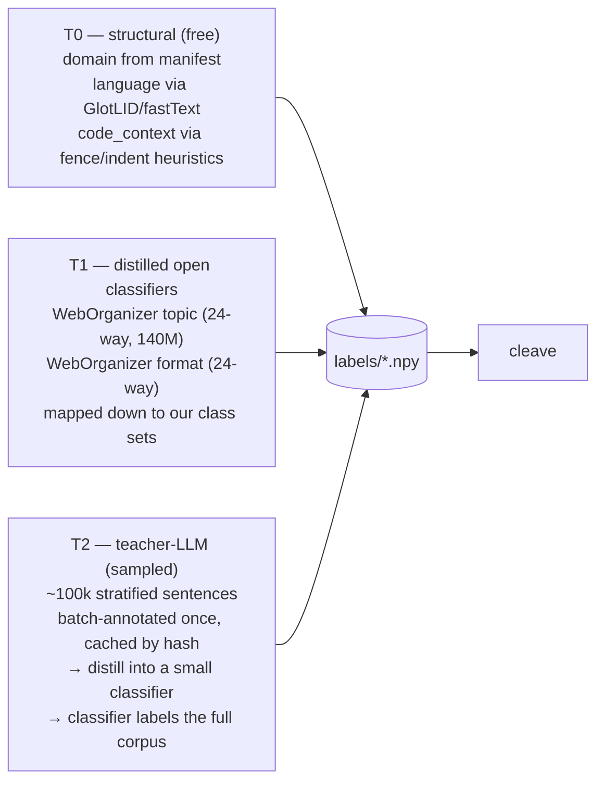

# extraction-v1 — Corpus scale-up + robust attribute extraction

**Status:** design / pre-implementation (this document is the plan of record for
overview.md §4.6 items 1–3).
**Scope:** the R1/R2 side of the conversion pipeline only — recording corpus,
labelers, probes, admission. No runtime (E-tier) changes; the GGUF contract
(`robot.probe.*` tensors, `labels/<attr>.npy` recording files) is unchanged.
**Last updated:** 2026-07-08.

---

## 1. Why (recap) and what v0 actually measured

Cleave can only admit an attribute where the corpus makes it *vary*
(overview §4.3). v0's substrate was ~300 MB of FineWeb + FineWeb-2 slices plus
~425 KB of synthetic suites — enough to validate the apparatus (it correctly
dropped `language` on the monolingual sandbox run and produced the first
depth-map findings), not enough to map the model.

Three v0 limitations this plan removes, plus one latent bug it fixes:

1. **Corpus coverage.** No code, no mathematics, no scientific prose, no
   literature. Attributes that only vary across domains (code-vs-prose,
   proof register, symbolic density) are untestable, and every admitted
   bottleneck is implicitly "on web text" with no cross-domain check.
2. **Label quality.** Seven heuristic lexicon labelers
   (`robotgguf/labelers.py`). Fine for bootstrap decodability; too noisy to
   trust selectivity margins near the admission bar, and structurally unable
   to label attributes that need judgment (factual-vs-speculative).
3. **Probe reach.** Linear probes on six fixed 128-wide slices at
   `resid_post`, offset 0. A concept that is nonlinearly coded, lives at
   offset 512, or concentrates in `attn_out` is invisible.
4. **The loader bug (found writing this plan).** `record._load_corpus`
   reads `cfg.corpus` files *sequentially* and stops at `max_tokens`. With
   `corpus: [mixed-text.txt, behavioral-suites.txt]` and the default 200k-token
   budget, recordings come from roughly the first megabyte of
   `mixed-text.txt` (the loader's own docstring does the math: a 2M-token
   budget reads ~8 MB of a 300 MB corpus) — i.e. essentially the head of the
   English FineWeb stream, since `fetch_corpus.py` writes its sources in
   order, English first. The behavioral suites
   and the FineWeb-2 language slices (which sit later in the file) likely
   never entered the v0 recordings at all. Stratified sampling at load time
   (§3.3) is therefore not just a v1 feature — it is a correctness fix, and it
   may explain some of v0's admission table. Re-run v0 cleave after C1 to
   re-baseline before trusting any v0-vs-v1 comparison.

The admission discipline itself — decodability, selectivity against a control,
stability — does not change. The instrument gets sharper and the map larger.

---

## 2. Corpus v1

### 2.1 Composition

Seven domain strata, all streamable from HF, all permissively licensed
(ODC-BY / Apache-2.0; attribution noted in the manifest). Sizes are what we
*keep on disk*, not what we record — the recording budget is a separate,
smaller number (§5).

| Stratum | Source | Share | ~Disk | Why |
|---|---|---|---|---|
| web-en | `HuggingFaceFW/fineweb` (sample-10BT) | 25% | 5 GB | naturalistic baseline; register/sentiment/entity spread |
| multilingual | `HuggingFaceFW/fineweb-2` — widen to ~10 langs across scripts (fra, deu, spa, rus, ukr, jpn, zho, kor, ara, hin) | 20% | 4 GB | `language` upgraded from script-class to language-id (§4.1); cross-script stability |
| code | `HuggingFaceTB/stack-edu` (ungated, 125B-token educational filter of Stack-v2/StarCoder2Data; per-language configs) | 20% | 4 GB | `code_context`, symbolic density; the largest distribution shift we can buy |
| math | `HuggingFaceTB/finemath` (finemath-4plus) | 10% | 2 GB | proof/derivation register, symbolic density at high LaTeX load |
| science | `allenai/peS2o` | 10% | 2 GB | formal-academic register, citation structure, factual density |
| literature | `deepmind/pg19` | 10% | 2 GB | narrative register, dialogue, affect — the sentiment/valence attributes' natural home |
| long-form / PDF | `HuggingFaceFW/finepdfs` (eng-Latn) | 5% | 1 GB | legal/technical long-form web text underrepresents |
| behavioral suites v2 | generated (`tools/make_corpus.py`, expanded) | ~0.1% | 20 MB | sharp corners: imperatives, threat-salience, register extremes, and dense blocks for the new attributes |

Total ~20 GB on disk. Note `bigcode/the-stack-v2` itself is **gated** (SWH
terms + HF token); Stack-Edu is the same material post-filter, ungated, and
better suited to a probing corpus anyway (natural-language-adjacent code with
comments, not minified tarballs).

### 2.2 The manifest replaces the flat file list

`corpus:` in the per-donor YAML currently names bare text files. v1 replaces it
with a manifest (`corpus/manifest.yaml`) that `fetch_corpus.py` writes and
`record` consumes:

```yaml
strata:
  - { domain: web-en,      file: corpus/web-en.txt,      share: 0.25 }
  - { domain: code,        file: corpus/code.txt,        share: 0.20, meta: { langs: [python, cpp, js, rust] } }
  - { domain: math,        file: corpus/math.txt,        share: 0.10 }
  # ...
provenance:
  - { domain: code, dataset: HuggingFaceTB/stack-edu, license: odc-by, fetched: 2026-07-.. }
```

`cfg.corpus` keeps working (a bare list is treated as one `mixed` stratum) so
existing configs and the e2e test don't break.

### 2.3 Stratified loading (the C1 correctness fix)

`record._load_corpus` v1 interleaves strata by share instead of reading files
head-to-tail: round-robin over per-stratum readers, each contributing
window-sized chunks in proportion to its share, until `max_tokens`. Two
consequences:

- every stratum is present in every recording at its configured share,
  regardless of token budget;
- each token window carries a **domain id**, persisted as
  `labels/domain.npy` — a free, perfectly-labeled attribute and the
  stratification key for cross-domain admission (§4.3).

Shard boundaries in the recording manifest become **domain-aware**: shards are
(stratum × position) cells rather than blind position ranges, so cleave's
stability score and the new cross-domain criterion read straight off the
existing shard machinery.

---

## 3. Labeler architecture v1

### 3.1 Contract unchanged

The recording store stays the interface: `labels/<attr>.npy`, int64, aligned
to `tokens.npy`; `robotgguf relabel` regenerates labels from stored tokens
without re-running the model. Everything below is *sources* for that contract
— exactly the teacher-LLM upgrade path labelers.py's docstring anticipated.

### 3.2 Three tiers, by cost



- **T0 — structural.** `domain` comes from the manifest (exact).
  `language` upgrades from the v0 4-way script classifier to real language id
  via a fastText/GlotLID model (~1 MB, thousands of langs; we bucket to the
  ~10 corpus languages + `other`). `code_context`
  (prose / code / mixed) from fences, indentation density, and symbol ratio —
  cheap and near-exact on a corpus whose code stratum is known.
- **T1 — existing distilled classifiers.** WebOrganizer ships 140M-param
  topic (24-way) and format (24-way) classifiers distilled from
  Llama-3.1-405B annotations, trained exactly for this job (organizing
  pretraining corpora). We run them once over the corpus and *project* their
  24 classes onto our small class sets (topic 24→{tech, science,
  news/politics, arts/narrative, other}; format informs `register` and
  `factual_vs_speculative`). This buys teacher-grade labels for the broadest
  attributes without paying for a teacher.
- **T2 — teacher-LLM, sampled + distilled (the FineWeb-Edu /
  WebOrganizer recipe).** For judgment attributes (sentiment,
  safety_salience, factual_vs_speculative, math_register): stratified-sample
  ~100k sentences (~30M teacher input tokens), annotate once with a teacher,
  cache by sentence hash ("label once, reuse forever"), then distill a small
  classifier (logreg/MLP over an off-the-shelf sentence embedding) that labels
  the *full* corpus. The teacher never runs over the whole corpus.
  Teacher options, in preference order: (a) a self-hosted Qwen3.5-9B on the
  existing k8s AI tier — no external dependency, aligns with the project's
  self-host thesis; (b) a batch API pass if local throughput disappoints.

New module: `robotgguf/labelers_teacher.py` (annotation client + cache +
distillation), plus `robotgguf/labelers_t1.py` (classifier runners). v0
heuristics stay as the fallback tier and as the agreement baseline.

### 3.3 Label QA (new, cheap, mandatory)

Selectivity margins near the bar are meaningless if label noise swamps them.
Per attribute: (a) double-annotate a 2k-sentence holdout (teacher twice at
different temperatures, or teacher vs T1) and report agreement (Cohen's κ);
(b) report heuristic-vs-teacher confusion so we know what v0 was actually
measuring; (c) `record` logs per-attribute class mass per *stratum* — an
attribute with <5% minority mass inside every stratum is flagged un-testable
before any probe trains. Results land in the lockfile under `labels_qa`.

---

## 4. Attribute set v1 and probe upgrades

### 4.1 Attributes

Keep the seven v0 attributes (with `language` upgraded per §3.2). Add five,
all coarse (2–5 classes) by design — probes measure *presence*, not nuance:

| New attribute | Classes | Label source |
|---|---|---|
| `domain` | 7 (the strata) | T0 manifest (exact) |
| `code_context` | 3: prose / code / mixed | T0 structural |
| `math_register` | 3: none / applied-numeric / formal-symbolic | T0 (symbol density) + T2 |
| `factual_vs_speculative` | 3: factual / speculative / normative | T1 format + T2 |
| `narrative_voice` | 3: expository / first-person narrative / dialogue | T1 format + T2 |

Twelve attributes total. `topic`'s class set widens by one
(arts/narrative), now that literature exists in the corpus.

### 4.2 Probe upgrades

- **Nonlinear fallback.** Where the linear probe misses `min_decodability`,
  retrain once as a 1-hidden-layer MLP (width 64, same L2, same balanced-
  accuracy scoring, same shuffled-feature control). Admission records
  `probe_kind: linear|mlp`. *Only linear probes export as `robot.probe.*`
  tensors in v1* — the runtime's `probe_eval` is a matvec — so an MLP-only
  admission is recorded as a **finding** ("nonlinearly present at site X"),
  which is exactly the kind of map detail we want, and motivates the runtime's
  MLP-probe extension only if such findings are common.
- **Slice search.** Candidate sites expand from 6 fixed slices to a swept
  grid: depths every 2 blocks (11 sites on the 24-block donor, skipping 0 and
  23), points {`resid_post`, `attn_out`, `ffn_out`}, widths {64, 128, 256},
  offsets {0, 256, 512, 768}. The full grid is too big to *record*
  (§5 does the budget math), so the search is two-pass:
  **survey pass** records wide slices (width 256, offset-0 only) at all
  11 depths × `resid_post` on a ~1M-token budget; cleave on that identifies
  winning (depth, attribute) cells; a **focused pass** re-records only winning
  depths at all points/offsets/widths on the full budget. Sub-width probes
  (64/128 inside a recorded 256) are free — slice the stored activations,
  no re-recording.
- **Probe training at scale.** `train_probe` is full-batch GD; at v1 sample
  counts (millions of positions) it goes mini-batch (fixed 4096 batch, 3
  epochs, cosine LR) with a per-pair subsample cap (default 1M positions,
  stratified by domain) so the cleave matrix stays tractable. Scores are
  unchanged (held-out balanced accuracy, shuffled control, shard std).

### 4.3 Cross-domain admission (the new bar)

Admission criteria gain a fourth score alongside decodability / selectivity /
stability:

```
domain_stability = min over strata s of balanced_accuracy(probe, held-out positions of s)
```

with a per-attribute domain mask (attributes structurally absent from a
stratum — e.g. `math_register` in pg19 — are excluded from their own min).
A bottleneck admitted on web text that collapses on code is either rejected
or admitted with an explicit `domains:` scope in the lockfile — the runtime
doesn't change, but the map stops overclaiming. Thresholds start at
`min_domain_stability: 0.9 × min_decodability` and get tuned against the C4
gate.

---

## 5. Budget math (why the token budget, not the corpus, is the constraint)

Recording cost per token = Σ(site widths) × 2 bytes (fp16).

| Pass | Sites | Bytes/token | Tokens | Recordings on disk |
|---|---|---|---|---|
| v0 (as-run) | 6 × 128 | 1.5 KB | 200k | ~300 MB |
| v1 survey | 11 × 256 | 5.5 KB | 1M | ~5.5 GB |
| v1 focused | ~4 depths × 3 points × 256 | ~6 KB | 5M | ~30 GB |

Forward-pass time on the M4 (MPS) is the other budget: record.py's own
throughput print is the instrument — measure on a 50k-token dry run before
committing to the 5M-token pass; if MPS lands under ~150 tok/s the focused
pass moves to a CUDA box (it is embarrassingly resumable — windows are
independent).

Teacher cost: ~100k sentences ≈ 30M input tokens, once, cached. Distilled
classifier inference over the full corpus is embedding-bound and runs
overnight on the M4.

---

## 6. Work packages

Each is independently landable and gated, in dependency order:

- **C1 — manifest + stratified loader** (fixes the §1.4 bug).
  `fetch_corpus.py` v1 writes per-stratum files + manifest; `_load_corpus`
  interleaves by share; `labels/domain.npy` + domain-aware shards land in the
  recording store. *Gate:* on a 200k-token budget, per-stratum token shares
  within ±2% of manifest; every v0 attribute shows ≥2 classes with ≥5% mass;
  re-run v0 cleave on the stratified 300 MB corpus and re-baseline the
  admission table.
- **C2 — labeler tiers.** T0 (GlotLID language, code_context), T1
  (WebOrganizer runners + class projections), T2 (teacher client, cache,
  distillation), QA harness. *Gate:* per-attribute κ ≥ 0.6 on the
  double-annotated holdout (attributes below the bar are demoted to
  findings, not forced); `relabel` regenerates all twelve attributes from
  stored tokens.
- **C3 — survey recording.** 1M tokens, 11 × 256-wide `resid_post` sites,
  corpus v1. *Gate:* recordings manifest carries domain shards; size within
  budget; per-stratum shares hold.
- **C4 — cleave v1.** Mini-batch probes, MLP fallback, sub-width slice
  search, cross-domain admission, `probe_kind`/`domains:` in the lockfile.
  *Gate:* `tests/e2e_test.py` extended to cover MLP-fallback and
  domain-scoped admission paths; on the survey recordings, produces the
  depth × attribute map with per-domain scores.
- **C5 — focused recording + the map.** Re-record winning depths at full
  point/offset grid, 5M tokens; final cleave; write
  `work/extraction-report.md` — *where each of twelve concepts becomes
  linearly (or only nonlinearly) available in Qwen3.5-0.8B, per domain* —
  the first full instance of the map the whole apparatus exists to draw.

C1+C2 are pure-Python, testable without the GPU; C3–C5 need the checkpoint
host. R3-graft training (overview §5 "Remaining") is downstream of C5's
bottleneck table but otherwise independent — it can proceed against the
re-baselined v0 table in parallel.

---

## 7. Risks / open questions

- **Label projection error (T1).** WebOrganizer's 24-way classes don't map
  1:1 onto ours; a bad projection poisons `topic`/`register` labels
  silently. Mitigation: the κ holdout in C2 scores the *projected* labels
  against the teacher, not WebOrganizer's raw output.
- **Domain confound.** With `domain` almost perfectly decodable everywhere
  (it will be), other attributes can ride it — `math_register` ≈ "is this
  finemath". The shuffled-feature control does not catch this. Add a
  *within-domain* selectivity check for attributes correlated with a stratum:
  probe trained and evaluated inside a single stratum must retain skill.
- **Recording drift across passes.** Survey and focused passes must use the
  identical tokenizer, window size, and stratified seed or the "free
  sub-width slices" claim breaks. The recording manifest already carries the
  corpus hash; extend it with the manifest hash + loader seed.
- **MPS throughput.** If the M4 can't sustain the focused pass, C5 slips to
  a rented GPU day. Cheap, but breaks the everything-local loop; decide at
  the C3 dry run.
- **Teacher availability.** T2 assumes a local Qwen3.5-9B (or API budget).
  If neither, v1 ships with T0+T1 only — ten of twelve attributes survive,
  `factual_vs_speculative` and `math_register` degrade to structural
  heuristics and are flagged as such in the lockfile.

---

*Relation to other docs: this implements overview.md §4.6 (all three items)
and supersedes the corpus paragraph of §4.3 once landed. Runtime docs
unaffected. The v0 heuristic labelers, corpus tools, and admission thresholds
remain the fallback path throughout — every C-package degrades to v0 behavior
if its gate fails.*
