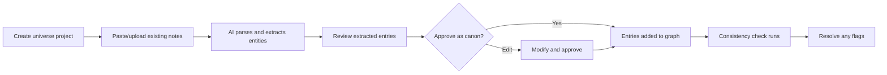
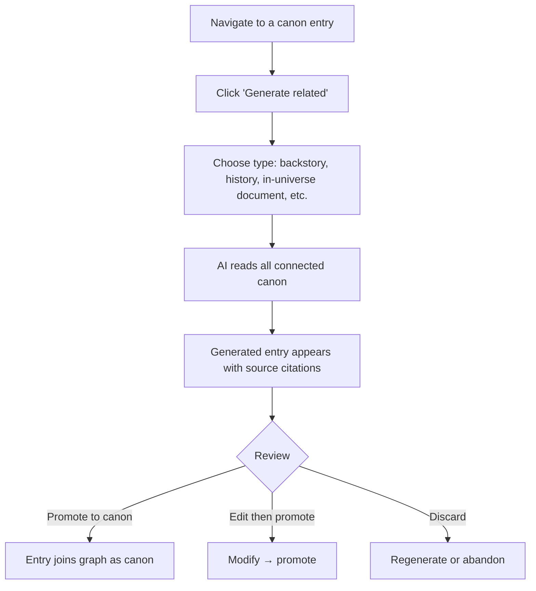
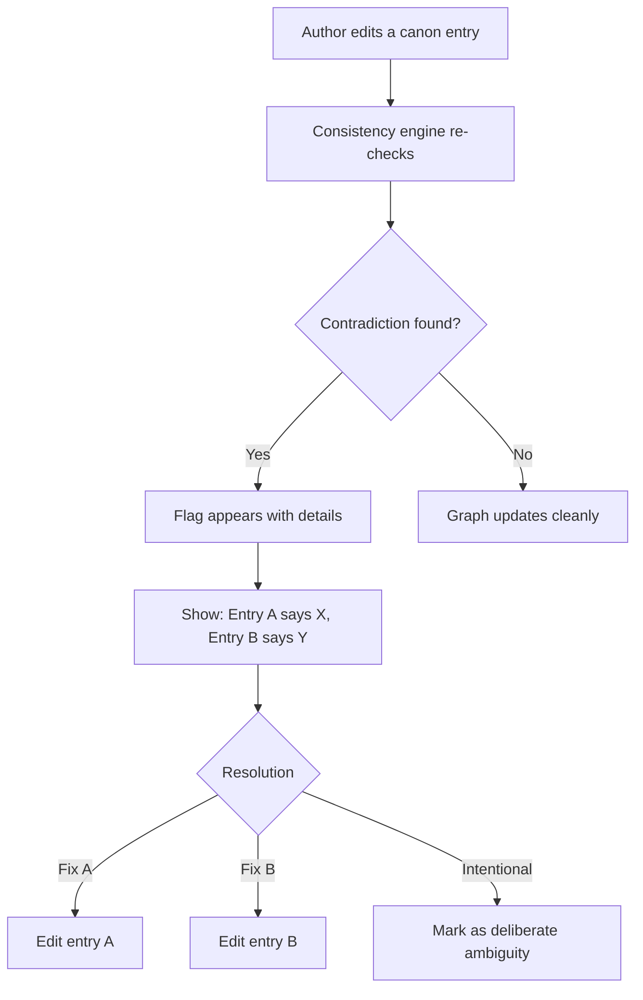
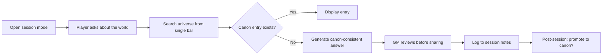
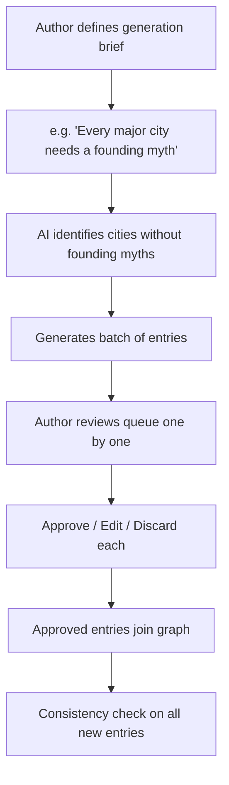

# NOIZUAI-4: TheRobotKnows — Knowledge Base

**Domain:** [therobotknows.com](https://therobotknows.com)

## Elevator Pitch

**A living wiki that writes itself.** Define the seeds of a body of knowledge — the entities, the rules, the history that everything else has to agree with — and the Knowledge Base generates consistent, cross-referenced supplementary material from it, then keeps checking that the whole set still agrees with itself.

The container is called a **universe**. Depending on who you are, that's a fictional world, a product's documentation set, or a single book:

| If you are… | Your canon is… | The system generates… | And catches… |
|---|---|---|---|
| **A novelist or game master** | The world bible — characters, places, magic system, timeline | Lore entries, backstories, in-universe documents, founding myths | Continuity errors — a trade route that contradicts chapter 3 |
| **A documentation lead** | The source of truth — specs, API references, RFCs, the source code | Task guides, tutorials, worked examples, migration notes, "see also" links | Version and terminology drift — a parameter renamed in v3 that 40 pages still call by its v2 name |
| **A technical book author** | The chapter outline, the reference stack, the running example | Sidebars, exercises, glossary entries, appendix cross-references | Contradictions — a chapter 9 code sample that can't run on chapter 2's setup |

Same mechanic, three audiences: a curated core of truth, a much larger body of derived material generated from it, and a machine that never stops re-reading both.

Think: World Anvil meets Notion meets an AI collaborator who has actually *read* everything you've written — and tells you when page 200 stopped agreeing with page 12.

---

## Problem

### 1. Any Large Body of Writing Drifts Out of Sync

**Fiction.** An author writes 300 pages of a fantasy novel. By chapter 12, they've mentioned a trade route that contradicts the geography from chapter 3, given two characters the same family name accidentally, and forgotten whether the magic system costs "mana" or "aether." Game masters running year-long campaigns face the same entropy — lore accretes, contradictions multiply, and the binder of notes becomes untouchable.

**Documentation.** A team ships v3 of an API. The `user_id` parameter became `principal_id`, one endpoint moved from `POST` to `PATCH`, and the auth flow gained a step. The reference page is updated the same day. But 40 pages of guides, tutorials, blog-derived how-tos, and quickstarts still use the old names — and nobody knows which 40, because nothing links the reference to the prose that depends on it. Support tickets become the drift detector.

**Technical books.** A 400-page book has a running example threaded through 14 chapters. Chapter 2 pins a dependency version. Chapter 9's code sample uses an API that only exists in a later version. Both were correct when written, six months apart. The reader hits the wall, not the author.

Consistency is the invisible labor. It doesn't make the work *better*, but its absence makes it *worse* — and it scales nonlinearly: twice the content means four times the consistency burden. Fiction calls the failure a continuity error; documentation calls it staleness. It's the same failure.

### 2. Existing Tools Are Manual Entry

The world-building toolchain:

| Tool | What It Does | What It Doesn't |
|---|---|---|
| **World Anvil** | Wiki-style articles, maps, timelines | You write every word yourself. No generation, no consistency checking. |
| **Campfire** | Character sheets, magic system builder | Beautiful templates, but empty until you fill them. No AI. |
| **Notion / Obsidian** | Flexible notes with linking | No domain structure. No consistency. No generation. |
| **Scrivener** | Long-form writing with research sidebar | Research is a dumping ground, not a knowledge graph. |
| **ChatGPT / Claude** | Can generate lore on demand | No persistence. No cross-referencing. Contradicts itself across sessions. |

The documentation toolchain, with the same shape of gap:

| Tool | What It Does | What It Doesn't |
|---|---|---|
| **Confluence / Notion** | Pages, spaces, backlinks, comments | A page is a blob. No typed entities, no relationship graph, no notion of which pages depend on which spec. |
| **Docusaurus / GitBook / ReadTheDocs** | Docs-as-code, versioned sites, good publishing | Publishing pipelines. They render what you wrote; they don't know whether it's still true. |
| **MadCap Flare** | Single-sourcing, conditional text, topic reuse | Reuse is manual and structural — snippets and variables you wired by hand. No semantic contradiction detection. |
| **Vale / textlint** | Style and terminology linting against a rule list | Lints prose against *rules*, not against your product's actual current behavior. Won't notice v3 renamed a field. |
| **Swimm / doc-linters** | Couples snippets to code, flags drift on change | Scoped to code snippets. Doesn't cover the conceptual prose where most drift lives. |

The gap in both columns is the same: **no tool connects a structured source of truth with AI generation *and* consistency enforcement.** You either write everything yourself (World Anvil, Confluence) or get AI-generated content that forgets itself between conversations (ChatGPT).

### 3. The Supporting Material Is the Larger Half

The reader never sees the 40-page document about the Dwarven economy. But the author who *wrote* it creates a world that feels lived-in, because every decision cascades through a consistent substrate.

The same asymmetry runs the other way in documentation: the API reference is the small, correct, generated-from-source part. The guides, tutorials, concept pages, migration notes, and troubleshooting entries are the bulk — and they're the part that rots, because they restate the reference in prose and nothing binds them to it.

The problem isn't generating one entry. It's generating *hundreds* that all agree with each other, that reference each other naturally, and that keep agreeing as the source material changes underneath them.

---

## Solution: A Consistency-Aware Knowledge Graph

### Core Concept

Every universe — fictional world, documentation set, or book — is organized around the same three layers:

| Layer | Purpose | In a fictional world | In a documentation set or book |
|---|---|---|---|
| **Canon** | Source-of-truth entries authored or approved by the owner. Nothing becomes canon without a human saying so. | Character profiles, core history, magic system rules, geography | API references, specs, RFCs, architecture decisions, the shipped source code, chapter outlines |
| **Generated** | AI-produced supplementary material derived from Canon, always tagged as generated and always carrying its sources | In-universe newspaper articles, minor character backstories, cultural customs, events between known dates | Task guides, tutorials, worked examples, migration notes, troubleshooting entries, glossary definitions, sidebars |
| **Inferred** | Relationships and consistency checks computed across every entry, canon and generated alike | "Character A and Character B were both in the same city during the War of Stones — did they interact?" | "This tutorial's setup step depends on a config key the v3 spec removed" · "These two pages define 'workspace' differently" · automatic "see also" edges |

The vocabulary maps cleanly across domains — the mechanic doesn't change:

| Fiction | Documentation / technical books |
|---|---|
| World bible / universe | Knowledge base / documentation set / book |
| Canon lore | Source of truth: specs, references, RFCs, code |
| Generated supplementary lore | Derived guides, tutorials, examples, migration notes |
| Inferred connections | Cross-references, dependency links, "see also" |
| Continuity error | Terminology drift, version drift, stale example, contradictory instructions |

### How It Works

```
┌─────────────────────────────────────────────────────────┐
│                                                         │
│   Creator writes Canon ──→ AI analyzes + indexes        │
│         ↑                           │                   │
│         │                           ↓                   │
│   Creator reviews,       AI generates supporting        │
│   promotes or edits  ←── materials that reference Canon  │
│         │                           │                   │
│         ↓                           ↓                   │
│   Canon grows ──────────→ Consistency engine checks      │
│                           all entries against each other  │
│                                     │                   │
│                                     ↓                   │
│                           Flags contradictions,          │
│                           suggests connections,          │
│                           fills gaps                     │
│                                                         │
└─────────────────────────────────────────────────────────┘
```

### What Makes It Different

**It reads before it writes.** Unlike a chatbot that generates in isolation, the Knowledge Base ingests your entire canon before generating anything.

- *Fiction:* "Write the backstory for the blacksmith in Thornwall" produces output that knows Thornwall is on the coast, that the last war disrupted iron supply chains, and that the blacksmith's apprentice was mentioned in chapter 7.
- *Documentation:* "Write a quickstart for the billing API" produces output that uses the parameter names in the current spec entry, not the ones from the version you shipped last year, and that cites which spec entries it drew from.

**Entries are linked, not listed.** Every generated entry carries hyperlinks to the canon it references. Click from a character's backstory to the war they fought in to the treaty that ended it — or from a tutorial to the endpoint it calls to the auth flow that endpoint requires. The knowledge graph is the product, not a byproduct.

**Consistency is enforced, not hoped for.** The system maintains a constraint graph: timelines, entities, relationships, factual claims, term definitions. When a new entry contradicts an existing one — or when editing a canon entry invalidates something derived from it — it flags the conflict and suggests resolutions. You decide what's true; the system keeps track of what depends on it.

**Canon vs. generated is always visible.** Every piece of content is tagged: did a human write this, or did the AI generate it? Generated content can be promoted to canon with one click. Nothing sneaks into your source of truth without your approval — which matters as much for a published API guide as for a world bible.

---

## Target Users

Two primary audiences, one product. Fiction writers and documentation teams have the same problem in different vocabulary; both are first-class.

### Primary: Fantasy/Sci-Fi Novelists

- Writing novels or series set in invented worlds
- Already maintain a "world bible" (Google Doc, Notion, physical binder)
- Spend 30-50% of creative time on consistency and reference materials
- **Job to be done:** "I need to write 40,000 words of lore so that 200,000 words of novel feel real — and I need all 40,000 to agree with each other"

### Primary: Documentation Leads & Technical Writers

- Own a documentation set that outgrew what one person can hold in their head — 200+ pages across reference, guides, tutorials, and concepts
- Source of truth already exists and is versioned: OpenAPI specs, RFCs, ADRs, the code itself. The prose *around* it is what drifts.
- Docs-as-code is solved for publishing (Docusaurus, GitBook) and unsolved for correctness
- **Job to be done:** "We renamed three fields and changed an auth step in v3. I need to know every page that is now wrong, and I need drafts of the corrections that use the right names."

### Secondary: Technical Book Authors

- Writing a 300–500 page technical book, usually against a moving target (a framework that ships every six weeks)
- Maintain a running example, a dependency baseline, and a glossary that all fourteen chapters have to honor
- Publisher tech reviewers catch some contradictions, late and expensively
- **Job to be done:** "Chapter 9 was written five months after chapter 2. Tell me where they disagree before my tech reviewer does — and generate the appendix cross-references I keep deferring."

### Secondary: Tabletop RPG Game Masters

- Running long campaigns in custom or adapted settings (D&D, Pathfinder, homebrew)
- Need to improvise consistently — players ask unexpected questions about the world
- Currently use a combination of wiki tools, notes apps, and memory
- **Job to be done:** "A player just asked about the political structure of a kingdom I mentioned offhand three sessions ago — I need a coherent answer in 30 seconds"

### Tertiary: Game Developers & Narrative Designers

- Building lore databases for video games (indie to AA scale)
- Need structured content that can be exported to game engines (dialogue, codex entries, item descriptions)
- Multiple writers working on the same universe
- **Job to be done:** "We have 6 writers and 400 lore entries — how do we make sure they all tell the same story?"

### Emerging: Content Creators with Extended Universes

- Podcast fiction (Welcome to Night Vale, The Magnus Archives)
- Webcomic authors maintaining worldbuilding across 500+ pages
- YouTube worldbuilders (Artifexian, Hello Future Me)
- **Job to be done:** "My audience notices contradictions before I do"

---

## Competitive Landscape

### Creative / world-building

| Tool | Strength | Gap Knowledge Base Fills |
|---|---|---|
| **World Anvil** | Rich templates, maps, timelines, large community | 100% manual entry. No AI generation, no consistency checking. |
| **Campfire** | Beautiful UI, structured character/magic system builders | Manual only. No cross-referencing, no knowledge graph. |
| **LegendKeeper** | Clean wiki + map integration, indie-friendly | Manual wiki. No generation, no consistency engine. |
| **Scrivener** | Industry-standard long-form writing tool | Research features are a filing cabinet, not a knowledge system. |
| **NovelAI / Sudowrite** | AI writing assistance | Generates prose, not structured knowledge. No persistence across sessions. |

### Documentation / technical publishing

| Tool | Strength | Gap Knowledge Base Fills | Where it's genuinely better than us |
|---|---|---|---|
| **Confluence** | Ubiquitous, permissions, comments, org-wide search | Pages are untyped blobs. No entity graph, no dependency between a guide and the spec it describes, no drift detection. | Enterprise governance, SSO/permissions maturity, everyone already has it |
| **Notion** | Flexible databases, relations, pleasant editing | Relations are hand-maintained. No generation grounded in a canon layer, no contradiction detection. | General-purpose flexibility; it does a hundred other jobs |
| **GitBook** | Clean publishing, git sync, good reading experience | Publishing surface only. Nothing checks whether the content is still true. | Polished public docs sites, out of the box |
| **Docusaurus / ReadTheDocs** | Docs-as-code, versioned builds, free, open source | Static site generators. Versioning means "keep the old copy," not "tell me what the new version broke." | Ownership, cost, CI integration, no vendor lock-in |
| **MadCap Flare** | Single-sourcing, conditional text, topic reuse, print+web from one source | Reuse is structural and hand-wired — snippets, variables, conditions. No semantic contradiction detection. | Deep single-source authoring, regulated-industry output formats |
| **Vale / textlint** | Fast, CI-friendly terminology and style enforcement | Lints prose against a rule list, not against the product's current behavior. Won't notice that v3 renamed a field. | Cheap, deterministic, no inference cost, trivially adopted |
| **Swimm** | Couples doc snippets to code, flags drift on change | Scoped to code-adjacent snippets; most drift lives in conceptual prose. | Tight, reliable coupling where it applies — no LLM guessing |

### Both columns

| Tool | Strength | Gap Knowledge Base Fills |
|---|---|---|
| **ChatGPT / Claude** | Powerful generation on demand | Stateless. Contradicts itself. No graph, no versioning, no canon/generated distinction. |

**Positioning:** Knowledge Base is not a writing tool (Scrivener), a wiki builder (World Anvil, Confluence), a publishing pipeline (Docusaurus, GitBook), or an AI prose generator (NovelAI). It's a **consistency-aware knowledge graph that generates structured supporting material from your source of truth and keeps flagging where the two have diverged.**

**Honest limits.** It does not replace your publishing pipeline — export to Markdown and let Docusaurus or Flare render it. It does not replace a style linter; Vale is cheaper and more deterministic for terminology rules, and the two are complementary. Consistency detection above the mechanical tier (dates, duplicate names, orphaned references) is LLM-based and probabilistic: it surfaces candidates for a human to adjudicate, and it will produce false positives. And every check and generation costs inference, which a static site generator does not.

---

## Key Features (MVP Scope)

### 1. Universe Projects

- Create a project per universe — one novel, one campaign, one game, one product's documentation set, one book
- Project-level settings: genre or subject domain, tone, naming conventions, key constraints
- Import existing materials: paste text, upload documents, link to Google Docs; for documentation, ingest existing Markdown trees, OpenAPI specs, and ADRs
- Export: Markdown, JSON, PDF, structured data for game engines and for static-site generators

### 2. Canon Editor

- Write and manage source-of-truth entries using structured templates
- Entry types: Character, Location, Event, Faction, Object, Concept, Rule. The labels are fiction-native, and they carry over to non-fiction rather than being replaced:

  | Entry type | In fiction | In a documentation set or book |
  |---|---|---|
  | **Concept** | Magic system, cultural custom | A defined term, an architectural concept, a protocol |
  | **Rule** | Law of magic, world constraint | A spec requirement, a constraint, a policy, a style rule |
  | **Object** | Artifact, item | An endpoint, a CLI command, a config key, a type |
  | **Faction** | Guild, kingdom | A service, module, team, or subsystem that owns behavior |
  | **Event** | Battle, treaty | A release, a breaking change, a deprecation, a migration |
  | **Location** | City, region | A surface or environment: a dashboard page, a deployment target |
  | **Character** | Person | An actor or role: end user, operator, service account |

- Rich text with inline links to other entries
- Tag system: era or version, region or product area, importance level, story arc or chapter

### 3. Knowledge Graph

- Visual, navigable graph of all entries and their relationships
- Zoom from universe-level overview to neighborhood-level detail
- Filter by entry type, era, region, or custom tags
- Click any edge to see *why* two entries are related

### 4. Generation Engine

- Request generated entries: "Write a 500-word history of the Thornwall blacksmithing guild"
- AI reads all relevant canon before generating
- Generated entries arrive with source citations: "[Based on: Thornwall geography, Iron trade routes, Character: Kael]"
- Bulk generation: "Generate minor characters for every location that doesn't have any"

### 5. Consistency Checker

- Runs continuously as entries are added or modified
- Flags: timeline contradictions, geographic impossibilities, duplicate names, orphaned references — and, in a documentation set, terminology drift (two entries defining the same term differently), version drift (prose using names a newer spec entry removed), and derived entries whose canon source has changed since they were generated
- Severity levels: error (hard contradiction), warning (possible conflict), suggestion (gap that could be filled)
- Resolution workflow: pick a side, merge entries, or mark as intentional ambiguity

### 6. Session Companion (for GMs)

- Quick-reference mode: search your entire universe from a single search bar
- "Improvise" mode: ask a question, get a canon-consistent answer generated in real time
- Session log: record what happened during play, auto-generate new entries from session notes
- Player-facing view: share selected entries with players (no spoilers)

---

## Information Architecture

```
┌─────────────────────────────────────────────────────────────┐
│  KNOWLEDGE BASE APP STRUCTURE                                │
├─────────────────────────────────────────────────────────────┤
│                                                             │
│  Dashboard ─────── Universe list, recent entries, alerts    │
│                    (contradictions, suggestions)             │
│                                                             │
│  Universe ──────── Overview → Graph → Entries → Timeline    │
│    ├── Entries     Entry list → Detail (read + edit)        │
│    │   └── Types   Character, Location, Event, Faction,     │
│    │               Object, Concept, Rule                    │
│    ├── Graph       Visual knowledge graph, filterable       │
│    ├── Timeline    Chronological event view, zoomable       │
│    ├── Generate    Prompt-based generation + bulk ops        │
│    └── Consistency Flags, warnings, resolution queue        │
│                                                             │
│  Session ───────── GM companion mode (search, improvise,    │
│                    session log, player view)                 │
│                                                             │
│  Templates ─────── Entry templates (built-in + custom)      │
│                                                             │
│  Settings ──────── Project config, export, sharing,         │
│                    AI model preferences, API keys            │
│                                                             │
└─────────────────────────────────────────────────────────────┘
```

---

## Primary User Flows

### Flow 1: Bootstrap a Universe from Existing Materials



### Flow 2: Generate Supporting Materials



### Flow 3: Catch a Contradiction



### Flow 4: GM Session Companion



### Flow 5: Bulk World-Building Sprint



---

## Key Screens

### Screen 1: Dashboard

```
┌─────────────────────────────────────────────────┐
│  ◊ KNOWLEDGE BASE          library.therobotlives│
│─────────────────────────────────────────────────│
│                                                 │
│  YOUR UNIVERSES                                 │
│                                                 │
│  ┌──────────────────┐  ┌──────────────────┐    │
│  │ The Ashward       │  │ Ironlight         │    │
│  │ Chronicles        │  │ Campaign          │    │
│  │                   │  │                   │    │
│  │ Fantasy Novel     │  │ D&D 5e Homebrew   │    │
│  │ 247 entries       │  │ 89 entries        │    │
│  │ 3 flags ⚠        │  │ 0 flags ✓        │    │
│  │ Updated 2h ago    │  │ Updated yesterday │    │
│  └──────────────────┘  └──────────────────┘    │
│                                                 │
│  ┌──────────────────┐  ┌──────────────────┐    │
│  │ Helix API          │  │                   │    │
│  │ Docs               │  │   + New Universe  │    │
│  │                   │  │                   │    │
│  │ Product Docs v3.2 │  │                   │    │
│  │ 412 entries       │  │                   │    │
│  │ 7 flags ⚠        │  │                   │    │
│  │ Updated 4d ago    │  │                   │    │
│  └──────────────────┘  └──────────────────┘    │
│                                                 │
│  ─ ─ ─ ─ ─ ─ ─ ─ ─ ─ ─ ─ ─ ─ ─ ─ ─ ─ ─ ─ ─ │
│  RECENT ACTIVITY                                │
│  ● Generated: "Founding of Thornwall" — 2h ago  │
│  ⚠ Conflict: Kael's age in Ch.3 vs Ch.12       │
│  ⚠ Drift: 12 pages still say `user_id` (v2)    │
│  ● Promoted: "Northern Trade Routes" to canon   │
│  ● New entry: "Billing API v3 spec" (imported)  │
│                                                 │
└─────────────────────────────────────────────────┘
```

### Screen 2: Knowledge Graph View

```
┌─────────────────────────────────────────────────┐
│  ← Ashward Chronicles    KNOWLEDGE GRAPH   [⊞]  │
│─────────────────────────────────────────────────│
│  Filter: [All Types ▼] [All Eras ▼] [Search…]  │
│─────────────────────────────────────────────────│
│                                                 │
│           ┌──────────┐                          │
│     ╭─────│ Thornwall │─────╮                   │
│     │     └────┬─────┘     │                    │
│     │          │            │                    │
│  ┌──▼───┐  ┌──▼─────┐  ┌──▼──────────┐        │
│  │ Kael │  │ Iron   │  │ Blacksmith  │        │
│  │      │──│ Trade  │──│ Guild       │        │
│  └──┬───┘  │ Routes │  └──────┬──────┘        │
│     │      └────────┘         │                │
│     │                    ┌────▼──────┐          │
│     │              ╭─────│ War of    │          │
│     ╰──────────────╯     │ Stones    │          │
│                          └─────┬────┘          │
│                                │                │
│                          ┌─────▼────┐           │
│                          │ Treaty   │           │
│                          │ of Dusk  │           │
│                          └──────────┘           │
│                                                 │
│  Legend: ■ Canon  □ Generated  ⚠ Flagged        │
│                                                 │
│  247 entries · 583 connections · 3 conflicts     │
│─────────────────────────────────────────────────│
│  📊 Graph  📋 List  📅 Timeline  🔍 Search     │
└─────────────────────────────────────────────────┘
```

### Screen 3: Entry Detail

```
┌─────────────────────────────────────────────────┐
│  ← Entries              ■ CANON    [Edit] [···] │
│─────────────────────────────────────────────────│
│                                                 │
│  CHARACTER                                      │
│                                                 │
│  Kael Ashward                                   │
│  ─────────────────────────────                  │
│                                                 │
│  Tags: protagonist, swordsmith, Northern Reach  │
│  Era: Third Age · Region: Thornwall             │
│                                                 │
│  ─ ─ ─ ─ ─ ─ ─ ─ ─ ─ ─ ─ ─ ─ ─ ─ ─ ─ ─ ─ ─ │
│                                                 │
│  Kael is the last master swordsmith of the      │
│  ⌈Thornwall⌉ ⌈Blacksmith Guild⌉, trained by   │
│  his grandfather before the ⌈War of Stones⌉    │
│  disrupted the ⌈iron trade routes⌉ from the    │
│  Northern Reach. He forges blades using a       │
│  technique called cold-singing, which...        │
│                                                 │
│  ─ ─ ─ ─ ─ ─ ─ ─ ─ ─ ─ ─ ─ ─ ─ ─ ─ ─ ─ ─ ─ │
│  CONNECTIONS (7)                                │
│                                                 │
│  → Thornwall (location) — resident              │
│  → Blacksmith Guild (faction) — last master     │
│  → War of Stones (event) — survivor             │
│  → Iron Trade Routes (concept) — dependent on   │
│  → Mira Ashward (character) — daughter           │
│  → Treaty of Dusk (event) — reluctant witness   │
│  → Cold-singing (concept) — practitioner        │
│                                                 │
│  ─ ─ ─ ─ ─ ─ ─ ─ ─ ─ ─ ─ ─ ─ ─ ─ ─ ─ ─ ─ ─ │
│  ⚠ 1 CONSISTENCY FLAG                           │
│  Kael's age at the War of Stones (entry says    │
│  14) conflicts with the War's date (would make  │
│  him 11 based on birth year in Ch.3).           │
│  [Resolve]                                      │
│                                                 │
│  ─ ─ ─ ─ ─ ─ ─ ─ ─ ─ ─ ─ ─ ─ ─ ─ ─ ─ ─ ─ ─ │
│  [✦ Generate Related]  [↗ View in Graph]        │
│                                                 │
└─────────────────────────────────────────────────┘
```

### Screen 4: Generation Studio

```
┌─────────────────────────────────────────────────┐
│  ← Ashward Chronicles    GENERATE              │
│─────────────────────────────────────────────────│
│                                                 │
│  What would you like to generate?               │
│  ┌─────────────────────────────────────────┐    │
│  │ Write the founding myth of Thornwall,   │    │
│  │ told as an oral history by elders of    │    │
│  │ the Blacksmith Guild.                   │    │
│  └─────────────────────────────────────────┘    │
│                                                 │
│  Entry type: [Event ▼]    Length: [~800 words]  │
│  Tone: [In-universe voice ▼]                    │
│                                                 │
│  AI WILL REFERENCE:              [Edit sources] │
│  ┌─────────────────────────────────────────┐    │
│  │ ■ Thornwall (location)                  │    │
│  │ ■ Blacksmith Guild (faction)            │    │
│  │ ■ Northern Reach (region)               │    │
│  │ ■ Iron Trade Routes (concept)           │    │
│  │ □ War of Stones (event) — excluded      │    │
│  │   (post-dates founding)                 │    │
│  └─────────────────────────────────────────┘    │
│                                                 │
│  [ ✦ Generate ]                                 │
│                                                 │
│  ─ ─ ─ ─ ─ ─ ─ ─ ─ ─ ─ ─ ─ ─ ─ ─ ─ ─ ─ ─ ─ │
│  RECENT GENERATIONS                             │
│  □ "Northern Reach Climate Patterns" — 1h ago   │
│  ■ "Mira Ashward Backstory" — promoted          │
│  □ "Guild Hierarchy" — pending review           │
│                                                 │
└─────────────────────────────────────────────────┘
```

---

## Visual Direction

### Style: Editorial (80%) + Minimal Tech (20%)

**Rationale:** The content *is* the product — lore articles and character profiles, or concept pages and API guides. Either way it's long-form prose meant to be read, which demands the Editorial style's typography-first, content-respecting aesthetic. The Minimal Tech accent serves the functional surfaces: the knowledge graph, consistency checker, generation controls, and search. The result should feel like browsing a beautiful reference library that happens to have a powerful engine underneath.

**The metaphor:** A scholar's private library — well-organized, beautifully typeset, with an AI archivist who knows where everything is.

### Color System

```
PALETTE: "VELLUM & INK"

Light Mode (primary):
  Background:  #FAF9F6  (Warm cream — parchment-inspired)
  Surface:     #FFFFFF  (Cards and panels)
  Border:      #E8E2D9  (Warm gray, subtle)

  Text:        #1A1A1A  (Near-black, high contrast)
  Text Muted:  #6B6560  (Warm medium gray)

  Accent:      #8B4513  (Saddle brown — library/leather)
  Link:        #2D5A8E  (Scholarly blue)

  Canon:       #1A1A1A  (Ink black indicator)
  Generated:   #8B7355  (Sepia — "draft" feeling)
  Flag:        #C4432B  (Manuscript red)
  Success:     #3D7A4A  (Forest green)

Dark Mode (secondary):
  Background:  #12110F  (Deep warm black)
  Surface:     #1E1C19  (Elevated warm)
  Text:        #E8E2D9  (Cream text)
  Accent:      #C4956A  (Warm gold)
```

### Typography

```
Headings / Entry Titles:  Freight Text Pro or Lora
                          Serif, warm, authoritative
                          Signals: "This is a document worth reading"

UI / Navigation:          Inter or DM Sans
                          Geometric sans, functional
                          Signals: "This is a tool you can trust"

Entry Body Text:          Freight Text Pro or Source Serif 4
                          Comfortable reading at long lengths
                          Line height: 1.65, max-width: 65ch

Monospace accent:         JetBrains Mono
                          Used for: tags, metadata, consistency
                          flag details, structured data
```

### Visual Identity Cues

- **Book/manuscript textures** — Subtle warm tones, never stark white, evoking vellum and paper
- **Ink-style iconography** — Entry type icons drawn in a slightly hand-drawn/woodcut style
- **The knowledge graph** — Dark lines on warm background, nodes as small circles with serif labels, feeling like an illuminated manuscript's marginalia
- **Canon vs. generated distinction** — Canon entries have solid left border (ink black); generated entries have dashed left border (sepia). Subtle but always present.
- **Generous margins** — Especially on entry detail pages. Content breathes. The reading experience is the priority.
- **Minimal chrome** — Navigation is quiet. The toolbar doesn't compete with the content. Buttons are text-styled, not blocky.

### Motion Language

| Interaction | Animation | Duration |
|---|---|---|
| Entry open | Content fades up with slight vertical shift | 200ms ease-out |
| Graph node hover | Connected edges highlight, related nodes pulse subtly | 150ms |
| Generation in progress | Sepia text appears word-by-word (typewriter) | Variable |
| Promote to canon | Dashed border solidifies, sepia shifts to ink | 300ms ease-in-out |
| Consistency flag | Red dot pulses gently until addressed | 2s loop, subtle |
| Graph zoom | Smooth zoom with node labels appearing/hiding at thresholds | 250ms ease |

---

## Relationship to TheRobotLives Ecosystem

Knowledge Base lives at `library.therobotlives.com` — the knowledge/content arm of the [TheRobotLives](../therobotlives/README.md) (NOIZUAI-11) social network.

| Integration Point | Description |
|---|---|
| **Shared auth** | Single account across TheRobotLives and Knowledge Base |
| **Public universes** | Creators can publish universe entries to TRL spaces for community discussion |
| **Agent integration** | TRL-registered agents can be invited as Knowledge Base collaborators (e.g., a history-specialist agent that helps generate period-accurate lore) |
| **Resource cross-pollination** | Prompts and templates used in Knowledge Base can be shared as TRL resources |
| **Reputation** | Active Knowledge Base creators build reputation on the TRL platform |

Knowledge Base is **standalone-viable** — it doesn't require a TRL account. But the integration creates a flywheel: creators build universes → share them socially → community feedback improves the work → more creators join.

---

## Open Questions

These are genuine unknowns — flagging per the "Is this bullshit?" principle:

1. **Consistency engine depth** — How deep does the consistency checker go? Surface-level (duplicate names, date conflicts) is tractable. Deep semantic consistency ("Would this culture *plausibly* develop this technology given their geography?") requires serious reasoning and may not be reliable enough to ship. *Need to define tiers of consistency checking and ship shallow first.*

2. **Canon import fidelity** — Parsing a 300-page manuscript into structured entities is a hard NLP problem. How much manual cleanup is acceptable? If import quality is poor, the bootstrapping experience fails. *Would benefit from testing with real manuscripts across genres before committing to an import-first onboarding flow.*

3. **Generation quality bar** — Generated lore needs to *feel* like the author's voice, not generic fantasy boilerplate. Style transfer is possible but fragile. *Users will likely need to provide writing samples or style guides. How much onboarding friction is too much?*

4. **Graph visualization performance** — A universe with 500+ entries and 2000+ edges is a nontrivial graph rendering problem. Force-directed layouts get slow. *Need to evaluate: Canvas vs. WebGL vs. SVG? What's the upper bound on entries before the graph becomes unusable?*

5. **Multiplayer consistency** — The game dev use case (multiple writers, one universe) introduces merge conflicts for *lore*. What happens when two writers create contradictory entries simultaneously? *Git-style conflict resolution for narrative content is unexplored territory.*

6. **Docs universes have a moving canon** — A world bible changes when the author decides it does. A documentation set's canon changes every time the product ships: the spec is regenerated from code, and dozens of derived entries silently go stale. That argues for canon entries that *sync* from an external source rather than being hand-authored — a different ingestion model, and a different re-check trigger, than the fiction case. *Unresolved: do we poll/webhook a repo, or is import-on-demand enough for v1?*

7. **Two audiences, one onboarding** — A novelist and a documentation lead want the same engine and a different first five minutes (genre and tone vs. import your spec and point at your Markdown tree). *Risk: a generic onboarding serves neither. Likely needs a fork at universe creation, which is cheap — but the marketing site has the harder version of this problem.*

8. **Pricing vs. AI costs** — Every generation request costs inference. Heavy users (game devs with large universes) could burn through margins quickly. *Need to model: how many generations per session does a typical GM/author need? What's the cost ceiling?*

---

## Monetization Angle

| Tier | Includes | Price Signal |
|---|---|---|
| **Free** | 1 universe, 50 entries, basic generation (10/day), consistency checking, manual entry only | Free (onboarding + retention) |
| **Creator** | 3 universes, unlimited entries, 100 generations/day, bulk generation, import/export, graph view | $14-19/mo |
| **Studio** | Unlimited universes, unlimited generations, multiplayer (3 collaborators), API export, session companion, priority generation | $39-49/mo |
| **Team** | Everything in Studio + 10 collaborators, shared template library, admin controls, export to game engine formats | $99-149/mo |

**Revenue accelerators:**

- **Template marketplace** — Sell/share universe templates (e.g., "Medieval European Fantasy starter" with 50 pre-built entries and relationships, "Hard Sci-Fi Solar System" with physics-accurate planetary data, "REST API documentation set" with reference/guide/tutorial entry scaffolds and a Diátaxis-shaped relationship model)
- **TRL integration premium** — Publishing to TheRobotLives spaces and inviting TRL agents requires Creator tier or above
- **Custom model fine-tuning** — For Studio/Team users: fine-tune generation on your specific writing style (expensive but high-value for professional authors)

---

## Technical Considerations

| Layer | Direction |
|---|---|
| **Knowledge graph storage** | Neo4j or similar graph database for entity-relationship storage. Entries as nodes, relationships as typed edges with metadata. |
| **Full-text + semantic search** | Hybrid: Postgres full-text for exact queries, vector embeddings (pgvector or Pinecone) for semantic search across entries |
| **Generation engine** | Claude API for generation with full canon context injected via RAG. Chunking strategy critical for large universes — need smart context selection, not "dump everything." |
| **Consistency engine** | Rule-based layer (timeline math, name deduplication) + LLM-based layer (semantic contradiction detection). Rules run on every edit; LLM checks run async. |
| **Graph visualization** | D3.js force-directed graph or Cytoscape.js. WebGL renderer for large graphs (500+ nodes). |
| **Frontend** | Next.js App Router. Rich text editor (Tiptap or ProseMirror) for entry authoring. |
| **Auth** | Shared with TheRobotLives (OAuth: GitHub, Google). Standalone mode available. |
| **Import sources** | Paste/upload for prose. For documentation universes, the higher-value path is structured ingest: Markdown/MDX trees, OpenAPI and JSON Schema, ADR directories — these parse into canon entries far more reliably than a manuscript does. |
| **Export formats** | Markdown, JSON, PDF (styled with Editorial typography), Twine (for interactive fiction), custom game engine schemas, and Markdown/MDX front-matter shaped for Docusaurus, GitBook, or MkDocs so the Knowledge Base feeds an existing publishing pipeline rather than replacing it |

---

## MVP Scope

### In Scope (v0.1)

- [ ] Single universe project
- [ ] Manual entry creation with 7 entry types (Character, Location, Event, Faction, Object, Concept, Rule) — these labels are fixed for v0.1; the mapping table above is how a documentation set uses them
- [ ] Basic linking between entries (manual + auto-suggested)
- [ ] Knowledge graph visualization (force-directed, filterable)
- [ ] AI generation from single-entry context (not yet full-universe RAG)
- [ ] Canon/generated distinction with promote-to-canon flow
- [ ] Basic consistency checking (timeline conflicts, duplicate names)
- [ ] Search across entries (full-text)
- [ ] Export to Markdown

### Out of Scope (v0.2+)

- Full-universe RAG for generation (requires chunking strategy)
- Bulk generation
- Manuscript import/parsing
- Structured documentation ingest (Markdown/MDX trees, OpenAPI, ADRs) and canon-syncs-from-repo
- Per-domain entry type labels / custom taxonomies
- Session companion mode
- Multiplayer / collaborators
- Semantic search
- Template marketplace
- TRL integration
- Game engine export formats
- Deep semantic consistency checking

---

## Status

Concept / Pre-development

**Next steps:**

1. Validate the core thesis: build a prototype that stores 20 entries in a graph DB, runs basic consistency checks, and generates one entry with full context of the other 20
2. Test generation quality: does a generated entry that has read 20 canon entries *feel* consistent and useful, or does it feel like generic AI slop?
3. Test graph visualization: render 100+ entries with D3.js force-directed layout — is it usable, or does it need WebGL?
4. If (1) and (2) work: build the entry editor and graph UI as a Next.js app
5. If (3) works at scale: proceed to import/parsing features
