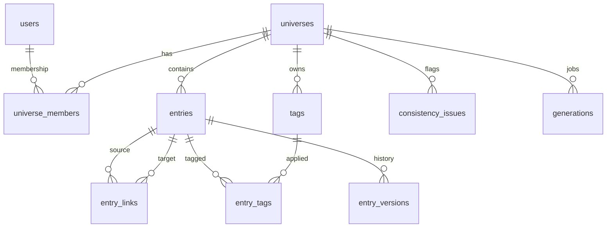

# Domain Model

Canonical knowledge-base domain model for therobotknows.com. Aligns with
[implementation-roadmap.md](../../project-management/implementation-roadmap.md)
M0.S0.1 and D-001. Wire shapes live under `app/docs/api/`.

---

## Design Guardrails

| Guardrail | Rule |
|---|---|
| Membership (D-001 / ADR-008) | Universe access via `universe_members` (member + role). No bare `owner_id`. |
| Attribution | Canon entries carry `created_by` (user UUID). |
| Entry types (ADR-005) | Fixed enum of 7 types. |
| Entry status | `canon` \| `draft` \| `generated`. |
| Versioning (ADR-007) | Snapshot-on-write into `entry_versions` (tables in M2). |
| Scope | All KB entities are universe-local. |

---

## Universe

Top-level container for a creative world. Independently scoped: entries, links,
tags, flags, and generations are all universe-local.

| Field | Type | Description |
|-------|------|-------------|
| `id` | uuid | Primary key |
| `slug` | string | URL-safe unique slug (e.g. `ashward-chronicles`) |
| `name` | string | Display name |
| `description` | string? | Short summary |
| `genre` | string? | Genre label (e.g. "Dark Fantasy") |
| `tone` | string? | Tone label for generation (e.g. "grim, lyrical") |
| `config` | object | Genre/tone/naming/constraints (jsonb); see genre-tone config |
| `status` | enum | `active` \| `deleted` (soft-delete) |
| `created_by` | uuid? | Creating user |
| `deleted_at` | datetime? | Soft-delete timestamp |
| `inserted_at` / `updated_at` | datetime | Audit timestamps |

### Denormalized / computed (API list/detail)

| Field | Description |
|-------|-------------|
| `entry_count` | Count of non-deleted entries |
| `flag_count` | Unresolved consistency issues |
| `connection_count` | Count of entry links |
| `role` | Caller's membership role on this universe |

### universe_members

| Field | Type | Description |
|-------|------|-------------|
| `id` | uuid | Primary key |
| `universe_id` | uuid | FK → universes |
| `user_id` | uuid | FK → users |
| `role` | enum | `owner` \| `editor` \| `viewer` (v0.1 always `owner` for the sole member) |
| `inserted_at` / `updated_at` | datetime | Audit timestamps |

Unique: `(universe_id, user_id)`.

### Genre / tone config (`config` jsonb)

```json
{
  "genre": "Dark Fantasy",
  "tone": "grim, lyrical",
  "naming_conventions": "Anglo-Saxon + Nordic compounds",
  "constraints": ["No modern firearms", "Magic costs aether"]
}
```

Top-level `genre` / `tone` columns mirror common config keys for list filters;
full config is the source of truth for generation (M3+).

---

## Entry (Canon Entry)

A knowledge article within a universe — fundamental unit of the knowledge graph.

| Field | Type | Description |
|-------|------|-------------|
| `id` | uuid | Primary key |
| `universe_id` | uuid | FK → universes |
| `type` | EntryType | See enumerations |
| `status` | EntryStatus | `canon` \| `draft` \| `generated` |
| `title` | string | Entry heading |
| `slug` | string? | Optional URL slug within universe |
| `excerpt` | string? | Short summary for cards/lists |
| `body` | object \| string | Rich document (ProseMirror/Tiptap JSON preferred) or plain text |
| `era` | string? | Temporal grouping |
| `region` | string? | Spatial grouping |
| `metadata` | object | Type-specific structured fields (jsonb) |
| `word_count` | integer | Derived from body |
| `version` | integer | Monotonic revision counter (snapshot index) |
| `created_by` | uuid? | Authoring user |
| `deleted_at` | datetime? | Soft-delete |
| `inserted_at` / `updated_at` | datetime | Audit timestamps |

### EntryType

`character` · `location` · `event` · `faction` · `object` · `concept` · `rule`

### EntryStatus

| Value | Meaning |
|-------|---------|
| `canon` | Human-approved source of truth |
| `draft` | Work in progress, not yet canon |
| `generated` | AI-produced, pending review |

### Allowed status transitions

| From | To |
|------|----|
| `draft` | `canon`, `generated` (rare) |
| `generated` | `canon` (promote), `draft` (adopt for edit) |
| `canon` | `draft` (unpublish for rework) |

Delete is soft-delete, not a status.

---

## Entry Link (Connection)

Typed, directed relationship between two entries in the same universe.

| Field | Type | Description |
|-------|------|-------------|
| `id` | uuid | Primary key |
| `universe_id` | uuid | FK → universes (denormalized for scoping) |
| `source_entry_id` | uuid | Origin entry |
| `target_entry_id` | uuid | Destination entry |
| `relationship` | string | Label (e.g. "ruler of", "located in") |
| `excerpt` | string? | Source excerpt / note |
| `created_by` | uuid? | Attributing user |
| `inserted_at` / `updated_at` | datetime | Audit timestamps |

Unique soft constraint: avoid exact duplicate `(source, target, relationship)`.

---

## Tag

| Field | Type | Description |
|-------|------|-------------|
| `id` | uuid | Primary key |
| `universe_id` | uuid | Scope |
| `name` | string | Tag label (case-preserving display) |
| `slug` | string | Normalized key within universe |
| `inserted_at` | datetime | Created |

### entry_tags

Join table: `(entry_id, tag_id)` unique.

---

## Entry Version (M2 schema; model locked here)

| Field | Type | Description |
|-------|------|-------------|
| `id` | uuid | Primary key |
| `entry_id` | uuid | FK → entries |
| `version` | integer | Snapshot number matching entry.version after write |
| `snapshot` | object | Full mutable field snapshot |
| `created_by` | uuid? | Actor |
| `reason` | string? | `create` \| `update` \| `promote` \| `restore` \| … |
| `inserted_at` | datetime | When snapshot was taken |

---

## Consistency Flag (issue)

| Field | Type | Description |
|-------|------|-------------|
| `id` | uuid | Primary key |
| `universe_id` | uuid | Scope |
| `severity` | FlagSeverity | `error` \| `warning` \| `suggestion` |
| `kind` | string | Check id (e.g. `duplicate_name`, `timeline_conflict`) |
| `title` | string | Short description |
| `detail` | string | Explanation |
| `entry_ids` | uuid[] | Involved entries |
| `status` | enum | `open` \| `resolved` \| `dismissed` |
| `resolution` | object? | Resolution payload |
| `inserted_at` / `updated_at` | datetime | Audit |

---

## Generation

| Field | Type | Description |
|-------|------|-------------|
| `id` | uuid | Primary key |
| `universe_id` | uuid | Scope |
| `prompt` | string | User prompt |
| `entry_type` | EntryType | Target type |
| `status` | GenerationStatus | `pending` \| `running` \| `complete` \| `failed` \| `promoted` \| `discarded` |
| `params` | object | Length, tone overrides, etc. |
| `output_entry_id` | uuid? | Created generated entry |
| `source_entry_ids` | uuid[] | Context entries |
| `citations` | object[] | Source citations |
| `created_by` | uuid? | Requesting user |
| `inserted_at` / `updated_at` | datetime | Audit |

---

## Type Enumerations (summary)

- **EntryType**: `character` · `location` · `event` · `faction` · `object` · `concept` · `rule`
- **EntryStatus**: `canon` · `draft` · `generated`
- **MemberRole**: `owner` · `editor` · `viewer`
- **FlagSeverity**: `error` · `warning` · `suggestion`
- **GenerationStatus**: `pending` · `running` · `complete` · `failed` · `promoted` · `discarded`

---

## Entity Relationship (logical)


