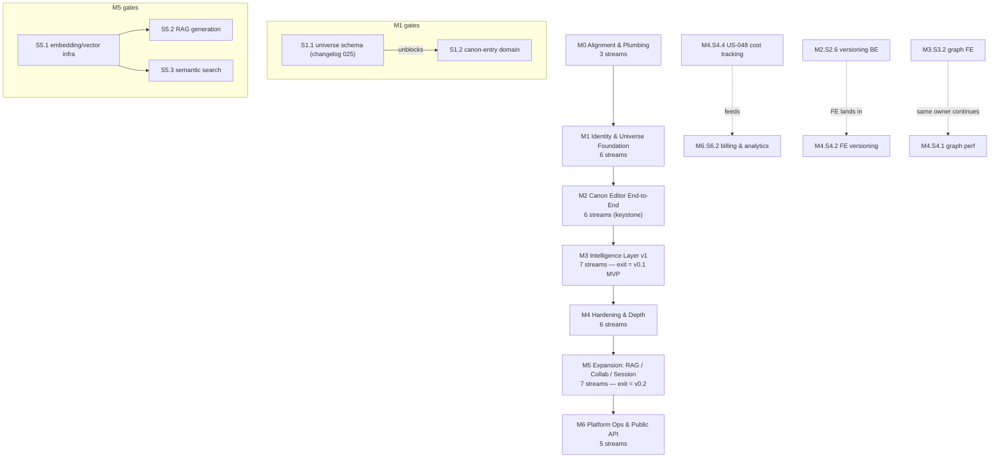

# TheRobotKnows — Implementation Roadmap

Sequence-of-tasks roadmap for therobotknows.com (Knowledge Base). This document
defines **ordering and dependencies only**. It contains no dates, weeks,
sprints, or time estimates. Milestones are dependency stages; sizing signals
are story complexity (S/M/L/XL) and MoSCoW priority taken from the
[user-stories index](user-stories/index.yaml).

---

## 1. Purpose & Scope

- **What this is:** the canonical build order for taking the current codebase
  (frontend prototype on mocks + platform-only backend) to v0.1 MVP and beyond,
  structured for maximal parallel execution with zero merge collisions.
- **What this is not:** a schedule. No calendar mapping is implied or intended.
  A milestone completes when its exit checkpoint passes, whenever that is.
- **Unit of tracking:** story IDs (US-001..US-100) from
  `project-management/user-stories/index.yaml`. Screen references come from
  `project-management/screens/README.md` (44 screens). v0.1 scope boundary
  comes from the project `README.md` MVP Scope section.
- **Coverage guarantee:** every one of the 100 stories appears exactly once in
  Appendix A (backlog counts as a placement).

---

## 2. Current State

| Area | State |
|---|---|
| `app/frontend` | Next.js 16 / React 19 / TS / Tailwind v4 / d3-force. App Router with route groups `(dashboard)` and `(universe)/[universeId]/{entries,graph,timeline,generate,consistency}`. Working UI prototype running **entirely on mock data** in `src/data/*`. |
| Frontend auth | Points at Authentik OIDC (auth.derobot.is) — **not** the project backend. Must be rewired. |
| `app/backend` | Phoenix 1.8 / Ecto / Guardian JWT + ueberauth SSO + oban + pgvector + postgis + hammer + genai + Noizu entity libs. **Platform domain only**: auth (register/login/refresh/magic-link/OTP/reset/verify/SSO), users, organizations, projects, PBAC v2 (groups/policies/custom roles), media presign, admin, webhooks. |
| Knowledge-base domain | **Greenfield.** No universe, entry, graph, generation, or consistency code exists on the backend. |
| DB migrations | Append-only numbered Liquibase-style YAML in `app/backend/db/changelog/` (001–024 taken). Ecto migrations dir carries only smart_token/oban. |
| Deploy | Helm chart at `helm/therobotknows/` incl. migrate-job; `.infra-config.yaml` has registry/db/domain entries; docker-compose dev files exist. |

---

## 3. Working Principles

### 3.1 Milestones are dependency stages

A milestone is a stage in a dependency graph, not a date. All streams within a
milestone fan out in parallel once entry criteria are met. Milestone exit = the
integration checkpoint passes. Nothing in M(n+1) starts before M(n) exits,
except where a stream is explicitly marked as continuing the same owner's work.

### 3.2 Exclusive code-area ownership

One worker (or pair) per stream. Every stream carries an **exclusive ownership
list of paths** — no two concurrent streams touch the same paths. Each
milestone section includes an ownership table. If a stream needs a change in
another stream's territory, it requests it from that stream's owner; it does
not make the edit. This is what makes the fan-out conflict-free, exploiting the
natural seams of the repo:

- Frontend: per-route-group and per-`components/<feature>` directory.
- Backend: per-domain `entities/<domain>/` + `schema/<domain>/` + one
  controller file per resource.
- DB: allocated changelog number ranges (below).
- Helm/infra: separate from application code.

### 3.3 Contract-first

Each milestone starts with API contracts committed under `app/docs/api/`
**before** fan-out. Frontend streams build against the agreed contract using
mock adapters (from M0.S0.2) until the corresponding backend streams land.
Contract changes after fan-out require sign-off from every consuming stream.

### 3.4 DB changelog range allocation

Changelogs are append-only numbered YAML in `app/backend/db/changelog/`.
Ranges are pre-allocated per domain so parallel backend streams never collide
on numbers:

| Range | Domain | Consumed by |
|---|---|---|
| 001–024 | Existing platform (auth, users, orgs, PBAC, media, webhooks) | — (immutable) |
| 025–029 | Universe | M1.S1.1 |
| 030–039 | Canon entries (036–038 **reserved** for versioning) | M1.S1.2 (030–035, 039), M2.S2.6 (036–038) |
| 040–049 | Generation | M3.S3.3, M4.S4.4 |
| 050–059 | Consistency | M3.S3.5, M4.S4.3 |
| 060–064 | Search | M2.S2.4 |
| 065–069 | Session companion | M5.S5.6 |
| 070–074 | Settings / AI / budget | M3.S3.7 |
| 075–079 | Admin / billing / moderation | M6.S6.1, M6.S6.2 |
| 080–084 | Embeddings / vector | M5.S5.1 |
| 085–089 | Collaboration | M5.S5.4 |
| 090+ | Unallocated | future |

A stream that exhausts its range requests a new block from the 090+ pool via
the architecture owner; it never borrows from a neighboring range.

### 3.5 Story tracking

Every story appears in exactly one milestone-stream. Where the frontend and
backend halves of one story split across streams, both placements are noted in
the milestone sections and combined into a single row in Appendix A. Stretch
items are marked; a stretch item that slips moves to the next milestone under
the same owner, it is not re-scoped silently.

### 3.6 Decision log

| ID | Decision |
|---|---|
| D-001 | Epic K (Collaboration) remains in M5 despite must-priority markers on US-091/US-092. The README v0.1 scope governs; index MoSCoW priorities are product-level, not v0.1-level. Rationale: primary personas (P-001, P-002, P-005) receive full value single-player; backend PBAC v2 already exists, so deferral carries no architectural debt. Hedge: universe ownership is designed membership-based from M1 (see S0.1/S1.1 guardrail) so M5.S5.4 is a role-mapping exercise, not schema surgery. |

---

## 4. Milestone Overview

| Milestone | Goal | Streams | Exit criterion |
|---|---|---|---|
| M0 | Contracts, API client scaffold, dev env & CI | 3 | Contracts merged; `docker compose up` gives a working stack; CI green |
| M1 | Real auth + universe CRUD live end-to-end | 6 | Register → login → create universe → dashboard, live on staging |
| M2 | Canon editor keystone: create/edit/link/tag/search/export | 6 | Full entry lifecycle e2e on staging |
| M3 | Graph, generation v1, consistency v1, AI settings | 7 | **v0.1 feature-complete per README — tag release** |
| M4 | Perf, a11y, versioning FE, depth passes | 6 | A11y audit pass; perf targets on large universes |
| M5 | RAG, collaboration, session companion, import | 7 | **v0.2** — collaborative universes, RAG generation, session play |
| M6 | Admin, billing, public API, moderation, notifications | 5 | Platform operable: admin, billing, rate-limited public API |

---

## 5. M0 — Alignment & Plumbing

**Goal:** everything downstream depends on three things: agreed contracts, a
frontend client seam, and a reproducible dev/CI environment. Low parallelism
by design — this milestone is deliberately small so the real fan-out starts on
a solid footing.

**Entry criteria:** none (start of roadmap).

### Ownership

| Stream | Owner slot | Exclusive paths | Stories |
|---|---|---|---|
| S0.1 Architecture & contracts | 1 (single owner) | `docs/arch/`, `app/docs/api/` | — |
| S0.2 FE API client scaffold | 1 | `app/frontend/src/lib/api/`, `app/frontend/src/types/` | — |
| S0.3 Dev env & CI | 1 | compose files, `Makefile`, `scripts/`, CI config | — |

### S0.1 — Architecture & contracts

1. **Auth decision ADR:** Phoenix Guardian becomes the canonical auth
   authority. Authentik is demoted to an optional OIDC upstream consumed via
   ueberauth on the backend. Frontend never talks to Authentik directly again.
   Commit to `docs/arch/`.
2. **KB domain model design doc:** universe; entry with 7 types (Character,
   Location, Event, Faction, Object, Concept, Rule); link; tag; status enum
   `canon | draft | generated`; versioning approach (snapshot-on-write vs
   delta) decided here so S2.6 doesn't re-litigate it. **Guardrail (D-001):**
   universe ownership MUST be modeled via a `universe_members` table
   (member + role, seeded with the creating owner) — not a bare `owner_id`
   column — and canon entries carry `created_by` attribution, so M5
   collaboration is a non-breaking addition.
3. **API contract conventions:** error envelope, pagination, auth header,
   versioned base path `/api/v1`, committed under `app/docs/api/`.
4. **Contract skeletons:** `/api/v1/universes` and
   `/api/v1/universes/:id/entries` (CRUD + links + tags + status transitions).
5. Review with S0.2 and S0.3 owners; merge. **This merge is the M1 fan-out
   gate.**

### S0.2 — Frontend API client scaffold

1. Greenfield `src/lib/api/`: fetch wrapper with token attach/refresh,
   typed error envelope, request/response interceptors.
2. Typed API models in `src/types/` mirroring the S0.1 contract drafts
   (iterate as contracts firm up — same milestone, cheap to sync).
3. **Mock adapter** wrapping the existing `src/data/*` mock modules behind the
   client interface, so every page can migrate to the client without waiting
   on a live backend.
4. Adapter switch (env flag): mock vs live per API domain — this is the seam
   every later FE stream uses to go live incrementally.
5. Proof migration: move one existing page (dashboard universe list) onto the
   client-over-mock path.

### S0.3 — Dev env & CI

1. Full-stack docker-compose: frontend, backend, postgres (with pgvector +
   postgis extensions), redis.
2. Seed task producing a small fixture universe for local dev.
3. CI: lint + test for both halves (mix + next), run on PR.
4. Wire the liquibase-style changelog runner into compose startup; **publish
   the changelog range allocation** (§3.4) as the authoritative doc.
5. Makefile / scripts targets: `up`, `seed`, `test`, `migrate`.

### Exit checkpoint

- [x] Auth ADR and KB domain model merged to `docs/arch/`.
- [x] `/api/v1/universes` and entries contracts merged to `app/docs/api/`.
- [x] `docker compose up` yields working frontend + backend + db + redis.
- [x] CI green on both halves.
- [x] Changelog range allocation published.

### Parallelization & collision notes

- Three disjoint territories (docs, `src/lib/api`+`src/types`, compose/CI) —
  no shared files. The only coordination point is S0.2 consuming S0.1's
  contract drafts, which is read-only.

---

## 6. M1 — Identity & Universe Foundation

**Goal:** a real authenticated product shell: users register and log in
against the project backend, create and manage universes, and the stack runs
on staging.

**Entry criteria:** M0 exit passed (contracts merged, compose stack, CI).

### Ownership

| Stream | Owner slot | Exclusive paths | Stories |
|---|---|---|---|
| S1.1 BE universe domain | 1 | `entities/universe/`, `schema/universe/`, universe controller; changelog 025–029 | US-009 (BE), US-010 (BE), US-012 (BE stats), US-013, US-015 (BE) |
| S1.2 BE canon-entry domain | 1 | `entities/canon/`, `schema/canon/`, entry/link/tag controllers; changelog 030–035, 039 | US-016 (BE), US-017 (BE), US-018 (BE), US-020 (BE), US-022 (BE), US-023 (BE), US-024 (BE) |
| S1.3 FE auth integration | 1 | `src/app/auth/`, new `src/components/auth/`, `src/lib/auth.ts` | US-001, US-002, US-003, US-004, US-006, US-008 |
| S1.4 FE universe management | 1 | `src/app/(dashboard)/`, `[universeId]/page`, new `[universeId]/settings` route, new `components/universe/` | US-005, US-009 (FE), US-010 (FE), US-012 (FE), US-015 (FE form) |
| S1.5 FE account settings | 1 | new `src/app/settings/`, new `components/settings/` | US-076, US-080, US-081 |
| S1.6 Infra deploy | 1 | `helm/`, Dockerfiles | — |

### S1.1 — BE universe domain

1. **Changelog 025: universes + universe_members tables** (name, description,
   genre/tone config as jsonb, soft-delete flag; membership = member + role,
   per the D-001 guardrail — no bare `owner_id`). Single-player v0.1 simply
   always has exactly one member with role `owner`. **First task — this
   migration unblocks S1.2.** Land it before anything else.
2. Noizu entity + repo definitions under `entities/universe/` +
   `schema/universe/`.
3. Universe controller: create/read/update (US-009, US-010) with PBAC scoping
   to owner.
4. Genre and tone configuration endpoints (US-015 BE) — persisted config the
   generation pipeline reads later (M3.S3.3, M4.S4.4).
5. Delete with confirmation semantics: soft-delete + purge job (US-013).
6. Dashboard stats endpoint (US-012 BE): entry counts, open flag counts,
   recent activity feed skeleton.
7. Contract conformance tests against `app/docs/api/`.

### S1.2 — BE canon-entry domain

Depends on **S1.1 task 1 only** (universes table FK target). Everything else
proceeds in parallel with S1.1.

1. Changelogs 030–035: entries (type enum ×7, status enum
   canon/draft/generated, era/region fields), entry_links, tags, entry_tags.
   Leave 036–038 untouched — reserved for M2.S2.6 versioning.
2. Entity + repo definitions under `entities/canon/` + `schema/canon/`.
3. Entry CRUD controller with per-type validation (US-016, US-017, US-018 BE).
4. Entry templates by type (US-020 BE): seed data for the 7 built-in
   templates + template fetch endpoint.
5. Links table CRUD + body-scan link extraction endpoint (US-022 BE) — the
   graph endpoint (M3.S3.1) reads this table.
6. Tag CRUD and assignment (US-023 BE); status transition endpoint with
   allowed-transition rules (US-024 BE).
7. Contract conformance tests.

### S1.3 — FE auth integration

1. Rewrite `src/lib/auth.ts` against the backend auth API: token storage,
   refresh, session context. Kill the Authentik-direct code path.
2. Registration form + flow (US-001).
3. Login form + flow (US-002).
4. OAuth via backend ueberauth redirect flow — Google/Discord buttons hand off
   to backend SSO endpoints (US-003).
5. Profile setup step after registration (US-004).
6. Password reset (US-006) and email verification (US-008) flows against
   existing backend endpoints.

### S1.4 — FE universe management

1. Migrate dashboard universe list from mock adapter to live universe API.
2. Create-universe flow (US-009 FE) — plain form; the wizard (US-011) is
   deliberately deferred to M4.S4.6.
3. New `[universeId]/settings` route (US-010 FE) including the genre/tone
   configuration form (US-015 FE half — note: story split with S1.1).
4. Universe overview page on live stats endpoint (US-012 FE).
5. First-run experience + empty states for zero-universe and zero-entry
   dashboards (US-005).

### S1.5 — FE account settings

1. New `src/app/settings/` route group + navigation entry.
2. Account settings & profile management (US-076) against existing backend
   users domain.
3. Privacy settings (US-080).
4. Theme & appearance customization (US-081) — light/dark per the Vellum & Ink
   palette.

### S1.6 — Infra deploy

1. Validate helm chart at `helm/therobotknows/` against current images; fix
   drift.
2. Wire the liquibase migrate-job to run the numbered changelog on deploy.
3. Staging deploy via existing `deploy-service` pipeline; ingress + TLS for
   the staging host.
4. Post-deploy smoke script (auth round-trip + universe create).

### Exit checkpoint

- [x] Register → login → create universe → see it on dashboard (local/mock+API path).
      Staging deploy still open (S1.6).
- [x] Entry API (S1.2) implemented + controller test coverage path (run mix test when Elixir available).
- [x] Authentik-direct code removed from frontend (ADR-006; Guardian/backend auth).
- [ ] Migrate-job applies changelogs 025–035, 039 cleanly on staging (S1.6).

### Parallelization & collision notes

- S1.1/S1.2 share one gate: changelog 025 (universes FK). S1.1 lands it as its
  first commit; from then on the two backend streams live in disjoint
  entity/schema/controller directories and disjoint changelog ranges.
- S1.3/S1.4/S1.5 own disjoint route groups and component directories. All
  three consume `src/lib/api/` (S0.2 output) read-only; changes to the shared
  client go through the S0.2 owner (who is free this milestone — assign them
  S1.3 or keep as client maintainer).
- S1.6 touches no application code.
- Coordination required: US-015 splits BE (S1.1) / FE form (S1.4) — contract
  for the genre/tone config shape is already fixed in `app/docs/api/`.

---

## 7. M2 — Canon Editor End-to-End

**Goal:** the keystone milestone. The entry lifecycle — create, edit
(rich text), link, tag, set status, search, export — works end-to-end on
staging. Everything in M3 builds on entries existing and being linkable.

**Entry criteria:** M1 exit passed; entry API live on staging; editor/entry
contracts in `app/docs/api/` extended for search + export + versions before
fan-out.

### Ownership

| Stream | Owner slot | Exclusive paths | Stories |
|---|---|---|---|
| S2.1 FE entry CRUD + templates | 1 | `[universeId]/entries/` routes, `components/entries/` | US-016 (FE), US-017 (FE), US-018 (FE), US-020 (FE) |
| S2.2 FE rich-text editor + inline linking | 1 | new `components/editor/` | US-021, US-022 (FE) |
| S2.3 FE tags/status/badges | 1 | `components/tags/`, status components | US-023 (FE), US-024 (FE) |
| S2.4 Search v1 BE+FE | 1 (full-stack) | search controller, changelog 060–064; new search route, `components/search/` | US-069, US-071, US-072, US-073 |
| S2.5 Export v1 | 1 (full-stack) | BE export module; export options screen | US-099 |
| S2.6 BE versioning foundation | 1 | versions tables changelog 036–038, versions controller | US-025 (BE; FE deferred to M4.S4.2) |

### S2.1 — FE entry CRUD + templates

1. Migrate `[universeId]/entries/` list route from mocks to live API.
2. Entry detail (read) view — reserves a mount point for S2.2's read-only
   renderer.
3. Create/edit forms for all 7 entry types with template pre-fill
   (US-016, US-017, US-020 FE).
4. Delete with confirmation (US-018 FE).
5. **Agree the editor props contract with S2.2** (value shape, onChange,
   link-request callback) and the tag/status slot contracts with S2.3 — a
   one-page interface doc, committed before either side integrates.
6. Integrate S2.2 and S2.3 components via those contracts once they land.

### S2.2 — FE rich-text editor + inline linking

Builds `components/editor/` in isolation against the agreed props contract; it
**does not edit S2.1's files** — S2.1 performs the integration.

1. Editor library selection + wrapper (Tiptap/ProseMirror per README technical
   direction) — `rich-text-editor` component (US-021).
2. Inline entry-link extension: trigger-char search over entries API, inserts
   link nodes, emits structured link records for the links table (US-022 FE).
3. Read-only renderer for entry detail (same document schema).
4. Serialization contract: document JSON persisted via the entry body field
   agreed in M0 domain model.
5. Handoff: publish the component API; support S2.1's integration.

### S2.3 — FE tags/status/badges

1. Tag input + tag management components (US-023 FE).
2. Status badge + transition control (US-024 FE) — canon = solid ink border,
   generated = dashed sepia border, per visual direction.
3. Reusable tag/type filter-chip components (consumed later by search and
   graph streams — publish as part of `components/tags/`).

### S2.4 — Search v1 (BE+FE)

1. Changelog 060: tsvector column + GIN index + trigger on entries.
2. Search controller: query, filters (type/tag/era), highlighted snippets
   (US-069 BE, US-071 BE, US-072 BE).
3. New search route + `components/search/`: global search UI, filter sidebar,
   result previews (US-069, US-071, US-072 FE).
4. Recent entries feed: endpoint + dashboard component (US-073).

### S2.5 — Export v1

1. BE export module: Markdown serializer for entries + universe bundle.
2. JSON export (structured entry + link data).
3. Export endpoint — synchronous for v1 scale; move to oban job if payloads
   demand it.
4. FE export options screen (US-099).
5. PDF export (styled with the editorial typography) — last task in the
   stream; Markdown/JSON are the v0.1-critical formats.

### S2.6 — BE versioning foundation

1. Changelogs 036–038 (the reserved block): entry_versions + metadata tables.
2. Snapshot-on-write hook in the entry update path (coordinate the single
   touch-point in S1.2's update function with — nobody else edits canon domain
   this milestone, so the canon domain ownership transfers to S2.6 for this
   change; see collision notes).
3. History API: list versions, fetch version, diff payload (US-025 BE).
4. Restore endpoint. **FE half (history screen, diff viewer) is deliberately
   deferred to M4.S4.2.**

### Exit checkpoint

- [x] Create → edit → tag → set status → list/filter → export Markdown/JSON
      (local + mock/live client). Staging smoke still open.
- [x] Recent entries on universe overview via entries API.
- [x] Versions recorded on entry write (changelog 036 + snapshot hook); history
      API routes live. FE history UI deferred M4.S4.2.
- [x] Entries routes on API client (mock adapter over fixtures; live when
      `NEXT_PUBLIC_API_MODE=live`). Search BE live; dedicated search UI thin
      (filters on entries list).

### Parallelization & collision notes

- **S2.1 ↔ S2.2 is the coordination point of the milestone:** integration via
  a props contract, agreed in writing before either integrates. S2.2 never
  edits `components/entries/` or routes; S2.1 never edits
  `components/editor/`.
- S2.3's components are consumed by S2.1 through the same slot-contract
  mechanism.
- S2.4 and S2.5 are full-stack but vertically isolated: distinct controllers,
  distinct changelog ranges, distinct new FE areas.
- S2.6 needs one hook in the entry update path owned by S1.2 in M1. Since
  S1.2's stream ended at M1 exit, canon-domain write access transfers to S2.6
  for the milestone — recorded in the ownership table by exclusion (no other
  M2 stream touches `entities/canon/`).

---

## 8. M3 — Intelligence Layer v1 (v0.1 MVP)

**Goal:** the three intelligence surfaces — knowledge graph, generation
studio, consistency engine — go live at v0.1 scope, plus the AI settings that
feed generation. Maximum fan-out: seven streams. **Milestone exit = v0.1
feature-complete per the README MVP scope; tag a release.**

Scope guard (from README v0.1): generation uses **single-entry context, not
full-universe RAG**; consistency is **basic** (timeline conflicts, duplicate
names); search is full-text only. RAG, semantic search, bulk generation are
M5.

**Entry criteria:** M2 exit passed; graph/generation/consistency/settings
contracts committed under `app/docs/api/` before fan-out.

### Ownership

| Stream | Owner slot | Exclusive paths | Stories |
|---|---|---|---|
| S3.1 BE graph endpoint | 1 | graph controller + graph query module | (serves US-026–033; stories tracked in S3.2) |
| S3.2 FE graph | 1 | `components/graph/`, `[universeId]/graph/` | US-026, US-027, US-028, US-029, US-030, US-031, US-032, US-033 |
| S3.3 BE generation v1 | 1 | `entities/generation/`, `schema/generation/`, generation controller, oban jobs; changelog 040–049 | US-036 (BE), US-038, US-039 (BE), US-044 (BE), US-046 (BE), US-047 (BE) |
| S3.4 FE generation studio | 1 | `components/generation/`, `[universeId]/generate/` | US-036 (FE), US-039 (FE), US-044 (FE), US-045, US-046 (FE), US-047 (FE) |
| S3.5 BE consistency v1 | 1 | `entities/consistency/`, `schema/consistency/`, check engine; changelog 050–059 | US-051 (lite), US-053, US-054, US-055 (BE) |
| S3.6 FE consistency | 1 | `components/consistency/`, `[universeId]/consistency/` | US-055 (FE), US-056, US-057 |
| S3.7 Settings-AI BE+FE | 1 (full-stack) | AI prefs controller, changelog 070–074; settings AI panel | US-078, US-079 |

### S3.1 — BE graph endpoint

1. Graph endpoint: nodes (entries) + edges (from entry_links), scoped per
   universe.
2. Filters: entry type, era, region, tag — mirroring the S2.4 filter grammar.
3. Edge metadata payload: relationship kind + source excerpt (feeds US-031's
   edge-detail panel).
4. Payload shape tuned for d3-force consumption; publish as contract addendum.
   **First deliverable of the milestone — unblocks S3.2's live wiring.**

### S3.2 — FE graph

1. Swap `[universeId]/graph/` mock data for the S3.1 endpoint (US-026);
   canon/generated/flagged node styling per legend.
2. Zoom + pan (US-027), click node → entry (US-030), hover highlight of
   connections (US-033).
3. Filter UI: entry type (US-028); era/region/tag (US-029) — reuse S2.3's
   filter chips.
4. Click edge → relationship detail panel (US-031).
5. Layout options (US-032).
6. **US-034 (perf, XL) and US-035 (minimap) are deliberately deferred to
   M4.S4.1 under the same owner** — v0.1 targets modest universe sizes.

### S3.3 — BE generation v1

1. Changelogs 040–044: generations, generation_sources (citations),
   generation params/status.
2. genai wiring: prompt assembly from **single-entry context** plus universe
   genre/tone config (v0.1 scope — explicitly not RAG).
3. Oban generation job + status/result polling endpoint (US-036 BE).
4. Generation type parameter (US-039 BE) and regenerate-with-params
   (US-044 BE).
5. Source citations recorded per generation (US-038) — FE display lands via
   S3.4's studio components.
6. Promote-to-canon (US-046 BE: status flip + version snapshot via S2.6
   tables) and discard (US-047 BE).

### S3.4 — FE generation studio

1. Migrate `[universeId]/generate/` off mocks: prompt form, entry-type /
   length / tone controls (US-036, US-039 FE).
2. In-progress state with job polling (typewriter sepia treatment optional).
3. Result review pane with source citations display (renders US-038's data).
4. Regenerate with different parameters (US-044 FE); promote (US-046 FE);
   discard (US-047 FE).
5. Generation history list (US-045) over S3.3's generation records.

### S3.5 — BE consistency v1

1. Changelogs 050–054: consistency_issues, check runs, resolutions.
2. Check-engine framework: oban-triggered checks on entry write; pluggable
   check modules.
3. Duplicate name detection (US-053); orphaned reference warnings (US-054).
4. **v0.1-lite timeline check** (US-051 lite): structured date-field
   comparison only — full timeline engine is M4.S4.3.
5. Severity levels on issues: error / warning / suggestion (US-055 BE).

### S3.6 — FE consistency

1. Migrate `[universeId]/consistency/` off mocks: consistency dashboard
   (US-057).
2. Issue detail with severity display (US-055 FE).
3. Resolution workflow UI (US-056): pick a side / merge / mark intentional
   ambiguity, wired to S3.5's resolution endpoints.

### S3.7 — Settings-AI (BE+FE)

1. Changelogs 070–072: user + universe AI preferences, budget/usage tables.
2. Model selection endpoint mapped to genai providers (US-078).
3. Generation budget & usage limits (US-079): enforcement hook **inside
   S3.3's generation pipeline** — single agreed integration point (see
   collision notes).
4. FE settings AI panel in `src/app/settings/` (territory inherited from
   S1.5, idle this milestone).

### Exit checkpoint — v0.1 MVP

- [x] Graph renders entries + links with filters; node click opens entry (API + mock).
- [x] Prompt → generation with citations → promote/discard (placeholder synthesizer + Oban worker).
- [x] Duplicate-name / orphan / timeline-lite checks + resolve workflow.
- [x] Budgets enforced via AI settings + generation create gate (402).
- [ ] Staging demonstration + release tag (ops).
- [ ] **Release tagged v0.1** (pending deploy).

### Parallelization & collision notes

- Three vertical pairs (graph S3.1/S3.2, generation S3.3/S3.4, consistency
  S3.5/S3.6) each split BE/FE across disjoint directories; contracts committed
  at milestone start keep pairs decoupled — FE sides run on the M0 mock
  adapter until their BE lands.
- Coordination points: (a) S3.7's budget hook is one function call inserted in
  S3.3's pipeline — S3.3 owns the file, S3.7 supplies the module and the
  contract; (b) S3.4's promote action and S3.6's dashboard both link into
  entries routes (S2.1 territory, idle now) — navigation-only, no file edits;
  (c) S3.2 reuses `components/tags/` chips read-only.
- Consistency checks read canon-domain tables but write only to their own
  changelog range and schema.

---

## 9. M4 — Hardening & Depth

**Goal:** make v0.1 production-grade and deepen each intelligence surface:
graph performance, versioning UI, full consistency engine, generation
depth + cost tracking, a11y/loading passes, onboarding polish.

**Entry criteria:** M3 exit passed (v0.1 tagged).

### Ownership

| Stream | Owner slot | Exclusive paths | Stories |
|---|---|---|---|
| S4.1 Graph perf + minimap | 1 (same owner as S3.2) | `components/graph/`, `[universeId]/graph/` | US-034, US-035 |
| S4.2 FE versioning | 1 | new version-history screen, `components/versions/` (diff viewer) | US-025 (FE) |
| S4.3 Consistency depth | 1 | consistency domain (BE) + `components/consistency/`; changelog 055–059 | US-051 (full), US-052, US-058, US-059, US-060 |
| S4.4 Generation depth | 1 | generation domain (BE) + `components/generation/`, `[universeId]/generate/`; changelog 045–049 | US-040, US-042, US-043, US-048 |
| S4.5 A11y + loading passes | 1 | **scheduled** cross-cutting access (see notes) | US-096, US-097 |
| S4.6 Onboarding polish | 1 | tour/wizard components, `components/onboarding/`; universe create flow | US-007, US-011, US-014 |

### S4.1 — Graph performance + minimap

1. Profiling harness with synthetic large universes (500+ nodes / 2000+ edges
   per README open question 4).
2. Renderer decision: canvas/WebGL vs SVG for large graphs; implement chosen
   path (US-034).
3. Level-of-detail: label thresholds, viewport culling, worker-side layout.
4. Minimap + graph overview (US-035).

### S4.2 — FE versioning

1. Version history screen over the S2.6 history API (US-025 FE).
2. Diff viewer component (`components/versions/`).
3. Restore flow with confirmation + resulting new version.

### S4.3 — Consistency depth

1. Full timeline contradiction engine (US-051 full): date normalization, era
   ordering, relative-date inference.
2. Changelogs 055–057: postgis geometry fields on locations; geographic
   impossibility checks (US-052).
3. Batch consistency check across a whole universe (US-058) + consistency
   history/audit log (US-059).
4. Real-time check on edit (US-060): debounced check endpoint + inline editor
   surfacing — the editor touch-point goes through the `components/editor/`
   props contract (S2.2's component accepts a diagnostics prop; S4.3 supplies
   data, does not edit editor internals).

### S4.4 — Generation depth

1. Tone and voice matching (US-040): universe tone config + exemplar text
   injected into prompt assembly.
2. Generation queue management (US-042): queue listing, cancel, reorder over
   oban.
3. Edit sources before generating (US-043): source list editing in the studio.
4. **Generation cost tracking (US-048)**: per-generation token/cost records —
   explicit groundwork for M6.S6.2 billing. Changelog 045–049.

### S4.5 — A11y + loading-state passes (horizontal)

Horizontal by nature — the collision risk of the milestone. Runs on an
**explicit per-route-group file-ownership schedule** so it never holds files
concurrently with S4.1–S4.4 (see notes).

1. Audit: keyboard navigation, focus management, ARIA, contrast (Vellum & Ink
   palette check) across all route groups (US-096).
2. Remediation pass per route group, in schedule order: auth → dashboard →
   settings → entries → search → consistency → generate → graph (graph last,
   after S4.1 stabilizes).
3. Loading states & skeleton screens per route group, same schedule (US-097).
4. Re-audit + regression checklist added to CI where automatable.

### S4.6 — Onboarding polish

1. Interactive onboarding tour (US-007) — overlay components, no route
   ownership conflicts.
2. Universe creation wizard (US-011) replacing/augmenting the plain M1 form
   (universe create flow ownership transfers here from S1.4).
3. Duplicate a universe (US-014) — BE copy endpoint + FE action.

### Exit checkpoint

- [ ] Graph usable at 500+ nodes / 2000+ edges (interaction remains smooth on
      the profiling harness).
- [ ] A11y audit pass recorded; keyboard-only walkthrough of core flows
      succeeds.
- [ ] Full timeline + geographic checks live; batch check + audit log usable.
- [ ] Cost per generation recorded and queryable (billing-ready).
- [ ] Version history + diff + restore usable from entry detail.

### Parallelization & collision notes

- S4.1–S4.4 and S4.6 hold disjoint verticals (graph / versions / consistency /
  generation / onboarding).
- **S4.5 is the explicit risk:** a horizontal pass touches everyone's files.
  Mitigation is scheduling, not hoping: S4.5 works one route group at a time
  and never enters a route group while its vertical owner (S4.1 graph, S4.4
  generate, S4.3 consistency) has open work there. The schedule in S4.5 task 2
  is ordered so contested groups come last. Route-group handoffs are announced
  and short.
- S4.3's real-time-check integration and S4.4's studio changes both use
  existing component contracts (editor props, generation components they now
  own) — no cross-stream file edits.

---

## 10. M5 — Expansion: RAG, Collaboration, Session Companion

**Goal:** the v0.2 wave per README out-of-scope list: full-universe RAG
generation, semantic search, multi-user universes, session companion for GMs,
and manuscript import. **Exit = v0.2.**

**Entry criteria:** M4 exit passed. Contracts for
collaboration/session/import committed before fan-out. **S5.1 is an
intra-milestone gate:** S5.2 and S5.3 cannot pass their first tasks without
its similarity API.

### Ownership

| Stream | Owner slot | Exclusive paths | Stories |
|---|---|---|---|
| S5.1 Embedding/vector infra | 1 (single owner — shared dependency) | embedding pipeline modules, chunking, oban embed jobs; changelog 080–084 | — (gates S5.2 + S5.3) |
| S5.2 RAG generation | 1 | generation prompt-assembly + retrieval modules | US-037, US-041 (stretch) |
| S5.3 Semantic search & discovery | 1 | search controller extensions + `components/search/` | US-070, US-074 |
| S5.4 Collaboration BE | 1 | `entities/collab/`, `schema/collab/`, membership/invite controllers; changelog 085–089 | US-091 (BE), US-092 (BE), US-093 (BE) |
| S5.5 Collaboration FE | 1 | `components/collab/`, sharing/collaborator screens, public codex route | US-091 (FE), US-092 (FE), US-093 (FE), US-094 |
| S5.6 Session companion | 1 (full-stack) | new session route + `components/session/`; changelog 065–069 | US-061, US-062, US-063, US-066, US-068; stretch: US-064, US-065, US-067 |
| S5.7 Import pipeline | 1 (full-stack) | import controller + oban parse jobs; import review UI | US-019 |

### S5.1 — Embedding/vector infrastructure

Single owner because it is the **shared dependency** of RAG (S5.2) and
semantic search (S5.3) — splitting it would put two streams in one directory.

1. Changelogs 080–084: entry_chunks + embeddings tables (pgvector), model/
   dimension metadata.
2. Chunking strategy for entry bodies (README flags this as critical for
   large universes — smart selection, not "dump everything").
3. Oban embed jobs: on entry write + full backfill task.
4. Internal similarity query API (top-k by vector, filterable). **Publishing
   this API is the gate-release for S5.2 and S5.3.**
5. Re-embed lifecycle on model change.

### S5.2 — RAG generation

Gated on S5.1 task 4.

1. Retrieval layer: context selection over embeddings + graph-adjacency boost
   (US-037).
2. Prompt assembly upgrade: multi-entry context with per-source citation
   mapping (upgrades the M3 single-entry pipeline in place — this stream owns
   generation prompt-assembly modules for the milestone).
3. Generation-quality evaluation harness: canon-consistency spot checks per
   README open question 3.
4. **Stretch:** bulk generation (US-041): brief → target detection ("every
   location without minor characters") → batched jobs → review queue.

### S5.3 — Semantic search & discovery

Gated on S5.1 task 4.

1. Semantic mode in the search API (vector + full-text hybrid) (US-070 BE).
2. FE semantic toggle + result treatment in `components/search/` (US-070 FE).
3. Suggested connections between entries (US-074): similarity-driven link
   suggestions surfaced on entry detail sidebar + accept-into-links flow.

### S5.4 — Collaboration BE

Per D-001 (§3.6): universes have been membership-based since changelog 025 —
this stream maps roles onto the existing `universe_members` table, not schema
surgery.

1. Changelogs 085–089: role extensions, invites, public flags (membership
   table pre-exists from M1).
2. **Map existing PBAC v2 to universe-level roles** (US-092 BE) — reuse
   groups/policies rather than inventing a parallel permission system.
3. Invite collaborators (US-091 BE): email invite, accept, revoke.
4. Public universe sharing (US-093 BE): public read scope for anonymous
   access, spoiler-flag filtering primitives (consumed by US-094).

### S5.5 — Collaboration FE

1. Collaborators management screen: invite, role assignment, removal
   (US-091, US-092 FE).
2. Public sharing settings + public URL surfaces (US-093 FE).
3. Reader-facing codex view (US-094): spoiler-safe, read-only public route
   over S5.4's public scope.

### S5.6 — Session companion (full-stack)

1. Changelogs 065–069: sessions, session log entries, share flags.
2. New session route + `components/session/` (net-new territory).
3. Quick-reference search overlay (US-061) — wraps the search API in a
   single-bar rapid-lookup mode.
4. Improvise mode (US-062): canon-consistent generated answers — consumes the
   S5.1 similarity API directly; upgrades to S5.2's retrieval layer when it
   lands (sequence improvise-mode polish after S5.2 task 2).
5. Session log and notes (US-063); session history (US-066).
6. End-of-session canon review: promote session findings to entries (US-068).
7. **Stretch:** auto-extract entries from notes (US-064), player-facing view
   (US-065), share session entries with players (US-067 — leans on S5.4
   sharing primitives).

### S5.7 — Import pipeline

US-019 is XL — a full vertical on its own.

1. Ingestion endpoint: paste text / upload documents (media presign already
   exists in the platform domain).
2. LLM entity-extraction pipeline as oban jobs: parse → propose entries +
   links per README Flow 1.
3. Import review UI: approve / edit / reject proposed entries before they
   become canon.
4. Post-import batch consistency run (reuses US-058 machinery from M4.S4.3).

### Exit checkpoint — v0.2

- [ ] Generation demonstrably grounded in multi-entry canon (citation set
      spans retrieved entries, not just the seed entry).
- [ ] Semantic search toggle live; suggested connections appearing on entry
      detail.
- [ ] Second user invited to a universe with a role; permissions enforced;
      public codex URL viewable logged-out.
- [ ] GM path: quick-reference lookup → improvise answer → session log →
      end-of-session review, end-to-end.
- [ ] A pasted document becomes reviewed canon entries via the import queue.
- [ ] **Release tagged v0.2.**

### Parallelization & collision notes

- **S5.1 → S5.2/S5.3 is the milestone's defining gate** (called out in the
  overview flowchart). S5.2 and S5.3 begin against S5.1's published API
  contract and stub, but cannot pass integration tasks until the similarity
  API is real. Everything else fans out immediately.
- S5.2 takes ownership of generation prompt-assembly modules (S3.3/S4.4
  territory, now idle) — recorded transfer, not shared access.
- S5.3 takes ownership of `components/search/` (S2.4 territory, idle).
- S5.4/S5.5 split collaboration BE/FE across disjoint directories with a
  contract in `app/docs/api/`; S5.6 and S5.7 are self-contained verticals in
  net-new territory.
- Coordination: US-067 (stretch) needs S5.4's sharing primitives — sequenced
  last in S5.6.

---

## 11. M6 — Platform Ops & Public API

**Goal:** operate the platform as a business: admin visibility, billing on
the cost pipeline, a rate-limited public API, moderation, and notifications.

**Entry criteria:** M5 exit passed. US-048 cost records (M4.S4.4) present in
production data — hard dependency of S6.2.

### Ownership

| Stream | Owner slot | Exclusive paths | Stories |
|---|---|---|---|
| S6.1 Admin dashboard | 1 | admin controllers/screens (extends existing admin domain); changelog 075 | US-083, US-084 (+ US-087 schema groundwork) |
| S6.2 Billing & analytics | 1 | billing/analytics modules + screens; changelog 076–079 | US-086, US-085 |
| S6.3 Public API | 1 | public API controllers, API-key management, `app/docs/api/` public section | US-082, US-049, US-088 |
| S6.4 Moderation & abuse | 1 | moderation domain modules + admin moderation screens | US-087, US-089, US-090 |
| S6.5 Notifications | 1 | notification prefs + delivery module | US-077 |

### S6.1 — Admin dashboard

1. Admin dashboard overview (US-083) on the existing backend admin domain:
   platform metrics, health, recent activity.
2. Admin user management (US-084): search, suspend, role assignment.
3. Moderation schema groundwork (changelog 075: reports/flags tables) —
   consumed by S6.4, which builds the workflows.

### S6.2 — Billing & analytics

1. Changelogs 076–078: usage rollups, billing records, plan/tier tables.
2. Admin billing management (US-086) — **consumes the US-048 cost pipeline**
   from M4.S4.4 (per-generation cost → per-user/universe rollups → tier
   enforcement alignment with US-079 budgets).
3. Platform usage analytics (US-085): generation volume, active universes,
   retention views.

### S6.3 — Public API

1. API key management (US-082): issue/rotate/revoke via existing smart_token
   machinery; FE panel in settings.
2. API-based generation for agents (US-049): public generation endpoints with
   key auth, job polling, citation payloads.
3. API rate limiting (US-088) via hammer: per-key tiers, headers,
   admin-visible counters.
4. Public API reference committed under `app/docs/api/`.

### S6.4 — Moderation & abuse

1. Content moderation for public universes (US-087): report intake, review
   queue, actions (unlist/remove/warn) — on S6.1's schema groundwork.
2. Abuse detection & automated flagging (US-089): rate/pattern heuristics +
   LLM screening jobs feeding the moderation queue.
3. Moderation policy configuration (US-090): thresholds and category toggles
   as admin settings.

### S6.5 — Notifications

1. Notification preferences (US-077): per-category opt-in/out (flags,
   invites, generation completion), settings panel + delivery via the
   already-present sendgrid lib.

### Exit checkpoint

- [ ] Admin can inspect platform health, manage users, and act on a
      moderation queue.
- [ ] A generation's cost is traceable from genai call → US-048 record →
      billing rollup → admin billing view.
- [ ] Third-party agent can authenticate with an API key, run a generation,
      and get rate-limited at its tier.
- [ ] Notification prefs respected end-to-end for at least flag + invite
      events.

### Parallelization & collision notes

- Five verticals over largely pre-existing seams (admin domain, billing,
  public API, moderation, notifications). The one ordered handoff: S6.1's
  changelog 075 schema groundwork precedes S6.4's workflow build — S6.4
  starts on detection heuristics (US-089) while waiting.
- S6.2 and S6.3 both read generation tables — read-only; writes stay in their
  own ranges.

---

## 12. Backlog (Deferred, Not Scheduled)

Explicitly deferred; not placed in any milestone. Revisit at each release
boundary.

| Story | Why deferred |
|---|---|
| US-050 Style Guide and Voice Configuration | won't-have-yet; near-term need covered by US-040 tone matching (M4); full style transfer is fragile per README open question 3 — needs R&D before commitment. |
| US-075 Gap Analysis — What's Missing | won't-have-yet, XL; requires a mature graph + semantic layer (M5 outputs) plus reliable "what should exist" reasoning — premature before v0.2 data exists. |
| US-095 Template Marketplace (Share & Sell Universe Templates) | won't-have-yet, XL; commerce, listing, and review infrastructure out of scope until multi-user sharing (M5) and billing (M6) are proven. |
| US-098 Offline Mode & PWA Support | could-have, XL; the product's core loops (generation, consistency) are server-authoritative — no coherent offline story yet; revisit after perf work settles caching layers. |
| US-100 Game Engine Export (Structured Schemas) | could-have; needs demand signal and target-engine schema partners; core export (US-099) ships in M2 and covers the interchange need until then. |

---

## Appendix A — Story Coverage Matrix

All 100 stories, exactly one row each. Placement `Mx.Sx.y`; split FE/BE halves
noted in one row. Priority: must / should / could / won't (MoSCoW).
Complexity: S/M/L/XL.

| ID | Title | Priority | Cx | Placement |
|---|---|---|---|---|
| US-001 | Sign Up with Email and Password | must | S | M1.S1.3 |
| US-002 | Login with Email and Password | must | S | M1.S1.3 |
| US-003 | OAuth Login via Google or Discord | must | M | M1.S1.3 |
| US-004 | Profile Setup After Registration | must | S | M1.S1.3 |
| US-005 | First-Run Experience and Empty State | must | M | M1.S1.4 |
| US-006 | Password Reset via Email | must | S | M1.S1.3 |
| US-007 | Interactive Onboarding Tour | should | M | M4.S4.6 |
| US-008 | Email Verification | must | S | M1.S1.3 |
| US-009 | Create a New Universe | must | M | M1.S1.1 (BE) / M1.S1.4 (FE) |
| US-010 | Edit Universe Settings | must | S | M1.S1.1 (BE) / M1.S1.4 (FE) |
| US-011 | Universe Creation Wizard | should | L | M4.S4.6 |
| US-012 | Universe Overview Dashboard | must | M | M1.S1.4 (FE; BE stats in S1.1) |
| US-013 | Delete a Universe | should | S | M1.S1.1 |
| US-014 | Duplicate a Universe | could | M | M4.S4.6 |
| US-015 | Genre and Tone Configuration | should | M | M1.S1.1 (BE) / M1.S1.4 (FE form) |
| US-016 | Create a Canon Entry | must | L | M1.S1.2 (BE) / M2.S2.1 (FE) |
| US-017 | Edit a Canon Entry | must | M | M1.S1.2 (BE) / M2.S2.1 (FE) |
| US-018 | Delete a Canon Entry | must | S | M1.S1.2 (BE) / M2.S2.1 (FE) |
| US-019 | Import Existing Materials into a Universe | should | XL | M5.S5.7 |
| US-020 | Entry Templates by Type | must | M | M1.S1.2 (BE) / M2.S2.1 (FE) |
| US-021 | Rich Text Editing in Canon Entries | must | L | M2.S2.2 |
| US-022 | Inline Linking Between Canon Entries | must | L | M1.S1.2 (BE links) / M2.S2.2 (FE) |
| US-023 | Tag Management on Canon Entries | should | M | M1.S1.2 (BE) / M2.S2.3 (FE) |
| US-024 | Entry Status — Canon, Draft, Generated | must | M | M1.S1.2 (BE) / M2.S2.3 (FE) |
| US-025 | Entry Versioning and History | should | L | M2.S2.6 (BE) / M4.S4.2 (FE) |
| US-026 | View Knowledge Graph | must | L | M3.S3.2 (BE endpoint in S3.1) |
| US-027 | Zoom and Pan the Knowledge Graph | must | S | M3.S3.2 |
| US-028 | Filter Graph by Entry Type | must | M | M3.S3.2 |
| US-029 | Filter Graph by Era, Region, or Tag | should | M | M3.S3.2 |
| US-030 | Click Node to View Entry | must | S | M3.S3.2 |
| US-031 | Click Edge to View Relationship | should | M | M3.S3.2 |
| US-032 | Graph Layout Options | should | M | M3.S3.2 |
| US-033 | Highlight Connections on Hover | must | S | M3.S3.2 |
| US-034 | Graph Performance with Large Datasets | must | XL | M4.S4.1 |
| US-035 | Minimap and Graph Overview | could | M | M4.S4.1 |
| US-036 | Generate Entry from Prompt | must | L | M3.S3.3 (BE) / M3.S3.4 (FE) |
| US-037 | AI Reads Relevant Canon Context Before Generating | must | XL | M5.S5.2 |
| US-038 | Source Citations on Generated Entries | must | M | M3.S3.3 (display via S3.4) |
| US-039 | Choose Generation Type | must | M | M3.S3.3 (BE) / M3.S3.4 (FE) |
| US-040 | Tone and Voice Matching for Generation | should | L | M4.S4.4 |
| US-041 | Bulk Generation | could | XL | M5.S5.2 (stretch) |
| US-042 | Generation Queue Management | should | L | M4.S4.4 |
| US-043 | Edit Sources Before Generating | should | M | M4.S4.4 |
| US-044 | Regenerate with Different Parameters | must | S | M3.S3.3 (BE) / M3.S3.4 (FE) |
| US-045 | Generation History | should | M | M3.S3.4 |
| US-046 | Promote Generated Entry to Canon | must | M | M3.S3.3 (BE) / M3.S3.4 (FE) |
| US-047 | Discard Generated Entry | must | S | M3.S3.3 (BE) / M3.S3.4 (FE) |
| US-048 | Generation Cost Tracking | should | M | M4.S4.4 |
| US-049 | API-Based Generation for Agents | could | XL | M6.S6.3 |
| US-050 | Style Guide and Voice Configuration | won't | L | Backlog |
| US-051 | Timeline Contradiction Detection | must | XL | M3.S3.5 (lite) / M4.S4.3 (full) |
| US-052 | Geographic Impossibility Flags | should | L | M4.S4.3 |
| US-053 | Duplicate Name Detection | must | M | M3.S3.5 |
| US-054 | Orphaned Reference Warnings | must | M | M3.S3.5 |
| US-055 | Consistency Issue Severity Levels | must | S | M3.S3.5 (BE) / M3.S3.6 (FE) |
| US-056 | Consistency Issue Resolution Workflow | must | L | M3.S3.6 |
| US-057 | Consistency Dashboard | must | L | M3.S3.6 |
| US-058 | Batch Consistency Check | should | M | M4.S4.3 |
| US-059 | Consistency History and Audit Log | should | M | M4.S4.3 |
| US-060 | Real-Time Consistency Check on Edit | should | L | M4.S4.3 |
| US-061 | Session Quick-Reference Search Mode | must | M | M5.S5.6 |
| US-062 | Improvise Mode (Canon-Consistent Generation) | must | L | M5.S5.6 |
| US-063 | Session Log and Notes | must | M | M5.S5.6 |
| US-064 | Auto-Extract Canon Entries from Session Notes | should | L | M5.S5.6 (stretch) |
| US-065 | Player-Facing View (Spoiler-Free) | should | M | M5.S5.6 (stretch) |
| US-066 | Session History | should | S | M5.S5.6 |
| US-067 | Share Session Entries with Players | could | M | M5.S5.6 (stretch) |
| US-068 | End-of-Session Canon Review | must | M | M5.S5.6 |
| US-069 | Full-Text Search Across Canon Entries | must | M | M2.S2.4 |
| US-070 | Semantic Search (Vector) | should | XL | M5.S5.3 |
| US-071 | Filter Search Results by Type, Tag, and Era | must | M | M2.S2.4 |
| US-072 | Search Result Previews | should | S | M2.S2.4 |
| US-073 | Recent Entries Feed | must | S | M2.S2.4 |
| US-074 | Suggested Connections Between Entries | could | L | M5.S5.3 |
| US-075 | Gap Analysis — What's Missing | won't | XL | Backlog |
| US-076 | Account Settings & Profile Management | must | M | M1.S1.5 |
| US-077 | Notification Preferences | should | S | M6.S6.5 |
| US-078 | AI Model Selection | should | M | M3.S3.7 |
| US-079 | Generation Budget & Usage Limits | must | M | M3.S3.7 |
| US-080 | Privacy Settings | must | S | M1.S1.5 |
| US-081 | Theme & Appearance Customization | could | S | M1.S1.5 |
| US-082 | API Key Management | should | M | M6.S6.3 |
| US-083 | Admin Dashboard Overview | must | L | M6.S6.1 |
| US-084 | Admin User Management | must | M | M6.S6.1 |
| US-085 | Platform Usage Analytics | should | L | M6.S6.2 |
| US-086 | Admin Billing Management | must | M | M6.S6.2 |
| US-087 | Content Moderation for Public Universes | must | L | M6.S6.4 (schema groundwork in S6.1) |
| US-088 | API Rate Limiting | must | M | M6.S6.3 |
| US-089 | Abuse Detection & Automated Flagging | should | XL | M6.S6.4 |
| US-090 | Moderation Policy Configuration | could | M | M6.S6.4 |
| US-091 | Invite Collaborators to a Universe | must | M | M5.S5.4 (BE) / M5.S5.5 (FE) |
| US-092 | Collaborator Roles & Permissions | must | M | M5.S5.4 (BE) / M5.S5.5 (FE) |
| US-093 | Public Universe Sharing | should | M | M5.S5.4 (BE) / M5.S5.5 (FE) |
| US-094 | Reader-Facing Codex View (Spoiler-Safe) | should | L | M5.S5.5 |
| US-095 | Template Marketplace (Share & Sell Universe Templates) | won't | XL | Backlog |
| US-096 | Screen Reader & Keyboard Navigation Accessibility | must | L | M4.S4.5 |
| US-097 | Loading States & Skeleton Screens | should | M | M4.S4.5 |
| US-098 | Offline Mode & PWA Support | could | XL | Backlog |
| US-099 | Export to Markdown, JSON & PDF | must | M | M2.S2.5 |
| US-100 | Game Engine Export (Structured Schemas) | could | L | Backlog |

Coverage check: 100 unique story IDs, each exactly once. Backlog = 5
(US-050, US-075, US-095, US-098, US-100); scheduled = 95.

---

## Appendix B — Story → Screen Quick Reference

Screen inventory: 44 screens across 14 categories
(`project-management/screens/README.md`). Category-level mapping where it
helps stream owners find their screen specs:

| Milestone streams | Screen category (count) |
|---|---|
| M1.S1.3 | Authentication (5) |
| M1.S1.4, M4.S4.6 | Universe (4), Onboarding (2) |
| M1.S1.5, M3.S3.7 | Settings (5) |
| M2.S2.1–S2.3, M4.S4.2 | Canon (3: editor, list, version history) |
| M2.S2.4, M5.S5.3 | Search (2) |
| M2.S2.5 | Export (2) |
| M3.S3.1/S3.2, M4.S4.1 | Knowledge Graph (1) |
| M3.S3.3/S3.4, M4.S4.4 | Generation (4: studio, queue, history, source editor) |
| M3.S3.5/S3.6, M4.S4.3 | Consistency (2: dashboard, issue detail) |
| M5.S5.6 | Session (3: companion, quick reference, player view) |
| M5.S5.4/S5.5 | Collaboration (4) |
| M4.S4.5 | Accessibility & Performance (2, cross-cutting) |
| M6.S6.1–S6.4 | Admin (5) |

Non-screen stories (background jobs, API-level, cross-cutting patterns) are
enumerated in the screens README validation list — notably US-037 (RAG
pipeline), US-051–054 (check engine), US-088–090 (API/admin mechanisms).
