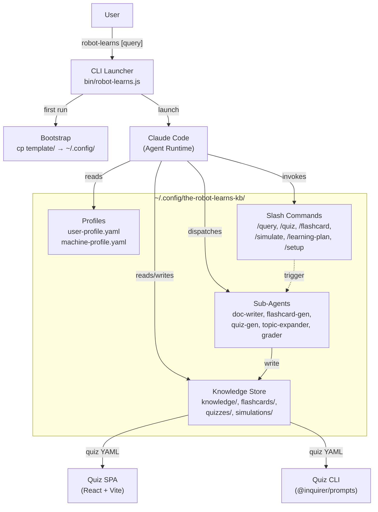

# Project Architecture

## Overview

TRL-KB (The Robot Learns KB) is a **cloud application with a local agent workspace**. The hosted therobotlearns.com app is the primary product surface for accounts, synced knowledge bases, team learning, dashboards, and integrations. The CLI launcher bootstraps a workspace directory at `~/.config/the-robot-learns-kb/`; Claude Code operates there as a capture and generation agent, reading user profiles, answering questions calibrated to expertise level, and generating documentation, flashcards, quizzes, and simulations as persistent YAML/Markdown artifacts that can sync to the cloud app.

Distribution is dual: a shell script (`bin/robot-learns`) for monorepo use, and an npm package (`the-robot-learns`) for standalone installation.

## System Diagram

## Core Components

| Component | Location | Purpose |
|-----------|----------|---------|
| CLI Launcher | `bin/robot-learns.js` | Bootstraps config dir, launches Claude Code with optional query passthrough |
| Template System | `template/` | Self-contained agent environment copied to `~/.config/` on first run |
| Agent Brain | `template/CLAUDE.md` | Master instructions for the KB agent (profile reading, knowledge indexing, content generation) |
| Sub-Agents (5) | `template/.claude/agents/` | Specialized workers: doc-writer, flashcard-generator, topic-expander, quiz-generator, grader |
| Slash Commands (6) | `template/.claude/commands/` | User-facing entry points: query, learning-plan, quiz, flashcard, simulate, setup |
| Quiz SPA | `quiz-app/` | Standalone React app (Vite), builds to single HTML file for offline quiz taking |
| Quiz CLI | `quiz-cli/` | Terminal quiz runner using @inquirer/prompts, same quiz YAML format |
| Schemas | `schemas/` | 9 YAML schema examples documenting all data formats |

## Data Architecture

All user data lives under `~/.config/the-robot-learns-kb/` as flat YAML and Markdown files — no database, no lock-in.

| Data Type | Format | Indexing |
|-----------|--------|----------|
| Knowledge articles | Markdown + YAML frontmatter | `knowledge/index.yaml` + domain `_index.yaml` files |
| Flashcard decks | YAML (Anki-compatible, SM-2 scheduling) | `flashcards/_deck-index.yaml` |
| Quizzes + results | YAML definitions + YAML score history | Directory convention: `quizzes/results/` |
| Simulations | YAML scenario definitions | Directory convention: `simulations/results/` |
| User/machine profiles | YAML | Single files at config root |
| Session logs | Markdown | Date-prefixed filenames |

-> *See `schemas/*.yaml.example` for complete format documentation*

## Agent Dispatch Model

Claude Code acts as the orchestrator. When a slash command is invoked, the agent brain (`CLAUDE.md`) reads profiles to calibrate response depth, searches the knowledge index, and dispatches to specialized sub-agents:

| Agent | Model Tier | Responsibility |
|-------|------------|----------------|
| kb-doc-writer | Sonnet | Write and update knowledge articles |
| kb-flashcard-generator | Haiku | Generate spaced-repetition flashcard decks |
| kb-topic-expander | Haiku | Expand topic stubs into full articles |
| kb-quiz-generator | Sonnet | Create quizzes from knowledge content |
| kb-grader | Sonnet | Grade project submissions against rubrics |

## Quiz Runners

Two independent consumers of the same `quiz.yaml` format:

- **Quiz SPA** (`quiz-app/`): React + Vite, builds to a single self-contained HTML file. Supports multiple-choice, fill-in-blank, matching, and code questions with syntax highlighting.
- **Quiz CLI** (`quiz-cli/`): Terminal-based runner using `@inquirer/prompts`. Same question types, rendered for terminal interaction.

Both are pre-built and shipped in the npm package (`quiz-app/dist/`, `quiz-cli/dist/`).

## Key Design Decisions

- **Claude Code as runtime**: No custom server — the agent framework provides tool use, file I/O, and conversational UX for free
- **Local-first / no database**: All data is human-readable YAML/Markdown in the user's config directory, portable and version-controllable
- **Expertise calibration**: Profiles drive response depth — a beginner gets different explanations than an expert on the same topic
- **SM-2 spaced repetition**: Flashcards use the SuperMemo 2 algorithm for scheduling review intervals
- **Dual quiz distribution**: Browser SPA for rich interaction, terminal CLI for quick sessions — same data format for both
