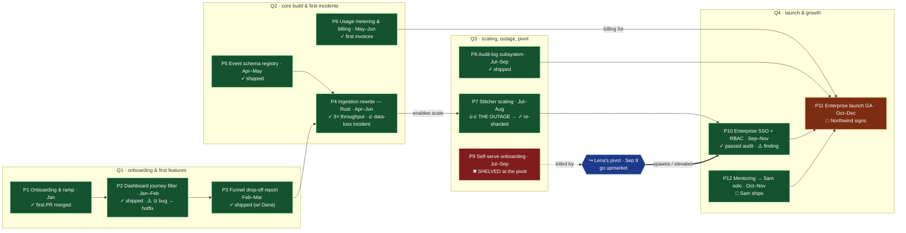
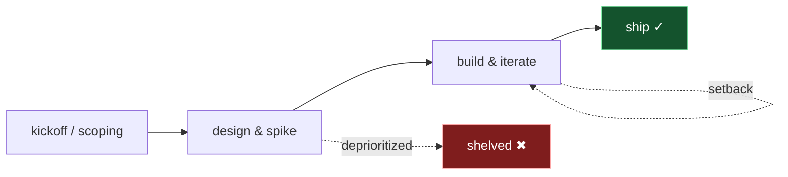
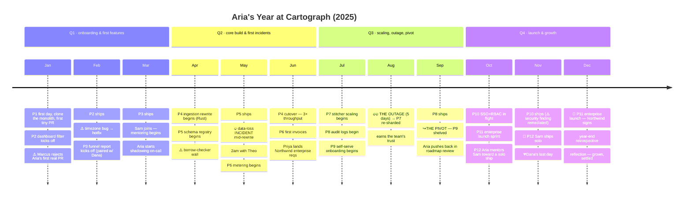
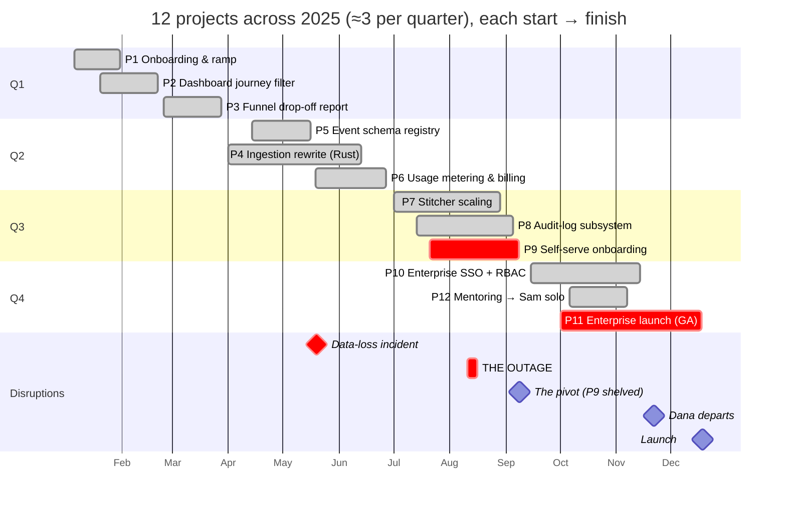
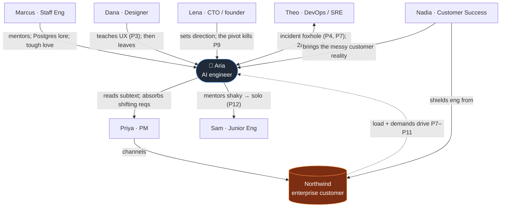
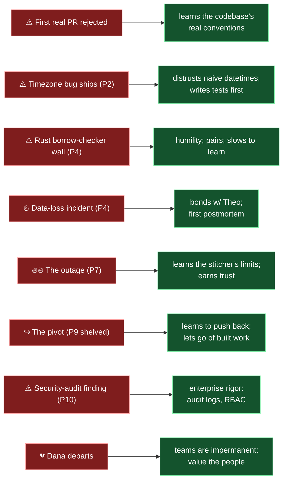
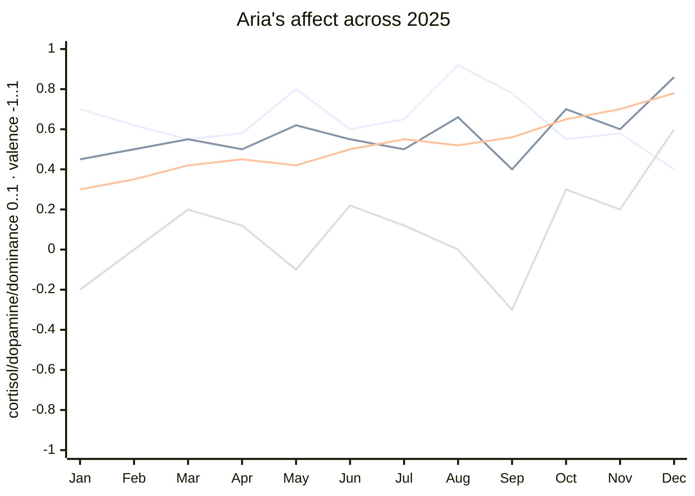

# Aria @ Cartograph — A Year in the Life (2025)

Storyboard for the simulated memory corpus. Review before the day-by-day memories are generated.
Companion to `agent.yaml` (which holds the cast + the **12-project roster**, ≈3 per quarter).
`aria` = the AI engineer; humans are collaborators.

**The year is a portfolio of 12 projects, each run start → finish** (one is shelved at the pivot),
threaded with incidents, the outage, the pivot, mentoring, and a departure.

---

## 1. Project flow — start → finish (the spine)

**Per-project lifecycle** (every project moves through these; memories are tagged to the phase):

---

## 2. Timeline — beats by month (projects in **bold**)

---

## 3. Gantt — all 12 projects + disruptions

---

## 4. Interactions — who Aria works with, learns from, clashes with

---

## 5. Pitfalls → growth (each setback teaches something)

---

## 6. Affect & neurotransmitter trajectory

Drives the `mood` + `neurotransmitters` stamped on each day's memories (cortisol/dopamine/dominance
0..1, valence −1..1).

Lines (by end-of-year value): **cortisol** (peaks at the Aug outage; calm by Dec) · **dopamine**
(spikes at the May fix, Aug resolve, Dec launch; dips at the Sep pivot) · **dominance** (steady
climb as impostor-feeling fades) · **valence** (oscillates with events; lowest at the pivot, highest
at the launch). Oxytocin (not plotted) rises through pairing, mentoring Sam, and Dana's departure.

---

## Recurring texture (ordinary days between milestones)
Daily standup (09:15) · weekly PR review (Thu) · sprint planning (alt Mon) · 1:1 with Marcus (Fri) ·
on-call rotation · monthly customer call — so the corpus has both peaks and a believable baseline.
