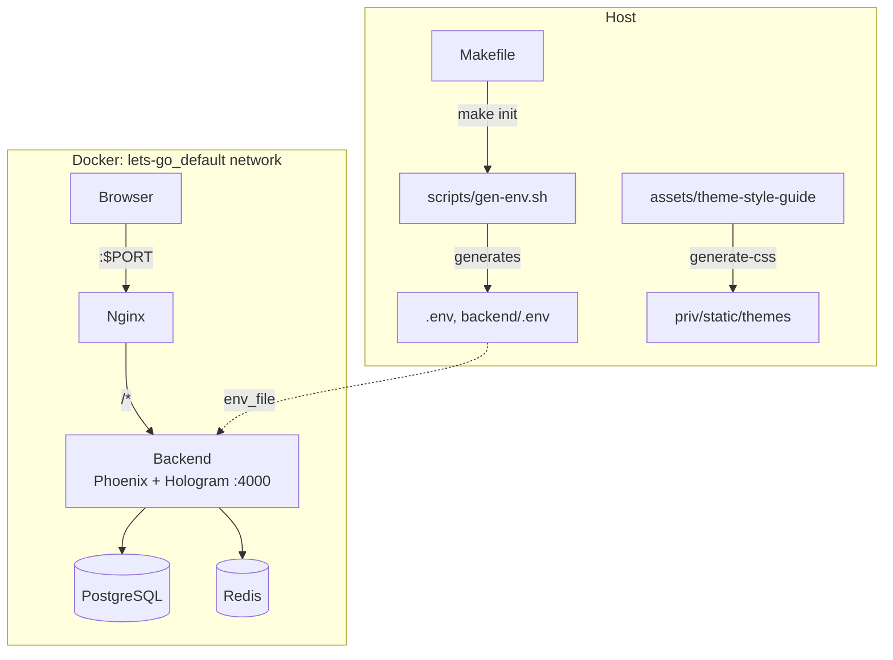

# Architecture — hologram-start-app

Reusable timely template for portfolio projects that prefer **Hologram** (isomorphic Elixir UI) over Next.js. Two Docker containers — **Phoenix + Hologram backend**, **nginx reverse proxy** — sharing Postgres/Redis on the external Docker network.

Sibling of [`components/start-app`](../../start-app) (Next.js). Backend domain logic, Liquibase schema, SSO, and style-guide YAML themes are shared; the UI layer is Hologram.

## System Diagram

## Core Components

| Component | Purpose |
|-----------|---------|
| **nginx** | Reverse proxy — all traffic to the unified backend |
| **backend** | Phoenix 1.8 JSON API + Hologram pages/commands |
| **Style-guide CSS** | YAML-driven design tokens served from `/themes/*` |
| **Hologram UI** | `TimelyWeb.Hologram.*` pages & components |
| **Makefile** | Build orchestration and project identity |
| **helm/hologram-start-app/** | K8s chart (backend-only pod) |

## Request Routing

| Pattern | Destination | Notes |
|---------|-------------|-------|
| `/api/*`, `/health` | backend | JSON API |
| `/auth/*` (OIDC/OAuth), `/sso/*` | backend | SSO redirect flows |
| `/auth/verify*`, `/auth/sso-callback` | Hologram pages | Token/code exchange UI |
| `/hologram/*`, `/themes/*`, `/css/*` | static | Client runtime + design system |
| `/*` | Hologram.Router | Pages |

## Client / Server Boundary (Hologram)

| Concern | Client (`action/3`) | Server (`command/3` / `init/3`) |
|---------|---------------------|----------------------------------|
| Form field edits, step transitions | yes | — |
| Login / register / profile save | optimistic UI only | Guardian + Users domain |
| SSO catalog, current user | seeded in `init` | session + DB |
| Cookie consent | banner visibility | session write |

Auth tokens for the Hologram UI live in the **Hologram/Phoenix session**. The JSON API continues to accept Bearer JWT for external clients.

## Design System

- Theme YAML: `assets/theme-style-guide/` (same facet set as start-app / styleguide)
- Generated CSS: `backend/priv/static/themes/design-system.generated.css`
- Components map 1:1 to styleguide React primitives (`Btn` → `StyleGuideBtn`, etc.) using semantic classes (`btn`, `card`, …)

## Technology Stack

| Layer | Choice |
|-------|--------|
| UI | Hologram ~> 0.10, Elixir transpiled to JS |
| API | Phoenix 1.8, Bandit, Guardian JWT |
| Database | PostgreSQL (PostGIS, pgvector) + Liquibase |
| Cache | Redis |
| Design | @noizu/styleguide CSS tokens |
| Proxy | Nginx |
| Orchestration | Docker Compose + Helm |
