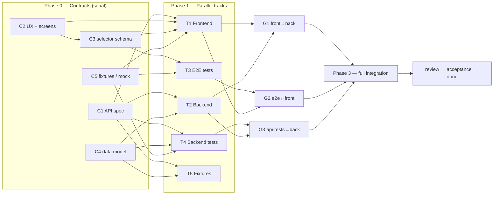

# Interface-First Fan-Out Patterns

The flagship pattern of this skill: freeze the **contracts** first, then let every **consumer** build against the frozen contract instead of waiting on a finished implementation. This document expands the SKILL.md Phase 0–3 summary into a working method and generalizes it to five pattern variants.

Vocabulary (from SKILL.md): work units `U{n}`, contracts `C{n}`, tracks `T{n}`, gates `G{n}`. A `CONTRACT-RFC` is the coordination-room message type used to request a change to a frozen contract.

---

## 1. The Insight

Sequential delivery — UX → frontend → backend → tests — serializes work that has no real data dependency on each other's *code*. Each stage waits on the previous stage's *implementation* only because nobody wrote down the *interface* between them.

**Replace the implementation dependency with a contract dependency.** Every consumer that can build against a frozen contract can start on day one:

- The backend doesn't need the frontend — it needs the **API contract** (`C1`).
- The frontend doesn't need the backend — it needs `C1` + the **UX spec** (`C2`) + the **selector schema** (`C3`).
- The e2e suite doesn't need the frontend to exist — it needs `C3`. Tests select by frozen `data-cy` names; the components that will later render those names are irrelevant to writing the spec.
- The fixtures/mock server doesn't need the backend — it needs `C1`.

> The e2e suite written before the frontend exists is the whole trick generalized: **two tracks key to one frozen contract, so they run in parallel even though one "depends on" the other in the sequential mental model.** The dependency was never on the code — it was on the interface, and the interface is now frozen.

Serial time is spent **only** on contracts. Everything downstream is parallel.

---

## 2. The Fullstack Fan-Out, In Full

### Phase 0 — Contracts (serial, small, frontier-model work)

Five contracts. Each is frozen the moment a consumer could complete its track **without asking a single clarifying question** (§3). Author `C1` with **trl-api-designer**; author `C3`'s discipline with the sibling skill **trl-ui-test-engineer**.

#### `C1` — API interface spec
- **Must contain:** every endpoint (method + path); request type per endpoint; response type per endpoint (success shape); complete error catalog (status codes + error body shape, RFC 9457 or house standard); auth model (who, which header/scheme, which endpoints are public); pagination/filtering conventions; content types.
- **Frozen when:** both the frontend track and the backend track can write code without asking a question. If the FE dev would have to guess a field name or the BE dev would have to invent an error code, it is not frozen.

#### `C2` — UX spec + screen inventory
- **Must contain:** screen list; per-screen states (empty / loading / error / populated); component inventory per screen; navigation/flow between screens; copy or copy-source; responsive/breakpoint intent; accessibility requirements.
- **Frozen when:** the frontend track can build every screen and state without inventing UX decisions, and `C3` can enumerate every interactive/assertable element from it.

#### `C3` — Cypress selector schema
- **Must contain:** the `data-cy` extended-attribute map — a stable `data-cy` name for **every** interactive or assertable element, defined **before any component exists**. Tests select **only** by these names; components **must** render them. Naming convention + ownership documented.
- **Frozen when:** the e2e track can write specs that reference only `C3` names, and the frontend track knows exactly which attributes it is contractually required to render.
- Defer the naming discipline, command layer, and anti-flake rules to the sibling skill **trl-ui-test-engineer** — it owns this contract's craft.

#### `C4` — data-model deltas / migrations
- **Must contain:** new/changed tables, columns, types, constraints, indexes; migration up/down; backfill plan; nullability and default decisions; the mapping from `C1` response fields to storage.
- **Frozen when:** the backend track can write migrations and the fixtures track can seed valid rows without guessing shapes.

#### `C5` — fixtures + stub/mock-server definitions
- **Must contain:** the mock-server behavior derived from `C1` (canned responses per endpoint, including error responses); seed datasets; fixture record shapes matching `C4`; the stub's contract-conformance guarantee (it answers exactly as `C1` promises).
- **Frozen when:** every track that runs pre-integration (FE against the mock, e2e against the stub, BE tests against fixtures) has a running double to build against.

### Phase 1 — Five parallel tracks (disjoint files, all simultaneous)

| Track | Builds | Keyed to | Runs against pre-integration | Typical file ownership |
|-------|--------|----------|------------------------------|------------------------|
| `T1` Frontend | Components, pages, client state | `C1` + `C2` + `C3` | `C5` mock server | `src/components/**`, `src/pages/**`, `src/state/**` |
| `T2` Backend | Endpoints, services, migrations | `C1` + `C4` | `C5` fixtures / in-proc | `src/api/**`, `src/services/**`, `db/migrations/**` |
| `T3` E2E tests | Cypress specs + command layer | `C3` (+ `C1` for intercepts) | `C5` mock server + built FE later | `cypress/e2e/**`, `cypress/support/**` |
| `T4` Backend tests | Unit / integration suites | `C1` + `C4` | `C5` fixtures + mocks | `test/api/**`, `test/services/**` |
| `T5` Fixtures | Mock server, seed data, stubs | `C1` + `C4` | itself (self-validating) | `fixtures/**`, `mocks/**`, `cypress/fixtures/**` |

Each track owns a disjoint file set (one owner per file — see merge-conflict-avoidance.md). `C3` attributes are the only surface `T1` and `T3` share, and it is frozen.

### Phase 2 — Pairwise integration gates (parallelizable in pairs)

Each gate replaces one stub with a real component. Only **one side moves** per gate, so failures localize.

| Gate | Integrates | Entry criterion (verifiable) |
|------|-----------|------------------------------|
| `G1` front ↔ back | `T1` real FE ↔ `T2` real BE | Contract conformance **both sides**: BE responses match `C1`; FE consumes real responses with no shape errors |
| `G2` e2e ↔ front | `T3` specs ↔ `T1` real FE, API still mocked (`C5`) | Every `C3` selector resolves against real components; specs green against mocked API |
| `G3` api-tests ↔ back | `T4` suite ↔ `T2` real BE | Suite green against the real service, not mocks |

`G1`, `G2`, `G3` have no ordering dependency on each other — run them as three parallel pairs. The critical path through Phase 2 is one gate, not three.

### Phase 3 — Full integration

Integrated **test suite** (real `T3` specs, real `T4` suites) against the integrated **system** (real FE + real BE, mock server removed).

**"Integrated" evidence looks like:**
- `T3` Cypress specs green against real FE **and** real BE (no `cy.intercept` stubbing the API under test).
- `T4` suites green against the deployed/running BE.
- Mock server (`C5`) no longer in the request path for any passing test.
- Every `C1` endpoint exercised by at least one green test; every `C3` selector resolved by at least one green spec.
- Then: review → acceptance-criteria check → done.

### The DAG

---

## 3. Contract Quality Bar

> A contract is **freeze-ready** when a consumer can complete its entire track without a single clarifying question.

That is the whole test. Read each contract as the consumer who must build against it and ask: *is there any field, code, name, state, or shape I would have to guess?* If yes, it is not frozen — resolve the ambiguity first.

**Post-freeze ambiguity = `CONTRACT-RFC`.** When a consumer hits an unanswered question after freeze, it does not guess and does not patch the contract unilaterally — it files a `CONTRACT-RFC` in the coordination room and the coordinator arbitrates.

**RFC cost grows with parallel work in flight.** A contract change is not free — every track keyed to that contract potentially reworks:

- Change `C1` after freeze → `T1`, `T2`, `T4`, `T5` all re-examine, and any code already written against the old shape is rework.
- Change `C3` after freeze → `T1` re-renders attributes **and** `T3` re-selects.

The intuition: **RFC cost ≈ (work already done by consuming tracks) × (number of consuming tracks).** Early in Phase 0 an RFC is nearly free. Deep in Phase 1 with five tracks running, one `C1` RFC can invalidate four tracks' work. This is exactly why Phase 0 is frontier-model serial time — the cost of under-specifying is paid back multiplied.

---

## 4. Stubbing Strategies

The stub is what makes "build against the contract, not the implementation" real. Keep **all** stubs owned by the fixtures track (`T5`) so neither `T1` nor `T2` blocks on the other and no stub is duplicated.

| Strategy | What it is | Best for | Owned by |
|----------|-----------|----------|----------|
| Contract-generated mock server | Server generated/derived from `C1` that answers exactly as promised (incl. errors) | FE (`T1`) and e2e (`T3`) needing a live API before BE exists | `T5` |
| Fixture seams | Injectable seams in code that return fixture data instead of hitting a dependency | BE tests (`T4`), FE state layers | `T5` supplies data; consuming track owns the seam |
| Recorded fixtures | Real responses captured once, replayed deterministically | High-fidelity replay once BE has an early build; regression stability | `T5` |

Principles:
- **One owner for stubs.** `T5` owns `mocks/**` and `fixtures/**`. `T1`/`T2` consume; they never fork their own copy.
- **The stub is contract-conformant by definition.** If the mock and `C1` disagree, that is a `C5`/`C1` bug, not a per-consumer workaround.
- **Stubs retire at gates.** Each Phase-2 gate swaps a stub for the real thing; Phase 3 removes them from the path entirely (§Phase 3 evidence).

---

## 5. Pattern Variants

The fullstack case is one instance of a general move: **find the interface, freeze it, fan out the consumers.** It applies wherever a shared surface can be named before it is implemented.

| Variant | Contract(s) frozen first | Parallel tracks unlocked | No-FE? |
|---------|--------------------------|--------------------------|--------|
| API-only feature | `C1` + `C4` + `C5` | backend, backend-tests, fixtures | yes |
| Data pipeline | record/schema shapes | extract, transform, load, tests | n/a |
| Design-system component | props + tokens contract | component, story, visual-test | n/a |
| Migration | old↔new interface adapters | migrate-consumers (per consumer), tests | n/a |
| Docs-alongside | same code contracts | docs track ‖ code tracks | n/a |

### API-only feature
Drop `T1`/`C2`/`C3` entirely. Freeze `C1` + `C4`, stand up `C5`. Parallel tracks: backend (`T2`), backend tests (`T4`), fixtures (`T5`). Gate is `G3` only, then integration. Consumers of the API are external and key to `C1` on their own schedule.

### Data pipeline (schema-first)
The contract is the **record shape** at each stage boundary, not an HTTP API. Freeze the input schema, intermediate schema(s), and output schema. Then extract, transform, and load run as parallel units — each keyed to the schema at its boundaries, each tested against fixture records of those shapes. Integration gates join adjacent stages (extract↔transform, transform↔load).

### Design-system component
Contract = **props interface + design tokens**. Freeze the prop names/types and the token set. Parallel: the component implementation (`T1`), its stories/documentation (`T2`), and its visual/interaction tests (`T3`) — all keyed to the same prop+token contract. The visual test is written against props that don't yet render, exactly like e2e-before-frontend.

### Migration (adapter-first)
Freeze the **old→new interface adapters** first — the shim that lets code speak either interface. Once the adapter contract is frozen, migrating each consumer is an independent parallel unit (one track per consumer or consumer group), plus a test track proving old and new paths agree. Consumers never block on each other because they all target the frozen adapter.

### Docs-alongside
The docs track keys to the **same contracts** (`C1`–`C4`) as the code tracks, so documentation is written in parallel with implementation rather than after it. Docs drift is caught at the same gates: if a `CONTRACT-RFC` changes `C1`, docs is a consuming track and reworks like any other.

---

## 6. When NOT to Use

Interface-first fan-out pays for itself only when the interface can be known before the implementation and the work is big enough to parallelize. Skip it when:

- **The interface can't be known up front** — genuinely exploratory work where you don't yet know the endpoints, the schema, or even the shape of the answer. **Spike first** (throwaway exploration to discover the interface), *then* freeze a contract and fan out. Freezing a contract you don't understand yet just guarantees expensive `CONTRACT-RFC` churn.
- **Single-file / single-owner changes** — there is no seam to freeze and no second consumer to unlock. Just do the change.
- **Work smaller than its coordination overhead** — if authoring five contracts, standing up a mock server, and running three gates costs more than the serial implementation would, the fan-out is negative-value. Parallelism has fixed overhead; the work must exceed it.

Rule of thumb: if you cannot name at least two consumers that would each start immediately given a frozen contract, there is nothing to fan out.
