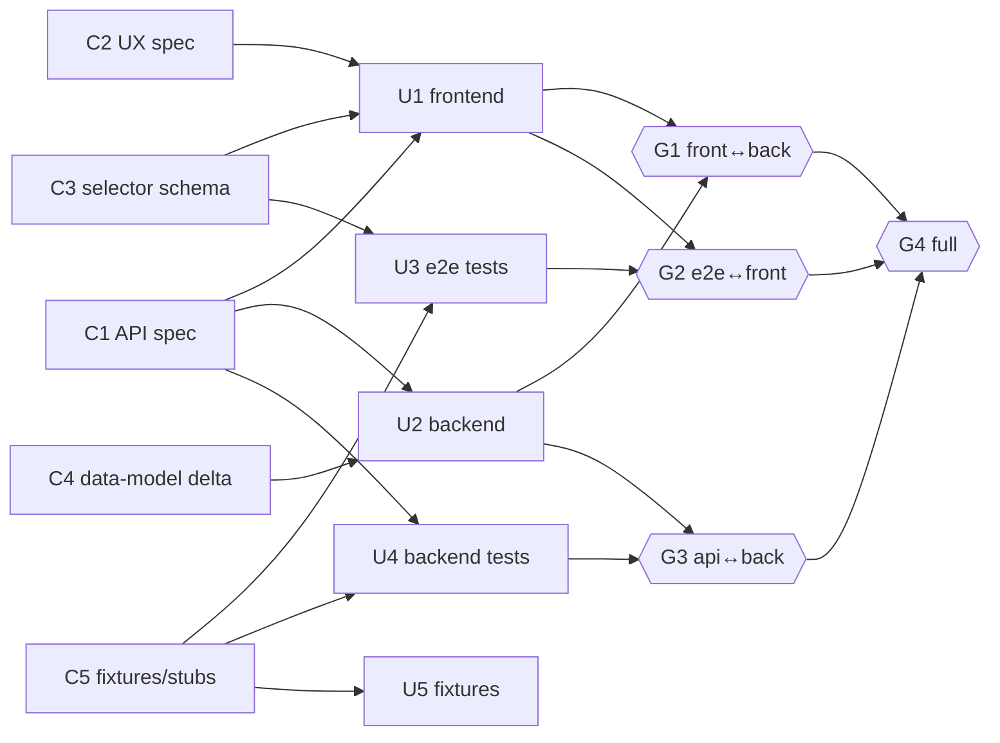

# Parallelization Planning — the Work-DAG Method

The methodological core of this skill. A feature becomes a directed acyclic graph of
work units scheduled onto a fleet of agents. You plan **structure** (what blocks what);
wall-clock time falls out of the structure and the fleet size. If a date appears in the
plan, the plan is wrong.

Notation is shared across the skill: contracts **C{n}**, work units **U{n}**, tracks
**T{n}**, gates **G{n}**. IDs are stable — tickets and room messages reference them.

---

## 1. The model

A plan is five element types and nothing else:

| Element | Definition | Invariant |
|---------|-----------|-----------|
| Work unit **U** | Smallest independently assignable piece of work | One owner, one deliverable, verifiable in isolation |
| Blocking edge | "U_b cannot start until U_a's output exists" | Only true data/contract dependencies survive |
| Track **T** | A chain of work units sharing one owner | Owns a disjoint file set for its whole life |
| Gate **G** | Barrier where tracks synchronize / integrate | Entry criteria are mechanically verifiable |
| Contract **C** | Frozen artifact standing in for a blocking edge | Versioned; post-freeze changes go through the coordinator |

**A plan is a DAG scheduled onto a fleet.** Nodes are units and contracts; edges are
blocking dependencies; tracks are the paths a single owner walks; gates are the merge
points. The fleet is the parallel machine you schedule onto.

**Wall-clock is emergent, never an input.** You do not decide "this takes three days."
You decide the DAG shape, then read the schedule off it: with unlimited agents, duration
= critical path length; with N agents, it is the critical path stretched by contention
for the N slots. Change the shape (cut an edge, split a unit) and the duration changes.
Add agents past the graph's width and nothing changes. This is why the plan holds no dates.

**Planning procedure (one pass):**
enumerate deliverables → draw only true dependencies → attack every edge → group surviving
chains into tracks → partition file ownership → place gates → assign to the fleet.

---

## 2. Dependency classes

Every edge you draw belongs to one of four classes. Only one class is load-bearing; the
other three are removable, and removing them is where parallelism comes from.

| Class | What it means | Detection question | Attack move | Keep? |
|-------|---------------|--------------------|-------------|-------|
| **Data** | U_b consumes a value U_a computes at runtime/build | "Does B read a byte A actually produced?" | None — this is real. Sequence it. | Keep |
| **Contract** | U_b needs the *shape* of A (types, routes, schema), not A's implementation | "Does B need A's behavior, or only its interface?" | Extract the shape into a frozen **C**; both sides depend on C, not each other | Replace |
| **Resource** | U_a and U_b touch the same file / table / port / env | "Would these collide only because they share a location?" | Partition ownership, or isolate (worktree, schema, fixture DB) | Remove |
| **Habit** | "We always do X before Y" with no artifact passing between them | "What output of X does Y actually read? (none)" | Delete the edge | Delete |

The single most valuable move is **contract → replace**: the sequential chain
`design → backend → frontend → tests` is almost entirely contract edges. Freeze the API
shape, the selector schema, and the data-model delta as contracts, and all four collapse
into one contract unit followed by four parallel units. See §3 for the mechanics and
[interface-first-patterns.md](interface-first-patterns.md) for the full application.

---

## 3. The edge attack

For **every** edge in the draft DAG, run the challenge:

> Could a **contract**, **stub**, **fixture**, or **ownership split** remove this edge?

- **Contract** — freeze the interface A exposes; point B at the frozen artifact. (contract edges)
- **Stub** — give B a fake A that satisfies the contract so B builds against the fake. (contract edges, lets B start at t=0)
- **Fixture** — give B canned data instead of A's live output. (data edges that are only about *sample* data, not production values)
- **Ownership split** — divide the shared resource so A and B never touch the same location. (resource edges)

An edge survives only when it is a genuine data edge with no fixture substitute. Record the
survivor and its class in the plan's edge-audit table — an unaudited edge is an
unchallenged assumption.

**Worked mini-attack** — a generic "add notification preferences" feature, raw edges first:

| # | Raw edge | Class | Attack outcome |
|---|----------|-------|----------------|
| 1 | frontend ← backend API | contract | **Replace** → both depend on `C1` API spec; frontend builds against stub |
| 2 | frontend ← UX design | contract | **Replace** → freeze `C2` screen inventory + spec; frontend keys to it |
| 3 | e2e tests ← frontend | contract | **Replace** → both key to `C3` selector schema; e2e runs against stub first |
| 4 | backend ← data-model migration | data | **Keep** → backend reads columns the migration creates; sequence `C4 → U_backend` |
| 5 | backend tests ← backend | contract | **Replace** → tests target `C1` mocks; author in parallel with backend |
| 6 | e2e tests ← seed data | data(sample) | **Fixture** → canned seed `C5`; remove edge to any live producer |
| 7 | frontend ← "backend goes first" | habit | **Delete** → no artifact passes; pure sequencing reflex |
| 8 | backend + frontend ← same `routes.ts` | resource | **Remove** → split: backend owns `api/`, frontend owns `web/`; shared types live in `C1` |

Eight raw edges, one surviving data edge (#4). The other seven convert to five contracts
plus a partition — turning a serial chain into five tracks that start together.

---

## 4. Work-unit sizing

A work unit is right-sized when it has **one owner, one deliverable, and is verifiable in
isolation** (its own tests / contract-conformance check pass without any sibling landing).

**Too big** — symptoms and cost:
- Hidden internal serialization: the "unit" is really design-then-build-then-test wearing one ID. It cannot be handed to one agent without that agent going serial inside it.
- Unstealable: if the owner stalls, no one can pick it up mid-flight because its state lives in one head/session.
- Spans the ownership map: it touches files two tracks want → it is a contract or an integration unit in disguise, not a track unit.
- **Fix:** split at the internal contract boundary. The design half becomes a **C**; the build/test halves become parallel **U**s.

**Too small** — symptoms and cost:
- Coordination overhead (CLAIM + STATUS + DONE + a gate check) rivals the work itself.
- Produces cross-unit chatter for edits that one owner would have made without a handoff.
- **Fix:** merge adjacent tiny units under one owner into a single track unit.

**Rule of thumb:** a unit's real work should outweigh its coordination overhead by roughly
**an order of magnitude**. If claiming, reporting, and gating a unit costs ~5 minutes of
protocol, the unit should be tens of minutes of work, not five. Below that ratio, merge;
far above it (and internally serial), split.

---

## 5. Plan metrics

Read these four numbers off the finished DAG. They tell you whether the plan is actually
parallel and where more fleet stops helping.

| Metric | Definition | Good looks like |
|--------|-----------|-----------------|
| **Critical path length** | Longest chain of blocking edges, C→U→G inclusive | As short as the surviving data edges allow; dominated by contracts + integration, not implementation |
| **Width** | Max units runnable at once (max antichain) | ≥ your usable fleet size during Phase 1 |
| **Parallelism factor** | total units ÷ critical path length | > 1 means real fan-out; ≈ 1 means a disguised sequence |
| **Phase-0 serial fraction** | contract work ÷ total work | Small but non-zero — a few percent. Zero means unfrozen shared surfaces (conflicts coming); large means over-specifying |

**What good looks like:** a short critical path made mostly of C (Phase 0) and G (integration)
nodes, a wide middle where implementation/test units run together, parallelism factor
comfortably above 1, and a Phase-0 fraction just large enough to freeze every shared surface.

**When adding fleet stops helping — the width limit.** Duration with N agents cannot drop
below the critical path no matter how large N is; and agents beyond the graph's **width**
sit idle because there is nothing unblocked to claim. If you want to go faster after that,
you cannot buy it with more agents — you must **reshape the graph**: cut a surviving edge
with a new contract, or split a critical-path unit so the path itself shortens.

---

## 6. Gate placement

Gates are synchronization barriers. Place them so integration is incremental and
verifiable, never a single big-bang merge.

- **Pairwise before global.** Integrate two tracks at a time (`G1: front↔back`,
  `G2: e2e↔front`, `G3: api-tests↔back`) before the one global gate (`G4: full integration`).
  A pairwise gate localizes any failure to two known tracks; a global-only gate leaves you
  bisecting the whole fleet's output at once.
- **One moving side per gate.** Order merges so each gate integrates a fresh track into an
  already-settled base — exactly one side is changing. Two moving sides means you cannot
  tell which introduced a failure.
- **Mechanically verifiable entry criteria — never vibes.** A gate's entry test must be a
  command with a pass/fail exit: contract-conformance tests pass both sides, the Cypress
  suite is green against the real frontend with a mocked API, the API suite is green against
  the real backend. "Looks integrated," "seems fine," "reviewer is happy" are not entry
  criteria; if you cannot name the command that proves the gate, the gate does not exist yet.

| Gate | Joins | Entry criterion (a command that exits 0) |
|------|-------|-------------------------------------------|
| G1 | T_front + T_back | contract-conformance suite passes on both sides |
| G2 | T_e2e + T_front | Cypress green vs real frontend, mocked API |
| G3 | T_apitests + T_back | API suite green vs real backend |
| G4 | all | integrated suite green end-to-end |

---

## 7. Notation

Express the DAG two ways in the plan file — a machine-checkable adjacency list and a mermaid
picture. Both encode the same `C → U → G` structure.

**Adjacency list** (`producers ──▶ consumer`), true edges only:

```
C1,C2,C3 ──▶ U1   (frontend impl)
C1        ──▶ U2   (backend impl)      C4 ──▶ U2   (data-model delta, data edge)
C3,C5     ──▶ U3   (e2e specs)
C1,C5     ──▶ U4   (backend tests)
C5        ──▶ U5   (fixtures/mock server)
U1,U2     ──▶ G1   (front↔back)
U3,U1     ──▶ G2   (e2e↔front)
U4,U2     ──▶ G3   (api-tests↔back)
G1,G2,G3  ──▶ G4   (full integration)
```

**Mermaid** — the fullstack fan-out (contracts fan out to a wide parallel middle, gates
fan back in):



The waist of the diagram — U1…U5 all live and unblocked at once — is the plan's width.

---

## 8. Anti-patterns

| Anti-pattern | Smell | Correction |
|--------------|-------|------------|
| **Habit edges** | "We always do backend first" with no artifact passing | Run the edge attack; delete edges no output crosses (§2 habit row) |
| **Date / estimate leakage** | Any "~2 days", sprint, or milestone in the plan | Strip it. Duration is emergent (§1, §5); express order only as blocking edges |
| **Mega-units** | One unit spanning design+build+test or two tracks' files | Split at the internal contract boundary; the design half becomes a C (§4) |
| **Vibes gates** | Entry criterion is "looks done" / "reviewer happy" | Replace with a command that exits 0 (§6); no command → no gate |
| **Org-chart DAG** | Edges mirror team/agent boundaries, not data flow | Redraw from deliverables and true dependencies; assign owners *after* the graph exists, not before |
| **Unfrozen shared surface** | Two tracks edit the same types/schema; Phase-0 fraction ≈ 0 | Lift the surface into a frozen contract C; edits go via CONTRACT-RFC |
| **Silent re-plan** | Coordinator reshapes the DAG mid-flight in their head | Amend the shared plan file and re-broadcast; the plan file is the single source of truth, not one agent's memory |

---

## 9. Cross-references

- **[interface-first-patterns.md](interface-first-patterns.md)** — the flagship application of
  this method: the contract-first fullstack fan-out (Phase 0 contracts → parallel
  frontend/backend/test/fixture tracks → pairwise gates) and its variants. §2's
  contract-replace move and §7's mermaid are the general form; that file is the concrete play.
- **[merge-conflict-avoidance.md](merge-conflict-avoidance.md)** — the ownership-partition
  detail behind §2's *resource* class and §4's "spans the ownership map": exclusive
  file-ownership maps per track, contract freezes, workspace isolation, and integration order
  that keeps every gate at one moving side.
