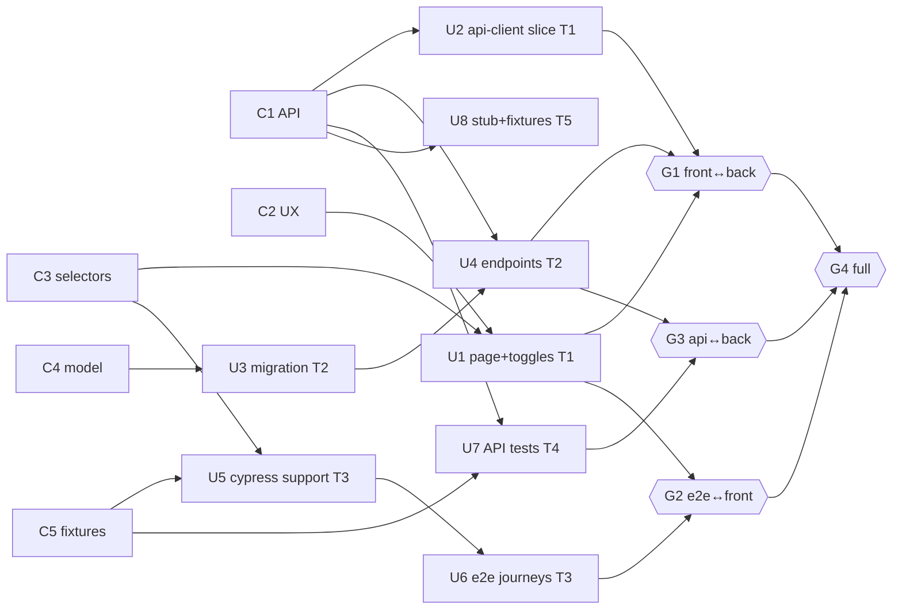

# Worked Example — Notification Preferences (end to end)

> One feature taken through all eight phases: intake → decompose → partition → staff →
> provision → coordinate → integrate → close. Every artifact below is real (abridged where
> long), using the IDs, message types, and templates defined in `SKILL.md`, the
> playbook, and `assets/`. Read those first; this file shows them working together, it does
> not redefine them.

**Transport note (read once).** As of the 2026-07-16 tobor surface, **chat rooms, tickets, and
stories are not yet callable** — the live tools are Organization/Project/Session CRUD plus the
discovery meta-tools. So this example creates the umbrella object with a **real** `Session.Create`
`ToolCall` (org slug resolved from `$NPL_ORG` first, because the MCP layer does not expand env
vars), and runs the entire room/ticket protocol over repo files:

| Protocol object | Interim file transport |
|-----------------|------------------------|
| Work plan | `project-management/work-plans/notification-preferences.md` |
| Ticket (per work unit) | `project-management/work-plans/notification-preferences.tickets/U{n}.md` |
| Room (append-only log) | `project-management/work-plans/notification-preferences.room.md` |

Room log line format is fixed: `{ISO8601} {handle} {TYPE} U{n} — {body}`. **The protocol is
identical to the eventual MCP surface; migration is mechanical** — swap file appends for
`Room.Post` calls and ticket writes for `Ticket.Update`, same IDs, same message types.

---

## Phase 1 — Intake

**Story excerpt** (`project-management/user-stories/notification-preferences.md`):

> *As a signed-in user, I want a settings page where I can turn email and push notifications on or
> off for each category — mentions, digests, billing — so I only get the alerts I care about. My
> choices persist across sessions and take effect immediately.*

**Deliverables**
- Settings page at `/settings/notifications` with a row per category and an email + push toggle each
- `GET`/`PUT /api/v1/me/notification-preferences` backed by a new table
- Cypress e2e coverage of load → toggle → save → confirm, keyed to a frozen selector schema
- Backend endpoint tests (auth, happy path, validation errors)
- A stub server + fixtures so frontend and e2e can run before the backend is live

**Acceptance criteria** (verifiable)
1. Toggling any category/channel and saving persists; reload shows the saved state.
2. `PUT` with an unknown category returns a structured `422` (not a `500`).
3. Unauthenticated request to either verb returns `401`.
4. e2e suite is green against the real frontend + stub API; API suite green against the real backend.

**Out of scope**: per-device push routing, notification *delivery* itself, admin-side defaults,
localization of category labels.

---

## Phase 2 — Decompose (`plan-work`)

Full plan: `project-management/work-plans/notification-preferences.md`. Highlights below.

### Phase 0 contracts (serial, frontier-owned)

| ID | Contract | Substance | Consumers | Freeze |
|----|----------|-----------|-----------|--------|
| C1 | API interface spec | `GET`→`200 {preferences:[{category, channels:{email:bool,push:bool}}], updated_at}`; `PUT` same shape in/out; `401` unauth; `422` invalid category/channel | T1,T2,T4,T5 | ☑ frozen `v1` → `v1.1` |
| C2 | UX spec + screen states | One screen; states: `loading`, `loaded`, `saving`, `saved-toast`, `load-error` | T1 | ☑ frozen |
| C3 | Selector schema (`data-cy`) | see below (~14 attrs) | T1,T3 | ☑ frozen |
| C4 | Data-model delta | `user_notification_prefs(user_id, category, channel, enabled, timestamps)`, unique `(user_id,category,channel)` | T2 | ☑ frozen |
| C5 | Fixtures + stub definition | seed shape for 3 users; stub `GET`/`PUT` behavior incl. error cases | T3,T4,T5 | ☑ frozen |

**C3 selector schema** (templated; concrete expansion = 3 categories × 2 channels):
```yaml
notif-prefs-page            # page root
notif-prefs-loading         # skeleton
notif-prefs-load-error      # load failure banner
notif-prefs-row-{category}         # mentions | digests | billing  → 3
notif-prefs-toggle-{category}-{channel}  # {cat} × {email,push}   → 6
notif-prefs-save            # save button
notif-prefs-toast-saved     # success toast
```

### Work DAG



### Edge audit

| Edge | Class | Verdict |
|------|-------|---------|
| U1 (frontend) → U6 (e2e) | **habit** | **Deleted.** Both key to C3; the e2e specs target `data-cy`, not the built DOM. Authoring needs C3 frozen, not U1 done. |
| U4 (backend) → U1/U2 (frontend) | **habit** | **Deleted.** Frontend keys to C1 + runs against the C5 stub (U8). "FE waits for BE" is convention, not data. |
| U4 (backend) → U7 (API tests) | **habit** | **Deleted (cut by C1).** Tests are authored against the C1 spec and run against the stub; the *real*-backend run is deferred to gate G3. |
| C4 → U3 → U4 | **data** | Kept. Endpoints need the table to exist; migration is a true prerequisite. |
| U5 → U6 | **resource** | Kept. Journey specs consume the support/command layer authored in U5 (same track, one owner). |
| C1 → U2, U4, U7, U8 · C3 → U1, U5 · C4 → U3 | **contract** | Kept by design — these are the frozen cut points that make the fan-out legal. |

Two habit edges removed, one serial chain (C1→FE→e2e) collapsed by the C1/C3 freezes; three true edges remain.

### Gates

| ID | Joins | Entry criteria (verifiable) | Merge order |
|----|-------|-----------------------------|-------------|
| G1 | T1+T2 | FE client (U2) against real BE (U4): response conforms to C1.1 both verbs | 2nd |
| G2 | T3+T1 | Cypress green against real FE (U1) + C5 stub | 3rd |
| G3 | T4+T2 | API suite (U7) green against real BE (U4) | 1st (one moving side) |
| G4 | all | Integrated suite green end-to-end (real FE + real BE) | last |

### Plan metrics
- **Critical path**: `C-phase → U3 → U4 → G3 → G4` — 4 hops after contracts (the backend chain is the deepest).
- **Graph width**: 6 units runnable the instant contracts freeze (U1, U2, U3, U5, U7, U8); U4 and U6 are the only intra-track waits.
- **Parallelism factor**: 8 implementation units over a 2-deep longest track chain ≈ **4× on the build phase**; ≈ **2× end-to-end** once the serial contract phase and the two on-path gates are counted against a single-worker baseline of `contracts + 8 units + integration`.

---

## Phase 3 — Partition (ownership map)

Every touched path maps to exactly one track (or `contract:` / `integration:`).

| Track | Exclusive globs |
|-------|-----------------|
| T1 Frontend | `frontend/src/pages/NotificationPreferences/**`, `frontend/src/components/preferences/**`, `frontend/src/api/notificationPreferences.ts` |
| T2 Backend | `backend/lib/app_web/controllers/notification_preferences_controller.ex`, `backend/lib/app/accounts/notification_prefs.ex`, `backend/priv/repo/migrations/*_create_user_notification_prefs.exs` |
| T3 E2E | `frontend/cypress/e2e/notification-preferences.cy.ts`, `frontend/cypress/support/preferences.ts` |
| T4 Backend tests | `backend/test/app_web/controllers/notification_preferences_controller_test.exs`, `backend/test/app/accounts/notification_prefs_test.exs` |
| T5 Fixtures/stub | `frontend/cypress/fixtures/notification-preferences/*.json`, `tools/stub-server/notification-preferences.mjs` |

**Contested path → resolution.** T1 needs the preferences calls to live somewhere, and its first draft
added them to the shared `frontend/src/api/client.ts` — a file every feature touches. Two tracks (and
future features) editing `client.ts` is a merge conflict scheduled in advance.
**Resolved by extraction**: the preferences API slice moves into a track-owned
`frontend/src/api/notificationPreferences.ts` that *imports* the base `client`; `client.ts` itself is
untouched. The one-line barrel re-export in `frontend/src/api/index.ts` is flagged `integration:` and
applied at G1, not by a track.

Ownership check: ☑ total, no path claimed twice, no touched path unowned.

---

## Phase 4 — Staff (`assemble-fleet`)

Roster: `project-management/work-plans/notification-preferences.roster.md`.

| Handle | Harness | Provider / model | Class | Persona | Track | Rationale |
|--------|---------|------------------|-------|---------|-------|-----------|
| coord | claude-code | Claude (frontier) | frontier | Fleet Coordinator | — | Contracts, arbitration, gates; never edits track files |
| mira | codex-cli | GPT-5-class (frontier OpenAI) | frontier | Mira — pragmatic FE craftsperson, a11y-minded | T1 | Frontend needs judgment on state/a11y; Codex strong on TS/React repo edits |
| doryu | noizu-intellect | Claude (frontier) | specialized | Doryu — OTP backend eng, contract-literal | T2 | Backend is Phoenix/Ecto; noizu-intellect is Elixir-native |
| vex | opencode | DeepSeek | bulk | **Vex — adversarial test engineer** | T3 | e2e is well-specced against C3/C5; Vex probes edge journeys |
| ledger | codex-cli | DeepSeek | bulk | Ledger — API tester, RFC 9457-strict | T4 | API tests are tightly specced by C1; cheap bulk reasoning fits |
| cobbler | opencode | Qwen (local, Ollama) | local | Cobbler — deterministic fixtures builder | T5 | Fixtures are high-volume + non-sensitive; free local grind |
| scribe | (Groq) | Llama (Groq-hosted) | fast | Scribe — terse digester | — | Room STATUS digests on demand; keeps coord frugal |

**Sanity checks** (from roster template):
- ☑ C-series design is frontier-only (coord + doryu authored C1/C4; coord owns C2/C3/C5)
- ☑ No frontier agent on mechanical passes (fixtures on local Qwen, not on Codex/Claude)
- ☑ Fast agent covers summarization (scribe)
- ☑ High-volume/non-private work on local model (T5)
- ☑ One owner per track; each agent knows its ticket IDs
- ☑ Fallback named for the at-risk provider: **DeepSeek → Claude Haiku in Codex CLI** (`ledger` → `ledger-2`)

---

## Phase 5 — Provision (`provision-coordination`)

**Step 1 — resolve slugs** (the MCP will not expand `$NPL_ORG`):
```bash
echo $NPL_ORG      # → noizu-labs
echo $NPL_PROJECT  # → npl
```

**Step 2 — create the session** (real `ToolCall`, resolved slugs substituted):
```jsonc
ToolCall(tool: "Session.Create", arguments: {
  "organization": "noizu-labs",
  "project":      "npl",
  "title":        "Notif-prefs fan-out",
  "description":  "Interface-first fan-out for the notification-preferences story. Plan: project-management/work-plans/notification-preferences.md · Room: project-management/work-plans/notification-preferences.room.md · Tickets: .../notification-preferences.tickets/U1..U8.md",
  "status":       "active"
})
// → { "session": { "id": "9f3b2a7e-1c4d-4a58-b0e2-6d7c8e5f1a90", "status": "active" } }
```

Session UUID `9f3b2a7e-1c4d-4a58-b0e2-6d7c8e5f1a90` becomes the parent context; plan and room file
paths are recorded in its description (above) and in the plan's Coordination block.

**Step 3 — tickets.** One file per unit. Example `notification-preferences.tickets/U7.md`:
```markdown
# U7 — API endpoint tests
- Track: T4 (backend tests) · Owner: ledger (fallback: ledger-2)
- Consumes: C1.1 (API spec) · runs against: U8 stub (:4010)
- Ownership: backend/test/app_web/controllers/notification_preferences_controller_test.exs,
             backend/test/app/accounts/notification_prefs_test.exs
- Feeds gate: G3 (api↔back)
- State: (updated by owner) — see last STATUS in room.md
```

**Step 4 — room charter** is the first (pinned) block of `notification-preferences.room.md`; the
append-only log follows it:
```markdown
# Coordination Room — notification-preferences   [PINNED CHARTER]
Session: 9f3b2a7e-1c4d-4a58-b0e2-6d7c8e5f1a90 · Coordinator: coord
Plan: project-management/work-plans/notification-preferences.md
Protocol: CLAIM/STATUS/BLOCKED/HANDOFF/CONTRACT-RFC/DONE · one type token per line.
Rules: claim before touching · stay in your ownership globs · contracts frozen (change only via
CONTRACT-RFC) · DONE needs evidence · durable state only · stay drop-safe.
Cadence: STATUS every meaningful step or 15m · Blocked threshold: 10m → coordinator acts.
--- log below (format: {ISO8601} {handle} {TYPE} U{n} — {body}) ---
```

**Step 5 — brief agents.** Each agent gets a one-line brief: *"Read charter (room.md head) + your
ticket U{n}.md; CLAIM before editing."* Reusable instruction-prompt template makes the Nth brief cost
one line.

---

## Phase 6 — Coordinate (`coordinate-execution`)

Abridged `notification-preferences.room.md` log (charter omitted):

```
2026-07-16T14:02:11Z coord    STATUS  G0 — Phase 0 frozen: C1 v1, C2, C3, C4, C5. Tracks may claim.
2026-07-16T14:03:40Z cobbler  CLAIM   U8 — stub server + seed fixtures from C1/C5
2026-07-16T14:04:02Z mira     CLAIM   U1 — prefs page + row/toggle components (C2,C3)
2026-07-16T14:04:31Z mira     CLAIM   U2 — api-client slice + save/load wiring (C1)
2026-07-16T14:05:10Z doryu    CLAIM   U3 — migration user_notification_prefs (C4)
2026-07-16T14:05:55Z vex      CLAIM   U5 — cypress support layer + selector bindings (C3,C5)
2026-07-16T14:06:20Z ledger   CLAIM   U7 — endpoint API tests vs C1 + stub (C1,C5)
2026-07-16T14:19:03Z cobbler  STATUS  U8 — stub GET/PUT live on :4010, 3 seed users, fixtures committed
2026-07-16T14:21:47Z doryu    STATUS  U3 — migration written; ecto up/down clean on shadow DB
2026-07-16T14:24:12Z mira     BLOCKED U2 — C1 error shape ambiguous: 422 body for unknown category unspecified
2026-07-16T14:31:08Z coord    CONTRACT-RFC C1 — add RFC9457 problem+json; 422 {type,title,detail,invalid-params[]} — impact: T1,T2,T4,T5
2026-07-16T14:33:20Z coord    STATUS  C1 — impact: U2(T1),U4(T2),U7(T4),U8(T5) rebase; U5(T3) keys to C3 only → NOT affected
2026-07-16T14:34:05Z coord    STATUS  C1 — RFC ACCEPTED as C1.1; error schema frozen; consumers rebase, T3 continue
2026-07-16T14:35:40Z cobbler  STATUS  U8 — rebased stub to C1.1; unknown category → 422 problem+json
2026-07-16T14:41:22Z doryu    DONE    U3 — migrated; `mix ecto.migrate` green; table (user_id,category,channel,enabled)
2026-07-16T14:42:10Z doryu    CLAIM   U4 — GET/PUT endpoints + service (C1.1,C4)
2026-07-16T14:58:39Z ledger   STATUS  U7 — 12/18 cases green vs stub; seeing provider throttle
2026-07-16T15:01:12Z ledger   BLOCKED U7 — DeepSeek 429 sustained — cannot proceed
2026-07-16T15:02:03Z ledger   HANDOFF U7 → ledger-2: 12/18 done; remaining PUT-422 + 401 + idempotency; branch t4-api-tests@f3a9c1
2026-07-16T15:03:50Z ledger-2 CLAIM   U7 — resumed from ticket U7.md + last STATUS; Claude Haiku in Codex CLI per roster fallback
2026-07-16T15:16:44Z mira     DONE    U1 — page + toggles render; data-cy 14/14 match C3; a11y roles pass
2026-07-16T15:19:10Z mira     DONE    U2 — client slice load/save + optimistic toast; rebased to C1.1
2026-07-16T15:20:33Z vex      DONE    U5+U6 — support commands + 6 journey specs green vs stub (incl 422 path)
2026-07-16T15:28:07Z ledger-2 DONE    U7 — 18/18 API cases green vs stub incl C1.1 problem+json
2026-07-16T15:41:52Z doryu    DONE    U4 — GET/PUT live; contract-conformance vs C1.1 green both verbs
2026-07-16T15:43:20Z scribe   STATUS  — digest: 8/8 units DONE; gates G1–G4 pending verifier
```

**What the coordinator did, narrated:**

- **CLAIMs / STATUS heartbeats** — six units claimed within four minutes of the freeze; the graph width of 6 is realized. STATUS lines keep every claim drop-safe.
- **BLOCKED → CONTRACT-RFC → ruling.** `mira` hits a real ambiguity: C1 v1 never specified the `422`
  body shape. She does **not** invent one (that would fork the contract silently) — she posts `BLOCKED`.
  Coord raises `CONTRACT-RFC C1`, runs **impact analysis across every consumer**: U2, U4, U7, U8 all
  serialize/parse the error and must rebase; **U5 (e2e) keys only to C3 selectors and is not affected.**
  Accepts as **C1.1**, bumps the version, broadcasts "rebase" to the four affected units and "continue"
  to T3. Because the change went through the coordinator, no track diverged from the frozen surface.
- **HANDOFF on provider failure.** `ledger` (DeepSeek) hits a sustained `429`. It does not silently
  stall past the 10m threshold — it posts its exact state (12/18, remaining cases, branch SHA) and hands
  off to the roster-named fallback `ledger-2` (Claude Haiku in Codex CLI). The successor resumes from
  **ticket U7.md + the last STATUS** — durable state, not session memory — and finishes to 18/18.
- **DONEs carry evidence** — test counts, conformance results, selector-match counts — never bare
  assertions.

---

## Phase 7 — Integrate (gates in merge order)

Gates opened in the plan's merge order — one moving side first, full integration last. Coord delegates
each entry-criteria check to the integration verifier; owning tracks integrate and reply `DONE G{n}`.

```
2026-07-16T15:52:10Z coord    STATUS  G3 — OPEN: U7 API suite vs real BE (U4)
2026-07-16T15:58:02Z ledger-2 DONE    G3 — 18/18 green vs real backend; `mix test` controller+context suites pass
2026-07-16T16:04:19Z coord    STATUS  G1 — OPEN: U2 client vs real BE (U4)
2026-07-16T16:09:44Z mira     DONE    G1 — contract-conformance GET+PUT match C1.1; barrel re-export (integration:) applied
2026-07-16T16:12:50Z coord    STATUS  G2 — OPEN: U6 e2e vs real FE (U1) + C5 stub
2026-07-16T16:18:33Z vex      DONE    G2 — 6/6 cypress specs green vs real frontend; toast + 422 paths covered
2026-07-16T16:22:05Z coord    STATUS  G4 — OPEN: integrated suite, real FE + real BE
2026-07-16T16:31:40Z coord    DONE    G4 — end-to-end suite green: load→toggle→save→reload persists; 401/422 verified
```

Entry-criteria evidence, gate by gate:
- **G3** (1st, backend-only moving side): `mix test` API suites 18/18 against the real controller — no stub.
- **G1** (front↔back): frontend client's serialized `GET`/`PUT` payloads conform to C1.1 both directions; the deferred `integration:` barrel re-export lands here, with backend as the single moving side already settled at G3.
- **G2** (e2e↔front): all six Cypress journeys green against the *real* built frontend (still the C5 stub for the API, per plan) — proves the DOM matches C3.
- **G4** (full): integrated suite against real FE + real BE — the acceptance journeys end to end.

No gate failed twice, so no gate was demoted to an investigation unit.

---

## Phase 8 — Close

**Acceptance verification** against the Phase 1 criteria:

| # | Criterion | Evidence |
|---|-----------|----------|
| 1 | Toggle + save persists across reload | G4 journey `load→toggle→save→reload` green |
| 2 | Unknown category → structured 422 | C1.1 problem+json; U7 case + U6 422 journey green |
| 3 | Unauthenticated → 401 | U7 auth case green vs real BE at G3 |
| 4 | e2e green (FE+stub), API green (real BE) | G2 (6/6) + G3 (18/18) |

**Close the session** (real `ToolCall`):
```jsonc
ToolCall(tool: "Session.Update", arguments: {
  "session": "9f3b2a7e-1c4d-4a58-b0e2-6d7c8e5f1a90",
  "status":  "completed"
})
// → { "session": { "id": "9f3b2a7e-…-1a90", "status": "completed" } }
```

**Plan-quality retro:**
- **Habit edge found late.** At G2 we noticed U6's journey specs implicitly assumed the toast
  auto-dismiss timing produced by U1 — a hidden frontend→e2e coupling the plan had *not* captured as a
  contract. It didn't bite (the stub matched), but it *should* have been in C3 as a toast-lifecycle
  clause. **Fix for next time:** the selector schema owns not just names but visibility/lifecycle
  semantics. This is exactly the kind of habit edge the audit is meant to catch pre-flight.
- **Serial fraction.** Only the Phase 0 contract authoring and the on-path chain `U3 → U4 → G3 → G4`
  were truly serial. Everything else fanned out. The one contract change (C1→C1.1) cost a single
  arbitration round, not a track rewrite, because it was caught as a `BLOCKED` rather than smuggled in.
- **Parallelism delivered.** Single-worker baseline = contracts + 8 units + 4 integrations, strictly
  sequential. The fleet collapsed the 8 build units onto a 2-deep critical chain (≈4× on the build
  phase) and absorbed a provider outage via HANDOFF with zero lost work — netting the projected ≈2×
  end-to-end, with the contract phase and two on-path gates as the irreducible serial floor.

**Migration reminder:** every `room.md` line and `U{n}.md` ticket here maps 1:1 onto the eventual
`Room.Post` / `Ticket.Update` calls — same IDs, same six message types. When the tobor surface lands
rooms and tickets, this whole run replays through the MCP unchanged.
