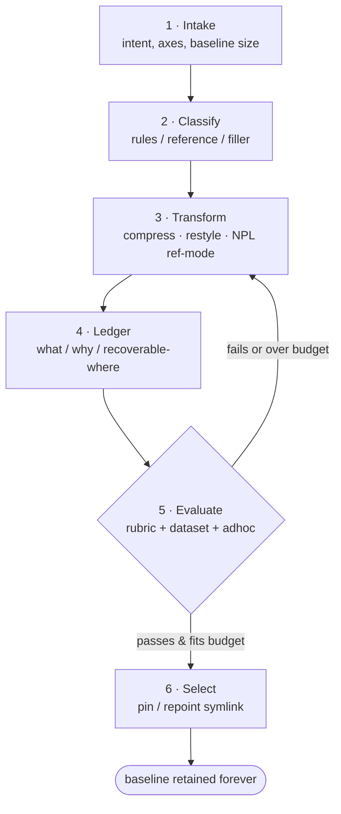

# Prompt Optimizer

Make a prompt as small as it can be while it still does its job — and prove which version does the job best.

## Overview

Prompt Optimizer takes an existing prompt — a CLAUDE.md, a system prompt, a slash command, an agent definition, a `.prompt` spec — and produces a smaller or restyled version that preserves the behavior the author actually needs. It treats compression as an engineering discipline, not a vibe: every byte dropped is recorded (what, why, recoverable-where), and every candidate is measured against an eval corpus rather than judged by eye. It provides:

- **Loss-accounted compression** — LLMLingua-family pruning applied in-LLM (budget controller, coarse-to-fine, iterative token pruning, question-aware retention) with a written loss ledger, so nothing disappears silently.
- **Style transforms** — restyle a prompt into an equivalent-behavior methodology (pure NPL, YAML meta-prompt, mermaid-as-instruction, checklist-imperative, pointer-index, telegraphic-symbolic) when the format itself is the compression axis.
- **NPL-powered compression** — emit prompts that fetch NPL element definitions on demand via `NPLLoad` at the necessary complexity tier instead of inlining them (lossless-by-reference), when NPL is available.
- **A prompt lifecycle** — a file-mode convention (`{name}.md.prompt` spec + `.{name}.md/` variants dir + best-eval symlink) and an MCP-served store spec (versioned records, `Prompt.Get`, bandit selection) that keep source → variants → evals → best-version selection in one place.

## Core Philosophy

**5 Principles:**

1. **Measure loss, don't guess it.** Compression that isn't scored against a corpus is a hope, not a result. Every candidate carries eval scores and a loss ledger; the ledger names each dropped fact and where it can be recovered. A smaller prompt that fails one eval case is a worse prompt, full stop.
2. **Style is a compression axis.** The same behavior can be specified as prose, YAML, a mermaid diagram, a checklist, or an NPL element set — and these cost wildly different token counts. Choosing the format is often a bigger win than pruning words inside a fixed format.
3. **Reference beats repetition.** The cheapest token is the one you don't ship. Behavioral rules must stay inline where the model needs them every turn; reference material should be denoted and pointed at (doc pointer, `NPLLoad` fetch, dependency ref) so it loads only when needed — verified to exist before it is cited.
4. **Evals decide, not aesthetics.** A dense, ugly prompt that scores 9/10 beats an elegant one that scores 7/10. Pinning, promotion, and bandit selection are driven by the eval corpus and observed behavior — never by which variant reads nicest.
5. **Declared intent drives what survives.** The caller states what the prompt is *for* (`key_requirements`, `protect`, `lossy_ok`, an intent statement). Compression is question-aware: the facts the declared intent needs are protected verbatim; everything else is fair game for the requested compactness level.

## When to Use This Skill

- **Shrink a bloated instruction file** — a CLAUDE.md, system prompt, or agent definition has grown past its budget and needs to lose weight without losing rules.
- **Hit a hard token budget** — the prompt must fit N tokens; the skill picks the compactness/style mix that fits and reports what it cost.
- **Build a variant corpus** — the author wants several styles/compactness levels of one prompt kept side by side, scored, with the best promoted.
- **Restyle a prompt** — convert a prose prompt into a YAML meta-prompt, mermaid instruction graph, checklist, NPL element set, or pointer-index because the format saves tokens or reads better to the target model.
- **Stand up prompt evals** — author `.prompt` spec files with `key_requirements`, an eval rubric, and a dataset so future variants can be scored and pinned.
- **Serve versioned prompts** — design an MCP prompt store where `Prompt.Get` returns the right version for a caller/intent/budget, with active-eval bandit selection.

> For building the skill or command a prompt lives inside, see **trl-skill-engineer** (`references/agent-playbook.claude-code.md`).
> For authoring the agent whose system prompt you are compressing, see **trl-agent-architect**.
> For prose clarity and readability of the source text (not its size), see **trl-technical-writer**.
> For generating the media asset a `.prompt` file might describe, see **content-media-engine** (`utilities/agent/media-tool/skill/content-media-engine/SKILL.md`).

## The Compactness Scale

`compactness` is a request axis, leveled like verbosity, with the explicit understanding that each level makes **known, declared sacrifices**. Levels 0–3 are lossless (facts retained). Level 4 is lossless *by reference* (facts moved to verified pointers, costing a fetch). Level 5 is lossy (facts dropped, declared).

| Level | Name | What survives | Known sacrifice | CLAUDE.md corpus analogue |
|-------|------|---------------|-----------------|---------------------------|
| **0** | Verbatim | Everything, byte-for-byte | None — original, typos included | `baseline-original` (11.6KB) |
| **1** | Edited-lossless | All facts; full words, no notation | Redundancy, filler, hedging | `plain-english-concise` (11.1KB) |
| **2** | Shorthand-lossless | All facts; abbreviations + symbols | Readability for the uninitiated | `shorthand-symbolic` (10.0KB) / `structured-data` (9.9KB) |
| **3** | Dense-lossless floor | All facts, inline, telegraphic | Prose flow; near the inline floor | `ultra-terse-min-loss` (8.1KB) |
| **4** | Lossless-by-reference | Behavioral rules inline; reference material denoted + pointer | A doc/`NPLLoad` read per referenced area | `pointer-index` (3.8KB) |
| **5** | Telegraphic-lossy | Only what the declared intent needs | Named facts dropped (ledgered), not recoverable in-prompt | `ultra-terse-lossy` (3.9KB) |

Insight from the corpus: dropping to level 5 (3.9KB) landed slightly larger than level 4 (3.8KB) while dropping ~4.2KB of facts — because most of the savings between level 2 and level 4 was **style** (~3.5KB), and the reference material (~4.2KB) was better *moved* than *deleted*. Reach for level 4 before level 5.

> Full scale semantics, per-level sacrifice statements, and the loss-accounting discipline live in `references/compression-methods.md` and `assets/compactness-scale.md`.

## Request Axes

A caller can specify any of these per invocation; defaults are settable at session, project, or agent level (see `references/mcp-prompt-entries.md` for the hierarchy).

| Axis | Values | Meaning |
|------|--------|---------|
| `compactness` | 0–5 | Target level on the scale above. |
| `token_budget` | integer | Hard ceiling; skill chooses the compactness/style mix that fits and reports the tradeoff. |
| `style` | pure-npl \| yaml-meta \| mermaid \| checklist \| pointer-index \| shorthand \| plain | Preferred methodology/format (optional). |
| `protect` | list of facts/areas | Must survive verbatim (behavioral rules, gotchas, exact commands). |
| `lossy_ok` | list of facts/areas | Loss is acceptable here — spend the budget savings on these first. |

When `token_budget` and `compactness` conflict, budget wins and the skill discloses the compactness level it had to reach. When `protect` and the budget conflict, `protect` wins and the skill reports the overage.

## Workflow Phases

| Phase | Action | Output |
|-------|--------|--------|
| 1. Intake | Read the source prompt; capture declared intent, `protect`, `lossy_ok`, and the target axis (compactness / budget / style). | A restated intent + a baseline byte/token count. |
| 2. Classify | Segment the prompt into behavioral rules (protect), reference material (candidate for reference-mode), and filler (candidate for pruning). | A segment map. |
| 3. Transform | Apply the chosen method — in-LLM compression, a style transform, or NPL reference-mode — honoring `protect` verbatim. | One or more candidate variants. |
| 4. Ledger | Record every drop: what, why, recoverable-where. Flag coreference/omission risks. | A loss ledger per variant. |
| 5. Evaluate | Score each candidate against the `.prompt` eval rubric + dataset; run adhoc cases for anything the dataset misses. | Eval scores per variant. |
| 6. Select | Pin/promote the best-scoring variant that fits the budget; repoint the symlink or set defaults. Keep the baseline forever. | A promoted best version + rationale. |

Evaluation gates selection: a variant that fails or overruns the budget loops back to Transform rather than shipping.

## Quick Start Guides

### Compress a single file to a budget
1. Read the source (e.g. `CLAUDE.md`). Ask the caller for `token_budget` or `compactness`, plus anything to `protect`.
2. Segment: rules (protect) vs reference (move) vs filler (prune) — Phase 2.
3. Apply in-LLM compression at the level needed to fit; if the format is the bottleneck, restyle instead (`references/style-transforms.md`).
4. Write the loss ledger. Report the new size, the level reached, and every dropped/moved fact.

### Build a variant corpus (file mode)
1. Create `{name}.md.prompt` from `assets/prompt-spec-template.md.prompt`: original body, `key_requirements`, `eval.rules`, `eval.dataset[]`.
2. Generate N variants into `.{name}.md/` — vary style/compactness/language — each with a `{slug}.meta.md` (`assets/variant-meta-template.md`).
3. Score every variant against the spec's dataset; record scores in the meta files.
4. Symlink `{name}.md -> .{name}.md/{best-slug}.md` (default = best eval), or honor a `pin` in the spec. Full convention: `references/file-mode-convention.md`.

### Restyle to a methodology
1. Pick the target from `references/style-transforms.md` (YAML meta-prompt, mermaid, NPL, checklist, pointer-index, …) — match it to the source's shape and the target model.
2. Rewrite the prompt in that methodology, preserving `protect` items verbatim.
3. Eval old vs new for behavior equivalence *and* token delta; keep both as variants; promote on score.

### Author an MCP prompt entry (spec)
1. Draft the record from `references/mcp-prompt-entries.md`: `name`, `description`, `key_requirements`, `eval_rules`, `eval_dataset`, `versions[]`, `defaults`.
2. Define the `Prompt.Get` contract inputs (session, caller, intent, optional compactness/budget/style) and pick default-version vs active-eval bandit mode.
3. Until the tobor MCP prompt tools ship, keep the record in file mode as the working fallback (the spec status is SPEC).

## Reference Guide

### When to Read Each Reference

| Task | Read These |
|------|-----------|
| **Compress a prompt in-LLM; understand the compactness scale + loss accounting** | `compression-methods.md` |
| **Restyle a prompt into another methodology; pick a format** | `style-transforms.md` |
| **Use NPL to compress by reference (`NPLLoad`, complexity tiers)** | `npl-compression-integration.md` |
| **Set up `{name}.md.prompt` / variants dir / best-eval symlink; migrate a plain file; wire the media tool** | `file-mode-convention.md` |
| **Design an MCP-served prompt store (`Prompt.Get`, bandit, defaults hierarchy)** | `mcp-prompt-entries.md` |
| **Write eval rules, dataset entries, run the scoring loop, pin a version** | `eval-and-scoring.md` |
| **See the whole thing end to end on a real file** | `worked-example-claude-md.md` |
| **Run a workflow step by step as an agent** | `agent-playbook.claude-code.md` |

All reference paths are relative to `references/`.

## Related Skills

- **trl-skill-engineer** — builds the skill/command a prompt lives inside; this skill optimizes the prompt text within it.
- **trl-agent-architect** — authors agent/persona definitions; hand a bloated agent system prompt here to compress it.
- **trl-technical-writer** — improves prose clarity and correctness; complementary but orthogonal to size.
- **content-media-engine** — the media tool that reads `.prompt` files; file mode is designed so this tool can generate/refresh prompt variants like any other asset.
- **trl-skill-evaluator** — scores finished *skills*; this skill scores *prompts*. Different unit of evaluation.

## Bundled Resources

### References
- [agent-playbook.claude-code.md](references/agent-playbook.claude-code.md) — agent role + 5 YAML-step workflows (compress-single-file, build-variant-corpus, restyle-to-methodology, author-mcp-prompt-entry, eval-score-and-pin).
- [compression-methods.md](references/compression-methods.md) — LLMLingua-family patterns as in-LLM method cards, failure modes, compactness-scale semantics, loss-accounting discipline.
- [style-transforms.md](references/style-transforms.md) — catalog of equivalent-behavior methodologies with mechanism, token economics, when-it-wins/loses, and citations.
- [npl-compression-integration.md](references/npl-compression-integration.md) — NPL detection rules, the `NPLLoad` on-demand fetch pattern, complexity-tier selection, worked micro-examples.
- [file-mode-convention.md](references/file-mode-convention.md) — full `.prompt`/variants-dir/symlink spec, migration guide, media-tool integration appendix, safety notes.
- [mcp-prompt-entries.md](references/mcp-prompt-entries.md) — MCP prompt-store record schema, `Prompt.Get` contract, bandit mode, defaults hierarchy (status: SPEC).
- [eval-and-scoring.md](references/eval-and-scoring.md) — writing eval rules/rubrics, dataset entry format, scoring loop, adhoc evals, pinning policy, bandit statistics basics.
- [worked-example-claude-md.md](references/worked-example-claude-md.md) — the real CLAUDE.md case study: 11.6KB baseline → 8 variants → 3.8KB pointer-index, with full loss decomposition and a file-mode adoption sketch.

### Assets
- [prompt-spec-template.md.prompt](assets/prompt-spec-template.md.prompt) — fillable `{name}.md.prompt` YAML template.
- [variant-meta-template.md](assets/variant-meta-template.md) — fillable `{slug}.meta.md` notes template.
- [compactness-scale.md](assets/compactness-scale.md) — the 0–5 scale reference card with per-level sacrifice statements.
- [project-tracker.md](assets/project-tracker.md) — optimization-run progress tracker.
