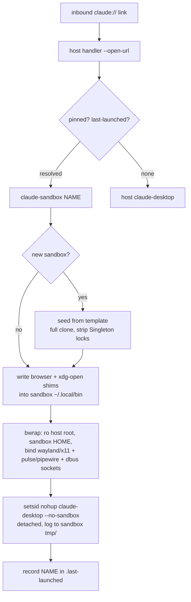

# Project Architecture

## Overview

`claude-desktop-sandbox` is a terminal utility that runs multiple isolated
instances of the `claude-desktop` Electron app side by side on one Linux
desktop, using `bwrap` (bubblewrap — the same mechanism Flatpak uses) instead
of separate Linux users. Each named sandbox gets its own `$HOME` under
`$CLAUDE_SANDBOX_ROOT` (default `~/sandboxes/claude-desktop-<name>`), so
config, session/cookies, and MCP server config resolve independently per
instance, while the host's display (Wayland/X11), audio (PipeWire/Pulse), and
D-Bus session are bind-mounted through so windows, audio, and notifications
work normally.

The whole utility is a single self-contained bash script (`bin/claude-sandbox`,
~365 lines) with no runtime dependencies beyond `bwrap` and coreutils. It is a
launcher, subcommand CLI (`--list`, `--remove`, `--pin`, URL-handler install),
template-based sandbox seeder, and inbound `claude://` deep-link router in one
file.

## Core Components

| Component | Purpose |
|-----------|---------|
| `bin/claude-sandbox` | Everything: CLI dispatch, sandbox creation/seeding, bwrap launch, URL routing |
| — bwrap launch block | Read-only `/usr` `/etc` `/opt` root, fresh writable `$HOME`, isolated `XDG_RUNTIME_DIR` with display/audio/dbus sockets bound through, `/dev/dri` GPU passthrough |
| — `write_browser_wrapper()` | Generates per-sandbox `sandboxed-browser`, `xdg-open`, and `x-www-browser` shims into the sandbox's `~/.local/bin` (first on PATH) |
| — template seeding | New sandbox = full clone (incl. login) of `--from` / `$CLAUDE_SANDBOX_TEMPLATE` / oldest sandbox; strips Electron `Singleton*` locks |
| — `claude://` router | `--install-url-handler` registers an `x-scheme-handler/claude` desktop entry; `--open-url` routes to pinned (`.pinned`) else last-launched (`.last-launched`) sandbox, else host binary |
| `Makefile` | `test` (bash -n) and `install` → `~/.local/bin/claude-sandbox`; dispatched by repo `mk/subdirs.mk` |
| `README.md` | User-facing install/usage and browser/OAuth gotchas |

## Launch Flow

## Key Decisions

- **bwrap, not separate users or containers**: lightweight per-instance
  filesystem/PID isolation while sharing the live desktop session sockets —
  windows render and audio/notifications work with no display forwarding.
- **`--no-sandbox` inside bwrap is deliberate**: Chromium's setuid sandbox
  can't nest inside bwrap's user/mount namespace; bwrap already provides the
  isolation layer. The same constraint drives the browser shims — Chromium
  browsers get `--no-sandbox`, QtWebEngine gets
  `QTWEBENGINE_DISABLE_SANDBOX=1`, Gecko needs nothing, and snap/Flatpak
  browsers are skipped entirely (their confinement can't nest).
- **xdg-open shims, not `$BROWSER`**: Electron opens URLs via `xdg-open`,
  which on XFCE (`exo-open`) bypasses `$BROWSER`; putting shims first on the
  sandbox PATH is the reliable interception point. A `claude://` link arriving
  *inside* a sandbox is routed to that sandbox's own claude-desktop.
- **Full-clone seeding including login**: seeded sandboxes start authenticated
  as the template's account — convenient for multi-workspace use of one
  account; use an empty sandbox for a different account.
- **Detached launch** (`setsid`/`nohup`, per-sandbox logfile): the invoking
  terminal never blocks; logs go to `<sandbox>/tmp/claude-desktop.log`.

## Ecosystem Fit

Lives under `utilities/agent/` in the Noizu Infra monorepo. Installed to
`~/.local/bin` via its own `make install` or the repo-wide
`make install-utilities` (dispatched through `mk/subdirs.mk`). Unlike most
utilities it does **not** source `share/k8-lib` and reads no
`.infra-config.yaml` — it is desktop-host tooling, configured purely by env
vars (`CLAUDE_SANDBOX_ROOT`, `CLAUDE_DESKTOP_BIN`, `CLAUDE_SANDBOX_BROWSER`,
`CLAUDE_SANDBOX_TEMPLATE`).

## Runtime State

All mutable state lives outside the repo under `$CLAUDE_SANDBOX_ROOT`:
per-sandbox homes (`claude-desktop-<name>/{home,tmp,runtime}`), the
`.last-launched` and `.pinned` routing markers, and per-sandbox logs. The
`--install-url-handler` flow additionally writes
`~/.local/share/applications/claude-sandbox-url.desktop` on the host.
