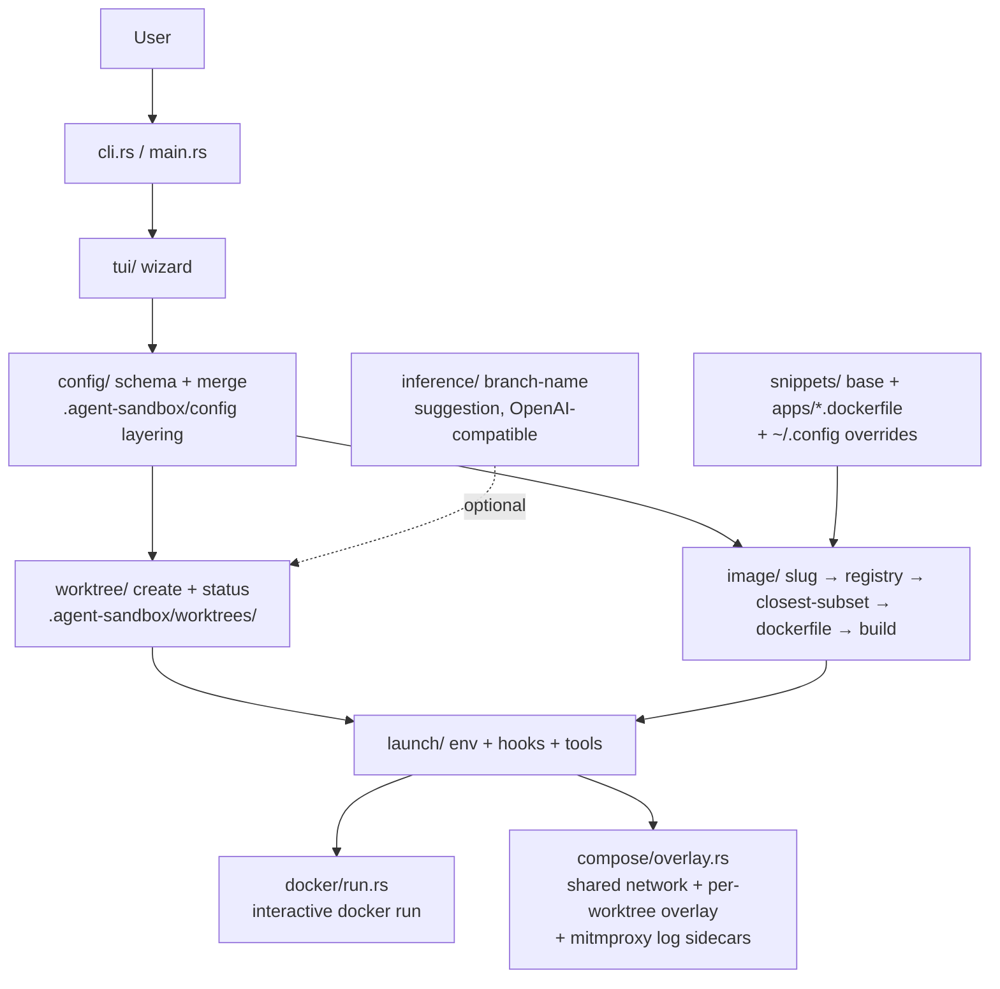

# Project Architecture

## Overview

`agent-sandbox` (dir: `utilities/agent/dangerously-safe`) is a Rust TUI + docker
image builder for running coding agents (claude / codex / opencode) in
**dangerous / auto-approve mode** safely. It isolates each run inside a
dedicated git worktree (`.agent-sandbox/worktrees/`) mounted into a per-project
docker container with a controlled environment, ports, mounts, and network. It
supersedes the legacy `bin/dangerously-safe` bash launcher, which is still
installed alongside for backward compatibility.

Architecturally it is a single binary crate composed of small focused modules:
a clap CLI + ratatui wizard front end, a layered YAML config system, an image
lifecycle pipeline that composes sandbox images from a dockerfile-fragment
library, a git-worktree manager, and a launch pipeline that assembles env /
mounts / hooks and drops the user into an interactive container shell (via
`docker run`, or docker-compose when the config defines compose services).

## System Diagram

## Core Components

| Component | Purpose |
|-----------|---------|
| `src/cli.rs`, `src/main.rs` | clap CLI: wizard (default), `build-image`, `list-images`, `doctor`, `template`, `preview` |
| `src/tui/` | Ratatui wizard screens; `fixtures.rs` powers `preview` mode (no docker/git needed) |
| `src/config/` | serde schema + deep-merge layering of `.agent-sandbox/config` YAML |
| `src/image/` | App-slug normalization, local registry via OCI label, closest-subset reuse, Dockerfile composition, build |
| `src/worktree/` | Git worktree create/list under `.agent-sandbox/worktrees/` (rsync untracked, restrict-access hook) |
| `src/launch/` | Env passthrough, before_launch / on_docker_start hooks, tool staging onto PATH |
| `src/docker/` | Interactive `docker run` into the sandbox |
| `src/compose/` | docker-compose overlay generation, shared network, mitmproxy outbound-logging sidecars |
| `src/inference/` | Optional LLM branch-name suggestion (OpenAI-compatible endpoint, deterministic fallback) |
| `src/paths.rs`, `src/error.rs` | XDG/project path resolution; thiserror error types |
| `snippets/` | Dockerfile fragment library (base + per-app fragments with `requires`/`apt` front-matter) |
| `templates/` | Bootstrap config templates installed to `~/.config/agent-sandbox/templates` |
| `bin/dangerously-safe` | Legacy bash launcher, installed alongside |

## Image Reuse Strategy

App slugs are normalized to a sorted set baked into the tag
(`agent-sandbox:<slug>-<slug>`) and an OCI label `org.agent-sandbox.apps`. On
launch: reuse an exact image; else layer the delta apps onto the closest
existing image whose app set is a subset of the request; else build from
`snippets/base.dockerfile`. This keeps rebuilds incremental as app sets grow.

## Config Layering

Per-project `.agent-sandbox/config` is deep-merged over parent configs found by
scanning upward, over the bootstrap template: `template <- parent(far→near) <-
project`. Mappings merge recursively; scalars/sequences are replaced by the
higher layer. Key fields: `apps`, `agent`, `env`, `ports`, `mounts`,
`internet_access`, `hooks`, `tools`, `worktree`, `compose`.

## Launch Modes

Plain mode runs an interactive `docker run` (with `--network none` when
`internet_access: false`, best-effort). When the config defines
`compose.services` / `base_file` / `network`, launch switches to
docker-compose: a shared external network, optional shared infra base, and a
generated per-worktree overlay at `{worktree}/.agent-sandbox/compose.overlay.yaml`.
Outbound services can enable a `mitmproxy` log sidecar that reverse-proxies to
the upstream and dumps flows under `{worktree}/.agent-sandbox/mitm/<name>/`.

## Ecosystem Fit

Part of the Noizu Infra `utilities/` tree but deliberately **not** wired to the
repo's `.infra-config.yaml` build/deploy conventions or `share/k8-lib` — it is
a self-contained Rust crate targeting any project directory. It integrates with
the utilities ecosystem only through the standard install path: `make install`
(dispatched by `../../mk/subdirs.mk`, and thus by the repo-root
`make install-utilities`) puts the binary and the legacy script in
`~/.local/bin`, snippets in `~/.local/share/agent-sandbox/`, and templates in
`~/.config/agent-sandbox/`.

## Key Decisions

- **Rust + ratatui over extending the bash script**: multi-screen wizard state,
  config merging, and image-set math outgrew shell; legacy script kept installed
  for continuity.
- **Worktree-per-run isolation**: the agent gets full write access to a
  disposable git worktree, never the primary checkout.
- **Fragment-composed images with subset reuse**: avoids one monolithic image
  and repeated full builds; user overrides in `~/.config/agent-sandbox/snippets/`.
- **Compose only when needed**: `docker run` stays the simple default; compose
  mode exists for shared infra and outbound-traffic logging.
- **Never-blocking inference**: branch-name suggestion always falls back to a
  deterministic slug when no API key or the call fails.

Designed in the schema but not yet wired: `dc` (direnv-config) env layers,
`post_container_start` hook, mitmproxy intercept mode, docker-build
push/multiarch, true egress control (internal compose network).

## Related Docs

- [PROJ-LAYOUT.md](PROJ-LAYOUT.md) — file/directory layout and install destinations
- [layout/src.md](layout/src.md) — Rust source module breakdown
- `../README.md` — usage, image naming/reuse rules, test coverage status
