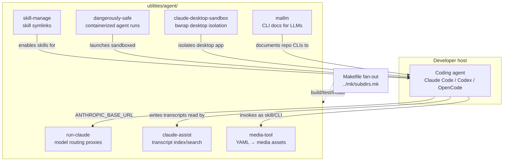

# Project Architecture — utilities/agent

## Overview

`utilities/agent/` is a **grouping component** in the Noizu Infra monorepo: a family of
seven agent-centric DevOps utilities that support working *with* AI coding agents —
sandboxing them, routing their model traffic, managing their skills, documenting CLIs for
them, indexing their transcripts, and generating media assets from declarative prompts.
There is no shared runtime at this level: each child is a self-contained sub-project with
its own stack (Rust, TypeScript/Node, Python, bash), build tooling, and architecture docs.
This document covers only the grouping concerns — build fan-out, install conventions, and
how the children relate to each other and the wider utilities ecosystem. For child
internals, follow the per-child architecture summaries linked below.

The directory map lives in [PROJ-LAYOUT.md](PROJ-LAYOUT.md).

## Children and Their Roles

| Utility | Role in the agent toolchain | Architecture |
|---|---|---|
| `claude-assist` | Transcript indexer/browser: REST + web SPA + TUI over SQLite (FTS5/vec) for multi-harness session continuity | [arch summary](../claude-assist/docs/PROJ-ARCH.summary.md) |
| `claude-desktop-sandbox` | bwrap launcher for multiple isolated claude-desktop instances, each with its own `$HOME` | [arch summary](../claude-desktop-sandbox/docs/PROJ-ARCH.summary.md) |
| `dangerously-safe` | agent-sandbox: Rust TUI + Docker image composer running coding agents in auto-approve mode inside worktree-per-run containers | [arch summary](../dangerously-safe/docs/PROJ-ARCH.summary.md) |
| `mallm` | LLM-friendly CLI documentation resolver (`.mallm/` → user config → `--mallm` → `--help`) documenting the repo's DevOps CLIs for agents | [arch summary](../mallm/docs/PROJ-ARCH.summary.md) |
| `media-tool` | Declarative `.media.prompt` YAML → media generation across 13 providers with DAG ordering and LLM eval grading | [arch summary](../media-tool/docs/PROJ-ARCH.summary.md) |
| `run-claude` | Directory-aware model routing: front proxy (:4443) → LiteLLM (:4444) with self-healing watchdog | [arch summary](../run-claude/docs/PROJ-ARCH.summary.md) |
| `skill-manage` | Symlink/catalog manager enabling monorepo `skills/` (`trl-*`) per provider (Claude/Codex/Grok) | [arch summary](../skill-manage/docs/PROJ-ARCH.summary.md) |

## System View

The children are peers, not layers: each targets a different concern of the
agent-assisted development loop (routing, isolation, capability management,
documentation, observability, asset generation). They do not call each other at
runtime; the only shared machinery is the build fan-out.

## Build & Install Fan-out

The grouping `Makefile` is five lines: it declares `SUBDIRS` (all seven children) and
includes the shared `utilities/mk/subdirs.mk`, which forwards `build` / `compile` /
`test` / `install` / `clean` to each child that declares the target (with a
`build` → `compile` fallback). No build or install logic lives at this level — the repo-wide
`make install-utilities` reaches children through this fan-out.

## Ecosystem Fit

Relative to the wider `utilities/` conventions (shared `share/k8-lib`, `~/.local/bin`
install, `.infra-config.yaml` metadata), the agent group is deliberately loosely coupled:

- **Install target**: most children install binaries/launchers to `~/.local/bin` via
  their own `make install`, dispatched by the fan-out; exceptions are `mallm` (npm link)
  and `run-claude` (`uv tool install .`), which manage their own toolchain installs.
- **k8-lib**: only `media-tool`'s legacy bash wrapper sources `share/k8-lib`; all other
  children are standalone and depend on nothing outside their own directory.
- **.infra-config.yaml**: no child is a Docker/Helm build target; `media-tool` is the
  only one that touches infra config (API keys via `.envrc.k8.dc`, optional k8s
  lmstudio-proxy evaluator).
- **Repo integration points**: `skill-manage` is the canonical enable mechanism for the
  monorepo `skills/` tree; `mallm` exists to document the repo's DevOps CLIs
  (helm-upgrade, docker-build, …) for LLM agents; `run-claude` provides per-directory
  provider routing for agent sessions working on this monorepo.

## Key Decisions

- **Grouping directory, not a project**: no shared code or runtime at this level — each
  utility evolves, builds, and documents independently; only the Makefile fan-out and
  docs map are shared.
- **Heterogeneous stacks by fit**: Rust for TUIs and multi-state logic (dangerously-safe,
  skill-manage, media-tool), TypeScript for web/API surfaces (claude-assist, mallm),
  Python for the LiteLLM ecosystem (run-claude), bash where a single script suffices
  (claude-desktop-sandbox).
- **Docs delegation**: grouping docs stay one-line-plus-link per child; internals live in
  each child's `docs/PROJ-LAYOUT.summary.md` / `docs/PROJ-ARCH.summary.md`.
- **Loose infra coupling by design**: these are developer-host tools, not cluster
  services — hence minimal k8-lib/.infra-config.yaml dependence compared to sibling
  utility groups.
