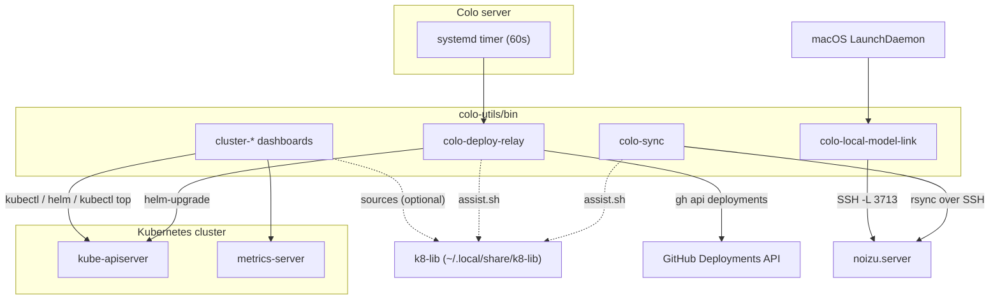

# colo-utils — Architecture

## Overview

A terminal utility package with two tool families. The `cluster-*` scripts are standalone Bash dashboards that query the Kubernetes API (via `kubectl`, `helm`, `metrics-server`) and render color-coded terminal output for inspecting the noizu k8s cluster. The `colo-*` scripts are operational helpers for the noizu colo server (`noizu.server`): a GitHub-Deployments-driven deploy relay, an SSH tunnel LaunchDaemon for the local-model port, and a mirrored-path rsync wrapper.

All tools optionally source the shared `k8-lib` shell library (resolved from `$K8_LIB_DIR`, defaulting to `~/.local/share/k8-lib`, or the sibling `../k8-lib` when run from the monorepo) for config resolution, colors/formatting, and the `--assist` AI-help hook. Every script degrades gracefully when k8-lib is absent.

## System Diagram

## Core Components

| Component | Purpose |
|-----------|---------|
| `cluster-status` | Tiered pod dashboard across namespaces, status-colored (`--watch`) |
| `cluster-nodes` | Node layout: capacity type (spot/on-demand), CPU/RAM reservations (`--pods`) |
| `cluster-resources` | Per-pod CPU/RAM usage vs requests (requires metrics-server) |
| `cluster-helm` | Helm release listing, color-coded by health |
| `cluster-layout` | Node/PVC/PV layout as markdown (rendered via `glow` when available) |
| `cluster-manticore` | Manticore Search dashboard: readers, indexes, S3 state, jobs |
| `cluster-setup-telemetry` | Installs OTel Collector + Fluent Bit on a VM/EC2 host (run on target as root) |
| `colo-deploy-relay` | Polls GitHub Deployments API, runs `helm-upgrade`, reports status back |
| `colo-local-model-link` | macOS LaunchDaemon managing an SSH tunnel to the colo local-model port (3713) |
| `colo-sync` | rsync local ↔ `noizu.server` with mirrored `/Users/…` ↔ `/home/…` path mapping |
| `colo-deploy-relay.service`/`.timer` | Hardened systemd oneshot + 60s timer running the relay on the colo server |

## Deploy Relay Flow

CI creates GitHub Deployments; the colo server pulls rather than being pushed to (no inbound access needed). Every 60s the systemd timer runs `colo-deploy-relay`, which fetches deployments newer than the last-processed ID (persisted in `/var/lib/deploy-relay`), marks them `in_progress`, translates the payload (`project`, `tag`, `services` map) into `helm-upgrade --include <project> --set <svc>.image=<registry>/<path>:<tag>` calls, and posts `success`/`failure` back to GitHub. `DRY_RUN=true` previews without deploying.

## Shared Library (k8-lib)

Scripts resolve `K8_LIB_DIR` (default `~/.local/share/k8-lib`; `colo-sync` prefers the monorepo sibling `../k8-lib` when present) and source `bin/config.sh`, `bin/common.sh`, and `bin/assist.sh` from it. `config.sh` resolves `infra-config.yaml` (tier groupings, status patterns, `telemetry:` section) — all `cluster-*` tools pre-parse `--config <path>` before sourcing so an alternate config wins. `assist.sh` provides the `--assist` AI-help hook and is sourced conditionally, so tools run on hosts without k8-lib (e.g. remote VMs targeted by `cluster-setup-telemetry`).

→ *See [arch/shared-library.md](arch/shared-library.md) for details*

## Installation

`make install` installs **only `colo-*` scripts** to `~/.local/bin` (`INSTALL_DIR` overridable). The `cluster-*` scripts are installed by the parent monorepo's `make install-utilities` (which also installs k8-lib) or run directly from `bin/`. The Makefile also wraps `colo-local-model-link` lifecycle targets (`local-model-link-on/off/status/logs`). The systemd units are copied to the colo server manually and are not part of local install.

→ *See [arch/installation.md](arch/installation.md) for details*

## Ecosystem Fit

Part of the Noizu Infra monorepo's `utilities/` family: shares `k8-lib` with the other DevOps tools, honors the repo-root `.infra-config.yaml` conventions (tiers, telemetry config), and the deploy relay reuses the monorepo's `helm-upgrade` utility on the colo server. Unlike most utilities it targets two extra hosts beyond the dev machine: the colo server (relay + timer) and macOS laptops (LaunchDaemon tunnel).

## Key Decisions

- **Standalone Bash, optional library**: runs anywhere `bash` + `kubectl` exist; k8-lib sourcing is guarded so remote hosts need no install
- **Pull-based deploys**: relay polls GitHub Deployments instead of exposing an inbound webhook on the colo server; state is a single last-ID file
- **Split install responsibility**: `make install` handles colo-side helpers only; cluster dashboards belong to the parent repo's utility install alongside k8-lib
- **Env-var overridable defaults**: every host/port/path (`COLO_*`, `LOCAL_MODEL_LINK_*`, `DEPLOY_*`, `K8_TELEMETRY_*`) uses `${VAR:-default}` so no config file is required
- **Markdown + ANSI output**: `cluster-layout` emits markdown (pipe to `glow`); dashboards use red/yellow/green status coloring to surface problems at a glance
