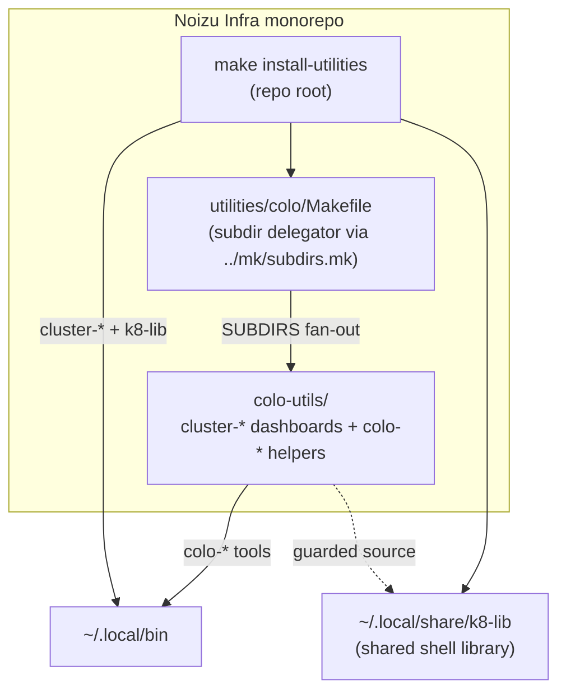

# Architecture — utilities/colo

## Overview

`utilities/colo` is a **grouping directory** within the Noizu Infra monorepo's
`utilities/` tree. It collects utility packages related to the noizu colo server
and its Kubernetes cluster. The directory itself contains no runtime code — just
a delegating Makefile and these docs. All functionality lives in child packages,
each self-documented under its own `docs/`.

Today there is a single child, `colo-utils/`, which ships two Bash tool families:
`cluster-*` terminal dashboards (kubectl/helm/metrics-server views of the noizu
k8s cluster) and `colo-*` helpers for the colo server itself (pull-based deploy
relay, SSH tunnel LaunchDaemon, mirrored rsync). Child internals are documented
in the child's own architecture doc — do not duplicate them here.

## Structure

## Components

| Component | Purpose | Docs |
|-----------|---------|------|
| `Makefile` | Subdir delegator: fans `make` targets out to `SUBDIRS` (currently only `colo-utils`) via the shared `utilities/mk/subdirs.mk` include | — |
| `colo-utils/` | Colo/k8s terminal utilities: `cluster-*` dashboards and `colo-*` server helpers (deploy relay + systemd units, local-model SSH tunnel, mirrored rsync) | [Layout](../colo-utils/docs/PROJ-LAYOUT.summary.md) · [Architecture](../colo-utils/docs/PROJ-ARCH.summary.md) |

## Ecosystem Fit

- **Install path**: the monorepo root's `make install-utilities` installs
  `cluster-*` tools and the shared `k8-lib` library to `~/.local/bin` /
  `~/.local/share/k8-lib`; the child's own `make install` covers only the
  `colo-*` tools. The grouping Makefile lets root-level builds reach children
  uniformly.
- **Shared k8-lib**: child tools source `share/k8-lib` when present (config
  resolution, formatting, `--assist` hook) and degrade gracefully without it.
- **Deploy conventions**: `colo-deploy-relay` bridges GitHub Deployments to the
  repo's `helm-upgrade` utility, keeping the colo server pull-based (no inbound
  webhooks) and consistent with `.infra-config.yaml`-driven deploy tooling.

## Key Decisions

- **Grouping directory, not a package**: keeps colo-related packages
  independently documented and installable while giving the monorepo one
  fan-out point; add new packages by appending to `SUBDIRS`.
- **Docs stay at the child level**: this doc references child summaries rather
  than re-documenting internals, so child docs remain the single source of
  truth.
