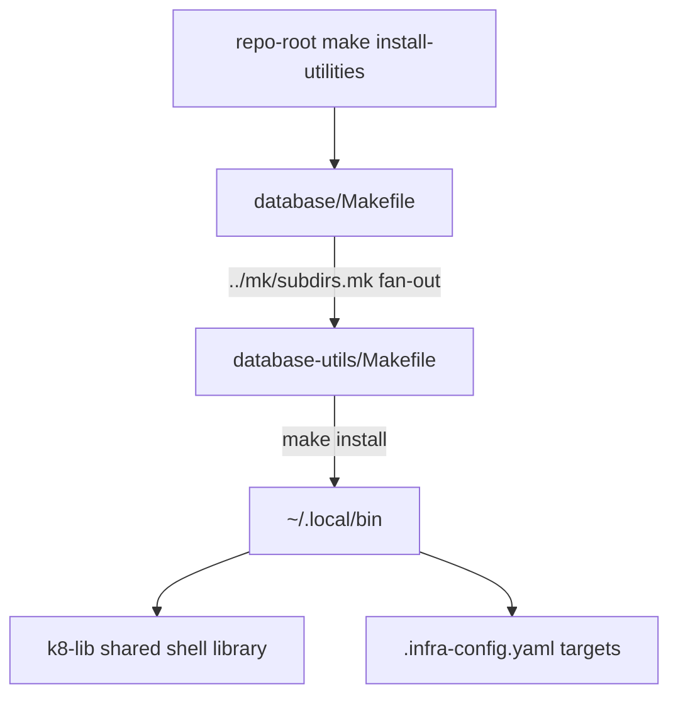

# Project Architecture

## Overview

`utilities/database/` is a **grouping directory** in the Noizu Infra monorepo: it
aggregates database-related DevOps utility packages under a single delegating
Makefile. It contains no runtime logic of its own — architecture lives in the
child packages, each self-documented under its own `docs/`.

Today there is one child, `database-utils/`, a config-driven CLI toolset for
administering K8s-hosted PostgreSQL/TimescaleDB and Valkey (Liquibase
migrations, DB/role provisioning, app-consistent EBS snapshots).

## System Diagram

## Components

| Component | Purpose |
|-----------|---------|
| `Makefile` | Delegates `install`/targets to child dirs via `utilities/mk/subdirs.mk` (`SUBDIRS := database-utils`) |
| `database-utils/` | CLI tools + SQL templates for K8s Postgres/TimescaleDB/Valkey — see child docs |
| `docs/` | This grouping level's PROJ-LAYOUT / PROJ-ARCH docs |

## Child Architecture

Child internals are documented in the child's own docs — reference, don't
duplicate:

| Child | Architecture | Layout |
|-------|--------------|--------|
| `database-utils/` | [PROJ-ARCH.summary.md](../database-utils/docs/PROJ-ARCH.summary.md) | [PROJ-LAYOUT.summary.md](../database-utils/docs/PROJ-LAYOUT.summary.md) |

In brief: `liquibase-shell` (interactive/one-shot Liquibase over kubectl
port-forward), `liquibase-update` (legacy in-cluster Job), `provision-db`
(Postgres DB/role + Valkey ACL provisioning), `tsdb-snapshot` (app-consistent
EBS snapshots via pg_backup_start/stop), plus PgBouncer and migration-role SQL
templates.

## Ecosystem Fit

- **Install path**: repo-root `make install-utilities` recurses here and
  symlinks/copies child tools into `~/.local/bin`.
- **Shared library**: child tools source `share/k8-lib` (`common.sh`,
  `assist.sh`) for helpers and `--assist` support.
- **Configuration**: targets are declared in the repo-root `.infra-config.yaml`
  (`liquibase_targets`, `tsdb_snapshot_targets`) rather than script flags;
  credentials follow the dc → Infisical → K8s Secrets flow used across the
  monorepo.

## Key Decisions

- **Grouping-directory pattern**: keeps `utilities/` navigable by domain;
  each child stays independently installable and documented.
- **Makefile fan-out via `mk/subdirs.mk`**: one shared include drives all
  grouping directories consistently — adding a new database utility means
  appending to `SUBDIRS` only.
- **No logic at this level**: avoids duplicated docs and coupling; all
  behavior and design rationale belong to the child packages.
