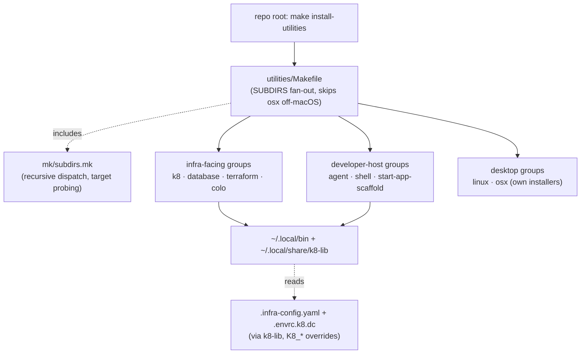

# Project Architecture — utilities/

## Overview

`utilities/` is the top-level grouping directory for all Noizu Infra DevOps
tooling: ten child groups spanning the k8s deploy pipeline, database ops,
Terraform helpers, colo host operations, AI-agent tooling, shell/terminal QoL,
project scaffolding, platform-specific desktop utilities (linux/osx), and the
shared Make plumbing that binds them. This level contributes **no runtime code**
— only aggregation: a fan-out `Makefile`, the shared `mk/` include package it
depends on, a `source_up` `.envrc`, and one standalone script
(`push-3rd-party-images.sh`) for mirroring 3rd-party Docker images to
ops.noizu.com.

Architecturally the tree is *federated, not framework-based*: each child group
(and each utility package under it) is self-contained with its own Makefile and
docs. Uniformity comes from three shared conventions rather than shared code —
the recursive `mk/subdirs.mk` Make contract, installation to `~/.local/bin`
(shared libs to `~/.local/share/`), and, for infra-facing tools, config
resolution through `share/k8-lib` against repo-root `.infra-config.yaml` with
`K8_*` env-first overrides. Structure map: [PROJ-LAYOUT.md](PROJ-LAYOUT.md).

## System Diagram

## Core Components

| Group | Purpose | Arch docs |
|-------|---------|-----------|
| `k8/` | Core build → push → deploy → operate pipeline (docker-build, helm-upgrade, deploy-service) + shared `k8-lib` | [summary](../k8/docs/PROJ-ARCH.summary.md) |
| `database/` | K8s Postgres/TimescaleDB/Valkey CLIs, Liquibase runners driven by `.infra-config.yaml` targets | [summary](../database/docs/PROJ-ARCH.summary.md) |
| `terraform/` | Ad-hoc TF helpers (tf-plan-all, migrate-tfstate); not the Terragrunt stacks | [summary](../terraform/docs/PROJ-ARCH.summary.md) |
| `colo/` | Colo host dashboards + pull-based deploy relay (systemd) | [summary](../colo/docs/PROJ-ARCH.summary.md) |
| `agent/` | AI-agent tooling: sandboxes, model routing, skill management, media generation | [summary](../agent/docs/PROJ-ARCH.summary.md) |
| `shell/` | Terminal/secret QoL: dc, secret-bucket, repo-lock, zellij launchers, ... | [summary](../shell/docs/PROJ-ARCH.summary.md) |
| `start-app-scaffold/` | Portfolio-project scaffolding from the start-app template + LLM-assisted merge | [summary](../start-app-scaffold/docs/PROJ-ARCH.summary.md) |
| `linux/` | Linux desktop utils (queue-populator, Rust/PipeWire) | [summary](../linux/docs/PROJ-ARCH.summary.md) |
| `osx/` | macOS-only utils (fstab LaunchDaemon, Swift queue-populator); own install paths | [summary](../osx/docs/PROJ-ARCH.summary.md) |
| `mk/` | Shared `subdirs.mk` recursive dispatch + `check-subdirs.sh` linter | [summary](../mk/docs/PROJ-ARCH.summary.md) |

Child internals are documented in each group's own `docs/` — this document
does not restate them.

## Build & Install Flow

Repo-root `make install-utilities` → `utilities/Makefile` `install`, which
loops `SUBDIRS_NO_OSX` (osx children install via their own sudo/launchd
mechanisms) calling each group's `install` target. Generic targets
(`build`/`compile`/`test`/`clean`) dispatch through `mk/subdirs.mk`, which
probes each child's `.PHONY` targets and skips gracefully — children need no
stub targets. `mk/check-subdirs.sh` lints SUBDIRS lists against on-disk
Makefiles for CI/pre-commit.

## Coupling Spectrum

Groups sit on a deliberate spectrum of infra coupling:

- **Tightly coupled** — `k8/`, `database/`, `terraform/`, `colo/`: source
  `k8-lib`, resolve `.infra-config.yaml` (single source of truth for
  build/deploy metadata), participate in the dc → Infisical → K8s Secrets flow.
- **Loosely coupled** — `agent/`, `shell/`, `start-app-scaffold/`:
  developer-host tools; at most one k8-lib consumer per group; several exist
  specifically for multi-agent fleet workflows (repo-lock, secret-bucket,
  zellij, skill-manage).
- **Decoupled** — `linux/`, `osx/`: compiled desktop apps that bypass k8-lib
  and (for osx) even `~/.local/bin`; integrated only via the make harness.

## Key Decisions

- **Grouping directories over a framework** — no imposed shared library;
  each package independently installable and documented, with one monorepo
  fan-out point for install.
- **Capability-probed recursion** (`mk/subdirs.mk`) — uniform Make interface
  across heterogeneous stacks (Bash, Rust, Swift, TypeScript, Python) without
  boilerplate.
- **Flat `~/.local/bin` composition** — higher-level tools shell out to
  sibling executables on PATH instead of importing code; config is the shared
  interface, parsed only through k8-lib.
- **Platform gating at the group level** — `linux/` and `osx/` isolate
  OS-specific children; top-level install skips `osx/` off-macOS, child
  Makefiles gate the reverse.
- **Language by need** — Bash for thin wrappers; Rust where correctness,
  secret-safety, or TUI demands it.

## Ecosystem Fit

Within the wider monorepo: these utilities are the operator toolbelt for the
self-hosted k8s platform (Helm charts live upstream in `noizu-infra`;
Terragrunt stacks under repo-root `terraform/`). `deploy-service` and friends
consume `.infra-config.yaml`; scaffolded apps from start-app-scaffold emerge
already conformant to those conventions; agent tools support the Claude/LLM
fleet workflows used to operate the repo itself.
