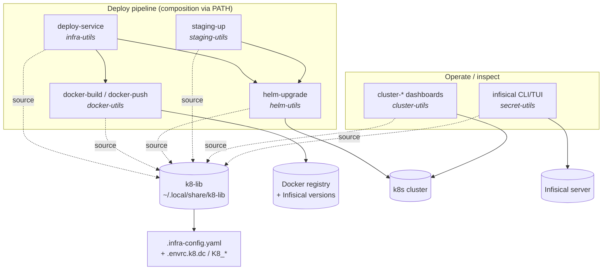

# Project Architecture — utilities/k8

## Overview

`utilities/k8` is the Kubernetes DevOps tool suite of the Noizu monorepo: a
grouping directory of seven self-contained utility packages that together form
the build → push → deploy → operate pipeline for the self-hosted k8s platform.
Six packages are collections of standalone Bash CLIs (plus one Rust binary in
secret-utils); the seventh, `k8-lib`, is a sourced-shell library that all the
others load at runtime. Nothing here is a long-running service — every tool is
an operator-invoked command installed flat to `~/.local/bin`.

The architectural style is **flat composition over shared config**: packages
never import each other's code. Higher-level tools (e.g. `deploy-service`)
compose lower-level ones by shelling out to sibling executables on PATH, and
all tools converge on the same two configuration sources — the repo-root
`.infra-config.yaml` (structural: images, charts, tiers, namespaces) and
`.envrc.k8.dc` / `K8_*` env vars (scalars and credentials) — resolved
exclusively through k8-lib.

Child internals are documented in each child's own `docs/`; this file covers
only the grouping-level architecture. See
[PROJ-LAYOUT.md](PROJ-LAYOUT.md) for the directory map.

## System Diagram

## Core Components

| Package | Purpose | Architecture doc |
|---------|---------|------------------|
| k8-lib | Shared sourced-shell library (18 modules): config facade, output helpers, Docker/Helm discovery, `--assist` AI help | [summary](../k8-lib/docs/PROJ-ARCH.summary.md) |
| docker-utils | Image build/push layer: BuildKit multi-arch builds, Infisical-resolved patch versions | [summary](../docker-utils/docs/PROJ-ARCH.summary.md) |
| helm-utils | Chart lifecycle: tiered upgrades w/ MD5 change detection, reverse-tier rollback, OCI publish | [summary](../helm-utils/docs/PROJ-ARCH.summary.md) |
| infra-utils | Orchestration CLIs: `deploy-service` pipeline, `infra-config` CRUD, `infra-init`, dashboards | [summary](../infra-utils/docs/PROJ-ARCH.summary.md) |
| secret-utils | Secrets sync (Rust `infisical` CLI/TUI + legacy Bash): dc ↔ YAML ↔ Infisical server | [summary](../secret-utils/docs/PROJ-ARCH.summary.md) |
| cluster-utils | Seven `cluster-*` inspection dashboards over kubectl/helm/metrics-server | [summary](../cluster-utils/docs/PROJ-ARCH.summary.md) |
| staging-utils | Staging env lifecycle: thin convention wrappers over helm-upgrade/kubectl | [summary](../staging-utils/docs/PROJ-ARCH.summary.md) |

## Shared Library Model

Every executable sources k8-lib modules from `$K8_LIB_DIR` (default
`~/.local/share/k8-lib`) by absolute path, so installed copies work from any
directory. k8-lib is the *sole parser* of `.infra-config.yaml` (discovery:
`--config` → `$K8_CONFIG` → `$INFRA_ROOT` → git-root walk) and resolves
scalars env-first (`K8_*` → `dc get` → YAML → default), giving CI and agents
per-invocation overrides. Only exception to "no local library code" is
`secret-utils/lib/secret-engine.sh`, local to its legacy Bash CLIs.

## Build & Install

The top-level `Makefile` defines only `SUBDIRS` and fans `build / compile /
test / install / clean` out to each child via the shared `../mk/subdirs.mk`
include; the repo-root `make install-utilities` drives it. Each child's
`make install` copies its `bin/*` flat into `~/.local/bin` (k8-lib installs to
`~/.local/share/k8-lib`). Testing is intentionally light — `bash -n` syntax
checks (plus cargo tests in secret-utils' Rust crate).

## Data & Deployment Flow

A release runs: `deploy-service <image-key>` → `docker-build`/`docker-push`
(Infisical allocates the monotonic patch version; promoted tag recorded in
`.docker-state/`) → yq bump of the chart's values.yaml → `helm-upgrade` for
the affected release, honoring the `.infra-config.yaml` tier ordering.
Runtime state handoff between stages lives in dot-dirs under `$INFRA_ROOT`
(`.docker-state/`, `.helm-state/`). Secrets flow separately:
`secret-utils` populates Infisical, Terraform-deployed InfisicalSecret CRDs
sync k8s Secrets, and Helm charts reference those — deploy tools never touch
secret values.

## Key Decisions

- **Flat bin, no inter-script imports** — tools compose by shelling out to
  siblings on PATH; k8-lib holds all shared logic. Keeps each package
  independently installable and testable.
- **Single config source of truth** — `.infra-config.yaml` for structure,
  direnv-config for scalars, resolved only through k8-lib; no per-tool config
  files.
- **Env-first overrides (`K8_*`)** — every scalar can be overridden per
  invocation, making tools agent- and CI-safe (`--headless`, `--no-zellij`).
- **Infisical as version + secret authority** — monotonic image patch
  versions and all credential material live server-side, not in the repo.
- **Bash-first with one Rust exception** — no compiled dependencies except
  the `infisical` binary, where TUI/API-client complexity outgrew shell
  (legacy Bash CLIs retained as a cargo-free fallback).
- **Helm charts live upstream** — charts are in the `noizu-infra` repo;
  `.infra-config.yaml` references chart paths existing in that context.
