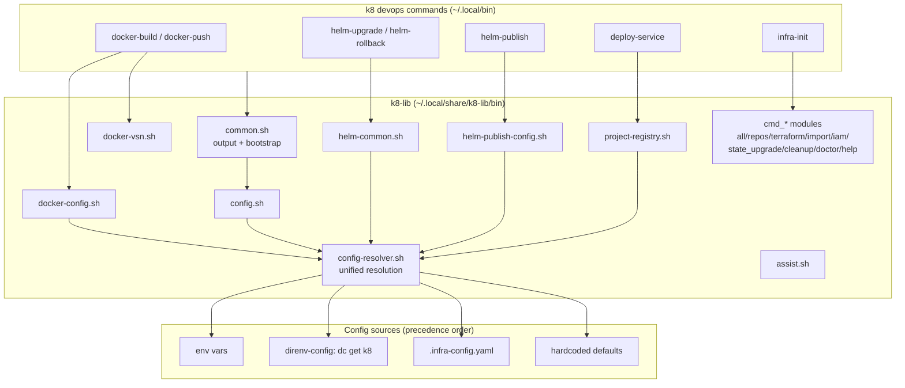

# Project Architecture — k8-lib

## Overview

k8-lib is the shared shell library underpinning the Noizu k8 devops tool suites
(`docker-build`, `docker-push`, `helm-upgrade`, `helm-rollback`, `helm-publish`,
`deploy-service`, `infra-init`, etc.). It is not an executable — every file in
`bin/` is a **sourced module** providing config resolution, output helpers,
target/chart discovery, and `infra-init` subcommand implementations.

The library is installed to `~/.local/share/k8-lib` (via `make install`, or
repo-wide via `make install-utilities` from the monorepo root, which also
installs the consuming commands to `~/.local/bin`). Commands locate it through
`$K8_LIB_DIR` and source the modules they need, starting from `common.sh`.

Architecturally it is a **layered configuration facade**: a single resolver
(`config-resolver.sh`) finds and reads `.infra-config.yaml` (structural config:
tiers, paths, namespaces, Docker/Helm targets) and merges scalar values from
environment variables, direnv-config (`dc get k8 <path>`), YAML fallbacks, and
hardcoded defaults — in that precedence order. All higher-level modules
(docker, helm, project registry) build on that facade.

## System Diagram

## Core Components

| Module | Purpose |
|--------|---------|
| `bin/common.sh` | Base include: colours, `step/ok/warn/fail/die` output helpers, config bootstrap via `config.sh` |
| `bin/config.sh` | Loads resolved config and exports `K8_*` variables |
| `bin/config-resolver.sh` | Unified config resolution: locates `.infra-config.yaml`, yq-flavor detection, `_cfg`/`_dc_get` accessors, double-source guard |
| `bin/docker-config.sh` | Docker build/push target discovery (standalone + composite projects), registry paths, build state |
| `bin/docker-vsn.sh` | Version/tag resolution (`VSN_MAJOR`/`VSN_MINOR`/`BUILD_ENV`), stale-tag cleanup |
| `bin/helm-common.sh` | Chart discovery, namespaces, tiers, timeouts, overlays, checksums, impact helpers |
| `bin/helm-publish-config.sh` | Chart packaging + OCI registry publish targets and state |
| `bin/project-registry.sh` | Per-project `project.yaml` registry loader (image → Helm values wiring for `deploy-service`) |
| `bin/assist.sh` | `--assist "question"` support: headless Claude Code call with tool context |
| `bin/{all,repos,terraform,import,iam,state_upgrade,cleanup,doctor,help}.sh` | `infra-init` subcommands (`cmd_*` entry points) — bootstrap, terraformer import, IAM import, tfstate migration, health checks |
| `Makefile` | `install` (copy `bin/*.sh` + `.example` templates), `test` (`bash -n` syntax check) |
| `*.example` templates | `infra-config.yaml.example` (structural) and `.envrc.k8.dc.example` (scalar/dc) starting points |

## Configuration Resolution

Two-axis resolution, both implemented in `config-resolver.sh`:

- **File discovery** for `.infra-config.yaml` (legacy `infra-config.yaml` also
  accepted): `--config` flag → `$K8_CONFIG` → `$INFRA_ROOT/` → git-root walk
  from CWD upward → `$K8_LIB_DIR/`. All paths inside the file are relative to
  the file's directory.
- **Scalar values**: env var → `dc get k8 <path>` (direnv-config) → YAML
  fallback → hardcoded default. Env vars always win, keeping every value
  overridable per-invocation.

Requires mikefarah `yq`; the resolver detects yq flavor and hard-fails with an
install hint if missing.

## Module Families

Two distinct families share `bin/`:

1. **Library/config modules** — pure function definitions sourced by many
   external commands (`common`, `config`, `config-resolver`, `docker-*`,
   `helm-*`, `project-registry`, `assist`). Contract: no side effects beyond
   variable/function definition; guarded against double-sourcing.
2. **`infra-init` subcommand modules** — each defines a `cmd_<name>()` entry
   point invoked by the `infra-init` dispatcher (bootstrap repos, install TF
   toolchain, terraformer/IAM imports, tfstate provider-address migration,
   cleanup, doctor, help). These assume `common.sh` is already loaded.

## Ecosystem Fit

- **Monorepo root `.infra-config.yaml`** is the single source of truth for
  build/deploy metadata (deployment tiers 0–9, namespace overrides, Docker
  image targets, Helm chart mappings); k8-lib is the only code that parses it —
  all consuming commands go through these modules.
- **direnv-config (`dc`)** supplies scalar secrets/credentials
  (`.envrc.k8.dc`, seeded from the example template), keeping secret values out
  of committed YAML.
- **Install path convention**: commands live in `~/.local/bin`, the library in
  `~/.local/share/k8-lib`; `make install-utilities` at the monorepo root
  installs both halves together.

## Key Decisions

- **Sourced library, not executables**: consuming commands stay thin; shared
  behavior (config, output, discovery) changes in one place.
- **Env-first scalar precedence**: every value overridable at invocation time
  without editing files — essential for CI and agent-driven runs.
- **Git-root walking config discovery**: tools work from any subdirectory of
  the monorepo without flags.
- **Direct IAM import path (`iam.sh`)**: bypasses terraformer, which hangs
  enumerating 1000+ AWS-managed policies; dependency-ordered `aws` CLI +
  `terraform import` instead.
- **`bash -n` as the test suite**: syntax-only checks; modules are exercised
  in production by the consuming commands rather than unit tests.
