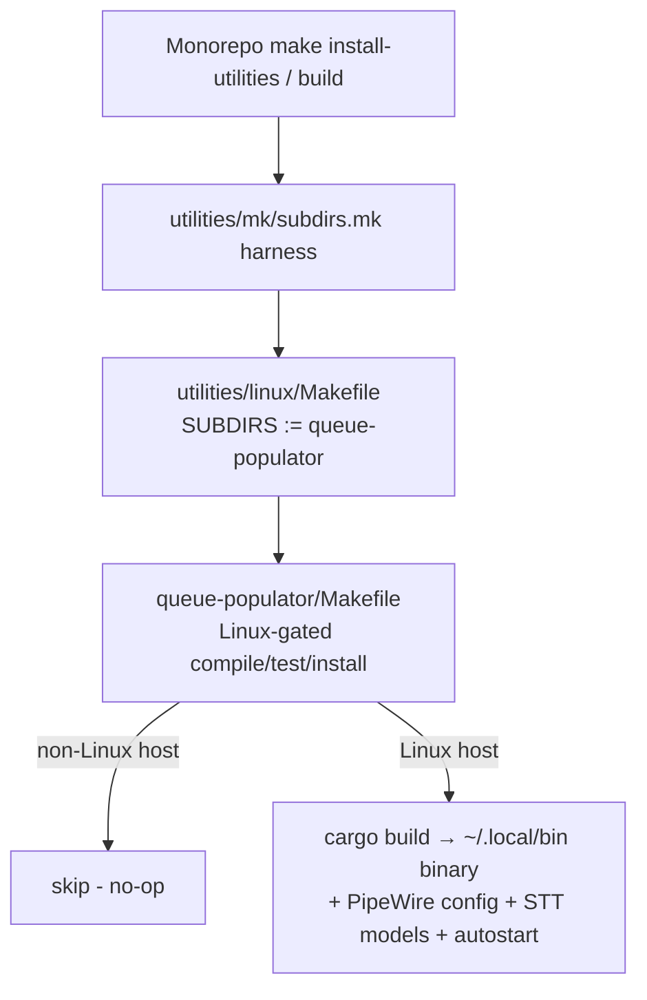

# Project Architecture — utilities/linux

## Overview

`utilities/linux` is a **grouping directory** for Linux-only desktop utilities
in the Noizu Infra monorepo. It contains no source code of its own — its
architecture is purely organizational: a thin delegating Makefile fans build
lifecycle targets out to child utility projects, each of which is a
self-contained, self-documented application with its own build tooling and
docs.

Unlike the shell DevOps tools elsewhere under `utilities/` (which source
`share/k8-lib` and are copied to `~/.local/bin` by `make install-utilities`),
the children here are compiled desktop applications with platform-gated
builds. They participate in the same monorepo-wide `make` fan-out but manage
their own installation (e.g. `install.sh` placing a binary in
`~/.local/bin` plus config/models/autostart pieces).

## System Diagram

## Core Components

| Component | Purpose | Docs |
|-----------|---------|------|
| `Makefile` | Sets `SUBDIRS := queue-populator`, includes shared `../mk/subdirs.mk` to fan out `build`/`compile`/`test`/`install`/`clean` | — |
| `queue-populator/` | Voice-driven Ubuntu GNOME / PipeWire utility (Rust): wake-phrase memo capture, on-device sherpa-onnx STT, LLM classification into JSONL queue entries, voice-controlled routing of the live mic into four persistent PipeWire virtual sources. Port of `utilities/osx/queue-populator`. | [Architecture](../queue-populator/docs/PROJ-ARCH.summary.md) · [Layout](../queue-populator/docs/PROJ-LAYOUT.summary.md) |

Child internals are authoritative in each child's own `docs/`; this document
does not duplicate them.

## Build Fan-out

The shared `utilities/mk/subdirs.mk` harness iterates `SUBDIRS`, invoking a
target only in subdirs that define it (falling back from `build` to
`compile`). Child Makefiles gate on `uname` = Linux, so monorepo-wide builds
and installs on macOS or other platforms silently skip this branch. `make
help` at this level lists available targets and subdirs.

## Ecosystem Fit

- **Not k8-lib consumers**: children are compiled apps, not shell scripts;
  they do not source `share/k8-lib`.
- **Not `.infra-config.yaml` targets**: no docker/helm/deploy pipeline —
  these are local desktop tools, outside the k8s deployment tiers.
- **Monorepo integration points**: the `make` subdirs harness (above) and,
  where a child needs secrets, the repo's `dc` direnv-config tool (e.g.
  queue-populator encrypts LLM API keys via `dc`).
- **Sibling relationship**: `utilities/osx/` holds the macOS counterparts;
  queue-populator's config schema is shared across both ports.

## Key Decisions

- **Grouping dir over flat utilities/**: platform-specific desktop apps are
  isolated under `linux/` (and `osx/`) so platform gating lives in one
  Makefile layer rather than scattered conditionals.
- **Self-contained children**: each child owns its build, install, and docs;
  this level only routes make targets and links to child summaries.
- **Extension path**: new Linux utilities are added as a sibling folder and
  appended to `SUBDIRS`.
