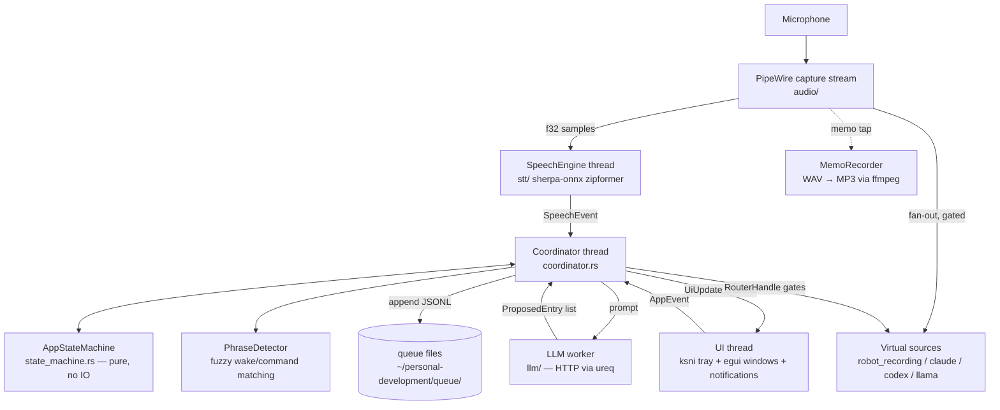

# Architecture — queue-populator (Linux)

## Overview

queue-populator is a voice-driven desktop utility for Ubuntu GNOME / PipeWire — a
Rust port of the Swift app at `utilities/osx/queue-populator`. It listens
continuously for a wake phrase ("hey robot"), records a spoken memo, transcribes
it on-device with sherpa-onnx, classifies the memo via an LLM into structured
entries, and appends them as JSONL to queue files under
`~/personal-development/queue/`. It also routes the live microphone into four
persistent PipeWire virtual mic devices (`Recording`, `Claude`, `Codex`,
`Llama`) on voice command, letting AI assistants in browsers/apps "hear" the
user without device switching.

The architecture is an event-driven, multi-threaded pipeline built on
crossbeam channels: audio capture, speech recognition, coordination, LLM work,
and UI each run on their own thread and communicate only via messages. Core
logic (state machine, phrase detection, queue format, config) is
platform-neutral in `lib.rs`; PipeWire, sherpa-onnx, ksni, and egui layers are
wired on top in `main.rs`.

## System Diagram

## Core Components

| Component | Purpose |
|-----------|---------|
| `src/audio/` | PipeWire capture; in-process fan-out to STT + four virtual source playback streams; lock-free `RouterState` gating (assistants exclusive, muted = silence) |
| `src/stt/` | sherpa-onnx streaming zipformer engine (int8, on-device, English) with endpoint detection; model locator/downloader |
| `src/coordinator.rs` | Central event loop: multiplexes speech/UI/LLM messages on one channel, executes state-machine side effects, owns routing decisions |
| `src/state_machine.rs` | Pure state transitions (Idle → Recording → MemoReview → Processing → Review/Revising); no IO |
| `src/phrase_detector.rs` | Fuzzy matching of wake/command phrases against live transcript |
| `src/llm/` | Provider-agnostic LLM client (ureq), prompt building, JSON response parsing into `ProposedEntry` |
| `src/queue/` | JSONL entry schema, queue manifest, append-only writer |
| `src/config/` | Config store (`~/.config/queue-populator/config.json`, schema shared with macOS app), secret store shelling out to repo `dc` tool, env resolution, debug log |
| `src/ui/` | ksni system tray (state-colored icon), egui transcript/config/review windows, desktop notifications, sound cues |
| `config/10-robot-virtual-mics.conf` | pipewire.conf.d drop-in creating the four persistent virtual sources |
| `install.sh` / `uninstall.sh` | Build + install binary, PipeWire config, STT models, autostart entry (and removal) |

## Threading & Data Flow

Five channels wire the threads: raw audio samples (bounded, 64) → STT;
`SpeechEvent` → coordinator; `CoordinatorMsg` (speech/UI/LLM/quit multiplex) →
coordinator; `UiUpdate` → UI; a show-window signal. The coordinator is the only
component with side effects — it drives the pure state machine and executes the
`SideEffect`s it returns (start/stop memo recording, launch LLM request, write
queue entries, gate virtual mics). Mic routing state is shared with PipeWire
realtime callbacks via atomics, so no locks touch the audio path.

## Key Decisions

- **Pure state machine + coordinator executor**: mirrors the macOS
  Coordinator.swift design; transitions are testable without audio/UI.
- **Persistent virtual sources, gated in-process**: streams stay connected and
  muted targets emit silence — no PipeWire relinking, no audible glitches;
  devices remain visible in GNOME Settings even when idle.
- **On-device STT (sherpa-onnx)**: no cloud dependency or latency for the
  always-on listening loop; only memo classification touches an LLM API.
- **Secrets via `dc`**: API keys in config.json are stored encrypted
  (`🔒:v1:` prefix) and encrypted/decrypted by shelling out to the monorepo's
  `~/.local/bin/dc` direnv-config tool — same convention as the macOS app.
- **Config schema shared with macOS port**: one `config.json` format so
  provider setup carries across machines.

## Ecosystem Fit (Noizu utilities)

Unlike the shell utilities under `utilities/`, this is a compiled Rust desktop
app: it does **not** use `share/k8-lib`, `.infra-config.yaml`, or the
docker/helm deploy pipeline. It follows the monorepo's install conventions —
binary lands in `~/.local/bin` (like `make install-utilities` targets), and its
Makefile gates `compile`/`test`/`install` on Linux so monorepo-wide builds
skip it cleanly on other platforms. Runtime deps: PipeWire ≥0.3 (with
`pipewire-utils`), `ffmpeg` for memo MP3 export, and the repo `dc` tool for
secrets. Verify an install with `queue-populator --check`.

## Related Docs

- [PROJ-LAYOUT.md](PROJ-LAYOUT.md) — file/directory layout
- [layout/src.md](layout/src.md) — per-module source breakdown
- `../../osx/queue-populator` — the original macOS Swift implementation
